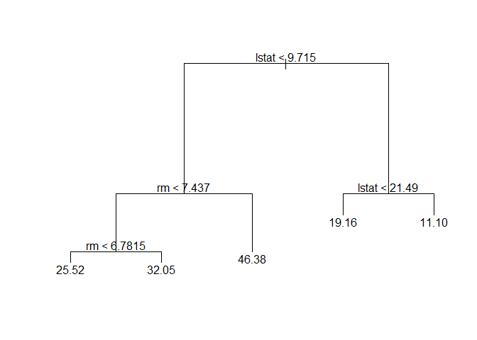
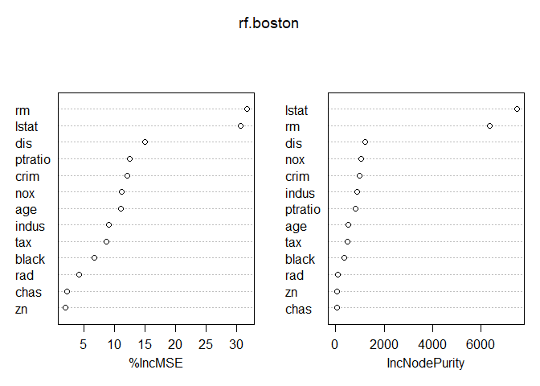
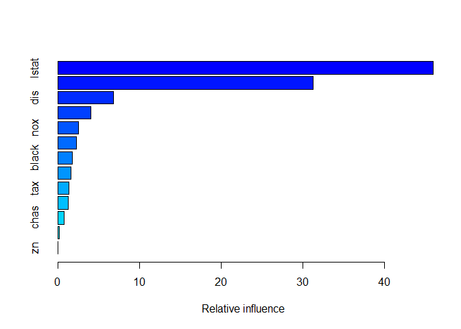
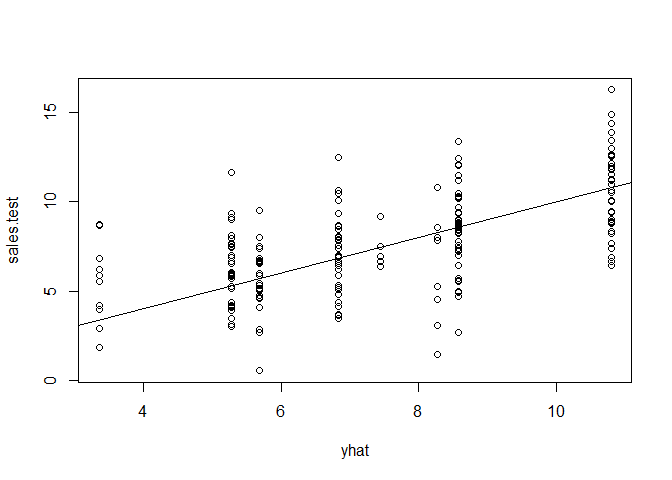

## load data


```r
library(ISLR)
library(ggplot2)
library(tree)
library(MASS)
library(dplyr)
```

```
## 
## Attaching package: 'dplyr'
```

```
## The following object is masked from 'package:MASS':
## 
##     select
```

```
## The following objects are masked from 'package:stats':
## 
##     filter, lag
```

```
## The following objects are masked from 'package:base':
## 
##     intersect, setdiff, setequal, union
```

```r
library(reshape2)
library(randomForest)
```

```
## randomForest 4.6-14
```

```
## Type rfNews() to see new features/changes/bug fixes.
```

```
## 
## Attaching package: 'randomForest'
```

```
## The following object is masked from 'package:dplyr':
## 
##     combine
```

```
## The following object is masked from 'package:ggplot2':
## 
##     margin
```

```r
library(gbm)
```

```
## Loading required package: survival
```

```
## Loading required package: lattice
```

```
## Loading required package: splines
```

```
## Loading required package: parallel
```

```
## Loaded gbm 2.1.3
```

```r
library(glmnet)
```

```
## Loading required package: Matrix
```

```
## Loading required package: foreach
```

```
## Loaded glmnet 2.0-16
```

# 8.3 Lab: Decision Trees

## 8.3.1 Fitting Classification Trees


```r
attach(Carseats)
High <- ifelse(Sales <= 8, "No","Yes")
Carseats <- data.frame(Carseats,High)
tree.carseats <- tree(High ~ .-Sales, Carseats)

summary(tree.carseats)
```

```
## 
## Classification tree:
## tree(formula = High ~ . - Sales, data = Carseats)
## Variables actually used in tree construction:
## [1] "ShelveLoc"   "Price"       "Income"      "CompPrice"   "Population" 
## [6] "Advertising" "Age"         "US"         
## Number of terminal nodes:  27 
## Residual mean deviance:  0.4575 = 170.7 / 373 
## Misclassification error rate: 0.09 = 36 / 400
```

```r
plot(tree.carseats)
text(tree.carseats, pretty = 0)
```

<!-- -->

```r
tree.carseats
```

```
## node), split, n, deviance, yval, (yprob)
##       * denotes terminal node
## 
##   1) root 400 541.500 No ( 0.59000 0.41000 )  
##     2) ShelveLoc: Bad,Medium 315 390.600 No ( 0.68889 0.31111 )  
##       4) Price < 92.5 46  56.530 Yes ( 0.30435 0.69565 )  
##         8) Income < 57 10  12.220 No ( 0.70000 0.30000 )  
##          16) CompPrice < 110.5 5   0.000 No ( 1.00000 0.00000 ) *
##          17) CompPrice > 110.5 5   6.730 Yes ( 0.40000 0.60000 ) *
##         9) Income > 57 36  35.470 Yes ( 0.19444 0.80556 )  
##          18) Population < 207.5 16  21.170 Yes ( 0.37500 0.62500 ) *
##          19) Population > 207.5 20   7.941 Yes ( 0.05000 0.95000 ) *
##       5) Price > 92.5 269 299.800 No ( 0.75465 0.24535 )  
##        10) Advertising < 13.5 224 213.200 No ( 0.81696 0.18304 )  
##          20) CompPrice < 124.5 96  44.890 No ( 0.93750 0.06250 )  
##            40) Price < 106.5 38  33.150 No ( 0.84211 0.15789 )  
##              80) Population < 177 12  16.300 No ( 0.58333 0.41667 )  
##               160) Income < 60.5 6   0.000 No ( 1.00000 0.00000 ) *
##               161) Income > 60.5 6   5.407 Yes ( 0.16667 0.83333 ) *
##              81) Population > 177 26   8.477 No ( 0.96154 0.03846 ) *
##            41) Price > 106.5 58   0.000 No ( 1.00000 0.00000 ) *
##          21) CompPrice > 124.5 128 150.200 No ( 0.72656 0.27344 )  
##            42) Price < 122.5 51  70.680 Yes ( 0.49020 0.50980 )  
##              84) ShelveLoc: Bad 11   6.702 No ( 0.90909 0.09091 ) *
##              85) ShelveLoc: Medium 40  52.930 Yes ( 0.37500 0.62500 )  
##               170) Price < 109.5 16   7.481 Yes ( 0.06250 0.93750 ) *
##               171) Price > 109.5 24  32.600 No ( 0.58333 0.41667 )  
##                 342) Age < 49.5 13  16.050 Yes ( 0.30769 0.69231 ) *
##                 343) Age > 49.5 11   6.702 No ( 0.90909 0.09091 ) *
##            43) Price > 122.5 77  55.540 No ( 0.88312 0.11688 )  
##              86) CompPrice < 147.5 58  17.400 No ( 0.96552 0.03448 ) *
##              87) CompPrice > 147.5 19  25.010 No ( 0.63158 0.36842 )  
##               174) Price < 147 12  16.300 Yes ( 0.41667 0.58333 )  
##                 348) CompPrice < 152.5 7   5.742 Yes ( 0.14286 0.85714 ) *
##                 349) CompPrice > 152.5 5   5.004 No ( 0.80000 0.20000 ) *
##               175) Price > 147 7   0.000 No ( 1.00000 0.00000 ) *
##        11) Advertising > 13.5 45  61.830 Yes ( 0.44444 0.55556 )  
##          22) Age < 54.5 25  25.020 Yes ( 0.20000 0.80000 )  
##            44) CompPrice < 130.5 14  18.250 Yes ( 0.35714 0.64286 )  
##              88) Income < 100 9  12.370 No ( 0.55556 0.44444 ) *
##              89) Income > 100 5   0.000 Yes ( 0.00000 1.00000 ) *
##            45) CompPrice > 130.5 11   0.000 Yes ( 0.00000 1.00000 ) *
##          23) Age > 54.5 20  22.490 No ( 0.75000 0.25000 )  
##            46) CompPrice < 122.5 10   0.000 No ( 1.00000 0.00000 ) *
##            47) CompPrice > 122.5 10  13.860 No ( 0.50000 0.50000 )  
##              94) Price < 125 5   0.000 Yes ( 0.00000 1.00000 ) *
##              95) Price > 125 5   0.000 No ( 1.00000 0.00000 ) *
##     3) ShelveLoc: Good 85  90.330 Yes ( 0.22353 0.77647 )  
##       6) Price < 135 68  49.260 Yes ( 0.11765 0.88235 )  
##        12) US: No 17  22.070 Yes ( 0.35294 0.64706 )  
##          24) Price < 109 8   0.000 Yes ( 0.00000 1.00000 ) *
##          25) Price > 109 9  11.460 No ( 0.66667 0.33333 ) *
##        13) US: Yes 51  16.880 Yes ( 0.03922 0.96078 ) *
##       7) Price > 135 17  22.070 No ( 0.64706 0.35294 )  
##        14) Income < 46 6   0.000 No ( 1.00000 0.00000 ) *
##        15) Income > 46 11  15.160 Yes ( 0.45455 0.54545 ) *
```

```r
set.seed(2)
train <- sample(1:nrow(Carseats), 200)
Carseats.test <- Carseats[-train,]
High.test <- High[-train]
tree.carseats <- tree(High ~ .-Sales, Carseats, subset=train)
tree.pred <- predict(tree.carseats, Carseats.test, type="class")
table(tree.pred, High.test)
```

```
##          High.test
## tree.pred No Yes
##       No  86  27
##       Yes 30  57
```

```r
(86+57)/200
```

```
## [1] 0.715
```

```r
set.seed(3)
cv.carseats <- cv.tree(tree.carseats,FUN=prune.misclass)
names(cv.carseats)
```

```
## [1] "size"   "dev"    "k"      "method"
```

```r
cv.carseats
```

```
## $size
## [1] 19 17 14 13  9  7  3  2  1
## 
## $dev
## [1] 55 55 53 52 50 56 69 65 80
## 
## $k
## [1]       -Inf  0.0000000  0.6666667  1.0000000  1.7500000  2.0000000
## [7]  4.2500000  5.0000000 23.0000000
## 
## $method
## [1] "misclass"
## 
## attr(,"class")
## [1] "prune"         "tree.sequence"
```

```r
par(mfrow=c(1,2))
plot(cv.carseats$size, cv.carseats$dev, type="b")
plot(cv.carseats$k, cv.carseats$dev, type="b")
```

<!-- -->

```r
prune.carseats <- prune.misclass(tree.carseats, best=9)
plot(prune.carseats)
text(prune.carseats, pretty = 0)

tree.pred <- predict(prune.carseats, Carseats.test, type="class")
table(tree.pred, High.test)
```

```
##          High.test
## tree.pred No Yes
##       No  94  24
##       Yes 22  60
```

```r
(94+60)/200
```

```
## [1] 0.77
```

```r
prune.carseats  <- prune.misclass(tree.carseats, best=15)
plot(prune.carseats)
text(prune.carseats, pretty = 0)
```

<!-- -->

```r
tree.pred <- predict(prune.carseats, Carseats.test, type="class")
table(tree.pred, High.test)
```

```
##          High.test
## tree.pred No Yes
##       No  86  22
##       Yes 30  62
```

```r
(86+62)/200
```

```
## [1] 0.74
```

```r
Carseats <- Carseats[,-12]
detach(Carseats)
```

## 8.3.2 Fitting Regression Trees


```r
set.seed(1)
train <- sample(1:nrow(Boston), nrow(Boston)/2)
tree.boston <- tree(medv ~., Boston, subset=train)
summary(tree.boston)
```

```
## 
## Regression tree:
## tree(formula = medv ~ ., data = Boston, subset = train)
## Variables actually used in tree construction:
## [1] "lstat" "rm"    "dis"  
## Number of terminal nodes:  8 
## Residual mean deviance:  12.65 = 3099 / 245 
## Distribution of residuals:
##      Min.   1st Qu.    Median      Mean   3rd Qu.      Max. 
## -14.10000  -2.04200  -0.05357   0.00000   1.96000  12.60000
```

```r
plot(tree.boston)
text(tree.boston, pretty = 0)
```

<!-- -->

```r
cv.boston <- cv.tree(tree.boston)
plot(cv.boston$size, cv.boston$dev, type='b')
```

<!-- -->

```r
prune.boston <- prune.tree(tree.boston, best=5)
plot(prune.boston)
text(prune.boston, pretty = 0)
```

<!-- -->

```r
yhat <- predict(tree.boston, newdata=Boston[-train,])
boston.test <- Boston[-train, "medv"]
plot(yhat, boston.test)
abline(0,1)
```

<!-- -->

```r
(mse <- mean((yhat - boston.test)^2))
```

```
## [1] 25.04559
```

```r
sqrt(mse)
```

```
## [1] 5.004557
```

## 8.3.3 Bagging and Random Forests


```r
set.seed(1)
train <- sample(1:nrow(Boston), nrow(Boston)/2)
boston.test <- Boston[-train ,"medv"]

set.seed(1)
bag.boston <- randomForest(medv ~ ., data=Boston, subset=train, mtry=13, importance = TRUE)
bag.boston
```

```
## 
## Call:
##  randomForest(formula = medv ~ ., data = Boston, mtry = 13, importance = TRUE,      subset = train) 
##                Type of random forest: regression
##                      Number of trees: 500
## No. of variables tried at each split: 13
## 
##           Mean of squared residuals: 11.15723
##                     % Var explained: 86.49
```

```r
yhat.bag <- predict(bag.boston, newdata=Boston[-train,])
plot(yhat.bag, boston.test)
abline(0,1)
```

<!-- -->

```r
mean((yhat.bag-boston.test)^2)
```

```
## [1] 13.50808
```

```r
sqrt(mean((yhat.bag-boston.test)^2))
```

```
## [1] 3.675334
```

```r
bag.boston <- randomForest(medv ~ ., data=Boston, subset=train, mtry=13, ntree=25)
yhat.bag <- predict(bag.boston, newdata=Boston[-train,])
mean((yhat.bag-boston.test)^2)
```

```
## [1] 13.94835
```

```r
sqrt(mean((yhat.bag-boston.test)^2))
```

```
## [1] 3.734749
```

```r
set.seed(1)
rf.boston <- randomForest(medv ~ ., data=Boston, subset=train, mtry=6, importance =TRUE)
yhat.rf <- predict(rf.boston, newdata=Boston[-train,])
mean((yhat.rf-boston.test)^2)
```

```
## [1] 11.66454
```

```r
sqrt(mean((yhat.rf-boston.test)^2))
```

```
## [1] 3.415338
```

```r
importance(rf.boston)
```

```
##           %IncMSE IncNodePurity
## crim    12.132320     986.50338
## zn       1.955579      57.96945
## indus    9.069302     882.78261
## chas     2.210835      45.22941
## nox     11.104823    1044.33776
## rm      31.784033    6359.31971
## age     10.962684     516.82969
## dis     15.015236    1224.11605
## rad      4.118011      95.94586
## tax      8.587932     502.96719
## ptratio 12.503896     830.77523
## black    6.702609     341.30361
## lstat   30.695224    7505.73936
```

```r
varImpPlot(rf.boston)
```

<!-- -->

## 8.3.4 Boosting


```r
set.seed(1)
boost.boston <- gbm(medv ~., data=Boston[train,], distribution="gaussian", n.trees=5000, interaction.depth=4)
summary(boost.boston)
```

<!-- -->

```
##             var    rel.inf
## lstat     lstat 45.9627334
## rm           rm 31.2238187
## dis         dis  6.8087398
## crim       crim  4.0743784
## nox         nox  2.5605001
## ptratio ptratio  2.2748652
## black     black  1.7971159
## age         age  1.6488532
## tax         tax  1.3595005
## indus     indus  1.2705924
## chas       chas  0.8014323
## rad         rad  0.2026619
## zn           zn  0.0148083
```

```r
par(mfrow=c(1,2))
plot(boost.boston, i="rm")
plot(boost.boston, i="lstat")
```

<!-- -->

```r
yhat.boost=predict(boost.boston, newdata=Boston[-train,], n.trees=5000)
mean((yhat.boost-boston.test)^2)
```

```
## [1] 11.84434
```

```r
sqrt(mean((yhat.boost-boston.test)^2))
```

```
## [1] 3.441561
```

```r
boost.boston <- gbm(medv ~., data=Boston[train,], distribution="gaussian", n.trees=5000, interaction.depth=4, shrinkage=0.2, verbose=F)
yhat.boost <- predict(boost.boston, newdata=Boston[-train ,],n.trees=5000)
mean((yhat.boost-boston.test)^2)
```

```
## [1] 11.51109
```

```r
sqrt(mean((yhat.boost-boston.test)^2))
```

```
## [1] 3.3928
```

```r
par(mfrow=c(1,1))
```

### 5. Suppose we produce ten bootstrapped samples from a data set containing red and green classes. We then apply a classification tree to each bootstrapped sample and, for a specific value of X, produce 10 estimates of P(Class is Red|X): (0.1, 0.15, 0.2, 0.2, 0.55, 0.6, 0.6, 0.65, 0.7, and 0.75) There are two common ways to combine these results together into a single class prediction. One is the majority vote approach discussed in this chapter. The second approach is to classify based on the average probability. In this example, what is the final classification under each of these two approaches?


```r
p <- c(.1,.15,.2,.2,.55,.6,.6,.65,.7,.76)
# First approach
ifelse(sum(p > .5) > 5, "Red", "Green")
```

```
## [1] "Red"
```

```r
# Second approach
ifelse(mean(p) > .5, "Red", "Green")
```

```
## [1] "Green"
```
Under the first approach the final classification is Red and under the second approach the final classification is Green.

### 7. In the lab, we applied random forests to the Boston data using mtry=6 and using ntree=25 and ntree=500. Create a plot displaying the test error resulting from random forests on this data set for a more comprehensive range of values for mtry and ntree. You can model your plot after Figure 8.10. Describe the results obtained.


```r
set.seed(123)
train <- sample(1:nrow(Boston), nrow(Boston)/2)
boston.test <- Boston[-train ,"medv"]
mtry <- seq(1,13)
ntree <- seq(1,101,5)
err.mat <- matrix(ncol = length(ntree), nrow = length(mtry))
colnames(err.mat) <- ntree
row.names(err.mat) <- mtry
for(m in mtry){
  for(n in ntree){
    boston.bag <- randomForest(medv ~ ., data=Boston, subset=train, mtry=m, ntree=n)
    yhat.bag <- predict(boston.bag, newdata=Boston[-train,])
    err.mat[m,(n%/%5+1)] <- mean((yhat.bag-boston.test)^2)
  }
}
m.err.mat <- melt(err.mat, varnames=c("mtry value","Number of trees"), value.name = "MSE")
m.err.mat$`mtry value` <- as.factor(m.err.mat$`mtry value`)
ggplot(m.err.mat, aes(`Number of trees`,MSE, group = `mtry value`, color = `mtry value`)) +
  geom_line()
```

<!-- -->

An mtry value between 3 and 5 seems appear to be the best option. This range actually inclues sqrt(p) and p/3 which are both defaults. After about 25 trees, there does not seem to be much improvement.

### 8. In the lab, a classification tree was applied to the Carseats data set after converting Sales into a qualitative response variable. Now we will seek to predict Sales using regression trees and related approaches, treating the response as a quantitative variable.

(a) Split the data set into a training set and a test set.


```r
dim(Carseats)
```

```
## [1] 400  11
```

```r
set.seed(123)
train <- sample(1:nrow(Carseats), nrow(Carseats)/2)
Carseats.train <- Carseats[train,]
Carseats.test <- Carseats[-train,]
sales.test <- Carseats.test$Sales
```

(b) Fit a regression tree to the training set. Plot the tree, and interpret
the results. What test MSE do you obtain?


```r
tree.carseats <- tree(Sales ~ ., Carseats.train)
summary(tree.carseats)
```

```
## 
## Regression tree:
## tree(formula = Sales ~ ., data = Carseats.train)
## Variables actually used in tree construction:
## [1] "ShelveLoc"   "Price"       "Advertising" "Population"  "Age"        
## [6] "CompPrice"  
## Number of terminal nodes:  15 
## Residual mean deviance:  2.624 = 485.4 / 185 
## Distribution of residuals:
##      Min.   1st Qu.    Median      Mean   3rd Qu.      Max. 
## -3.863000 -1.166000  0.000105  0.000000  1.070000  4.177000
```

```r
plot(tree.carseats)
text(tree.carseats, pretty = 0)
```

<!-- -->

```r
yhat <- predict(tree.carseats, newdata=Carseats.test)
plot(yhat, sales.test)
abline(0,1)
```

<!-- -->

```r
(mse <- mean((yhat - sales.test)^2))
```

```
## [1] 4.427724
```

```r
sqrt(mse)
```

```
## [1] 2.104216
```
Prediction on average is within 2000 unit sales

(c) Use cross-validation in order to determine the optimal level of
tree complexity. Does pruning the tree improve the test MSE?


```r
cv.carseats <- cv.tree(tree.carseats)
cv.carseats
```

```
## $size
##  [1] 15 14 13 12 11 10  9  8  7  6  5  4  3  2  1
## 
## $dev
##  [1] 1112.530 1113.512 1188.719 1192.842 1161.976 1140.579 1140.579
##  [8] 1107.894 1153.070 1167.780 1241.037 1288.249 1238.151 1264.437
## [15] 1628.018
## 
## $k
##  [1]      -Inf  18.02620  21.27734  25.61440  29.30120  33.75840  34.39053
##  [8]  39.98526  44.49292  47.11262  63.49470  78.31714 106.92311 164.25364
## [15] 358.55742
## 
## $method
## [1] "deviance"
## 
## attr(,"class")
## [1] "prune"         "tree.sequence"
```

```r
plot(cv.carseats$size, cv.carseats$dev, type='b')
```

<!-- -->

```r
(best <- cv.carseats$size[which.min(cv.carseats$dev)])
```

```
## [1] 8
```

```r
prune.carseats <- prune.tree(tree.carseats, best=best)
plot(prune.carseats)
text(prune.carseats, pretty = 0)
```

<!-- -->

```r
yhat <- predict(prune.carseats, newdata=Carseats.test)
sales.test <- Carseats.test$Sales
par(mfrow=c(1,1))
plot(yhat, sales.test)
abline(0,1)
```

<!-- -->

```r
(mse <- mean((yhat - sales.test)^2))
```

```
## [1] 5.314472
```

```r
sqrt(mse)
```

```
## [1] 2.305314
```
Made it worse

(d) Use the bagging approach in order to analyze this data. What test MSE do you obtain? Use the importance() function to determine which variables are most important.


```r
carseat.bag <- randomForest(Sales ~ ., data=Carseats.train, mtry = 10, importance = TRUE)
yhat.bag <- predict(carseat.bag, newdata=Carseats.test)
mean((yhat.bag-sales.test)^2)
```

```
## [1] 2.543963
```

```r
sqrt(mean((yhat.bag-sales.test)^2))
```

```
## [1] 1.594981
```

```r
importance(carseat.bag)
```

```
##                %IncMSE IncNodePurity
## CompPrice   18.3879616    133.719062
## Income       1.5791859     70.251318
## Advertising 16.9419482    117.741372
## Population   0.8570600     75.972978
## Price       48.8547414    430.886378
## ShelveLoc   52.4027018    451.648661
## Age         18.7321814    184.613850
## Education    1.9852591     43.152555
## Urban       -0.2435544      9.443501
## US           1.6143102      6.429770
```

```r
varImpPlot(carseat.bag)
```

<!-- -->

(e) Use random forests to analyze this data. What test MSE do you obtain? Use the importance() function to determine which variables are most important. Describe the effect of m, the number of variables considered at each split, on the error rate obtained.


```r
carseat.rf <- randomForest(Sales ~ ., data=Carseats.train, importance = TRUE)
yhat.rf <- predict(carseat.rf, newdata=Carseats.test)
mean((yhat.rf-sales.test)^2)
```

```
## [1] 3.164889
```

```r
sqrt(mean((yhat.rf-sales.test)^2))
```

```
## [1] 1.779014
```

```r
importance(carseat.rf)
```

```
##                %IncMSE IncNodePurity
## CompPrice    9.1940189     123.04843
## Income       2.5642183     107.39589
## Advertising 13.4586779     136.82540
## Population  -0.2645558     111.87972
## Price       31.5479151     327.91020
## ShelveLoc   38.1193566     332.78909
## Age         15.8297411     206.50753
## Education    3.3146567      78.11128
## Urban        1.4060705      19.25830
## US           5.2109801      21.41495
```

```r
varImpPlot(carseat.rf)
```

<!-- -->

### 10. We now use boosting to predict Salary in the Hitters data set.

(a) Remove the observations for whom the salary information is unknown, and then log-transform the salaries.


```r
small.hitters <- Hitters %>%
  na.omit(Salary) %>%
  mutate(Salary = log(Salary))
```

(b) Create a training set consisting of the first 200 observations, and a test set consisting of the remaining observations.


```r
hitters.train <- small.hitters[1:200,]
hitters.test <- small.hitters[201:nrow(small.hitters),]
```

(c) Perform boosting on the training set with 1,000 trees for a range of values of the shrinkage parameter λ. Produce a plot with different shrinkage values on the x-axis and the corresponding training set MSE on the y-axis.


```r
shrinkage <- seq(.001, .1, .001)
train.mse <- double(100)
test.mse <- double(100)
set.seed(123)
for(i in shrinkage){
  hitters.boost <- gbm(Salary ~., data=hitters.train, distribution="gaussian", n.trees=1000, shrinkage=i, verbose=F)
  yhat.boost <- predict(hitters.boost, newdata=hitters.test, n.trees=1000)
  train.mse[i*1000] <- mean((hitters.boost$train.error)^2)
  test.mse[i*1000] <- mean((yhat.boost-hitters.test$Salary)^2)
}
ggplot(data.frame(shrinkage,train.mse), aes(shrinkage,train.mse)) +
  geom_line()
```

<!-- -->

(d) Produce a plot with different shrinkage values on the x-axis and the corresponding test set MSE on the y-axis.


```r
ggplot(data.frame(shrinkage,test.mse), aes(shrinkage,test.mse)) +
  geom_line()
```

<!-- -->

(e) Compare the test MSE of boosting to the test MSE that results from applying two of the regression approaches seen in Chapters 3 and 6.


```r
set.seed(123)
# Boost
shrink <- shrinkage[which.min(test.mse)]
shrink
```

```
## [1] 0.069
```

```r
hitters.boost <- gbm(Salary ~ ., data=hitters.train, shrinkage = shrink, n.trees = 1000)
```

```
## Distribution not specified, assuming gaussian ...
```

```r
yhat.boost <- predict(hitters.boost, newdata=hitters.test, n.trees = 1000)
boost.mse <- mean((yhat.boost - hitters.test$Salary)^2)

# Linear regression
hitters.lm <- lm(Salary ~ ., data=hitters.train)
yhat.lm <- predict(hitters.lm, newdata=hitters.test)
lm.mse <- mean((yhat.lm - hitters.test$Salary)^2)

# Lasso
train.x <- model.matrix(Salary ~ ., hitters.train)[,-19]
train.y <- hitters.train$Salary
test.x <- model.matrix(Salary ~ ., hitters.test)[,-19]
test.y <- hitters.test$Salary
hitters.lasso <- cv.glmnet(train.x, train.y, alpha=1)
yhat.lasso <- predict(hitters.lasso,newx=test.x)
lasso.mse <- mean((yhat.lasso - hitters.test$Salary)^2)

# Compare
cat("Mean square errors\nBoost:",boost.mse,"\nLinear Regression:",lm.mse,"\nLasso:",lasso.mse,"\n")
```

```
## Mean square errors
## Boost: 0.27787 
## Linear Regression: 0.4917959 
## Lasso: 0.4361955
```

(f) Which variables appear to be the most important predictors in the boosted model?

```r
summary(hitters.boost)
```

<!-- -->

```
##                 var    rel.inf
## CAtBat       CAtBat 18.3293674
## CWalks       CWalks 10.6610681
## CHits         CHits 10.1579615
## PutOuts     PutOuts  7.1749220
## Walks         Walks  6.2904846
## CHmRun       CHmRun  5.8780324
## Years         Years  5.7192188
## CRBI           CRBI  4.8650255
## Hits           Hits  4.7244829
## RBI             RBI  4.5130456
## Assists     Assists  4.4337029
## HmRun         HmRun  3.5391046
## CRuns         CRuns  3.4430252
## AtBat         AtBat  3.3741496
## Errors       Errors  2.8657520
## Runs           Runs  2.4057309
## Division   Division  0.6628693
## NewLeague NewLeague  0.5772393
## League       League  0.3848172
```
Top 3 are carrer Atbat, carerr Walks, and career Hits.

(g) Now apply bagging to the training set. What is the test set MSE for this approach?

```r
hitters.bag <- randomForest(Salary ~ ., data=hitters.train, mtry = 19, importance = TRUE)
yhat.bag <- predict(hitters.bag, newdata=hitters.test)
mean((yhat.bag-hitters.test$Salary)^2)
```

```
## [1] 0.2358647
```

```r
importance(hitters.bag)
```

```
##              %IncMSE IncNodePurity
## AtBat      9.3484003    7.87644167
## Hits       6.6748104    3.81274327
## HmRun     -0.7243498    1.56209445
## Runs       3.4533270    2.79143914
## RBI        2.1673047    3.28466140
## Walks     10.4990355    7.53379586
## Years     10.0564562    1.89778547
## CAtBat    36.6599754   87.24935209
## CHits      8.0619627   11.65745535
## CHmRun     9.6129447    4.81280386
## CRuns     11.4793570   11.78297359
## CRBI      11.5224770    8.95862009
## CWalks     6.4850309    5.55498566
## League    -1.4071251    0.09465797
## Division  -2.1856040    0.13307230
## PutOuts    0.3099232    2.55294940
## Assists   -1.2256152    1.46806803
## Errors     1.3514542    1.19321461
## NewLeague  1.1190668    0.22127924
```

```r
varImpPlot(hitters.bag)
```

<!-- -->

### 11. This question uses the Caravan data set.

(a) Create a training set consisting of the first 1,000 observations, and a test set consisting of the remaining observations.  

```r
dim(Caravan)
```

```
## [1] 5822   86
```

```r
summary(Caravan)
```

```
##     MOSTYPE         MAANTHUI         MGEMOMV         MGEMLEEF    
##  Min.   : 1.00   Min.   : 1.000   Min.   :1.000   Min.   :1.000  
##  1st Qu.:10.00   1st Qu.: 1.000   1st Qu.:2.000   1st Qu.:2.000  
##  Median :30.00   Median : 1.000   Median :3.000   Median :3.000  
##  Mean   :24.25   Mean   : 1.111   Mean   :2.679   Mean   :2.991  
##  3rd Qu.:35.00   3rd Qu.: 1.000   3rd Qu.:3.000   3rd Qu.:3.000  
##  Max.   :41.00   Max.   :10.000   Max.   :5.000   Max.   :6.000  
##     MOSHOOFD          MGODRK           MGODPR          MGODOV    
##  Min.   : 1.000   Min.   :0.0000   Min.   :0.000   Min.   :0.00  
##  1st Qu.: 3.000   1st Qu.:0.0000   1st Qu.:4.000   1st Qu.:0.00  
##  Median : 7.000   Median :0.0000   Median :5.000   Median :1.00  
##  Mean   : 5.774   Mean   :0.6965   Mean   :4.627   Mean   :1.07  
##  3rd Qu.: 8.000   3rd Qu.:1.0000   3rd Qu.:6.000   3rd Qu.:2.00  
##  Max.   :10.000   Max.   :9.0000   Max.   :9.000   Max.   :5.00  
##      MGODGE          MRELGE          MRELSA           MRELOV    
##  Min.   :0.000   Min.   :0.000   Min.   :0.0000   Min.   :0.00  
##  1st Qu.:2.000   1st Qu.:5.000   1st Qu.:0.0000   1st Qu.:1.00  
##  Median :3.000   Median :6.000   Median :1.0000   Median :2.00  
##  Mean   :3.259   Mean   :6.183   Mean   :0.8835   Mean   :2.29  
##  3rd Qu.:4.000   3rd Qu.:7.000   3rd Qu.:1.0000   3rd Qu.:3.00  
##  Max.   :9.000   Max.   :9.000   Max.   :7.0000   Max.   :9.00  
##     MFALLEEN        MFGEKIND       MFWEKIND      MOPLHOOG    
##  Min.   :0.000   Min.   :0.00   Min.   :0.0   Min.   :0.000  
##  1st Qu.:0.000   1st Qu.:2.00   1st Qu.:3.0   1st Qu.:0.000  
##  Median :2.000   Median :3.00   Median :4.0   Median :1.000  
##  Mean   :1.888   Mean   :3.23   Mean   :4.3   Mean   :1.461  
##  3rd Qu.:3.000   3rd Qu.:4.00   3rd Qu.:6.0   3rd Qu.:2.000  
##  Max.   :9.000   Max.   :9.00   Max.   :9.0   Max.   :9.000  
##     MOPLMIDD        MOPLLAAG        MBERHOOG        MBERZELF    
##  Min.   :0.000   Min.   :0.000   Min.   :0.000   Min.   :0.000  
##  1st Qu.:2.000   1st Qu.:3.000   1st Qu.:0.000   1st Qu.:0.000  
##  Median :3.000   Median :5.000   Median :2.000   Median :0.000  
##  Mean   :3.351   Mean   :4.572   Mean   :1.895   Mean   :0.398  
##  3rd Qu.:4.000   3rd Qu.:6.000   3rd Qu.:3.000   3rd Qu.:1.000  
##  Max.   :9.000   Max.   :9.000   Max.   :9.000   Max.   :5.000  
##     MBERBOER         MBERMIDD        MBERARBG       MBERARBO    
##  Min.   :0.0000   Min.   :0.000   Min.   :0.00   Min.   :0.000  
##  1st Qu.:0.0000   1st Qu.:2.000   1st Qu.:1.00   1st Qu.:1.000  
##  Median :0.0000   Median :3.000   Median :2.00   Median :2.000  
##  Mean   :0.5223   Mean   :2.899   Mean   :2.22   Mean   :2.306  
##  3rd Qu.:1.0000   3rd Qu.:4.000   3rd Qu.:3.00   3rd Qu.:3.000  
##  Max.   :9.0000   Max.   :9.000   Max.   :9.00   Max.   :9.000  
##       MSKA           MSKB1           MSKB2            MSKC      
##  Min.   :0.000   Min.   :0.000   Min.   :0.000   Min.   :0.000  
##  1st Qu.:0.000   1st Qu.:1.000   1st Qu.:1.000   1st Qu.:2.000  
##  Median :1.000   Median :2.000   Median :2.000   Median :4.000  
##  Mean   :1.621   Mean   :1.607   Mean   :2.203   Mean   :3.759  
##  3rd Qu.:2.000   3rd Qu.:2.000   3rd Qu.:3.000   3rd Qu.:5.000  
##  Max.   :9.000   Max.   :9.000   Max.   :9.000   Max.   :9.000  
##       MSKD           MHHUUR          MHKOOP          MAUT1     
##  Min.   :0.000   Min.   :0.000   Min.   :0.000   Min.   :0.00  
##  1st Qu.:0.000   1st Qu.:2.000   1st Qu.:2.000   1st Qu.:5.00  
##  Median :1.000   Median :4.000   Median :5.000   Median :6.00  
##  Mean   :1.067   Mean   :4.237   Mean   :4.772   Mean   :6.04  
##  3rd Qu.:2.000   3rd Qu.:7.000   3rd Qu.:7.000   3rd Qu.:7.00  
##  Max.   :9.000   Max.   :9.000   Max.   :9.000   Max.   :9.00  
##      MAUT2           MAUT0          MZFONDS          MZPART     
##  Min.   :0.000   Min.   :0.000   Min.   :0.000   Min.   :0.000  
##  1st Qu.:0.000   1st Qu.:1.000   1st Qu.:5.000   1st Qu.:1.000  
##  Median :1.000   Median :2.000   Median :7.000   Median :2.000  
##  Mean   :1.316   Mean   :1.959   Mean   :6.277   Mean   :2.729  
##  3rd Qu.:2.000   3rd Qu.:3.000   3rd Qu.:8.000   3rd Qu.:4.000  
##  Max.   :7.000   Max.   :9.000   Max.   :9.000   Max.   :9.000  
##     MINKM30         MINK3045        MINK4575        MINK7512     
##  Min.   :0.000   Min.   :0.000   Min.   :0.000   Min.   :0.0000  
##  1st Qu.:1.000   1st Qu.:2.000   1st Qu.:1.000   1st Qu.:0.0000  
##  Median :2.000   Median :4.000   Median :3.000   Median :0.0000  
##  Mean   :2.574   Mean   :3.536   Mean   :2.731   Mean   :0.7961  
##  3rd Qu.:4.000   3rd Qu.:5.000   3rd Qu.:4.000   3rd Qu.:1.0000  
##  Max.   :9.000   Max.   :9.000   Max.   :9.000   Max.   :9.0000  
##     MINK123M         MINKGEM         MKOOPKLA        PWAPART      
##  Min.   :0.0000   Min.   :0.000   Min.   :1.000   Min.   :0.0000  
##  1st Qu.:0.0000   1st Qu.:3.000   1st Qu.:3.000   1st Qu.:0.0000  
##  Median :0.0000   Median :4.000   Median :4.000   Median :0.0000  
##  Mean   :0.2027   Mean   :3.784   Mean   :4.236   Mean   :0.7712  
##  3rd Qu.:0.0000   3rd Qu.:4.000   3rd Qu.:6.000   3rd Qu.:2.0000  
##  Max.   :9.0000   Max.   :9.000   Max.   :8.000   Max.   :3.0000  
##     PWABEDR           PWALAND           PPERSAUT       PBESAUT       
##  Min.   :0.00000   Min.   :0.00000   Min.   :0.00   Min.   :0.00000  
##  1st Qu.:0.00000   1st Qu.:0.00000   1st Qu.:0.00   1st Qu.:0.00000  
##  Median :0.00000   Median :0.00000   Median :5.00   Median :0.00000  
##  Mean   :0.04002   Mean   :0.07162   Mean   :2.97   Mean   :0.04827  
##  3rd Qu.:0.00000   3rd Qu.:0.00000   3rd Qu.:6.00   3rd Qu.:0.00000  
##  Max.   :6.00000   Max.   :4.00000   Max.   :8.00   Max.   :7.00000  
##     PMOTSCO          PVRAAUT            PAANHANG          PTRACTOR      
##  Min.   :0.0000   Min.   :0.000000   Min.   :0.00000   Min.   :0.00000  
##  1st Qu.:0.0000   1st Qu.:0.000000   1st Qu.:0.00000   1st Qu.:0.00000  
##  Median :0.0000   Median :0.000000   Median :0.00000   Median :0.00000  
##  Mean   :0.1754   Mean   :0.009447   Mean   :0.02096   Mean   :0.09258  
##  3rd Qu.:0.0000   3rd Qu.:0.000000   3rd Qu.:0.00000   3rd Qu.:0.00000  
##  Max.   :7.0000   Max.   :9.000000   Max.   :5.00000   Max.   :6.00000  
##      PWERKT            PBROM           PLEVEN          PPERSONG      
##  Min.   :0.00000   Min.   :0.000   Min.   :0.0000   Min.   :0.00000  
##  1st Qu.:0.00000   1st Qu.:0.000   1st Qu.:0.0000   1st Qu.:0.00000  
##  Median :0.00000   Median :0.000   Median :0.0000   Median :0.00000  
##  Mean   :0.01305   Mean   :0.215   Mean   :0.1948   Mean   :0.01374  
##  3rd Qu.:0.00000   3rd Qu.:0.000   3rd Qu.:0.0000   3rd Qu.:0.00000  
##  Max.   :6.00000   Max.   :6.000   Max.   :9.0000   Max.   :6.00000  
##     PGEZONG           PWAOREG            PBRAND         PZEILPL         
##  Min.   :0.00000   Min.   :0.00000   Min.   :0.000   Min.   :0.0000000  
##  1st Qu.:0.00000   1st Qu.:0.00000   1st Qu.:0.000   1st Qu.:0.0000000  
##  Median :0.00000   Median :0.00000   Median :2.000   Median :0.0000000  
##  Mean   :0.01529   Mean   :0.02353   Mean   :1.828   Mean   :0.0008588  
##  3rd Qu.:0.00000   3rd Qu.:0.00000   3rd Qu.:4.000   3rd Qu.:0.0000000  
##  Max.   :3.00000   Max.   :7.00000   Max.   :8.000   Max.   :3.0000000  
##     PPLEZIER           PFIETS           PINBOED           PBYSTAND      
##  Min.   :0.00000   Min.   :0.00000   Min.   :0.00000   Min.   :0.00000  
##  1st Qu.:0.00000   1st Qu.:0.00000   1st Qu.:0.00000   1st Qu.:0.00000  
##  Median :0.00000   Median :0.00000   Median :0.00000   Median :0.00000  
##  Mean   :0.01889   Mean   :0.02525   Mean   :0.01563   Mean   :0.04758  
##  3rd Qu.:0.00000   3rd Qu.:0.00000   3rd Qu.:0.00000   3rd Qu.:0.00000  
##  Max.   :6.00000   Max.   :1.00000   Max.   :6.00000   Max.   :5.00000  
##     AWAPART         AWABEDR           AWALAND           APERSAUT     
##  Min.   :0.000   Min.   :0.00000   Min.   :0.00000   Min.   :0.0000  
##  1st Qu.:0.000   1st Qu.:0.00000   1st Qu.:0.00000   1st Qu.:0.0000  
##  Median :0.000   Median :0.00000   Median :0.00000   Median :1.0000  
##  Mean   :0.403   Mean   :0.01477   Mean   :0.02061   Mean   :0.5622  
##  3rd Qu.:1.000   3rd Qu.:0.00000   3rd Qu.:0.00000   3rd Qu.:1.0000  
##  Max.   :2.000   Max.   :5.00000   Max.   :1.00000   Max.   :7.0000  
##     ABESAUT           AMOTSCO           AVRAAUT            AAANHANG      
##  Min.   :0.00000   Min.   :0.00000   Min.   :0.000000   Min.   :0.00000  
##  1st Qu.:0.00000   1st Qu.:0.00000   1st Qu.:0.000000   1st Qu.:0.00000  
##  Median :0.00000   Median :0.00000   Median :0.000000   Median :0.00000  
##  Mean   :0.01048   Mean   :0.04105   Mean   :0.002233   Mean   :0.01254  
##  3rd Qu.:0.00000   3rd Qu.:0.00000   3rd Qu.:0.000000   3rd Qu.:0.00000  
##  Max.   :4.00000   Max.   :8.00000   Max.   :3.000000   Max.   :3.00000  
##     ATRACTOR           AWERKT             ABROM             ALEVEN       
##  Min.   :0.00000   Min.   :0.000000   Min.   :0.00000   Min.   :0.00000  
##  1st Qu.:0.00000   1st Qu.:0.000000   1st Qu.:0.00000   1st Qu.:0.00000  
##  Median :0.00000   Median :0.000000   Median :0.00000   Median :0.00000  
##  Mean   :0.03367   Mean   :0.006183   Mean   :0.07042   Mean   :0.07661  
##  3rd Qu.:0.00000   3rd Qu.:0.000000   3rd Qu.:0.00000   3rd Qu.:0.00000  
##  Max.   :4.00000   Max.   :6.000000   Max.   :2.00000   Max.   :8.00000  
##     APERSONG           AGEZONG            AWAOREG             ABRAND      
##  Min.   :0.000000   Min.   :0.000000   Min.   :0.000000   Min.   :0.0000  
##  1st Qu.:0.000000   1st Qu.:0.000000   1st Qu.:0.000000   1st Qu.:0.0000  
##  Median :0.000000   Median :0.000000   Median :0.000000   Median :1.0000  
##  Mean   :0.005325   Mean   :0.006527   Mean   :0.004638   Mean   :0.5701  
##  3rd Qu.:0.000000   3rd Qu.:0.000000   3rd Qu.:0.000000   3rd Qu.:1.0000  
##  Max.   :1.000000   Max.   :1.000000   Max.   :2.000000   Max.   :7.0000  
##     AZEILPL             APLEZIER            AFIETS       
##  Min.   :0.0000000   Min.   :0.000000   Min.   :0.00000  
##  1st Qu.:0.0000000   1st Qu.:0.000000   1st Qu.:0.00000  
##  Median :0.0000000   Median :0.000000   Median :0.00000  
##  Mean   :0.0005153   Mean   :0.006012   Mean   :0.03178  
##  3rd Qu.:0.0000000   3rd Qu.:0.000000   3rd Qu.:0.00000  
##  Max.   :1.0000000   Max.   :2.000000   Max.   :3.00000  
##     AINBOED            ABYSTAND       Purchase  
##  Min.   :0.000000   Min.   :0.00000   No :5474  
##  1st Qu.:0.000000   1st Qu.:0.00000   Yes: 348  
##  Median :0.000000   Median :0.00000             
##  Mean   :0.007901   Mean   :0.01426             
##  3rd Qu.:0.000000   3rd Qu.:0.00000             
##  Max.   :2.000000   Max.   :2.00000
```

```r
#Set no to 0 and yes to 1
Caravan$Purchase <- ifelse(Caravan$Purchase == "Yes", 1, 0)
Caravan.train <- Caravan[1:1000,]
Caravan.test <- Caravan[1001:nrow(Caravan),]
```

(b) Fit a boosting model to the training set with Purchase as the response and the other variables as predictors. Use 1,000 trees, and a shrinkage value of 0.01. Which predictors appear to be the most important?


```r
set.seed(123)
Caravan.boost <- gbm(Purchase ~ ., data = Caravan.train, distribution = "bernoulli", shrinkage = .01, n.trees = 1000)
```

```
## Warning in gbm.fit(x, y, offset = offset, distribution = distribution, w =
## w, : variable 50: PVRAAUT has no variation.
```

```
## Warning in gbm.fit(x, y, offset = offset, distribution = distribution, w =
## w, : variable 71: AVRAAUT has no variation.
```

```r
summary(Caravan.boost)
```

<!-- -->

```
##               var     rel.inf
## PPERSAUT PPERSAUT 14.68137994
## MKOOPKLA MKOOPKLA  9.24410213
## MOPLHOOG MOPLHOOG  7.15657002
## MBERMIDD MBERMIDD  6.31195378
## PBRAND     PBRAND  5.41026779
## MGODGE     MGODGE  4.55751022
## MINK3045 MINK3045  4.10560259
## ABRAND     ABRAND  3.57059504
## MOSTYPE   MOSTYPE  3.56070215
## MGODPR     MGODPR  2.66819294
## MSKC         MSKC  2.27879862
## PWAPART   PWAPART  2.15162241
## MAUT1       MAUT1  2.12566124
## MBERARBG MBERARBG  2.11473767
## MSKA         MSKA  2.09466053
## MAUT2       MAUT2  1.94714666
## MSKB1       MSKB1  1.90610028
## PBYSTAND PBYSTAND  1.86069156
## MINKGEM   MINKGEM  1.75040846
## MRELGE     MRELGE  1.58600540
## MGODOV     MGODOV  1.52158243
## MRELOV     MRELOV  1.31632452
## MFWEKIND MFWEKIND  1.24056776
## MOPLMIDD MOPLMIDD  1.03962223
## MBERHOOG MBERHOOG  0.99408658
## MBERBOER MBERBOER  0.98653159
## MAUT0       MAUT0  0.97489594
## MFGEKIND MFGEKIND  0.96135899
## APERSAUT APERSAUT  0.87687578
## MGODRK     MGODRK  0.87337866
## MINKM30   MINKM30  0.86704169
## MHHUUR     MHHUUR  0.84714186
## MINK4575 MINK4575  0.84653461
## MBERARBO MBERARBO  0.75878372
## MINK7512 MINK7512  0.71473591
## MSKD         MSKD  0.49622356
## MFALLEEN MFALLEEN  0.45489686
## MGEMOMV   MGEMOMV  0.45067730
## PMOTSCO   PMOTSCO  0.43357481
## PLEVEN     PLEVEN  0.33438953
## MOSHOOFD MOSHOOFD  0.32924947
## MSKB2       MSKB2  0.31682618
## MHKOOP     MHKOOP  0.25261322
## MZFONDS   MZFONDS  0.24844483
## MINK123M MINK123M  0.22095401
## MGEMLEEF MGEMLEEF  0.17326653
## MOPLLAAG MOPLLAAG  0.15831615
## MRELSA     MRELSA  0.12436372
## MZPART     MZPART  0.05445179
## MAANTHUI MAANTHUI  0.04958036
## MBERZELF MBERZELF  0.00000000
## PWABEDR   PWABEDR  0.00000000
## PWALAND   PWALAND  0.00000000
## PBESAUT   PBESAUT  0.00000000
## PVRAAUT   PVRAAUT  0.00000000
## PAANHANG PAANHANG  0.00000000
## PTRACTOR PTRACTOR  0.00000000
## PWERKT     PWERKT  0.00000000
## PBROM       PBROM  0.00000000
## PPERSONG PPERSONG  0.00000000
## PGEZONG   PGEZONG  0.00000000
## PWAOREG   PWAOREG  0.00000000
## PZEILPL   PZEILPL  0.00000000
## PPLEZIER PPLEZIER  0.00000000
## PFIETS     PFIETS  0.00000000
## PINBOED   PINBOED  0.00000000
## AWAPART   AWAPART  0.00000000
## AWABEDR   AWABEDR  0.00000000
## AWALAND   AWALAND  0.00000000
## ABESAUT   ABESAUT  0.00000000
## AMOTSCO   AMOTSCO  0.00000000
## AVRAAUT   AVRAAUT  0.00000000
## AAANHANG AAANHANG  0.00000000
## ATRACTOR ATRACTOR  0.00000000
## AWERKT     AWERKT  0.00000000
## ABROM       ABROM  0.00000000
## ALEVEN     ALEVEN  0.00000000
## APERSONG APERSONG  0.00000000
## AGEZONG   AGEZONG  0.00000000
## AWAOREG   AWAOREG  0.00000000
## AZEILPL   AZEILPL  0.00000000
## APLEZIER APLEZIER  0.00000000
## AFIETS     AFIETS  0.00000000
## AINBOED   AINBOED  0.00000000
## ABYSTAND ABYSTAND  0.00000000
```
The top 3 are PPERSAUT, MKOOPKLA, MOPLHOOG which are Contribution car policies, Purchasing power class, and High level education

(c) Use the boosting model to predict the response on the test data. Predict that a person will make a purchase if the estimated probability of purchase is greater than 20 %. Form a confusion matrix. What fraction of the people predicted to make a purchase do in fact make one? How does this compare with the results obtained from applying KNN or logistic regression to this data set?


```r
preds.boost <- predict(Caravan.boost, newdata=Caravan.test, n.trees = 1000, type = "response")
preds.boost <- ifelse(preds.boost > .2, 1, 0)
table(Caravan.test$Purchase, preds.boost)
```

```
##    preds.boost
##        0    1
##   0 4420  113
##   1  256   33
```

```r
(4420+33)/4822
```

```
## [1] 0.9234757
```

```r
Caravan.lr <- glm(Purchase ~ ., data = Caravan.train, family = "binomial")
```

```
## Warning: glm.fit: fitted probabilities numerically 0 or 1 occurred
```

```r
preds.lr <- predict(Caravan.lr, newdata=Caravan.test, type = "response")
```

```
## Warning in predict.lm(object, newdata, se.fit, scale = 1, type =
## ifelse(type == : prediction from a rank-deficient fit may be misleading
```

```r
preds.lr <- ifelse(preds.lr > .2, 1, 0)
table(Caravan.test$Purchase, preds.lr)
```

```
##    preds.lr
##        0    1
##   0 4183  350
##   1  231   58
```

```r
(4183+58)/4822
```

```
## [1] 0.8795106
```
Did better than logistic regression but having a larger would probably increase accuracy

12. Apply boosting, bagging, and random forests to a data set of your choice. Be sure to fit the models on a training set and to evaluate their performance on a test set. How accurate are the results compared to simple methods like linear or logistic regression? Which of these approaches yields the best performance?


```r
library(nycflights13)
summary(flights)
```

```
##       year          month             day           dep_time   
##  Min.   :2013   Min.   : 1.000   Min.   : 1.00   Min.   :   1  
##  1st Qu.:2013   1st Qu.: 4.000   1st Qu.: 8.00   1st Qu.: 907  
##  Median :2013   Median : 7.000   Median :16.00   Median :1401  
##  Mean   :2013   Mean   : 6.549   Mean   :15.71   Mean   :1349  
##  3rd Qu.:2013   3rd Qu.:10.000   3rd Qu.:23.00   3rd Qu.:1744  
##  Max.   :2013   Max.   :12.000   Max.   :31.00   Max.   :2400  
##                                                  NA's   :8255  
##  sched_dep_time   dep_delay          arr_time    sched_arr_time
##  Min.   : 106   Min.   : -43.00   Min.   :   1   Min.   :   1  
##  1st Qu.: 906   1st Qu.:  -5.00   1st Qu.:1104   1st Qu.:1124  
##  Median :1359   Median :  -2.00   Median :1535   Median :1556  
##  Mean   :1344   Mean   :  12.64   Mean   :1502   Mean   :1536  
##  3rd Qu.:1729   3rd Qu.:  11.00   3rd Qu.:1940   3rd Qu.:1945  
##  Max.   :2359   Max.   :1301.00   Max.   :2400   Max.   :2359  
##                 NA's   :8255      NA's   :8713                 
##    arr_delay          carrier              flight       tailnum         
##  Min.   : -86.000   Length:336776      Min.   :   1   Length:336776     
##  1st Qu.: -17.000   Class :character   1st Qu.: 553   Class :character  
##  Median :  -5.000   Mode  :character   Median :1496   Mode  :character  
##  Mean   :   6.895                      Mean   :1972                     
##  3rd Qu.:  14.000                      3rd Qu.:3465                     
##  Max.   :1272.000                      Max.   :8500                     
##  NA's   :9430                                                           
##     origin              dest              air_time        distance   
##  Length:336776      Length:336776      Min.   : 20.0   Min.   :  17  
##  Class :character   Class :character   1st Qu.: 82.0   1st Qu.: 502  
##  Mode  :character   Mode  :character   Median :129.0   Median : 872  
##                                        Mean   :150.7   Mean   :1040  
##                                        3rd Qu.:192.0   3rd Qu.:1389  
##                                        Max.   :695.0   Max.   :4983  
##                                        NA's   :9430                  
##       hour           minute        time_hour                  
##  Min.   : 1.00   Min.   : 0.00   Min.   :2013-01-01 05:00:00  
##  1st Qu.: 9.00   1st Qu.: 8.00   1st Qu.:2013-04-04 13:00:00  
##  Median :13.00   Median :29.00   Median :2013-07-03 10:00:00  
##  Mean   :13.18   Mean   :26.23   Mean   :2013-07-03 05:02:36  
##  3rd Qu.:17.00   3rd Qu.:44.00   3rd Qu.:2013-10-01 07:00:00  
##  Max.   :23.00   Max.   :59.00   Max.   :2013-12-31 23:00:00  
## 
```

```r
dim(flights)
```

```
## [1] 336776     19
```

```r
# Predicting if a plane will be early/on-time or late
# Convert to 0 and 1 ie early and late
# also format and/or remove problematic predictors
small.flights <- flights %>%
  na.omit(arr_delay) %>%
  mutate(arr_delay = ifelse(arr_delay <= 0 , 0, 1),
         carrier = as.factor(carrier),
         origin = as.factor(origin),
         dest = as.factor(dest),
         date = as.factor(paste(year,month,day, sep = "_"))) %>%
  select(-c(tailnum,sched_dep_time,dep_time,sched_arr_time,
            arr_time,dep_delay,flight,hour,minute,time_hour,
            year, month, day))
summary(small.flights)
```

```
##    arr_delay         carrier      origin            dest       
##  Min.   :0.0000   UA     :57782   EWR:117127   ATL    : 16837  
##  1st Qu.:0.0000   B6     :54049   JFK:109079   ORD    : 16566  
##  Median :0.0000   EV     :51108   LGA:101140   LAX    : 16026  
##  Mean   :0.4063   DL     :47658                BOS    : 15022  
##  3rd Qu.:1.0000   AA     :31947                MCO    : 13967  
##  Max.   :1.0000   MQ     :25037                CLT    : 13674  
##                   (Other):59765                (Other):235254  
##     air_time        distance            date       
##  Min.   : 20.0   Min.   :  80   2013_12_2 :   998  
##  1st Qu.: 82.0   1st Qu.: 509   2013_8_5  :   997  
##  Median :129.0   Median : 888   2013_7_31 :   994  
##  Mean   :150.7   Mean   :1048   2013_8_15 :   994  
##  3rd Qu.:192.0   3rd Qu.:1389   2013_8_7  :   994  
##  Max.   :695.0   Max.   :4983   2013_11_21:   993  
##                                 (Other)   :321376
```

```r
# split data 2/3 train 1/3 test
set.seed(1)
train <- sample(1:nrow(small.flights), nrow(small.flights)/3*2)
flights.train <- small.flights[train,]
flights.test <- small.flights[-train,]

# Boost
flights.boost <- gbm(arr_delay ~ ., data = flights.train, distribution = "bernoulli", shrinkage = .01, n.trees = 1000)
summary(flights.boost)
```

<!-- -->

```
##               var   rel.inf
## date         date 85.314059
## carrier   carrier  7.485000
## dest         dest  3.835333
## air_time air_time  3.365608
## origin     origin  0.000000
## distance distance  0.000000
```

```r
preds.boost <- predict(flights.boost, newdata=flights.test, n.trees = 1000, type = "response")
# above .5 means late
preds.boost <- ifelse(preds.boost > .5, 1, 0)
table(flights.test$arr_delay, preds.boost)
```

```
##    preds.boost
##         0     1
##   0 53288 11718
##   1 24267 19843
```

```r
(53288 + 19843)/ 109116
```

```
## [1] 0.6702134
```

```r
# Bagging
flights.bag <- randomForest(arr_delay ~ ., data=flights.train, mtry = 6, importance = TRUE)
```

```
## Warning in randomForest.default(m, y, ...): The response has five or fewer
## unique values. Are you sure you want to do regression?
```

```
## Error in randomForest.default(m, y, ...): Can not handle categorical predictors with more than 53 categories.
```

```r
# Bagging won't work

# Random forest
flights.rf <- randomForest(arr_delay ~ ., data=flights.train, importance = TRUE)
```

```
## Warning in randomForest.default(m, y, ...): The response has five or fewer
## unique values. Are you sure you want to do regression?
```

```
## Error in randomForest.default(m, y, ...): Can not handle categorical predictors with more than 53 categories.
```

```r
# Random forest won't work

# Logistic regression
flights.lr <- glm(arr_delay ~ ., data = flights.train, family = "binomial")
# have to remove 1 entry because model was created on data that did not include LEX as a dest
flights.test.nolex <- flights.test[which(flights.test$dest != "LEX"),]
preds.lr <- predict(flights.lr, newdata=flights.test.nolex, type = "response")
preds.lr <- ifelse(preds.lr > .5, 1, 0)
table(flights.test.nolex$arr_delay, preds.lr)
```

```
##    preds.lr
##         0     1
##   0 53598 11407
##   1 20471 23639
```

```r
(53598 + 23639) / 109115
```

```
## [1] 0.7078495
```

