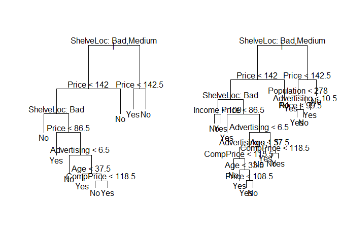
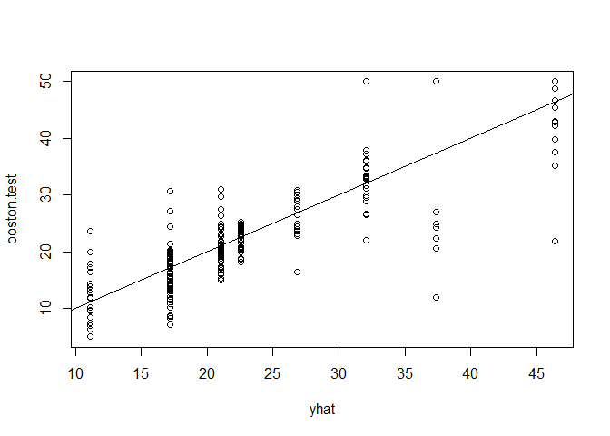
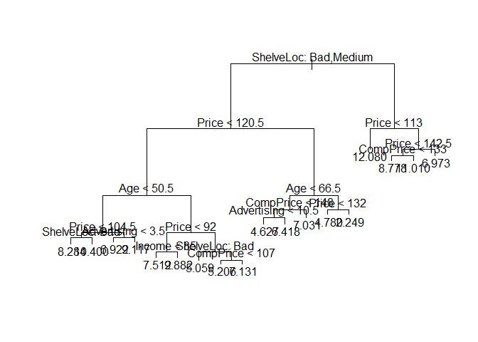
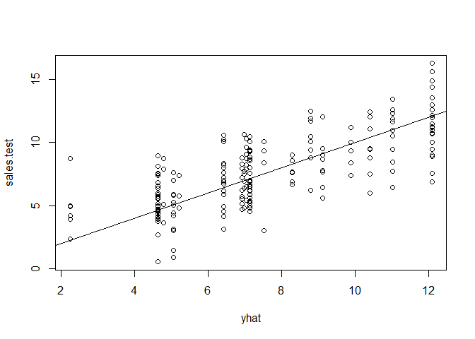
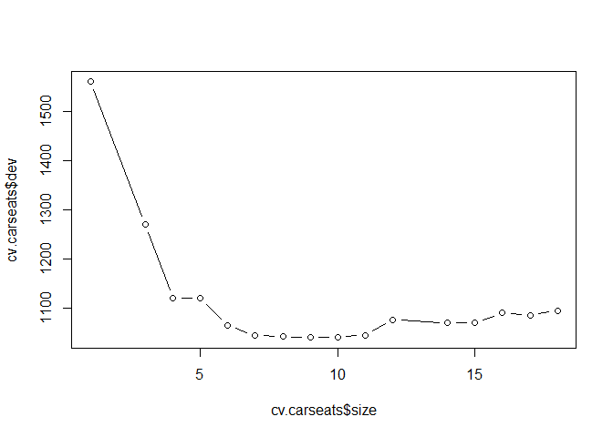
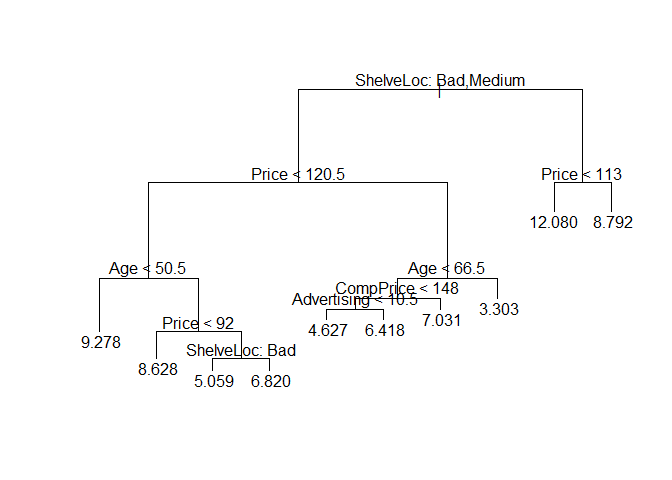
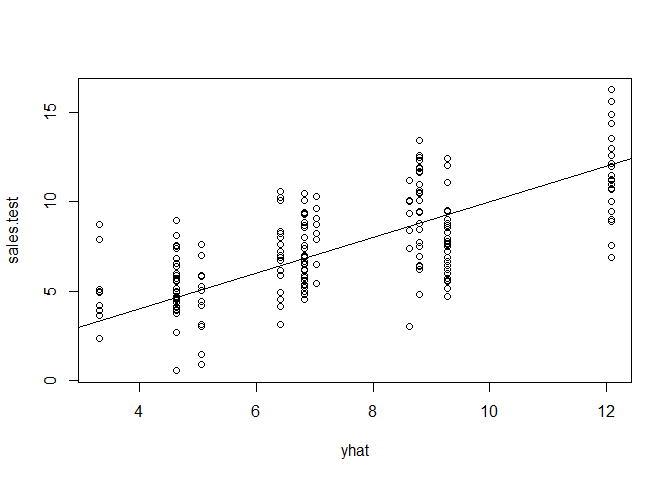
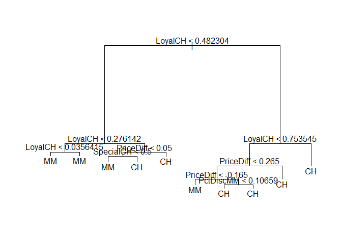
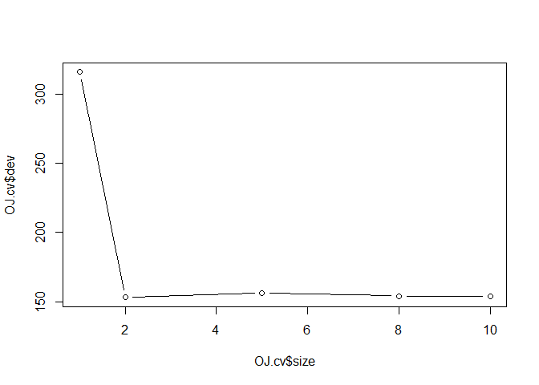
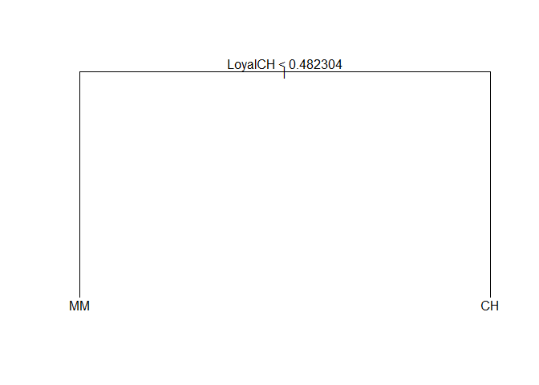

## load data


```r
library(ISLR)
library(ggplot2)
library(tree)
library(MASS)
library(dplyr)
```

```
## 
## Attaching package: 'dplyr'
```

```
## The following object is masked from 'package:MASS':
## 
##     select
```

```
## The following objects are masked from 'package:stats':
## 
##     filter, lag
```

```
## The following objects are masked from 'package:base':
## 
##     intersect, setdiff, setequal, union
```

# 8.3 Lab: Decision Trees

## 8.3.1 Fitting Classification Trees


```r
attach(Carseats)
High <- ifelse(Sales <= 8, "No","Yes")
Carseats <- data.frame(Carseats,High)
tree.carseats <- tree(High ~ .-Sales, Carseats)

summary(tree.carseats)
```

```
## 
## Classification tree:
## tree(formula = High ~ . - Sales, data = Carseats)
## Variables actually used in tree construction:
## [1] "ShelveLoc"   "Price"       "Income"      "CompPrice"   "Population" 
## [6] "Advertising" "Age"         "US"         
## Number of terminal nodes:  27 
## Residual mean deviance:  0.4575 = 170.7 / 373 
## Misclassification error rate: 0.09 = 36 / 400
```

```r
plot(tree.carseats)
text(tree.carseats, pretty = 0)
```

<!-- -->

```r
tree.carseats
```

```
## node), split, n, deviance, yval, (yprob)
##       * denotes terminal node
## 
##   1) root 400 541.500 No ( 0.59000 0.41000 )  
##     2) ShelveLoc: Bad,Medium 315 390.600 No ( 0.68889 0.31111 )  
##       4) Price < 92.5 46  56.530 Yes ( 0.30435 0.69565 )  
##         8) Income < 57 10  12.220 No ( 0.70000 0.30000 )  
##          16) CompPrice < 110.5 5   0.000 No ( 1.00000 0.00000 ) *
##          17) CompPrice > 110.5 5   6.730 Yes ( 0.40000 0.60000 ) *
##         9) Income > 57 36  35.470 Yes ( 0.19444 0.80556 )  
##          18) Population < 207.5 16  21.170 Yes ( 0.37500 0.62500 ) *
##          19) Population > 207.5 20   7.941 Yes ( 0.05000 0.95000 ) *
##       5) Price > 92.5 269 299.800 No ( 0.75465 0.24535 )  
##        10) Advertising < 13.5 224 213.200 No ( 0.81696 0.18304 )  
##          20) CompPrice < 124.5 96  44.890 No ( 0.93750 0.06250 )  
##            40) Price < 106.5 38  33.150 No ( 0.84211 0.15789 )  
##              80) Population < 177 12  16.300 No ( 0.58333 0.41667 )  
##               160) Income < 60.5 6   0.000 No ( 1.00000 0.00000 ) *
##               161) Income > 60.5 6   5.407 Yes ( 0.16667 0.83333 ) *
##              81) Population > 177 26   8.477 No ( 0.96154 0.03846 ) *
##            41) Price > 106.5 58   0.000 No ( 1.00000 0.00000 ) *
##          21) CompPrice > 124.5 128 150.200 No ( 0.72656 0.27344 )  
##            42) Price < 122.5 51  70.680 Yes ( 0.49020 0.50980 )  
##              84) ShelveLoc: Bad 11   6.702 No ( 0.90909 0.09091 ) *
##              85) ShelveLoc: Medium 40  52.930 Yes ( 0.37500 0.62500 )  
##               170) Price < 109.5 16   7.481 Yes ( 0.06250 0.93750 ) *
##               171) Price > 109.5 24  32.600 No ( 0.58333 0.41667 )  
##                 342) Age < 49.5 13  16.050 Yes ( 0.30769 0.69231 ) *
##                 343) Age > 49.5 11   6.702 No ( 0.90909 0.09091 ) *
##            43) Price > 122.5 77  55.540 No ( 0.88312 0.11688 )  
##              86) CompPrice < 147.5 58  17.400 No ( 0.96552 0.03448 ) *
##              87) CompPrice > 147.5 19  25.010 No ( 0.63158 0.36842 )  
##               174) Price < 147 12  16.300 Yes ( 0.41667 0.58333 )  
##                 348) CompPrice < 152.5 7   5.742 Yes ( 0.14286 0.85714 ) *
##                 349) CompPrice > 152.5 5   5.004 No ( 0.80000 0.20000 ) *
##               175) Price > 147 7   0.000 No ( 1.00000 0.00000 ) *
##        11) Advertising > 13.5 45  61.830 Yes ( 0.44444 0.55556 )  
##          22) Age < 54.5 25  25.020 Yes ( 0.20000 0.80000 )  
##            44) CompPrice < 130.5 14  18.250 Yes ( 0.35714 0.64286 )  
##              88) Income < 100 9  12.370 No ( 0.55556 0.44444 ) *
##              89) Income > 100 5   0.000 Yes ( 0.00000 1.00000 ) *
##            45) CompPrice > 130.5 11   0.000 Yes ( 0.00000 1.00000 ) *
##          23) Age > 54.5 20  22.490 No ( 0.75000 0.25000 )  
##            46) CompPrice < 122.5 10   0.000 No ( 1.00000 0.00000 ) *
##            47) CompPrice > 122.5 10  13.860 No ( 0.50000 0.50000 )  
##              94) Price < 125 5   0.000 Yes ( 0.00000 1.00000 ) *
##              95) Price > 125 5   0.000 No ( 1.00000 0.00000 ) *
##     3) ShelveLoc: Good 85  90.330 Yes ( 0.22353 0.77647 )  
##       6) Price < 135 68  49.260 Yes ( 0.11765 0.88235 )  
##        12) US: No 17  22.070 Yes ( 0.35294 0.64706 )  
##          24) Price < 109 8   0.000 Yes ( 0.00000 1.00000 ) *
##          25) Price > 109 9  11.460 No ( 0.66667 0.33333 ) *
##        13) US: Yes 51  16.880 Yes ( 0.03922 0.96078 ) *
##       7) Price > 135 17  22.070 No ( 0.64706 0.35294 )  
##        14) Income < 46 6   0.000 No ( 1.00000 0.00000 ) *
##        15) Income > 46 11  15.160 Yes ( 0.45455 0.54545 ) *
```

```r
set.seed(2)
train <- sample(1:nrow(Carseats), 200)
Carseats.test <- Carseats[-train,]
High.test <- High[-train]
tree.carseats <- tree(High ~ .-Sales, Carseats, subset=train)
tree.pred <- predict(tree.carseats, Carseats.test, type="class")
table(tree.pred, High.test)
```

```
##          High.test
## tree.pred No Yes
##       No  86  27
##       Yes 30  57
```

```r
(86+57)/200
```

```
## [1] 0.715
```

```r
set.seed(3)
cv.carseats <- cv.tree(tree.carseats,FUN=prune.misclass)
names(cv.carseats)
```

```
## [1] "size"   "dev"    "k"      "method"
```

```r
cv.carseats
```

```
## $size
## [1] 19 17 14 13  9  7  3  2  1
## 
## $dev
## [1] 55 55 53 52 50 56 69 65 80
## 
## $k
## [1]       -Inf  0.0000000  0.6666667  1.0000000  1.7500000  2.0000000
## [7]  4.2500000  5.0000000 23.0000000
## 
## $method
## [1] "misclass"
## 
## attr(,"class")
## [1] "prune"         "tree.sequence"
```

```r
par(mfrow=c(1,2))
plot(cv.carseats$size, cv.carseats$dev, type="b")
plot(cv.carseats$k, cv.carseats$dev, type="b")
```

<!-- -->

```r
prune.carseats <- prune.misclass(tree.carseats, best=9)
plot(prune.carseats)
text(prune.carseats, pretty = 0)

tree.pred <- predict(prune.carseats, Carseats.test, type="class")
table(tree.pred, High.test)
```

```
##          High.test
## tree.pred No Yes
##       No  94  24
##       Yes 22  60
```

```r
(94+60)/200
```

```
## [1] 0.77
```

```r
prune.carseats  <- prune.misclass(tree.carseats, best=15)
plot(prune.carseats)
text(prune.carseats, pretty = 0)
```

<!-- -->

```r
tree.pred <- predict(prune.carseats, Carseats.test, type="class")
table(tree.pred, High.test)
```

```
##          High.test
## tree.pred No Yes
##       No  86  22
##       Yes 30  62
```

```r
(86+62)/200
```

```
## [1] 0.74
```

```r
detach(Carseats)
```

## 8.3.2 Fitting Regression Trees


```r
set.seed(1)
train <- sample(1:nrow(Boston), nrow(Boston)/2)
tree.boston <- tree(medv ~., Boston, subset=train)
summary(tree.boston)
```

```
## 
## Regression tree:
## tree(formula = medv ~ ., data = Boston, subset = train)
## Variables actually used in tree construction:
## [1] "lstat" "rm"    "dis"  
## Number of terminal nodes:  8 
## Residual mean deviance:  12.65 = 3099 / 245 
## Distribution of residuals:
##      Min.   1st Qu.    Median      Mean   3rd Qu.      Max. 
## -14.10000  -2.04200  -0.05357   0.00000   1.96000  12.60000
```

```r
plot(tree.boston)
text(tree.boston, pretty = 0)
```

<!-- -->

```r
cv.boston <- cv.tree(tree.boston)
plot(cv.boston$size, cv.boston$dev, type='b')
```

<!-- -->

```r
prune.boston <- prune.tree(tree.boston, best=5)
plot(prune.boston)
text(prune.boston, pretty = 0)
```

<!-- -->

```r
yhat <- predict(tree.boston, newdata=Boston[-train,])
boston.test <- Boston[-train, "medv"]
plot(yhat, boston.test)
abline(0,1)
```

<!-- -->

```r
(mse <- mean((yhat - boston.test)^2))
```

```
## [1] 25.04559
```

```r
sqrt(mse)
```

```
## [1] 5.004557
```

# 8.4 Exercises

### 1. Draw an example (of your own invention) of a partition of two-dimensional feature space that could result from recursive binary splitting. Your example should contain at least six regions. Draw a decision tree corresponding to this partition. Be sure to label all aspects of your figures, including the regions R1, R2,..., the cutpoints t1, t2,..., and so forth. Hint: Your result should look something like Figures 8.1 and 8.2.


### 8. In the lab, a classification tree was applied to the Carseats data set after converting Sales into a qualitative response variable. Now we will seek to predict Sales using regression trees and related approaches, treating the response as a quantitative variable.

(a) Split the data set into a training set and a test set.


```r
set.seed(1)
train <- sample(1:nrow(Carseats), 200)
Carseats.train <- Carseats[train,-12]
Carseats.test <- Carseats[-train,-12]
```

(b) Fit a regression tree to the training set. Plot the tree, and interpret
the results. What test MSE do you obtain?


```r
tree.carseats <- tree(Sales ~ ., Carseats.train)
summary(tree.carseats)
```

```
## 
## Regression tree:
## tree(formula = Sales ~ ., data = Carseats.train)
## Variables actually used in tree construction:
## [1] "ShelveLoc"   "Price"       "Age"         "Advertising" "Income"     
## [6] "CompPrice"  
## Number of terminal nodes:  18 
## Residual mean deviance:  2.36 = 429.5 / 182 
## Distribution of residuals:
##    Min. 1st Qu.  Median    Mean 3rd Qu.    Max. 
## -4.2570 -1.0360  0.1024  0.0000  0.9301  3.9130
```

```r
par(mfrow=c(1,1))
plot(tree.carseats)
text(tree.carseats, pretty = 0)
```

<!-- -->

```r
yhat <- predict(tree.carseats, newdata=Carseats.test)
sales.test <- Carseats.test$Sales
plot(yhat, sales.test)
abline(0,1)
```

<!-- -->

```r
(mse <- mean((yhat - sales.test)^2))
```

```
## [1] 4.148897
```

```r
sqrt(mse)
```

```
## [1] 2.036884
```
Prediction on average is within 2000 unit sales

(c) Use cross-validation in order to determine the optimal level of
tree complexity. Does pruning the tree improve the test MSE?


```r
cv.carseats <- cv.tree(tree.carseats)
cv.carseats
```

```
## $size
##  [1] 18 17 16 15 14 12 11 10  9  8  7  6  5  4  3  1
## 
## $dev
##  [1] 1094.537 1085.178 1089.409 1069.294 1069.294 1075.806 1044.469
##  [8] 1039.212 1039.212 1041.308 1043.459 1064.162 1119.046 1120.344
## [15] 1270.012 1560.273
## 
## $k
##  [1]      -Inf  15.48181  15.53599  18.69038  18.74886  21.05038  23.79480
##  [8]  25.78579  26.01210  30.10435  32.74801  53.28569  72.33061  78.19599
## [15] 141.73781 251.22901
## 
## $method
## [1] "deviance"
## 
## attr(,"class")
## [1] "prune"         "tree.sequence"
```

```r
plot(cv.carseats$size, cv.carseats$dev, type='b')
```

<!-- -->

```r
(best <- cv.carseats$size[which.min(cv.carseats$dev)])
```

```
## [1] 10
```

```r
prune.carseats <- prune.tree(tree.carseats, best=best)
plot(prune.carseats)
text(prune.carseats, pretty = 0)
```

<!-- -->

```r
yhat <- predict(prune.carseats, newdata=Carseats.test)
sales.test <- Carseats.test$Sales
par(mfrow=c(1,1))
plot(yhat, sales.test)
abline(0,1)
```

<!-- -->

```r
(mse <- mean((yhat - sales.test)^2))
```

```
## [1] 4.819708
```

```r
sqrt(mse)
```

```
## [1] 2.195383
```
Made it worse

### 9. This problem involves the OJ data set which is part of the ISLR package.

(a) Create a training set containing a random sample of 800 observations, and a test set containing the remaining observations.


```r
summary(OJ)
```

```
##  Purchase WeekofPurchase     StoreID        PriceCH         PriceMM     
##  CH:653   Min.   :227.0   Min.   :1.00   Min.   :1.690   Min.   :1.690  
##  MM:417   1st Qu.:240.0   1st Qu.:2.00   1st Qu.:1.790   1st Qu.:1.990  
##           Median :257.0   Median :3.00   Median :1.860   Median :2.090  
##           Mean   :254.4   Mean   :3.96   Mean   :1.867   Mean   :2.085  
##           3rd Qu.:268.0   3rd Qu.:7.00   3rd Qu.:1.990   3rd Qu.:2.180  
##           Max.   :278.0   Max.   :7.00   Max.   :2.090   Max.   :2.290  
##      DiscCH            DiscMM         SpecialCH        SpecialMM     
##  Min.   :0.00000   Min.   :0.0000   Min.   :0.0000   Min.   :0.0000  
##  1st Qu.:0.00000   1st Qu.:0.0000   1st Qu.:0.0000   1st Qu.:0.0000  
##  Median :0.00000   Median :0.0000   Median :0.0000   Median :0.0000  
##  Mean   :0.05186   Mean   :0.1234   Mean   :0.1477   Mean   :0.1617  
##  3rd Qu.:0.00000   3rd Qu.:0.2300   3rd Qu.:0.0000   3rd Qu.:0.0000  
##  Max.   :0.50000   Max.   :0.8000   Max.   :1.0000   Max.   :1.0000  
##     LoyalCH          SalePriceMM     SalePriceCH      PriceDiff      
##  Min.   :0.000011   Min.   :1.190   Min.   :1.390   Min.   :-0.6700  
##  1st Qu.:0.325257   1st Qu.:1.690   1st Qu.:1.750   1st Qu.: 0.0000  
##  Median :0.600000   Median :2.090   Median :1.860   Median : 0.2300  
##  Mean   :0.565782   Mean   :1.962   Mean   :1.816   Mean   : 0.1465  
##  3rd Qu.:0.850873   3rd Qu.:2.130   3rd Qu.:1.890   3rd Qu.: 0.3200  
##  Max.   :0.999947   Max.   :2.290   Max.   :2.090   Max.   : 0.6400  
##  Store7      PctDiscMM        PctDiscCH       ListPriceDiff  
##  No :714   Min.   :0.0000   Min.   :0.00000   Min.   :0.000  
##  Yes:356   1st Qu.:0.0000   1st Qu.:0.00000   1st Qu.:0.140  
##            Median :0.0000   Median :0.00000   Median :0.240  
##            Mean   :0.0593   Mean   :0.02731   Mean   :0.218  
##            3rd Qu.:0.1127   3rd Qu.:0.00000   3rd Qu.:0.300  
##            Max.   :0.4020   Max.   :0.25269   Max.   :0.440  
##      STORE      
##  Min.   :0.000  
##  1st Qu.:0.000  
##  Median :2.000  
##  Mean   :1.631  
##  3rd Qu.:3.000  
##  Max.   :4.000
```

```r
dim(OJ)
```

```
## [1] 1070   18
```

```r
set.seed(123)
train <- sample(1:nrow(OJ), 800)
OJ.train <- OJ[train,]
OJ.test <- OJ[-train,]
```

(b) Fit a tree to the training data, with Purchase as the response and the other variables as predictors. Use the summary() function to produce summary statistics about the tree, and describe the results obtained. What is the training error rate? How many terminal nodes does the tree have?


```r
OJ.tree <- tree(Purchase ~ ., data = OJ.train)
summary(OJ.tree)
```

```
## 
## Classification tree:
## tree(formula = Purchase ~ ., data = OJ.train)
## Variables actually used in tree construction:
## [1] "LoyalCH"   "PriceDiff" "SpecialCH" "PctDiscMM"
## Number of terminal nodes:  10 
## Residual mean deviance:  0.7289 = 575.8 / 790 
## Misclassification error rate: 0.1612 = 129 / 800
```
Training error is 16% and tree has 10 terminal nodes

(c) Type in the name of the tree object in order to get a detailed text output. Pick one of the terminal nodes, and interpret the information displayed.


```r
OJ.tree
```

```
## node), split, n, deviance, yval, (yprob)
##       * denotes terminal node
## 
##  1) root 800 1073.000 CH ( 0.60500 0.39500 )  
##    2) LoyalCH < 0.482304 299  320.600 MM ( 0.22742 0.77258 )  
##      4) LoyalCH < 0.276142 172  127.600 MM ( 0.12209 0.87791 )  
##        8) LoyalCH < 0.0356415 56   10.030 MM ( 0.01786 0.98214 ) *
##        9) LoyalCH > 0.0356415 116  106.600 MM ( 0.17241 0.82759 ) *
##      5) LoyalCH > 0.276142 127  167.400 MM ( 0.37008 0.62992 )  
##       10) PriceDiff < 0.05 58   59.140 MM ( 0.20690 0.79310 )  
##         20) SpecialCH < 0.5 51   36.950 MM ( 0.11765 0.88235 ) *
##         21) SpecialCH > 0.5 7    5.742 CH ( 0.85714 0.14286 ) *
##       11) PriceDiff > 0.05 69   95.640 CH ( 0.50725 0.49275 ) *
##    3) LoyalCH > 0.482304 501  456.300 CH ( 0.83034 0.16966 )  
##      6) LoyalCH < 0.753545 236  292.000 CH ( 0.69068 0.30932 )  
##       12) PriceDiff < 0.265 147  202.300 CH ( 0.55102 0.44898 )  
##         24) PriceDiff < -0.165 40   47.050 MM ( 0.27500 0.72500 ) *
##         25) PriceDiff > -0.165 107  138.000 CH ( 0.65421 0.34579 )  
##           50) PctDiscMM < 0.10659 75  102.900 CH ( 0.56000 0.44000 ) *
##           51) PctDiscMM > 0.10659 32   24.110 CH ( 0.87500 0.12500 ) *
##       13) PriceDiff > 0.265 89   49.030 CH ( 0.92135 0.07865 ) *
##      7) LoyalCH > 0.753545 265   97.720 CH ( 0.95472 0.04528 ) *
```

```r
#7) LoyalCH > 0.753545 265   97.720 CH ( 0.95472 0.04528 ) *
```
Split criterion in this case brand loyalty for Citus Hills, # of observations in branch, deviance, overall prediction for branch Citrus Hill in this case, Fraction that are Citrus Hill and Fraction that are Minute Maid

(d) Create a plot of the tree, and interpret the results.


```r
plot(OJ.tree)
text(OJ.tree, pretty = 0)
```

<!-- -->
Loyalty and Price difference play a huge role in the decision

(e) Predict the response on the test data, and produce a confusion
matrix comparing the test labels to the predicted test labels.
What is the test error rate?


```r
pred <- predict(OJ.tree, newdata=OJ.test, type = "class")
purchase.test <- OJ.test$Purchase
table(pred, purchase.test)
```

```
##     purchase.test
## pred  CH  MM
##   CH 158  37
##   MM  11  64
```

```r
(1-((158+64)/270))*100
```

```
## [1] 17.77778
```
17.78% MSE

(f) Apply the cv.tree() function to the training set in order to determine the optimal tree size.


```r
OJ.cv <- cv.tree(OJ.tree,FUN=prune.misclass)
```

(g) Produce a plot with tree size on the x-axis and cross-validated classification error rate on the y-axis.


```r
plot(OJ.cv$size, OJ.cv$dev, type="b")
```

<!-- -->

(h) Which tree size corresponds to the lowest cross-validated classification error rate?

```r
(best <- OJ.cv$size[which.min(OJ.cv$dev)])
```

```
## [1] 2
```
2 is the best

(i) Produce a pruned tree corresponding to the optimal tree size obtained using cross-validation. If cross-validation does not lead to selection of a pruned tree, then create a pruned tree with five terminal nodes.


```r
OJ.prune <- prune.misclass(OJ.tree, best=best)
plot(OJ.prune)
text(OJ.prune, pretty = 0)
```

<!-- -->

(j) Compare the training error rates between the pruned and unpruned
trees. Which is higher?


```r
summary(OJ.tree)
```

```
## 
## Classification tree:
## tree(formula = Purchase ~ ., data = OJ.train)
## Variables actually used in tree construction:
## [1] "LoyalCH"   "PriceDiff" "SpecialCH" "PctDiscMM"
## Number of terminal nodes:  10 
## Residual mean deviance:  0.7289 = 575.8 / 790 
## Misclassification error rate: 0.1612 = 129 / 800
```

```r
summary(OJ.prune)
```

```
## 
## Classification tree:
## snip.tree(tree = OJ.tree, nodes = 2:3)
## Variables actually used in tree construction:
## [1] "LoyalCH"
## Number of terminal nodes:  2 
## Residual mean deviance:  0.9735 = 776.9 / 798 
## Misclassification error rate: 0.1912 = 153 / 800
```
Pruned has a higher error

(k) Compare the test error rates between the pruned and unpruned
trees. Which is higher?

```r
pred <- predict(OJ.tree, OJ.test, type="class")
table(pred, OJ.test$Purchase)
```

```
##     
## pred  CH  MM
##   CH 158  37
##   MM  11  64
```

```r
(1-(158+64)/270)*100
```

```
## [1] 17.77778
```

```r
prune.pred <- predict(OJ.prune, OJ.test, type="class")
table(prune.pred, OJ.test$Purchase)
```

```
##           
## prune.pred  CH  MM
##         CH 143  25
##         MM  26  76
```

```r
(1-(143+76)/270)*100
```

```
## [1] 18.88889
```
Pruned has a higher error
