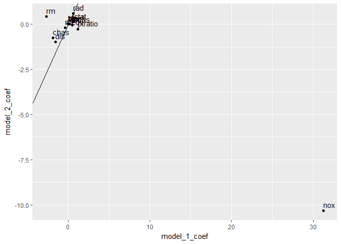
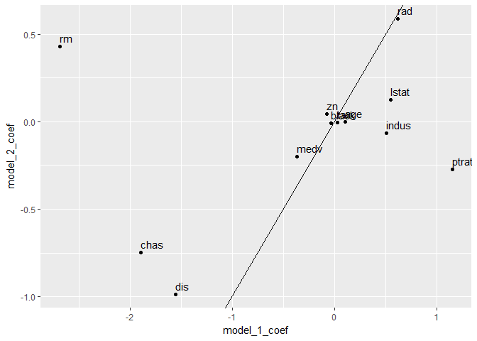

## 3.6.3 Multiple Linear Regression


```r
lm.fit <- lm(medv~lstat+age ,data=Boston )
summary (lm.fit)
```

```
## 
## Call:
## lm(formula = medv ~ lstat + age, data = Boston)
## 
## Residuals:
##     Min      1Q  Median      3Q     Max 
## -15.981  -3.978  -1.283   1.968  23.158 
## 
## Coefficients:
##             Estimate Std. Error t value Pr(>|t|)    
## (Intercept) 33.22276    0.73085  45.458  < 2e-16 ***
## lstat       -1.03207    0.04819 -21.416  < 2e-16 ***
## age          0.03454    0.01223   2.826  0.00491 ** 
## ---
## Signif. codes:  0 '***' 0.001 '**' 0.01 '*' 0.05 '.' 0.1 ' ' 1
## 
## Residual standard error: 6.173 on 503 degrees of freedom
## Multiple R-squared:  0.5513,	Adjusted R-squared:  0.5495 
## F-statistic:   309 on 2 and 503 DF,  p-value: < 2.2e-16
```

```r
lm.fit <- lm(medv~.,data=Boston)
summary (lm.fit)
```

```
## 
## Call:
## lm(formula = medv ~ ., data = Boston)
## 
## Residuals:
##     Min      1Q  Median      3Q     Max 
## -15.595  -2.730  -0.518   1.777  26.199 
## 
## Coefficients:
##               Estimate Std. Error t value Pr(>|t|)    
## (Intercept)  3.646e+01  5.103e+00   7.144 3.28e-12 ***
## crim        -1.080e-01  3.286e-02  -3.287 0.001087 ** 
## zn           4.642e-02  1.373e-02   3.382 0.000778 ***
## indus        2.056e-02  6.150e-02   0.334 0.738288    
## chas         2.687e+00  8.616e-01   3.118 0.001925 ** 
## nox         -1.777e+01  3.820e+00  -4.651 4.25e-06 ***
## rm           3.810e+00  4.179e-01   9.116  < 2e-16 ***
## age          6.922e-04  1.321e-02   0.052 0.958229    
## dis         -1.476e+00  1.995e-01  -7.398 6.01e-13 ***
## rad          3.060e-01  6.635e-02   4.613 5.07e-06 ***
## tax         -1.233e-02  3.760e-03  -3.280 0.001112 ** 
## ptratio     -9.527e-01  1.308e-01  -7.283 1.31e-12 ***
## black        9.312e-03  2.686e-03   3.467 0.000573 ***
## lstat       -5.248e-01  5.072e-02 -10.347  < 2e-16 ***
## ---
## Signif. codes:  0 '***' 0.001 '**' 0.01 '*' 0.05 '.' 0.1 ' ' 1
## 
## Residual standard error: 4.745 on 492 degrees of freedom
## Multiple R-squared:  0.7406,	Adjusted R-squared:  0.7338 
## F-statistic: 108.1 on 13 and 492 DF,  p-value: < 2.2e-16
```

```r
summary(lm.fit)$r.sq
```

```
## [1] 0.7406427
```

```r
summary(lm.fit)$sigma
```

```
## [1] 4.745298
```

```r
#install.packages('car')
vif(lm.fit)
```

```
##     crim       zn    indus     chas      nox       rm      age      dis 
## 1.792192 2.298758 3.991596 1.073995 4.393720 1.933744 3.100826 3.955945 
##      rad      tax  ptratio    black    lstat 
## 7.484496 9.008554 1.799084 1.348521 2.941491
```

```r
lm.fit1 <- lm(medv∼.-age ,data=Boston )
summary (lm.fit1)
```

```
## 
## Call:
## lm(formula = medv ~ . - age, data = Boston)
## 
## Residuals:
##      Min       1Q   Median       3Q      Max 
## -15.6054  -2.7313  -0.5188   1.7601  26.2243 
## 
## Coefficients:
##               Estimate Std. Error t value Pr(>|t|)    
## (Intercept)  36.436927   5.080119   7.172 2.72e-12 ***
## crim         -0.108006   0.032832  -3.290 0.001075 ** 
## zn            0.046334   0.013613   3.404 0.000719 ***
## indus         0.020562   0.061433   0.335 0.737989    
## chas          2.689026   0.859598   3.128 0.001863 ** 
## nox         -17.713540   3.679308  -4.814 1.97e-06 ***
## rm            3.814394   0.408480   9.338  < 2e-16 ***
## dis          -1.478612   0.190611  -7.757 5.03e-14 ***
## rad           0.305786   0.066089   4.627 4.75e-06 ***
## tax          -0.012329   0.003755  -3.283 0.001099 ** 
## ptratio      -0.952211   0.130294  -7.308 1.10e-12 ***
## black         0.009321   0.002678   3.481 0.000544 ***
## lstat        -0.523852   0.047625 -10.999  < 2e-16 ***
## ---
## Signif. codes:  0 '***' 0.001 '**' 0.01 '*' 0.05 '.' 0.1 ' ' 1
## 
## Residual standard error: 4.74 on 493 degrees of freedom
## Multiple R-squared:  0.7406,	Adjusted R-squared:  0.7343 
## F-statistic: 117.3 on 12 and 493 DF,  p-value: < 2.2e-16
```

```r
lm.fit1 <- update(lm.fit , ∼.-age)
summary (lm.fit1)
```

```
## 
## Call:
## lm(formula = medv ~ crim + zn + indus + chas + nox + rm + dis + 
##     rad + tax + ptratio + black + lstat, data = Boston)
## 
## Residuals:
##      Min       1Q   Median       3Q      Max 
## -15.6054  -2.7313  -0.5188   1.7601  26.2243 
## 
## Coefficients:
##               Estimate Std. Error t value Pr(>|t|)    
## (Intercept)  36.436927   5.080119   7.172 2.72e-12 ***
## crim         -0.108006   0.032832  -3.290 0.001075 ** 
## zn            0.046334   0.013613   3.404 0.000719 ***
## indus         0.020562   0.061433   0.335 0.737989    
## chas          2.689026   0.859598   3.128 0.001863 ** 
## nox         -17.713540   3.679308  -4.814 1.97e-06 ***
## rm            3.814394   0.408480   9.338  < 2e-16 ***
## dis          -1.478612   0.190611  -7.757 5.03e-14 ***
## rad           0.305786   0.066089   4.627 4.75e-06 ***
## tax          -0.012329   0.003755  -3.283 0.001099 ** 
## ptratio      -0.952211   0.130294  -7.308 1.10e-12 ***
## black         0.009321   0.002678   3.481 0.000544 ***
## lstat        -0.523852   0.047625 -10.999  < 2e-16 ***
## ---
## Signif. codes:  0 '***' 0.001 '**' 0.01 '*' 0.05 '.' 0.1 ' ' 1
## 
## Residual standard error: 4.74 on 493 degrees of freedom
## Multiple R-squared:  0.7406,	Adjusted R-squared:  0.7343 
## F-statistic: 117.3 on 12 and 493 DF,  p-value: < 2.2e-16
```

# Problems

### 1. Describe the null hypotheses to which the p-values given in Table 3.4 correspond. Explain what conclusions you can draw based on these p-values. Your explanation should be phrased in terms of sales, TV, radio, and newspaper, rather than in terms of the coefficients of the linear model.
  

```r
advertising <- read.csv("Advertising.csv", row.names = 1)
head(advertising)
```

```
##      TV radio newspaper sales
## 1 230.1  37.8      69.2  22.1
## 2  44.5  39.3      45.1  10.4
## 3  17.2  45.9      69.3   9.3
## 4 151.5  41.3      58.5  18.5
## 5 180.8  10.8      58.4  12.9
## 6   8.7  48.9      75.0   7.2
```

```r
lm.fit <- lm(sales ~ ., data = advertising)
summary(lm.fit)
```

```
## 
## Call:
## lm(formula = sales ~ ., data = advertising)
## 
## Residuals:
##     Min      1Q  Median      3Q     Max 
## -8.8277 -0.8908  0.2418  1.1893  2.8292 
## 
## Coefficients:
##              Estimate Std. Error t value Pr(>|t|)    
## (Intercept)  2.938889   0.311908   9.422   <2e-16 ***
## TV           0.045765   0.001395  32.809   <2e-16 ***
## radio        0.188530   0.008611  21.893   <2e-16 ***
## newspaper   -0.001037   0.005871  -0.177     0.86    
## ---
## Signif. codes:  0 '***' 0.001 '**' 0.01 '*' 0.05 '.' 0.1 ' ' 1
## 
## Residual standard error: 1.686 on 196 degrees of freedom
## Multiple R-squared:  0.8972,	Adjusted R-squared:  0.8956 
## F-statistic: 570.3 on 3 and 196 DF,  p-value: < 2.2e-16
```

```r
summary(lm.fit)$coefficients
```

```
##                 Estimate  Std. Error    t value     Pr(>|t|)
## (Intercept)  2.938889369 0.311908236  9.4222884 1.267295e-17
## TV           0.045764645 0.001394897 32.8086244 1.509960e-81
## radio        0.188530017 0.008611234 21.8934961 1.505339e-54
## newspaper   -0.001037493 0.005871010 -0.1767146 8.599151e-01
```

The p-values are for the null hypotheses that the predictor has no effect on the response. For TV and radio it is highly unlikely that these predictors do not affect sales. Newspaper on the other hand does not have a significant effect.

### 9. This question involves the use of multiple linear regression on the Auto data set.

  (a) Produce a scatterplot matrix which includes all of the variables in the data set.


```r
dat <- Auto
pairs(dat)
```

<!-- -->
  
  (b) Compute the matrix of correlations between the variables using the function cor(). You will need to exclude the name variable, which is qualitative.


```r
dat2 <- dat[,-9]
head(dat2)
```

```
##   mpg cylinders displacement horsepower weight acceleration year origin
## 1  18         8          307        130   3504         12.0   70      1
## 2  15         8          350        165   3693         11.5   70      1
## 3  18         8          318        150   3436         11.0   70      1
## 4  16         8          304        150   3433         12.0   70      1
## 5  17         8          302        140   3449         10.5   70      1
## 6  15         8          429        198   4341         10.0   70      1
```

```r
cor(dat2)
```

```
##                     mpg  cylinders displacement horsepower     weight
## mpg           1.0000000 -0.7776175   -0.8051269 -0.7784268 -0.8322442
## cylinders    -0.7776175  1.0000000    0.9508233  0.8429834  0.8975273
## displacement -0.8051269  0.9508233    1.0000000  0.8972570  0.9329944
## horsepower   -0.7784268  0.8429834    0.8972570  1.0000000  0.8645377
## weight       -0.8322442  0.8975273    0.9329944  0.8645377  1.0000000
## acceleration  0.4233285 -0.5046834   -0.5438005 -0.6891955 -0.4168392
## year          0.5805410 -0.3456474   -0.3698552 -0.4163615 -0.3091199
## origin        0.5652088 -0.5689316   -0.6145351 -0.4551715 -0.5850054
##              acceleration       year     origin
## mpg             0.4233285  0.5805410  0.5652088
## cylinders      -0.5046834 -0.3456474 -0.5689316
## displacement   -0.5438005 -0.3698552 -0.6145351
## horsepower     -0.6891955 -0.4163615 -0.4551715
## weight         -0.4168392 -0.3091199 -0.5850054
## acceleration    1.0000000  0.2903161  0.2127458
## year            0.2903161  1.0000000  0.1815277
## origin          0.2127458  0.1815277  1.0000000
```

```r
symnum(cor(dat2))
```

```
##              m c d h w a y o
## mpg          1              
## cylinders    , 1            
## displacement + B 1          
## horsepower   , + + 1        
## weight       + + * + 1      
## acceleration . . . , . 1    
## year         . . . . .   1  
## origin       . . , . .     1
## attr(,"legend")
## [1] 0 ' ' 0.3 '.' 0.6 ',' 0.8 '+' 0.9 '*' 0.95 'B' 1
```

  (c) Use the lm() function to perform a multiple linear regression with mpg as the response and all other variables except name as the predictors. Use the summary() function to print the results. Comment on the output. For instance:
    i. Is there a relationship between the predictors and the response?
    ii. Which predictors appear to have a statistically significant relationship to the response?
    iii. What does the coefficient for the year variable suggest?


```r
lm.fit <- lm(mpg ~ .-name, data = dat)

#or
#lm.fit <- lm(mpg ~ ., data = dat2)

summary(lm.fit)
```

```
## 
## Call:
## lm(formula = mpg ~ . - name, data = dat)
## 
## Residuals:
##     Min      1Q  Median      3Q     Max 
## -9.5903 -2.1565 -0.1169  1.8690 13.0604 
## 
## Coefficients:
##                Estimate Std. Error t value Pr(>|t|)    
## (Intercept)  -17.218435   4.644294  -3.707  0.00024 ***
## cylinders     -0.493376   0.323282  -1.526  0.12780    
## displacement   0.019896   0.007515   2.647  0.00844 ** 
## horsepower    -0.016951   0.013787  -1.230  0.21963    
## weight        -0.006474   0.000652  -9.929  < 2e-16 ***
## acceleration   0.080576   0.098845   0.815  0.41548    
## year           0.750773   0.050973  14.729  < 2e-16 ***
## origin         1.426141   0.278136   5.127 4.67e-07 ***
## ---
## Signif. codes:  0 '***' 0.001 '**' 0.01 '*' 0.05 '.' 0.1 ' ' 1
## 
## Residual standard error: 3.328 on 384 degrees of freedom
## Multiple R-squared:  0.8215,	Adjusted R-squared:  0.8182 
## F-statistic: 252.4 on 7 and 384 DF,  p-value: < 2.2e-16
```

i. When all predictors are considered together cylinders, horsepower, and acceleration are not found to be significant while the other predictors are.

ii. Displacement, weight, year, and origin all appear to be significant when regressing mpg on all other variables.

iii. The coefficient for year suggests that for each increase 1 year increase in year the mpg of a car increases by .75

### 10. This question should be answered using the Carseats data set.

  (a) Fit a multiple regression model to predict Sales using Price, Urban, and US.
  

```r
dat <- Carseats
summary(dat)
```

```
##      Sales          CompPrice       Income        Advertising    
##  Min.   : 0.000   Min.   : 77   Min.   : 21.00   Min.   : 0.000  
##  1st Qu.: 5.390   1st Qu.:115   1st Qu.: 42.75   1st Qu.: 0.000  
##  Median : 7.490   Median :125   Median : 69.00   Median : 5.000  
##  Mean   : 7.496   Mean   :125   Mean   : 68.66   Mean   : 6.635  
##  3rd Qu.: 9.320   3rd Qu.:135   3rd Qu.: 91.00   3rd Qu.:12.000  
##  Max.   :16.270   Max.   :175   Max.   :120.00   Max.   :29.000  
##    Population        Price        ShelveLoc        Age       
##  Min.   : 10.0   Min.   : 24.0   Bad   : 96   Min.   :25.00  
##  1st Qu.:139.0   1st Qu.:100.0   Good  : 85   1st Qu.:39.75  
##  Median :272.0   Median :117.0   Medium:219   Median :54.50  
##  Mean   :264.8   Mean   :115.8                Mean   :53.32  
##  3rd Qu.:398.5   3rd Qu.:131.0                3rd Qu.:66.00  
##  Max.   :509.0   Max.   :191.0                Max.   :80.00  
##    Education    Urban       US     
##  Min.   :10.0   No :118   No :142  
##  1st Qu.:12.0   Yes:282   Yes:258  
##  Median :14.0                      
##  Mean   :13.9                      
##  3rd Qu.:16.0                      
##  Max.   :18.0
```

```r
lm.fit <- lm(Sales ~ Price+Urban+US, data = dat)
summary(lm.fit)
```

```
## 
## Call:
## lm(formula = Sales ~ Price + Urban + US, data = dat)
## 
## Residuals:
##     Min      1Q  Median      3Q     Max 
## -6.9206 -1.6220 -0.0564  1.5786  7.0581 
## 
## Coefficients:
##              Estimate Std. Error t value Pr(>|t|)    
## (Intercept) 13.043469   0.651012  20.036  < 2e-16 ***
## Price       -0.054459   0.005242 -10.389  < 2e-16 ***
## UrbanYes    -0.021916   0.271650  -0.081    0.936    
## USYes        1.200573   0.259042   4.635 4.86e-06 ***
## ---
## Signif. codes:  0 '***' 0.001 '**' 0.01 '*' 0.05 '.' 0.1 ' ' 1
## 
## Residual standard error: 2.472 on 396 degrees of freedom
## Multiple R-squared:  0.2393,	Adjusted R-squared:  0.2335 
## F-statistic: 41.52 on 3 and 396 DF,  p-value: < 2.2e-16
```

  (b) Provide an interpretation of each coefficient in the model. Be Careful—some of the variables in the model are qualitative!
  

```r
summary(lm.fit)$coefficients
```

```
##                Estimate  Std. Error      t value     Pr(>|t|)
## (Intercept) 13.04346894 0.651012245  20.03567373 3.626602e-62
## Price       -0.05445885 0.005241855 -10.38923205 1.609917e-22
## UrbanYes    -0.02191615 0.271650277  -0.08067781 9.357389e-01
## USYes        1.20057270 0.259041508   4.63467306 4.860245e-06
```

As price increases the number of sales decreases. If a store is in an urban area sales goes down although this predictor appears to be insignificant based off its p-value. If the store is in the US sales goes up.

  (c) Write out the model in equation form, being careful to handle the qualitative variables properly
  

```r
as.formula(
  paste0("Sales ~ ", round(coefficients(lm.fit)[1],2), "", 
    paste(sprintf(" %+.2f*%s ", 
                  coefficients(lm.fit)[-1],  
                  names(coefficients(lm.fit)[-1])),
          collapse="")," + error"
  )
)
```

```
## Sales ~ 13.04 - 0.05 * Price - 0.02 * UrbanYes + 1.2 * USYes + 
##     error
```

  (d) For which of the predictors can you reject the null hypothesis H0 : βj = 0?
  
For the predictors Price and US we can reject the null hypothesis

  (e) On the basis of your response to the previous question, fit a smaller model that only uses the predictors for which there is evidence of association with the outcome.
  

```r
lm.fit2 <- lm(Sales ~ Price+US, data = dat)
```

  (f) How well do the models in (a) and (e) fit the data?


```r
summary(lm.fit)
```

```
## 
## Call:
## lm(formula = Sales ~ Price + Urban + US, data = dat)
## 
## Residuals:
##     Min      1Q  Median      3Q     Max 
## -6.9206 -1.6220 -0.0564  1.5786  7.0581 
## 
## Coefficients:
##              Estimate Std. Error t value Pr(>|t|)    
## (Intercept) 13.043469   0.651012  20.036  < 2e-16 ***
## Price       -0.054459   0.005242 -10.389  < 2e-16 ***
## UrbanYes    -0.021916   0.271650  -0.081    0.936    
## USYes        1.200573   0.259042   4.635 4.86e-06 ***
## ---
## Signif. codes:  0 '***' 0.001 '**' 0.01 '*' 0.05 '.' 0.1 ' ' 1
## 
## Residual standard error: 2.472 on 396 degrees of freedom
## Multiple R-squared:  0.2393,	Adjusted R-squared:  0.2335 
## F-statistic: 41.52 on 3 and 396 DF,  p-value: < 2.2e-16
```

```r
summary(lm.fit2)
```

```
## 
## Call:
## lm(formula = Sales ~ Price + US, data = dat)
## 
## Residuals:
##     Min      1Q  Median      3Q     Max 
## -6.9269 -1.6286 -0.0574  1.5766  7.0515 
## 
## Coefficients:
##             Estimate Std. Error t value Pr(>|t|)    
## (Intercept) 13.03079    0.63098  20.652  < 2e-16 ***
## Price       -0.05448    0.00523 -10.416  < 2e-16 ***
## USYes        1.19964    0.25846   4.641 4.71e-06 ***
## ---
## Signif. codes:  0 '***' 0.001 '**' 0.01 '*' 0.05 '.' 0.1 ' ' 1
## 
## Residual standard error: 2.469 on 397 degrees of freedom
## Multiple R-squared:  0.2393,	Adjusted R-squared:  0.2354 
## F-statistic: 62.43 on 2 and 397 DF,  p-value: < 2.2e-16
```

```r
summary(lm.fit)$r.squared-summary(lm.fit2)$r.squared
```

```
## [1] 1.250376e-05
```

There is not much of a difference between the two models.

  (g) Using the model from (e), obtain 95 % confidence intervals for the coefficient(s).


```r
confint(lm.fit2)
```

```
##                   2.5 %      97.5 %
## (Intercept) 11.79032020 14.27126531
## Price       -0.06475984 -0.04419543
## USYes        0.69151957  1.70776632
```

### 15. This problem involves the Boston data set, which we saw in the lab for this chapter. We will now try to predict per capita crime rate using the other variables in this data set. In other words, per capita crime rate is the response, and the other variables are the predictors.

  (a) For each predictor, fit a simple linear regression model to predict the response. Describe your results. In which of the models is there a statistically significant association between the predictor and the response? Create some plots to back up your assertions.
  
  
  

```r
boston.nest <- Boston %>% 
  tidyr::gather(key="predictor",value="value",-crim) %>%
  dplyr::group_by(predictor) %>%
  tidyr::nest()
boston.nest # a set of data frames, one for each predictor
```

```
## # A tibble: 13 x 2
##    predictor               data
##        <chr>             <list>
##  1        zn <tibble [506 x 2]>
##  2     indus <tibble [506 x 2]>
##  3      chas <tibble [506 x 2]>
##  4       nox <tibble [506 x 2]>
##  5        rm <tibble [506 x 2]>
##  6       age <tibble [506 x 2]>
##  7       dis <tibble [506 x 2]>
##  8       rad <tibble [506 x 2]>
##  9       tax <tibble [506 x 2]>
## 10   ptratio <tibble [506 x 2]>
## 11     black <tibble [506 x 2]>
## 12     lstat <tibble [506 x 2]>
## 13      medv <tibble [506 x 2]>
```

```r
boston.nest$data[[1]]
```

```
## # A tibble: 506 x 2
##       crim value
##      <dbl> <dbl>
##  1 0.00632  18.0
##  2 0.02731   0.0
##  3 0.02729   0.0
##  4 0.03237   0.0
##  5 0.06905   0.0
##  6 0.02985   0.0
##  7 0.08829  12.5
##  8 0.14455  12.5
##  9 0.21124  12.5
## 10 0.17004  12.5
## # ... with 496 more rows
```

```r
fitModel <- function(df) lm(crim ~ value, data=df)
boston.nest <- boston.nest%>%
  mutate(model=purrr::map(data,fitModel),
         model.summary=purrr::map(model,summary))
boston.nest
```

```
## # A tibble: 13 x 4
##    predictor               data    model    model.summary
##        <chr>             <list>   <list>           <list>
##  1        zn <tibble [506 x 2]> <S3: lm> <S3: summary.lm>
##  2     indus <tibble [506 x 2]> <S3: lm> <S3: summary.lm>
##  3      chas <tibble [506 x 2]> <S3: lm> <S3: summary.lm>
##  4       nox <tibble [506 x 2]> <S3: lm> <S3: summary.lm>
##  5        rm <tibble [506 x 2]> <S3: lm> <S3: summary.lm>
##  6       age <tibble [506 x 2]> <S3: lm> <S3: summary.lm>
##  7       dis <tibble [506 x 2]> <S3: lm> <S3: summary.lm>
##  8       rad <tibble [506 x 2]> <S3: lm> <S3: summary.lm>
##  9       tax <tibble [506 x 2]> <S3: lm> <S3: summary.lm>
## 10   ptratio <tibble [506 x 2]> <S3: lm> <S3: summary.lm>
## 11     black <tibble [506 x 2]> <S3: lm> <S3: summary.lm>
## 12     lstat <tibble [506 x 2]> <S3: lm> <S3: summary.lm>
## 13      medv <tibble [506 x 2]> <S3: lm> <S3: summary.lm>
```

```r
boston_glance <- boston.nest %>%
  mutate(glance=purrr::map(model,glance)) %>%
  tidyr::unnest(glance,.drop = TRUE)
boston_glance
```

```
## # A tibble: 13 x 12
##    predictor   r.squared adj.r.squared    sigma  statistic      p.value
##        <chr>       <dbl>         <dbl>    <dbl>      <dbl>        <dbl>
##  1        zn 0.040187908    0.03828352 8.435290  21.102782 5.506472e-06
##  2     indus 0.165310070    0.16365394 7.866281  99.817037 1.450349e-21
##  3      chas 0.003123869    0.00114594 8.596615   1.579364 2.094345e-01
##  4       nox 0.177217182    0.17558468 7.809972 108.555329 3.751739e-23
##  5        rm 0.048069117    0.04618036 8.400586  25.450204 6.346703e-07
##  6       age 0.124421452    0.12268419 8.056649  71.619402 2.854869e-16
##  7       dis 0.144149375    0.14245126 7.965369  84.887810 8.519949e-19
##  8       rad 0.391256687    0.39004886 6.717752 323.935172 2.693844e-56
##  9       tax 0.339614243    0.33830395 6.996901 259.190294 2.357127e-47
## 10   ptratio 0.084068439    0.08225111 8.240212  46.259453 2.942922e-11
## 11     black 0.148274239    0.14658431 7.946150  87.739763 2.487274e-19
## 12     lstat 0.207590933    0.20601869 7.664461 132.035125 2.654277e-27
## 13      medv 0.150780469    0.14909551 7.934451  89.486115 1.173987e-19
## # ... with 6 more variables: df <int>, logLik <dbl>, AIC <dbl>, BIC <dbl>,
## #   deviance <dbl>, df.residual <int>
```

  (b) Fit a multiple regression model to predict the response using all of the predictors. Describe your results. For which predictors can we reject the null hypothesis H0 : βj = 0?
  

```r
# Cut off of .01
lm.fit <- lm(crim ~ ., data = Boston)
coeffs <- summary(lm.fit)$coefficients[-1,]
rejectable <- coeffs[which(coeffs[,4] < .01),]
rejectable
```

```
##        Estimate Std. Error   t value     Pr(>|t|)
## dis  -0.9871757 0.28181727 -3.502893 5.022039e-04
## rad   0.5882086 0.08804927  6.680448 6.460451e-11
## medv -0.1988868 0.06051599 -3.286517 1.086810e-03
```

The null hypothesis for dis, rad, and medv can be rejected.

  (c) How do your results from (a) compare to your results from (b)? Create a plot displaying the univariate regression coefficients from (a) on the x-axis, and the multiple regression coefficients from (b) on the y-axis. That is, each predictor is displayed as a single point in the plot. Its coefficient in a simple linear regression model is shown on the x-axis, and its coefficient estimate in the multiple linear regression model is shown on the y-axis.
  

```r
all <- boston.nest[,c(1,3)]
all$model_1_coef <- sapply(1:nrow(all), function(x) all$model[[x]][[1]][[2]])
all$model <- NULL
all$model_2_coef <- summary(lm.fit)$coefficients[-1,1]
all
```

```
## # A tibble: 13 x 3
##    predictor model_1_coef  model_2_coef
##        <chr>        <dbl>         <dbl>
##  1        zn  -0.07393498   0.044855215
##  2     indus   0.50977633  -0.063854824
##  3      chas  -1.89277655  -0.749133611
##  4       nox  31.24853120 -10.313534912
##  5        rm  -2.68405122   0.430130506
##  6       age   0.10778623   0.001451643
##  7       dis  -1.55090168  -0.987175726
##  8       rad   0.61791093   0.588208591
##  9       tax   0.02974225  -0.003780016
## 10   ptratio   1.15198279  -0.271080558
## 11     black  -0.03627964  -0.007537505
## 12     lstat   0.54880478   0.126211376
## 13      medv  -0.36315992  -0.198886821
```

```r
ggplot(data = all, aes(x = model_1_coef, y = model_2_coef)) +
  geom_point() +
  geom_text(aes(label=predictor),hjust=0, vjust=-.5) +
  geom_abline()
```

<!-- -->

```r
ggplot(data = subset(all, subset = predictor != "nox"), aes(x = model_1_coef, y = model_2_coef)) +
  geom_point() +
  geom_text(aes(label=predictor),hjust=0, vjust=-.5) +
  geom_abline()
```

<!-- -->

  (d) Is there evidence of non-linear association between any of the predictors and the response? To answer this question, for each predictor X, fit a model of the form: Y = β0 + β1X + β2X2 + β3X3 + e
  

```r
boston2 <- boston.nest[,1:2]

polyFitModel <- function(df) lm(crim ~ value + value**2 + value**3, data=df)
boston2 <- boston2%>%
  mutate(model=purrr::map(data,polyFitModel),
         model.summary=purrr::map(model,summary))
boston2
```

```
## # A tibble: 13 x 4
##    predictor               data    model    model.summary
##        <chr>             <list>   <list>           <list>
##  1        zn <tibble [506 x 2]> <S3: lm> <S3: summary.lm>
##  2     indus <tibble [506 x 2]> <S3: lm> <S3: summary.lm>
##  3      chas <tibble [506 x 2]> <S3: lm> <S3: summary.lm>
##  4       nox <tibble [506 x 2]> <S3: lm> <S3: summary.lm>
##  5        rm <tibble [506 x 2]> <S3: lm> <S3: summary.lm>
##  6       age <tibble [506 x 2]> <S3: lm> <S3: summary.lm>
##  7       dis <tibble [506 x 2]> <S3: lm> <S3: summary.lm>
##  8       rad <tibble [506 x 2]> <S3: lm> <S3: summary.lm>
##  9       tax <tibble [506 x 2]> <S3: lm> <S3: summary.lm>
## 10   ptratio <tibble [506 x 2]> <S3: lm> <S3: summary.lm>
## 11     black <tibble [506 x 2]> <S3: lm> <S3: summary.lm>
## 12     lstat <tibble [506 x 2]> <S3: lm> <S3: summary.lm>
## 13      medv <tibble [506 x 2]> <S3: lm> <S3: summary.lm>
```

```r
boston2_glance <- boston2 %>%
  mutate(glance=purrr::map(model,glance)) %>%
  tidyr::unnest(glance,.drop = TRUE)
boston2_glance
```

```
## # A tibble: 13 x 12
##    predictor   r.squared adj.r.squared    sigma  statistic      p.value
##        <chr>       <dbl>         <dbl>    <dbl>      <dbl>        <dbl>
##  1        zn 0.040187908    0.03828352 8.435290  21.102782 5.506472e-06
##  2     indus 0.165310070    0.16365394 7.866281  99.817037 1.450349e-21
##  3      chas 0.003123869    0.00114594 8.596615   1.579364 2.094345e-01
##  4       nox 0.177217182    0.17558468 7.809972 108.555329 3.751739e-23
##  5        rm 0.048069117    0.04618036 8.400586  25.450204 6.346703e-07
##  6       age 0.124421452    0.12268419 8.056649  71.619402 2.854869e-16
##  7       dis 0.144149375    0.14245126 7.965369  84.887810 8.519949e-19
##  8       rad 0.391256687    0.39004886 6.717752 323.935172 2.693844e-56
##  9       tax 0.339614243    0.33830395 6.996901 259.190294 2.357127e-47
## 10   ptratio 0.084068439    0.08225111 8.240212  46.259453 2.942922e-11
## 11     black 0.148274239    0.14658431 7.946150  87.739763 2.487274e-19
## 12     lstat 0.207590933    0.20601869 7.664461 132.035125 2.654277e-27
## 13      medv 0.150780469    0.14909551 7.934451  89.486115 1.173987e-19
## # ... with 6 more variables: df <int>, logLik <dbl>, AIC <dbl>, BIC <dbl>,
## #   deviance <dbl>, df.residual <int>
```
