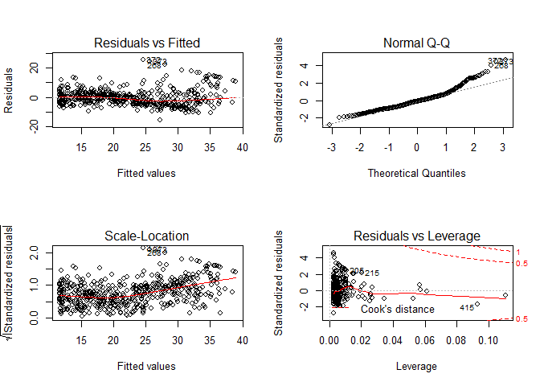
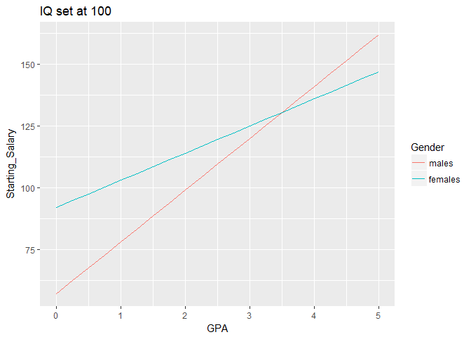
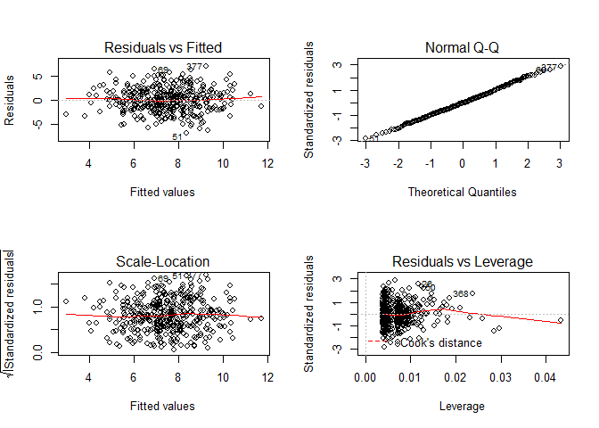

# 3. Linear Regression

### 3.6.3 Multiple Linear Regression


```r
library(MASS)
lm.fit=lm(medv∼lstat+age ,data=Boston )
summary(lm.fit)
```

```
## 
## Call:
## lm(formula = medv ~ lstat + age, data = Boston)
## 
## Residuals:
##     Min      1Q  Median      3Q     Max 
## -15.981  -3.978  -1.283   1.968  23.158 
## 
## Coefficients:
##             Estimate Std. Error t value Pr(>|t|)    
## (Intercept) 33.22276    0.73085  45.458  < 2e-16 ***
## lstat       -1.03207    0.04819 -21.416  < 2e-16 ***
## age          0.03454    0.01223   2.826  0.00491 ** 
## ---
## Signif. codes:  0 '***' 0.001 '**' 0.01 '*' 0.05 '.' 0.1 ' ' 1
## 
## Residual standard error: 6.173 on 503 degrees of freedom
## Multiple R-squared:  0.5513,	Adjusted R-squared:  0.5495 
## F-statistic:   309 on 2 and 503 DF,  p-value: < 2.2e-16
```

```r
lm.fit=lm(medv∼.,data=Boston)
summary(lm.fit)
```

```
## 
## Call:
## lm(formula = medv ~ ., data = Boston)
## 
## Residuals:
##     Min      1Q  Median      3Q     Max 
## -15.595  -2.730  -0.518   1.777  26.199 
## 
## Coefficients:
##               Estimate Std. Error t value Pr(>|t|)    
## (Intercept)  3.646e+01  5.103e+00   7.144 3.28e-12 ***
## crim        -1.080e-01  3.286e-02  -3.287 0.001087 ** 
## zn           4.642e-02  1.373e-02   3.382 0.000778 ***
## indus        2.056e-02  6.150e-02   0.334 0.738288    
## chas         2.687e+00  8.616e-01   3.118 0.001925 ** 
## nox         -1.777e+01  3.820e+00  -4.651 4.25e-06 ***
## rm           3.810e+00  4.179e-01   9.116  < 2e-16 ***
## age          6.922e-04  1.321e-02   0.052 0.958229    
## dis         -1.476e+00  1.995e-01  -7.398 6.01e-13 ***
## rad          3.060e-01  6.635e-02   4.613 5.07e-06 ***
## tax         -1.233e-02  3.760e-03  -3.280 0.001112 ** 
## ptratio     -9.527e-01  1.308e-01  -7.283 1.31e-12 ***
## black        9.312e-03  2.686e-03   3.467 0.000573 ***
## lstat       -5.248e-01  5.072e-02 -10.347  < 2e-16 ***
## ---
## Signif. codes:  0 '***' 0.001 '**' 0.01 '*' 0.05 '.' 0.1 ' ' 1
## 
## Residual standard error: 4.745 on 492 degrees of freedom
## Multiple R-squared:  0.7406,	Adjusted R-squared:  0.7338 
## F-statistic: 108.1 on 13 and 492 DF,  p-value: < 2.2e-16
```

```r
library (car)
vif(lm.fit)
```

```
##     crim       zn    indus     chas      nox       rm      age      dis 
## 1.792192 2.298758 3.991596 1.073995 4.393720 1.933744 3.100826 3.955945 
##      rad      tax  ptratio    black    lstat 
## 7.484496 9.008554 1.799084 1.348521 2.941491
```

```r
lm.fit1=lm(medv∼.-age ,data=Boston )
summary(lm.fit1)
```

```
## 
## Call:
## lm(formula = medv ~ . - age, data = Boston)
## 
## Residuals:
##      Min       1Q   Median       3Q      Max 
## -15.6054  -2.7313  -0.5188   1.7601  26.2243 
## 
## Coefficients:
##               Estimate Std. Error t value Pr(>|t|)    
## (Intercept)  36.436927   5.080119   7.172 2.72e-12 ***
## crim         -0.108006   0.032832  -3.290 0.001075 ** 
## zn            0.046334   0.013613   3.404 0.000719 ***
## indus         0.020562   0.061433   0.335 0.737989    
## chas          2.689026   0.859598   3.128 0.001863 ** 
## nox         -17.713540   3.679308  -4.814 1.97e-06 ***
## rm            3.814394   0.408480   9.338  < 2e-16 ***
## dis          -1.478612   0.190611  -7.757 5.03e-14 ***
## rad           0.305786   0.066089   4.627 4.75e-06 ***
## tax          -0.012329   0.003755  -3.283 0.001099 ** 
## ptratio      -0.952211   0.130294  -7.308 1.10e-12 ***
## black         0.009321   0.002678   3.481 0.000544 ***
## lstat        -0.523852   0.047625 -10.999  < 2e-16 ***
## ---
## Signif. codes:  0 '***' 0.001 '**' 0.01 '*' 0.05 '.' 0.1 ' ' 1
## 
## Residual standard error: 4.74 on 493 degrees of freedom
## Multiple R-squared:  0.7406,	Adjusted R-squared:  0.7343 
## F-statistic: 117.3 on 12 and 493 DF,  p-value: < 2.2e-16
```

```r
lm.fit1=update(lm.fit , ∼.-age)
summary(lm.fit1)
```

```
## 
## Call:
## lm(formula = medv ~ crim + zn + indus + chas + nox + rm + dis + 
##     rad + tax + ptratio + black + lstat, data = Boston)
## 
## Residuals:
##      Min       1Q   Median       3Q      Max 
## -15.6054  -2.7313  -0.5188   1.7601  26.2243 
## 
## Coefficients:
##               Estimate Std. Error t value Pr(>|t|)    
## (Intercept)  36.436927   5.080119   7.172 2.72e-12 ***
## crim         -0.108006   0.032832  -3.290 0.001075 ** 
## zn            0.046334   0.013613   3.404 0.000719 ***
## indus         0.020562   0.061433   0.335 0.737989    
## chas          2.689026   0.859598   3.128 0.001863 ** 
## nox         -17.713540   3.679308  -4.814 1.97e-06 ***
## rm            3.814394   0.408480   9.338  < 2e-16 ***
## dis          -1.478612   0.190611  -7.757 5.03e-14 ***
## rad           0.305786   0.066089   4.627 4.75e-06 ***
## tax          -0.012329   0.003755  -3.283 0.001099 ** 
## ptratio      -0.952211   0.130294  -7.308 1.10e-12 ***
## black         0.009321   0.002678   3.481 0.000544 ***
## lstat        -0.523852   0.047625 -10.999  < 2e-16 ***
## ---
## Signif. codes:  0 '***' 0.001 '**' 0.01 '*' 0.05 '.' 0.1 ' ' 1
## 
## Residual standard error: 4.74 on 493 degrees of freedom
## Multiple R-squared:  0.7406,	Adjusted R-squared:  0.7343 
## F-statistic: 117.3 on 12 and 493 DF,  p-value: < 2.2e-16
```

### 3.6.4 Interaction Terms


```r
summary(lm(medv∼lstat*age ,data=Boston))
```

```
## 
## Call:
## lm(formula = medv ~ lstat * age, data = Boston)
## 
## Residuals:
##     Min      1Q  Median      3Q     Max 
## -15.806  -4.045  -1.333   2.085  27.552 
## 
## Coefficients:
##               Estimate Std. Error t value Pr(>|t|)    
## (Intercept) 36.0885359  1.4698355  24.553  < 2e-16 ***
## lstat       -1.3921168  0.1674555  -8.313 8.78e-16 ***
## age         -0.0007209  0.0198792  -0.036   0.9711    
## lstat:age    0.0041560  0.0018518   2.244   0.0252 *  
## ---
## Signif. codes:  0 '***' 0.001 '**' 0.01 '*' 0.05 '.' 0.1 ' ' 1
## 
## Residual standard error: 6.149 on 502 degrees of freedom
## Multiple R-squared:  0.5557,	Adjusted R-squared:  0.5531 
## F-statistic: 209.3 on 3 and 502 DF,  p-value: < 2.2e-16
```

### 3.6.5 Non-linear Transformations of the Predictors


```r
lm.fit2=lm(medv∼lstat+I(lstat^2), data=Boston)
summary(lm.fit2)
```

```
## 
## Call:
## lm(formula = medv ~ lstat + I(lstat^2), data = Boston)
## 
## Residuals:
##      Min       1Q   Median       3Q      Max 
## -15.2834  -3.8313  -0.5295   2.3095  25.4148 
## 
## Coefficients:
##              Estimate Std. Error t value Pr(>|t|)    
## (Intercept) 42.862007   0.872084   49.15   <2e-16 ***
## lstat       -2.332821   0.123803  -18.84   <2e-16 ***
## I(lstat^2)   0.043547   0.003745   11.63   <2e-16 ***
## ---
## Signif. codes:  0 '***' 0.001 '**' 0.01 '*' 0.05 '.' 0.1 ' ' 1
## 
## Residual standard error: 5.524 on 503 degrees of freedom
## Multiple R-squared:  0.6407,	Adjusted R-squared:  0.6393 
## F-statistic: 448.5 on 2 and 503 DF,  p-value: < 2.2e-16
```

```r
lm.fit=lm(medv∼lstat, data = Boston)
anova(lm.fit ,lm.fit2)
```

```
## Analysis of Variance Table
## 
## Model 1: medv ~ lstat
## Model 2: medv ~ lstat + I(lstat^2)
##   Res.Df   RSS Df Sum of Sq     F    Pr(>F)    
## 1    504 19472                                 
## 2    503 15347  1    4125.1 135.2 < 2.2e-16 ***
## ---
## Signif. codes:  0 '***' 0.001 '**' 0.01 '*' 0.05 '.' 0.1 ' ' 1
```

```r
par(mfrow=c(2,2))
plot(lm.fit2)
```

<!-- -->

```r
lm.fit5=lm(medv∼poly(lstat ,5), data = Boston)
summary(lm.fit5)
```

```
## 
## Call:
## lm(formula = medv ~ poly(lstat, 5), data = Boston)
## 
## Residuals:
##      Min       1Q   Median       3Q      Max 
## -13.5433  -3.1039  -0.7052   2.0844  27.1153 
## 
## Coefficients:
##                  Estimate Std. Error t value Pr(>|t|)    
## (Intercept)       22.5328     0.2318  97.197  < 2e-16 ***
## poly(lstat, 5)1 -152.4595     5.2148 -29.236  < 2e-16 ***
## poly(lstat, 5)2   64.2272     5.2148  12.316  < 2e-16 ***
## poly(lstat, 5)3  -27.0511     5.2148  -5.187 3.10e-07 ***
## poly(lstat, 5)4   25.4517     5.2148   4.881 1.42e-06 ***
## poly(lstat, 5)5  -19.2524     5.2148  -3.692 0.000247 ***
## ---
## Signif. codes:  0 '***' 0.001 '**' 0.01 '*' 0.05 '.' 0.1 ' ' 1
## 
## Residual standard error: 5.215 on 500 degrees of freedom
## Multiple R-squared:  0.6817,	Adjusted R-squared:  0.6785 
## F-statistic: 214.2 on 5 and 500 DF,  p-value: < 2.2e-16
```

```r
summary(lm(medv∼log(rm),data=Boston))
```

```
## 
## Call:
## lm(formula = medv ~ log(rm), data = Boston)
## 
## Residuals:
##     Min      1Q  Median      3Q     Max 
## -19.487  -2.875  -0.104   2.837  39.816 
## 
## Coefficients:
##             Estimate Std. Error t value Pr(>|t|)    
## (Intercept)  -76.488      5.028  -15.21   <2e-16 ***
## log(rm)       54.055      2.739   19.73   <2e-16 ***
## ---
## Signif. codes:  0 '***' 0.001 '**' 0.01 '*' 0.05 '.' 0.1 ' ' 1
## 
## Residual standard error: 6.915 on 504 degrees of freedom
## Multiple R-squared:  0.4358,	Adjusted R-squared:  0.4347 
## F-statistic: 389.3 on 1 and 504 DF,  p-value: < 2.2e-16
```

### 3.6.6 Qualitative Predictors


```r
library(ISLR)
#fix(Carseats)
names(Carseats)
```

```
##  [1] "Sales"       "CompPrice"   "Income"      "Advertising" "Population" 
##  [6] "Price"       "ShelveLoc"   "Age"         "Education"   "Urban"      
## [11] "US"
```

```r
lm.fit=lm(Sales∼.+Income :Advertising +Price:Age ,data=Carseats)
summary(lm.fit)
```

```
## 
## Call:
## lm(formula = Sales ~ . + Income:Advertising + Price:Age, data = Carseats)
## 
## Residuals:
##     Min      1Q  Median      3Q     Max 
## -2.9208 -0.7503  0.0177  0.6754  3.3413 
## 
## Coefficients:
##                      Estimate Std. Error t value Pr(>|t|)    
## (Intercept)         6.5755654  1.0087470   6.519 2.22e-10 ***
## CompPrice           0.0929371  0.0041183  22.567  < 2e-16 ***
## Income              0.0108940  0.0026044   4.183 3.57e-05 ***
## Advertising         0.0702462  0.0226091   3.107 0.002030 ** 
## Population          0.0001592  0.0003679   0.433 0.665330    
## Price              -0.1008064  0.0074399 -13.549  < 2e-16 ***
## ShelveLocGood       4.8486762  0.1528378  31.724  < 2e-16 ***
## ShelveLocMedium     1.9532620  0.1257682  15.531  < 2e-16 ***
## Age                -0.0579466  0.0159506  -3.633 0.000318 ***
## Education          -0.0208525  0.0196131  -1.063 0.288361    
## UrbanYes            0.1401597  0.1124019   1.247 0.213171    
## USYes              -0.1575571  0.1489234  -1.058 0.290729    
## Income:Advertising  0.0007510  0.0002784   2.698 0.007290 ** 
## Price:Age           0.0001068  0.0001333   0.801 0.423812    
## ---
## Signif. codes:  0 '***' 0.001 '**' 0.01 '*' 0.05 '.' 0.1 ' ' 1
## 
## Residual standard error: 1.011 on 386 degrees of freedom
## Multiple R-squared:  0.8761,	Adjusted R-squared:  0.8719 
## F-statistic:   210 on 13 and 386 DF,  p-value: < 2.2e-16
```

```r
attach(Carseats)
contrasts(ShelveLoc)
```

```
##        Good Medium
## Bad       0      0
## Good      1      0
## Medium    0      1
```

### 3.6.7 Writing Function


```r
#LoadLibraries
#LoadLibraries()

LoadLibraries= function (){
library(ISLR)
library(MASS)
print("The libraries have been loaded.")
}

LoadLibraries
```

```
## function (){
## library(ISLR)
## library(MASS)
## print("The libraries have been loaded.")
## }
```

```r
LoadLibraries()
```

```
## [1] "The libraries have been loaded."
```

## 3.7 Exercises

3. Suppose we have a data set with five predictors, X1 = GPA, X2 = IQ, X3 = Gender (1 for Female and 0 for Male), X4 = Interaction between GPA and IQ, and X5 = Interaction between GPA and Gender. The response is starting salary after graduation (in thousands of dollars). Suppose we use least squares to fit the model, and get βˆ0 = 50, βˆ1 = 20, βˆ2 = 0.07, βˆ3 = 35, βˆ4 = 0.01, βˆ5 = −10.

  (a) Which answer is correct, and why?
    i. For a fixed value of IQ and GPA, males earn more on average than females.
    ii. For a fixed value of IQ and GPA, females earn more on average than males.
    iii. For a fixed value of IQ and GPA, males earn more on average than females provided that the GPA is high enough.
    iv. For a fixed value of IQ and GPA, females earn more on average than males provided that the GPA is high enough.
    

```r
library(ggplot2)
library(reshape2)
library(purrr)
```

```
## 
## Attaching package: 'purrr'
```

```
## The following object is masked from 'package:car':
## 
##     some
```

```r
SalaryCalc <- function(gpa,iq,gender){
  betas <- c(50,20,.07,35,.01,-10)
  return(betas[1] + betas[2]*gpa + betas[3]*iq + betas[4]*gender + betas[5]*gpa*iq + betas[6]*gpa*gender)
}

gpas <- seq(from = 0, to = 5, length.out = 21)
iqs <- seq(from = 50, to = 150, length.out = 21)
males <- sapply(gpas, function(x) SalaryCalc(x,100,0))
females <- sapply(gpas, function(x) SalaryCalc(x,100,1))
tots <- data.frame(cbind(gpas,males,females))

tots.m <- melt(tots, id.vars = "gpas")
colnames(tots.m) <- c("GPA", "Gender", "Starting_Salary")
ggplot(tots.m, aes(GPA,Starting_Salary, color = Gender)) +
  geom_line() +
  ggtitle("IQ set at 100")
```

<!-- -->

  iii is correct. At at GPA of 3.5 and above with a fixed IQ of 100 men on average make more.

  (b) Predict the salary of a female with IQ of 110 and a GPA of 4.0.
  

```r
SalaryCalc(4.0, 110, 1)
```

```
## [1] 137.1
```

  (c) True or false: Since the coefficient for the GPA/IQ interaction
term is very small, there is very little evidence of an interaction
effect. Justify your answer

  False. Just because a coefficient is small does not mean there is little evidence of an interaction. Should look at the p-value of the coefficient. The coefficient could be very small because the scale of the predictors may be extremely large.
  
9. This question involves the use of multiple linear regression on the Auto data set.

  (a) Produce a scatterplot matrix which includes all of the variables in the data set.


```r
dat <- Auto
pairs(dat)
```

<!-- -->
  
  (b) Compute the matrix of correlations between the variables using the function cor(). You will need to exclude the name variable, which is qualitative.


```r
dat2 <- dat[,-9]
head(dat2)
```

```
##   mpg cylinders displacement horsepower weight acceleration year origin
## 1  18         8          307        130   3504         12.0   70      1
## 2  15         8          350        165   3693         11.5   70      1
## 3  18         8          318        150   3436         11.0   70      1
## 4  16         8          304        150   3433         12.0   70      1
## 5  17         8          302        140   3449         10.5   70      1
## 6  15         8          429        198   4341         10.0   70      1
```

```r
cor(dat2)
```

```
##                     mpg  cylinders displacement horsepower     weight
## mpg           1.0000000 -0.7776175   -0.8051269 -0.7784268 -0.8322442
## cylinders    -0.7776175  1.0000000    0.9508233  0.8429834  0.8975273
## displacement -0.8051269  0.9508233    1.0000000  0.8972570  0.9329944
## horsepower   -0.7784268  0.8429834    0.8972570  1.0000000  0.8645377
## weight       -0.8322442  0.8975273    0.9329944  0.8645377  1.0000000
## acceleration  0.4233285 -0.5046834   -0.5438005 -0.6891955 -0.4168392
## year          0.5805410 -0.3456474   -0.3698552 -0.4163615 -0.3091199
## origin        0.5652088 -0.5689316   -0.6145351 -0.4551715 -0.5850054
##              acceleration       year     origin
## mpg             0.4233285  0.5805410  0.5652088
## cylinders      -0.5046834 -0.3456474 -0.5689316
## displacement   -0.5438005 -0.3698552 -0.6145351
## horsepower     -0.6891955 -0.4163615 -0.4551715
## weight         -0.4168392 -0.3091199 -0.5850054
## acceleration    1.0000000  0.2903161  0.2127458
## year            0.2903161  1.0000000  0.1815277
## origin          0.2127458  0.1815277  1.0000000
```

```r
symnum(cor(dat2))
```

```
##              m c d h w a y o
## mpg          1              
## cylinders    , 1            
## displacement + B 1          
## horsepower   , + + 1        
## weight       + + * + 1      
## acceleration . . . , . 1    
## year         . . . . .   1  
## origin       . . , . .     1
## attr(,"legend")
## [1] 0 ' ' 0.3 '.' 0.6 ',' 0.8 '+' 0.9 '*' 0.95 'B' 1
```

  (c) Use the lm() function to perform a multiple linear regression with mpg as the response and all other variables except name as the predictors. Use the summary() function to print the results. Comment on the output. For instance:
    i. Is there a relationship between the predictors and the response?
    ii. Which predictors appear to have a statistically significant relationship to the response?
    iii. What does the coefficient for the year variable suggest?


```r
lm.fit <- lm(mpg ~ .-name, data = dat)

#or
#lm.fit <- lm(mpg ~ ., data = dat2)

summary(lm.fit)
```

```
## 
## Call:
## lm(formula = mpg ~ . - name, data = dat)
## 
## Residuals:
##     Min      1Q  Median      3Q     Max 
## -9.5903 -2.1565 -0.1169  1.8690 13.0604 
## 
## Coefficients:
##                Estimate Std. Error t value Pr(>|t|)    
## (Intercept)  -17.218435   4.644294  -3.707  0.00024 ***
## cylinders     -0.493376   0.323282  -1.526  0.12780    
## displacement   0.019896   0.007515   2.647  0.00844 ** 
## horsepower    -0.016951   0.013787  -1.230  0.21963    
## weight        -0.006474   0.000652  -9.929  < 2e-16 ***
## acceleration   0.080576   0.098845   0.815  0.41548    
## year           0.750773   0.050973  14.729  < 2e-16 ***
## origin         1.426141   0.278136   5.127 4.67e-07 ***
## ---
## Signif. codes:  0 '***' 0.001 '**' 0.01 '*' 0.05 '.' 0.1 ' ' 1
## 
## Residual standard error: 3.328 on 384 degrees of freedom
## Multiple R-squared:  0.8215,	Adjusted R-squared:  0.8182 
## F-statistic: 252.4 on 7 and 384 DF,  p-value: < 2.2e-16
```

i. When all predictors are considered together cylinders, horsepower, and acceleration are not found to be significant while the other predictors are.

ii. Displacement, weight, year, and origin all appear to be significant when regressing mpg on all other variables.

iii. The coefficient for year suggests that for each increase 1 year increase in year the mpg of a car increases by .75

  (d) Use the plot() function to produce diagnostic plots of the linear regression fit. Comment on any problems you see with the fit. Do the residual plots suggest any unusually large outliers? Does the leverage plot identify any observations with unusually high leverage?
  

```r
par(mfrow=c(2,2))
plot(lm.fit)
```

<!-- -->

There are definitely points which stand out as outliers. There are also several points which have unusually high leverage

  (e) Use the * and : symbols to fit linear regression models with interaction effects. Do any interactions appear to be statistically significant?
  

```r
lm.fit <- lm(mpg ~ horsepower*acceleration, data = Auto)
summary(lm.fit)
```

```
## 
## Call:
## lm(formula = mpg ~ horsepower * acceleration, data = Auto)
## 
## Residuals:
##      Min       1Q   Median       3Q      Max 
## -13.3442  -2.7324  -0.4049   2.4210  15.8840 
## 
## Coefficients:
##                          Estimate Std. Error t value Pr(>|t|)    
## (Intercept)             33.512440   3.420187   9.798  < 2e-16 ***
## horsepower               0.017590   0.027425   0.641 0.521664    
## acceleration             0.800296   0.211899   3.777 0.000184 ***
## horsepower:acceleration -0.015698   0.002003  -7.838 4.45e-14 ***
## ---
## Signif. codes:  0 '***' 0.001 '**' 0.01 '*' 0.05 '.' 0.1 ' ' 1
## 
## Residual standard error: 4.426 on 388 degrees of freedom
## Multiple R-squared:  0.6809,	Adjusted R-squared:  0.6784 
## F-statistic: 275.9 on 3 and 388 DF,  p-value: < 2.2e-16
```

```r
lm.fit <- lm(mpg ~ acceleration + horsepower:acceleration, data = Auto)
summary(lm.fit)
```

```
## 
## Call:
## lm(formula = mpg ~ acceleration + horsepower:acceleration, data = Auto)
## 
## Residuals:
##      Min       1Q   Median       3Q      Max 
## -13.2411  -2.7623  -0.4742   2.4374  15.9596 
## 
## Coefficients:
##                           Estimate Std. Error t value Pr(>|t|)    
## (Intercept)             35.3852153  1.7794919  19.885  < 2e-16 ***
## acceleration             0.6754829  0.0837831   8.062 9.33e-15 ***
## acceleration:horsepower -0.0144701  0.0005857 -24.707  < 2e-16 ***
## ---
## Signif. codes:  0 '***' 0.001 '**' 0.01 '*' 0.05 '.' 0.1 ' ' 1
## 
## Residual standard error: 4.423 on 389 degrees of freedom
## Multiple R-squared:  0.6805,	Adjusted R-squared:  0.6789 
## F-statistic: 414.3 on 2 and 389 DF,  p-value: < 2.2e-16
```

```r
lm.fit <- lm(mpg ~ cylinders*acceleration, data = Auto)
summary(lm.fit)
```

```
## 
## Call:
## lm(formula = mpg ~ cylinders * acceleration, data = Auto)
## 
## Residuals:
##      Min       1Q   Median       3Q      Max 
## -13.2257  -3.1788  -0.7045   2.4031  17.4642 
## 
## Coefficients:
##                        Estimate Std. Error t value Pr(>|t|)    
## (Intercept)            31.37192    5.27599   5.946 6.13e-09 ***
## cylinders              -1.84692    0.85564  -2.159   0.0315 *  
## acceleration            0.73498    0.33724   2.179   0.0299 *  
## cylinders:acceleration -0.11179    0.05806  -1.926   0.0549 .  
## ---
## Signif. codes:  0 '***' 0.001 '**' 0.01 '*' 0.05 '.' 0.1 ' ' 1
## 
## Residual standard error: 4.895 on 388 degrees of freedom
## Multiple R-squared:  0.6097,	Adjusted R-squared:  0.6067 
## F-statistic:   202 on 3 and 388 DF,  p-value: < 2.2e-16
```

```r
lm.fit <- lm(mpg ~ horsepower*cylinders, data = Auto)
summary(lm.fit)
```

```
## 
## Call:
## lm(formula = mpg ~ horsepower * cylinders, data = Auto)
## 
## Residuals:
##      Min       1Q   Median       3Q      Max 
## -11.5862  -2.1945  -0.5617   1.9541  16.3329 
## 
## Coefficients:
##                       Estimate Std. Error t value Pr(>|t|)    
## (Intercept)          72.815097   3.071314  23.708   <2e-16 ***
## horsepower           -0.416007   0.034521 -12.051   <2e-16 ***
## cylinders            -6.492462   0.510560 -12.716   <2e-16 ***
## horsepower:cylinders  0.047247   0.004732   9.984   <2e-16 ***
## ---
## Signif. codes:  0 '***' 0.001 '**' 0.01 '*' 0.05 '.' 0.1 ' ' 1
## 
## Residual standard error: 4.094 on 388 degrees of freedom
## Multiple R-squared:  0.727,	Adjusted R-squared:  0.7249 
## F-statistic: 344.4 on 3 and 388 DF,  p-value: < 2.2e-16
```

There are interactions which are significant

  (f) Try a few different transformations of the variables, such as log(X), √X, X2. Comment on your findings.
  

```r
lm.fit <- lm(mpg ~ I(horsepower^2)*acceleration, data = Auto)
summary(lm.fit)
```

```
## 
## Call:
## lm(formula = mpg ~ I(horsepower^2) * acceleration, data = Auto)
## 
## Residuals:
##      Min       1Q   Median       3Q      Max 
## -13.6026  -3.2072  -0.6422   2.5227  18.7712 
## 
## Coefficients:
##                                Estimate Std. Error t value Pr(>|t|)    
## (Intercept)                   2.506e+01  2.397e+00  10.455  < 2e-16 ***
## I(horsepower^2)               5.329e-04  1.241e-04   4.295 2.21e-05 ***
## acceleration                  5.212e-01  1.436e-01   3.631 0.000321 ***
## I(horsepower^2):acceleration -9.334e-05  9.758e-06  -9.566  < 2e-16 ***
## ---
## Signif. codes:  0 '***' 0.001 '**' 0.01 '*' 0.05 '.' 0.1 ' ' 1
## 
## Residual standard error: 4.928 on 388 degrees of freedom
## Multiple R-squared:  0.6044,	Adjusted R-squared:  0.6014 
## F-statistic: 197.6 on 3 and 388 DF,  p-value: < 2.2e-16
```

```r
lm.fit <- lm(mpg ~ log(horsepower)*cylinders, data = Auto)
summary(lm.fit)
```

```
## 
## Call:
## lm(formula = mpg ~ log(horsepower) * cylinders, data = Auto)
## 
## Residuals:
##      Min       1Q   Median       3Q      Max 
## -12.4081  -2.2259  -0.4894   1.9625  15.4695 
## 
## Coefficients:
##                           Estimate Std. Error t value Pr(>|t|)    
## (Intercept)               174.5142    13.2371  13.184  < 2e-16 ***
## log(horsepower)           -31.0401     2.9294 -10.596  < 2e-16 ***
## cylinders                 -16.7885     2.2859  -7.344 1.23e-12 ***
## log(horsepower):cylinders   3.2506     0.4804   6.766 4.90e-11 ***
## ---
## Signif. codes:  0 '***' 0.001 '**' 0.01 '*' 0.05 '.' 0.1 ' ' 1
## 
## Residual standard error: 4.09 on 388 degrees of freedom
## Multiple R-squared:  0.7275,	Adjusted R-squared:  0.7254 
## F-statistic: 345.2 on 3 and 388 DF,  p-value: < 2.2e-16
```

10. This question should be answered using the Carseats data set.

  (a) Fit a multiple regression model to predict Sales using Price, Urban, and US.
  

```r
dat <- Carseats
summary(dat)
```

```
##      Sales          CompPrice       Income        Advertising    
##  Min.   : 0.000   Min.   : 77   Min.   : 21.00   Min.   : 0.000  
##  1st Qu.: 5.390   1st Qu.:115   1st Qu.: 42.75   1st Qu.: 0.000  
##  Median : 7.490   Median :125   Median : 69.00   Median : 5.000  
##  Mean   : 7.496   Mean   :125   Mean   : 68.66   Mean   : 6.635  
##  3rd Qu.: 9.320   3rd Qu.:135   3rd Qu.: 91.00   3rd Qu.:12.000  
##  Max.   :16.270   Max.   :175   Max.   :120.00   Max.   :29.000  
##    Population        Price        ShelveLoc        Age       
##  Min.   : 10.0   Min.   : 24.0   Bad   : 96   Min.   :25.00  
##  1st Qu.:139.0   1st Qu.:100.0   Good  : 85   1st Qu.:39.75  
##  Median :272.0   Median :117.0   Medium:219   Median :54.50  
##  Mean   :264.8   Mean   :115.8                Mean   :53.32  
##  3rd Qu.:398.5   3rd Qu.:131.0                3rd Qu.:66.00  
##  Max.   :509.0   Max.   :191.0                Max.   :80.00  
##    Education    Urban       US     
##  Min.   :10.0   No :118   No :142  
##  1st Qu.:12.0   Yes:282   Yes:258  
##  Median :14.0                      
##  Mean   :13.9                      
##  3rd Qu.:16.0                      
##  Max.   :18.0
```

```r
lm.fit <- lm(Sales ~ Price+Urban+US, data = dat)
summary(lm.fit)
```

```
## 
## Call:
## lm(formula = Sales ~ Price + Urban + US, data = dat)
## 
## Residuals:
##     Min      1Q  Median      3Q     Max 
## -6.9206 -1.6220 -0.0564  1.5786  7.0581 
## 
## Coefficients:
##              Estimate Std. Error t value Pr(>|t|)    
## (Intercept) 13.043469   0.651012  20.036  < 2e-16 ***
## Price       -0.054459   0.005242 -10.389  < 2e-16 ***
## UrbanYes    -0.021916   0.271650  -0.081    0.936    
## USYes        1.200573   0.259042   4.635 4.86e-06 ***
## ---
## Signif. codes:  0 '***' 0.001 '**' 0.01 '*' 0.05 '.' 0.1 ' ' 1
## 
## Residual standard error: 2.472 on 396 degrees of freedom
## Multiple R-squared:  0.2393,	Adjusted R-squared:  0.2335 
## F-statistic: 41.52 on 3 and 396 DF,  p-value: < 2.2e-16
```

  (b) Provide an interpretation of each coefficient in the model. Be Careful—some of the variables in the model are qualitative!
  

```r
summary(lm.fit)$coefficients
```

```
##                Estimate  Std. Error      t value     Pr(>|t|)
## (Intercept) 13.04346894 0.651012245  20.03567373 3.626602e-62
## Price       -0.05445885 0.005241855 -10.38923205 1.609917e-22
## UrbanYes    -0.02191615 0.271650277  -0.08067781 9.357389e-01
## USYes        1.20057270 0.259041508   4.63467306 4.860245e-06
```

As price increases the number of sales decreases. If a store is in an urban area sales goes down although this predictor appears to be insignificant based off its p-value. If the store is in the US sales goes up.

  (c) Write out the model in equation form, being careful to handle the qualitative variables properly
  

```r
as.formula(
  paste0("Sales ~ ", round(coefficients(lm.fit)[1],2), "", 
    paste(sprintf(" %+.2f*%s ", 
                  coefficients(lm.fit)[-1],  
                  names(coefficients(lm.fit)[-1])),
          collapse="")," + error"
  )
)
```

```
## Sales ~ 13.04 - 0.05 * Price - 0.02 * UrbanYes + 1.2 * USYes + 
##     error
```

  (d) For which of the predictors can you reject the null hypothesis H0 : βj = 0?
  
For the predictors Price and US we can reject the null hypothesis

  (e) On the basis of your response to the previous question, fit a smaller model that only uses the predictors for which there is evidence of association with the outcome.
  

```r
lm.fit2 <- lm(Sales ~ Price+US, data = dat)
```

  (f) How well do the models in (a) and (e) fit the data?


```r
summary(lm.fit)
```

```
## 
## Call:
## lm(formula = Sales ~ Price + Urban + US, data = dat)
## 
## Residuals:
##     Min      1Q  Median      3Q     Max 
## -6.9206 -1.6220 -0.0564  1.5786  7.0581 
## 
## Coefficients:
##              Estimate Std. Error t value Pr(>|t|)    
## (Intercept) 13.043469   0.651012  20.036  < 2e-16 ***
## Price       -0.054459   0.005242 -10.389  < 2e-16 ***
## UrbanYes    -0.021916   0.271650  -0.081    0.936    
## USYes        1.200573   0.259042   4.635 4.86e-06 ***
## ---
## Signif. codes:  0 '***' 0.001 '**' 0.01 '*' 0.05 '.' 0.1 ' ' 1
## 
## Residual standard error: 2.472 on 396 degrees of freedom
## Multiple R-squared:  0.2393,	Adjusted R-squared:  0.2335 
## F-statistic: 41.52 on 3 and 396 DF,  p-value: < 2.2e-16
```

```r
summary(lm.fit2)
```

```
## 
## Call:
## lm(formula = Sales ~ Price + US, data = dat)
## 
## Residuals:
##     Min      1Q  Median      3Q     Max 
## -6.9269 -1.6286 -0.0574  1.5766  7.0515 
## 
## Coefficients:
##             Estimate Std. Error t value Pr(>|t|)    
## (Intercept) 13.03079    0.63098  20.652  < 2e-16 ***
## Price       -0.05448    0.00523 -10.416  < 2e-16 ***
## USYes        1.19964    0.25846   4.641 4.71e-06 ***
## ---
## Signif. codes:  0 '***' 0.001 '**' 0.01 '*' 0.05 '.' 0.1 ' ' 1
## 
## Residual standard error: 2.469 on 397 degrees of freedom
## Multiple R-squared:  0.2393,	Adjusted R-squared:  0.2354 
## F-statistic: 62.43 on 2 and 397 DF,  p-value: < 2.2e-16
```

```r
summary(lm.fit)$r.squared-summary(lm.fit2)$r.squared
```

```
## [1] 1.250376e-05
```

There is not much of a difference between the two models.

  (g) Using the model from (e), obtain 95 % confidence intervals for the coefficient(s).


```r
confint(lm.fit2)
```

```
##                   2.5 %      97.5 %
## (Intercept) 11.79032020 14.27126531
## Price       -0.06475984 -0.04419543
## USYes        0.69151957  1.70776632
```

  (h) Is there evidence of outliers or high leverage observations in the
model from (e)?


```r
par(mfrow=c(2,2))
plot(lm.fit2)
```

<!-- -->

There doesn't seem to be outliers, but there are high leverage observations
