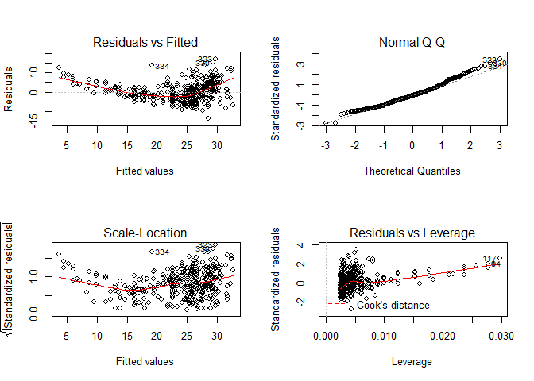
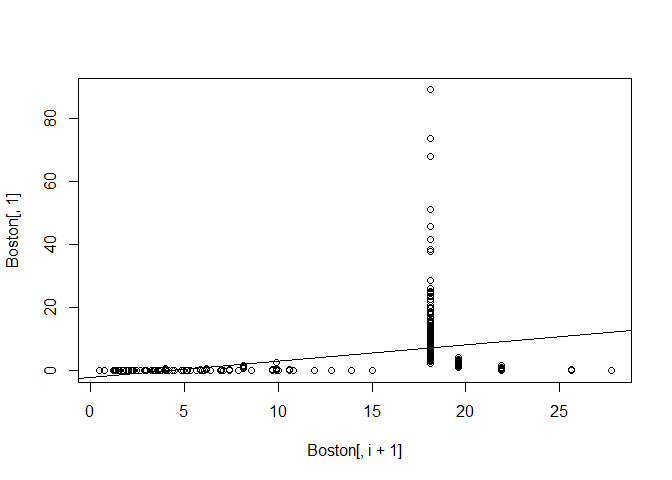
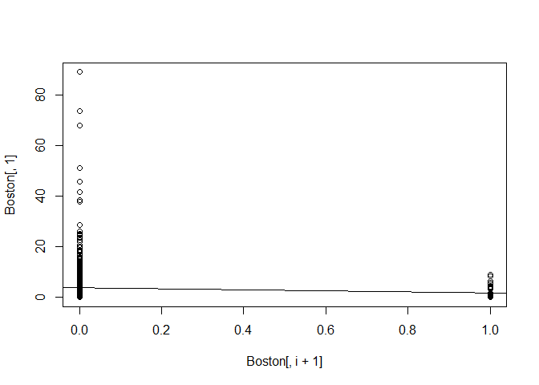
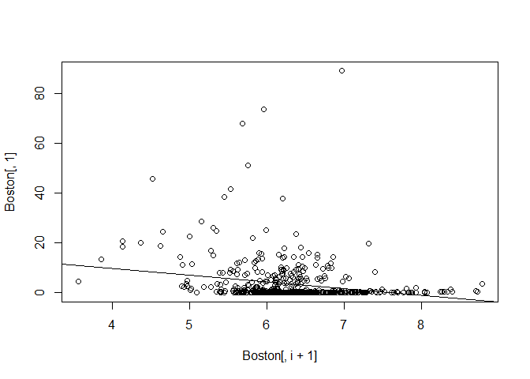
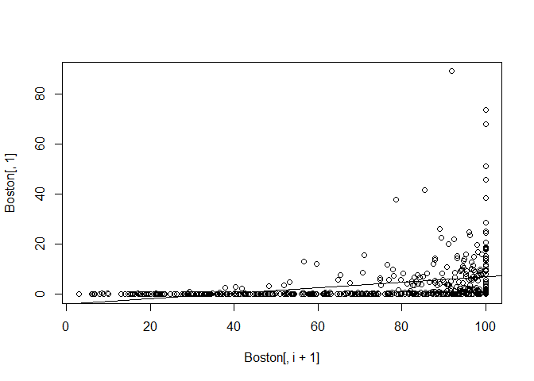
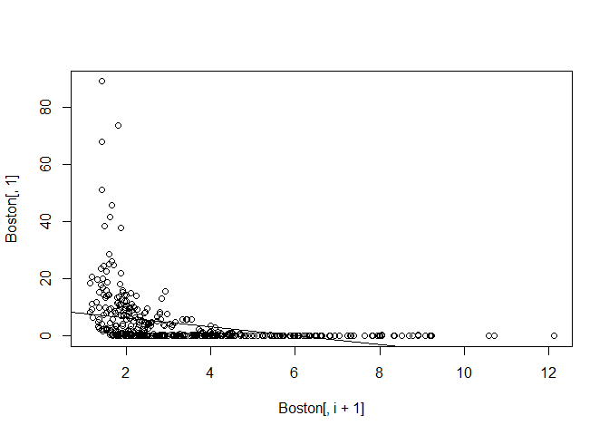
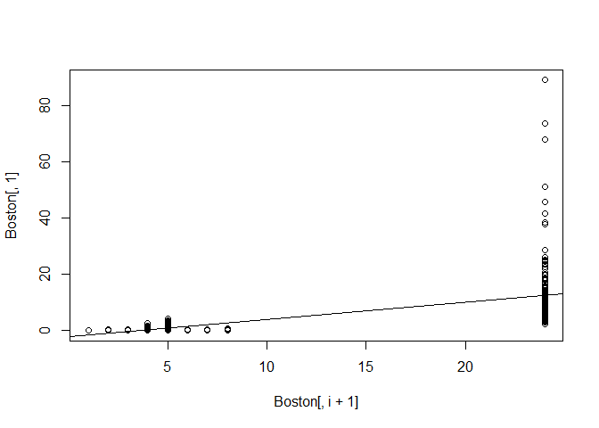
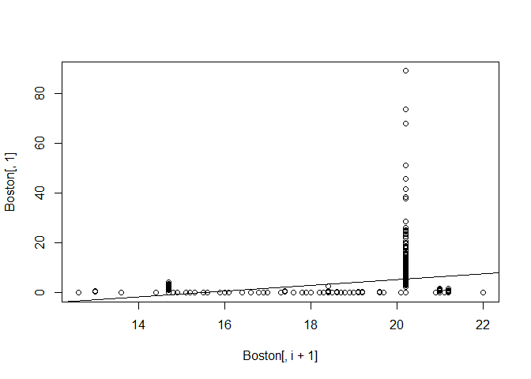
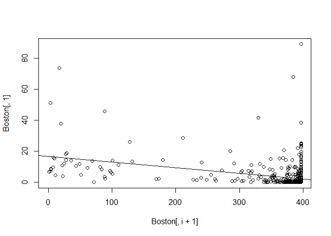

# 3.6 Lab: Linear Regression

```r
library(MASS)
library(ISLR)
```

## 3.6.2 Simple Linear Regression


```r
#fix(Boston)
names(Boston)
```

```
##  [1] "crim"    "zn"      "indus"   "chas"    "nox"     "rm"      "age"    
##  [8] "dis"     "rad"     "tax"     "ptratio" "black"   "lstat"   "medv"
```

```r
lm.fit <- lm(medv∼lstat , data=Boston)
attach(Boston)
lm.fit
```

```
## 
## Call:
## lm(formula = medv ~ lstat, data = Boston)
## 
## Coefficients:
## (Intercept)        lstat  
##       34.55        -0.95
```

```r
summary(lm.fit)
```

```
## 
## Call:
## lm(formula = medv ~ lstat, data = Boston)
## 
## Residuals:
##     Min      1Q  Median      3Q     Max 
## -15.168  -3.990  -1.318   2.034  24.500 
## 
## Coefficients:
##             Estimate Std. Error t value Pr(>|t|)    
## (Intercept) 34.55384    0.56263   61.41   <2e-16 ***
## lstat       -0.95005    0.03873  -24.53   <2e-16 ***
## ---
## Signif. codes:  0 '***' 0.001 '**' 0.01 '*' 0.05 '.' 0.1 ' ' 1
## 
## Residual standard error: 6.216 on 504 degrees of freedom
## Multiple R-squared:  0.5441,	Adjusted R-squared:  0.5432 
## F-statistic: 601.6 on 1 and 504 DF,  p-value: < 2.2e-16
```

```r
names(lm.fit)
```

```
##  [1] "coefficients"  "residuals"     "effects"       "rank"         
##  [5] "fitted.values" "assign"        "qr"            "df.residual"  
##  [9] "xlevels"       "call"          "terms"         "model"
```

```r
confint(lm.fit)
```

```
##                 2.5 %     97.5 %
## (Intercept) 33.448457 35.6592247
## lstat       -1.026148 -0.8739505
```

```r
predict(lm.fit ,data.frame(lstat=c(5,10 ,15)),
interval ="confidence")
```

```
##        fit      lwr      upr
## 1 29.80359 29.00741 30.59978
## 2 25.05335 24.47413 25.63256
## 3 20.30310 19.73159 20.87461
```

```r
predict(lm.fit ,data.frame(lstat=c(5,10 ,15)),
interval ="prediction")
```

```
##        fit       lwr      upr
## 1 29.80359 17.565675 42.04151
## 2 25.05335 12.827626 37.27907
## 3 20.30310  8.077742 32.52846
```

```r
plot(lstat ,medv)
abline(lm.fit)

abline (lm.fit ,lwd =3)
abline (lm.fit ,lwd=3,col ="red")
```

<!-- -->

```r
plot(lstat ,medv ,col="red")
```

<!-- -->

```r
plot(lstat ,medv ,pch =20)
```

<!-- -->

```r
plot(lstat ,medv ,pch ="+")
```

<!-- -->

```r
plot(1:20,1:20,pch =1:20)
```

<!-- -->

```r
par(mfrow=c(2,2))
plot(lm.fit)
```

<!-- -->

```r
plot(predict (lm.fit), residuals (lm.fit))
plot(predict (lm.fit), rstudent (lm.fit))
plot(hatvalues (lm.fit))
which.max(hatvalues (lm.fit))
```

```
## 375 
## 375
```

<!-- -->

## Problem 8

8. This question involves the use of simple linear regression on the Auto data set.
  (a) Use the lm() function to perform a simple linear regression with mpg as the response and horsepower as the predictor. Use the summary() function to print the results. Comment on the output.
    i. Is there a relationship between the predictor and the response?
    Yes
    
    ii. How strong is the relationship between the predictor and the response?
    Pretty strong
    
    iii. Is the relationship between the predictor and the response positive or negative?
    Negative
    
    iv. What is the predicted mpg associated with a horsepower of 98? What are the associated 95 % confidence and prediction intervals
    

```r
fit <- lm(mpg~horsepower, data = Auto)
summary(fit)
```

```
## 
## Call:
## lm(formula = mpg ~ horsepower, data = Auto)
## 
## Residuals:
##      Min       1Q   Median       3Q      Max 
## -13.5710  -3.2592  -0.3435   2.7630  16.9240 
## 
## Coefficients:
##              Estimate Std. Error t value Pr(>|t|)    
## (Intercept) 39.935861   0.717499   55.66   <2e-16 ***
## horsepower  -0.157845   0.006446  -24.49   <2e-16 ***
## ---
## Signif. codes:  0 '***' 0.001 '**' 0.01 '*' 0.05 '.' 0.1 ' ' 1
## 
## Residual standard error: 4.906 on 390 degrees of freedom
## Multiple R-squared:  0.6059,	Adjusted R-squared:  0.6049 
## F-statistic: 599.7 on 1 and 390 DF,  p-value: < 2.2e-16
```

```r
predict(fit ,data.frame(horsepower=98),
interval ="prediction")
```

```
##        fit     lwr      upr
## 1 24.46708 14.8094 34.12476
```

```r
predict(fit ,data.frame(horsepower=98),
interval ="confidence")
```

```
##        fit      lwr      upr
## 1 24.46708 23.97308 24.96108
```

(b) Plot the response and the predictor. Use the abline() function to display the least squares regression line.)


```r
par(mfrow=c(1,1))
attach(Auto)
plot(mpg~horsepower)
abline(fit)
```

<!-- -->

(c) Use the plot() function to produce diagnostic plots of the least squares regression fit. Comment on any problems you see with the fit.


```r
par(mfrow=c(2,2))
plot(fit)
```

<!-- -->

## Problem 13

In this exercise you will create some simulated data and will fit simple linear regression models to it. Make sure to use set.seed(1) prior to starting part (a) to ensure consistent results.

(a) Using the rnorm() function, create a vector, x, containing 100 observations drawn from a N(0, 1) distribution. This represents a feature, X.


```r
set.seed(1)
x <- rnorm(100,0,1)
```

(b) Using the rnorm() function, create a vector, eps, containing 100 observations drawn from a N(0, 0.25) distribution i.e. a normal distribution with mean zero and variance 0.25.


```r
eps <- rnorm(100,0,.25)
```

(c) Using x and eps, generate a vector y according to the model Y = −1+0.5X + eps. What is the length of the vector y? What are the values of βo and β1 in this linear model?


```r
y = -1+0.5*x+eps
length(y)
```

```
## [1] 100
```

```r
#βo = -1 
#β1 = .5
```

(d) Create a scatterplot displaying the relationship between x and y. Comment on what you observe.


```r
par(mfrow=c(1,1))
plot(y~x)
```

<!-- -->

Linear relationship

(e) Fit a least squares linear model to predict y using x. Comment on the model obtained. How do β^o and β^1 compare to βo and β1?


```r
fit <- lm(y~x)
summary(fit)
```

```
## 
## Call:
## lm(formula = y ~ x)
## 
## Residuals:
##      Min       1Q   Median       3Q      Max 
## -0.46921 -0.15344 -0.03487  0.13485  0.58654 
## 
## Coefficients:
##             Estimate Std. Error t value Pr(>|t|)    
## (Intercept) -1.00942    0.02425  -41.63   <2e-16 ***
## x            0.49973    0.02693   18.56   <2e-16 ***
## ---
## Signif. codes:  0 '***' 0.001 '**' 0.01 '*' 0.05 '.' 0.1 ' ' 1
## 
## Residual standard error: 0.2407 on 98 degrees of freedom
## Multiple R-squared:  0.7784,	Adjusted R-squared:  0.7762 
## F-statistic: 344.3 on 1 and 98 DF,  p-value: < 2.2e-16
```

Almost identical

(f)Display the least squares line on the scatterplot obtained in (d).Draw the population regression line on the plot, in a different color. Use the legend() command to create an appropriate legend


```r
plot(y~x); abline(fit, col ="red") 
legend("bottomright", c("Regression line"), lwd=1, col="red",bty ="n")
```

<!-- -->

(g)Now fit a polynomial regression model that predicts y using x and x^2. Is there evidence that the quadratic term improves the model fit? Explain your answer


```r
fit2 = lm(y~poly(x,2))
summary(fit2)
```

```
## 
## Call:
## lm(formula = y ~ poly(x, 2))
## 
## Residuals:
##     Min      1Q  Median      3Q     Max 
## -0.4913 -0.1563 -0.0322  0.1451  0.5675 
## 
## Coefficients:
##             Estimate Std. Error t value Pr(>|t|)    
## (Intercept) -0.95501    0.02395 -39.874   <2e-16 ***
## poly(x, 2)1  4.46612    0.23951  18.647   <2e-16 ***
## poly(x, 2)2 -0.33602    0.23951  -1.403    0.164    
## ---
## Signif. codes:  0 '***' 0.001 '**' 0.01 '*' 0.05 '.' 0.1 ' ' 1
## 
## Residual standard error: 0.2395 on 97 degrees of freedom
## Multiple R-squared:  0.7828,	Adjusted R-squared:  0.7784 
## F-statistic: 174.8 on 2 and 97 DF,  p-value: < 2.2e-16
```

Not significant

(h)Repeat (a)–(f) after modifying the data generation process in such a way that there is less noise in the data. The model (part-c) should remain the same. You can do this by decreasing the variance of the normal distribution used to generate the error term in (b). Describe your results.


```r
x = rnorm(100, mean= 0, sd =1)
eps = rnorm(100, mean =0, sd = 0.05)
y = -1+0.5*x+eps
fit3 = lm(y~x)
summary(fit3)
```

```
## 
## Call:
## lm(formula = y ~ x)
## 
## Residuals:
##       Min        1Q    Median        3Q       Max 
## -0.137090 -0.028070 -0.000874  0.033987  0.092421 
## 
## Coefficients:
##              Estimate Std. Error t value Pr(>|t|)    
## (Intercept) -0.997578   0.004955  -201.3   <2e-16 ***
## x            0.505311   0.004813   105.0   <2e-16 ***
## ---
## Signif. codes:  0 '***' 0.001 '**' 0.01 '*' 0.05 '.' 0.1 ' ' 1
## 
## Residual standard error: 0.04953 on 98 degrees of freedom
## Multiple R-squared:  0.9912,	Adjusted R-squared:  0.9911 
## F-statistic: 1.102e+04 on 1 and 98 DF,  p-value: < 2.2e-16
```

(j)What are the confidence intervals for βo and β1 based on the original data set, the noisier data set, and the less noisy data set? Comment on your results.

```r
confint(fit)
```

```
##                  2.5 %     97.5 %
## (Intercept) -1.0575402 -0.9613061
## x            0.4462897  0.5531801
```

```r
confint(fit2)
```

```
##                  2.5 %     97.5 %
## (Intercept) -1.0025441 -0.9074726
## poly(x, 2)1  3.9907590  4.9414735
## poly(x, 2)2 -0.8113727  0.1393418
```

```r
confint(fit3)
```

```
##                  2.5 %     97.5 %
## (Intercept) -1.0074105 -0.9877445
## x            0.4957597  0.5148621
```

## Problem 15

15. This problem involves the Boston data set, which we saw in the lab for this chapter. We will now try to predict per capita crime rate using the other variables in this data set. In other words, per capita crime rate is the response, and the other variables are the predictors.

(a)For each predictor, fit a simple linear regression model to predict the response. Describe your results. In which of the models is there a statistically significant association between the predictor and the response? Create some plots to back up your assertions.


```r
results <- lapply(Boston[,2:ncol(Boston)], function(x) lm(crim~x, data = Boston))
for(i in 1:13){
  print(names(results[i]))
  print(summary(results[[i]]))
  par(mfrow=c(2,2))
  plot(results[[i]])
}
```

```
## [1] "zn"
## 
## Call:
## lm(formula = crim ~ x, data = Boston)
## 
## Residuals:
##    Min     1Q Median     3Q    Max 
## -4.429 -4.222 -2.620  1.250 84.523 
## 
## Coefficients:
##             Estimate Std. Error t value Pr(>|t|)    
## (Intercept)  4.45369    0.41722  10.675  < 2e-16 ***
## x           -0.07393    0.01609  -4.594 5.51e-06 ***
## ---
## Signif. codes:  0 '***' 0.001 '**' 0.01 '*' 0.05 '.' 0.1 ' ' 1
## 
## Residual standard error: 8.435 on 504 degrees of freedom
## Multiple R-squared:  0.04019,	Adjusted R-squared:  0.03828 
## F-statistic:  21.1 on 1 and 504 DF,  p-value: 5.506e-06
```

<!-- -->

```
## [1] "indus"
## 
## Call:
## lm(formula = crim ~ x, data = Boston)
## 
## Residuals:
##     Min      1Q  Median      3Q     Max 
## -11.972  -2.698  -0.736   0.712  81.813 
## 
## Coefficients:
##             Estimate Std. Error t value Pr(>|t|)    
## (Intercept) -2.06374    0.66723  -3.093  0.00209 ** 
## x            0.50978    0.05102   9.991  < 2e-16 ***
## ---
## Signif. codes:  0 '***' 0.001 '**' 0.01 '*' 0.05 '.' 0.1 ' ' 1
## 
## Residual standard error: 7.866 on 504 degrees of freedom
## Multiple R-squared:  0.1653,	Adjusted R-squared:  0.1637 
## F-statistic: 99.82 on 1 and 504 DF,  p-value: < 2.2e-16
```

<!-- -->

```
## [1] "chas"
## 
## Call:
## lm(formula = crim ~ x, data = Boston)
## 
## Residuals:
##    Min     1Q Median     3Q    Max 
## -3.738 -3.661 -3.435  0.018 85.232 
## 
## Coefficients:
##             Estimate Std. Error t value Pr(>|t|)    
## (Intercept)   3.7444     0.3961   9.453   <2e-16 ***
## x            -1.8928     1.5061  -1.257    0.209    
## ---
## Signif. codes:  0 '***' 0.001 '**' 0.01 '*' 0.05 '.' 0.1 ' ' 1
## 
## Residual standard error: 8.597 on 504 degrees of freedom
## Multiple R-squared:  0.003124,	Adjusted R-squared:  0.001146 
## F-statistic: 1.579 on 1 and 504 DF,  p-value: 0.2094
```

<!-- -->

```
## [1] "nox"
## 
## Call:
## lm(formula = crim ~ x, data = Boston)
## 
## Residuals:
##     Min      1Q  Median      3Q     Max 
## -12.371  -2.738  -0.974   0.559  81.728 
## 
## Coefficients:
##             Estimate Std. Error t value Pr(>|t|)    
## (Intercept)  -13.720      1.699  -8.073 5.08e-15 ***
## x             31.249      2.999  10.419  < 2e-16 ***
## ---
## Signif. codes:  0 '***' 0.001 '**' 0.01 '*' 0.05 '.' 0.1 ' ' 1
## 
## Residual standard error: 7.81 on 504 degrees of freedom
## Multiple R-squared:  0.1772,	Adjusted R-squared:  0.1756 
## F-statistic: 108.6 on 1 and 504 DF,  p-value: < 2.2e-16
```

<!-- -->

```
## [1] "rm"
## 
## Call:
## lm(formula = crim ~ x, data = Boston)
## 
## Residuals:
##    Min     1Q Median     3Q    Max 
## -6.604 -3.952 -2.654  0.989 87.197 
## 
## Coefficients:
##             Estimate Std. Error t value Pr(>|t|)    
## (Intercept)   20.482      3.365   6.088 2.27e-09 ***
## x             -2.684      0.532  -5.045 6.35e-07 ***
## ---
## Signif. codes:  0 '***' 0.001 '**' 0.01 '*' 0.05 '.' 0.1 ' ' 1
## 
## Residual standard error: 8.401 on 504 degrees of freedom
## Multiple R-squared:  0.04807,	Adjusted R-squared:  0.04618 
## F-statistic: 25.45 on 1 and 504 DF,  p-value: 6.347e-07
```

<!-- -->

```
## [1] "age"
## 
## Call:
## lm(formula = crim ~ x, data = Boston)
## 
## Residuals:
##    Min     1Q Median     3Q    Max 
## -6.789 -4.257 -1.230  1.527 82.849 
## 
## Coefficients:
##             Estimate Std. Error t value Pr(>|t|)    
## (Intercept) -3.77791    0.94398  -4.002 7.22e-05 ***
## x            0.10779    0.01274   8.463 2.85e-16 ***
## ---
## Signif. codes:  0 '***' 0.001 '**' 0.01 '*' 0.05 '.' 0.1 ' ' 1
## 
## Residual standard error: 8.057 on 504 degrees of freedom
## Multiple R-squared:  0.1244,	Adjusted R-squared:  0.1227 
## F-statistic: 71.62 on 1 and 504 DF,  p-value: 2.855e-16
```

<!-- -->

```
## [1] "dis"
## 
## Call:
## lm(formula = crim ~ x, data = Boston)
## 
## Residuals:
##    Min     1Q Median     3Q    Max 
## -6.708 -4.134 -1.527  1.516 81.674 
## 
## Coefficients:
##             Estimate Std. Error t value Pr(>|t|)    
## (Intercept)   9.4993     0.7304  13.006   <2e-16 ***
## x            -1.5509     0.1683  -9.213   <2e-16 ***
## ---
## Signif. codes:  0 '***' 0.001 '**' 0.01 '*' 0.05 '.' 0.1 ' ' 1
## 
## Residual standard error: 7.965 on 504 degrees of freedom
## Multiple R-squared:  0.1441,	Adjusted R-squared:  0.1425 
## F-statistic: 84.89 on 1 and 504 DF,  p-value: < 2.2e-16
```

<!-- -->

```
## [1] "rad"
## 
## Call:
## lm(formula = crim ~ x, data = Boston)
## 
## Residuals:
##     Min      1Q  Median      3Q     Max 
## -10.164  -1.381  -0.141   0.660  76.433 
## 
## Coefficients:
##             Estimate Std. Error t value Pr(>|t|)    
## (Intercept) -2.28716    0.44348  -5.157 3.61e-07 ***
## x            0.61791    0.03433  17.998  < 2e-16 ***
## ---
## Signif. codes:  0 '***' 0.001 '**' 0.01 '*' 0.05 '.' 0.1 ' ' 1
## 
## Residual standard error: 6.718 on 504 degrees of freedom
## Multiple R-squared:  0.3913,	Adjusted R-squared:   0.39 
## F-statistic: 323.9 on 1 and 504 DF,  p-value: < 2.2e-16
```

<!-- -->

```
## [1] "tax"
## 
## Call:
## lm(formula = crim ~ x, data = Boston)
## 
## Residuals:
##     Min      1Q  Median      3Q     Max 
## -12.513  -2.738  -0.194   1.065  77.696 
## 
## Coefficients:
##              Estimate Std. Error t value Pr(>|t|)    
## (Intercept) -8.528369   0.815809  -10.45   <2e-16 ***
## x            0.029742   0.001847   16.10   <2e-16 ***
## ---
## Signif. codes:  0 '***' 0.001 '**' 0.01 '*' 0.05 '.' 0.1 ' ' 1
## 
## Residual standard error: 6.997 on 504 degrees of freedom
## Multiple R-squared:  0.3396,	Adjusted R-squared:  0.3383 
## F-statistic: 259.2 on 1 and 504 DF,  p-value: < 2.2e-16
```

<!-- -->

```
## [1] "ptratio"
## 
## Call:
## lm(formula = crim ~ x, data = Boston)
## 
## Residuals:
##    Min     1Q Median     3Q    Max 
## -7.654 -3.985 -1.912  1.825 83.353 
## 
## Coefficients:
##             Estimate Std. Error t value Pr(>|t|)    
## (Intercept) -17.6469     3.1473  -5.607 3.40e-08 ***
## x             1.1520     0.1694   6.801 2.94e-11 ***
## ---
## Signif. codes:  0 '***' 0.001 '**' 0.01 '*' 0.05 '.' 0.1 ' ' 1
## 
## Residual standard error: 8.24 on 504 degrees of freedom
## Multiple R-squared:  0.08407,	Adjusted R-squared:  0.08225 
## F-statistic: 46.26 on 1 and 504 DF,  p-value: 2.943e-11
```

<!-- -->

```
## [1] "black"
## 
## Call:
## lm(formula = crim ~ x, data = Boston)
## 
## Residuals:
##     Min      1Q  Median      3Q     Max 
## -13.756  -2.299  -2.095  -1.296  86.822 
## 
## Coefficients:
##              Estimate Std. Error t value Pr(>|t|)    
## (Intercept) 16.553529   1.425903  11.609   <2e-16 ***
## x           -0.036280   0.003873  -9.367   <2e-16 ***
## ---
## Signif. codes:  0 '***' 0.001 '**' 0.01 '*' 0.05 '.' 0.1 ' ' 1
## 
## Residual standard error: 7.946 on 504 degrees of freedom
## Multiple R-squared:  0.1483,	Adjusted R-squared:  0.1466 
## F-statistic: 87.74 on 1 and 504 DF,  p-value: < 2.2e-16
```

<!-- -->

```
## [1] "lstat"
## 
## Call:
## lm(formula = crim ~ x, data = Boston)
## 
## Residuals:
##     Min      1Q  Median      3Q     Max 
## -13.925  -2.822  -0.664   1.079  82.862 
## 
## Coefficients:
##             Estimate Std. Error t value Pr(>|t|)    
## (Intercept) -3.33054    0.69376  -4.801 2.09e-06 ***
## x            0.54880    0.04776  11.491  < 2e-16 ***
## ---
## Signif. codes:  0 '***' 0.001 '**' 0.01 '*' 0.05 '.' 0.1 ' ' 1
## 
## Residual standard error: 7.664 on 504 degrees of freedom
## Multiple R-squared:  0.2076,	Adjusted R-squared:  0.206 
## F-statistic:   132 on 1 and 504 DF,  p-value: < 2.2e-16
```

<!-- -->

```
## [1] "medv"
## 
## Call:
## lm(formula = crim ~ x, data = Boston)
## 
## Residuals:
##    Min     1Q Median     3Q    Max 
## -9.071 -4.022 -2.343  1.298 80.957 
## 
## Coefficients:
##             Estimate Std. Error t value Pr(>|t|)    
## (Intercept) 11.79654    0.93419   12.63   <2e-16 ***
## x           -0.36316    0.03839   -9.46   <2e-16 ***
## ---
## Signif. codes:  0 '***' 0.001 '**' 0.01 '*' 0.05 '.' 0.1 ' ' 1
## 
## Residual standard error: 7.934 on 504 degrees of freedom
## Multiple R-squared:  0.1508,	Adjusted R-squared:  0.1491 
## F-statistic: 89.49 on 1 and 504 DF,  p-value: < 2.2e-16
```

<!-- -->
