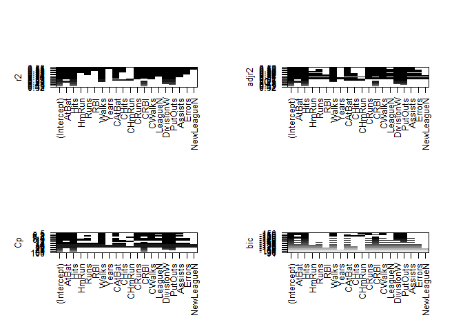

# 6.5 Lab 1: Subset Selection Methods
## 6.5.1 Best Subset Selection


```r
library(ISLR)
library(leaps)
#fix(Hitters)
names(Hitters)
```

```
##  [1] "AtBat"     "Hits"      "HmRun"     "Runs"      "RBI"      
##  [6] "Walks"     "Years"     "CAtBat"    "CHits"     "CHmRun"   
## [11] "CRuns"     "CRBI"      "CWalks"    "League"    "Division" 
## [16] "PutOuts"   "Assists"   "Errors"    "Salary"    "NewLeague"
```

```r
dim(Hitters)
```

```
## [1] 322  20
```

```r
sum(is.na(Hitters$Salary))
```

```
## [1] 59
```

```r
Hitters <- na.omit(Hitters)
dim(Hitters)
```

```
## [1] 263  20
```

```r
sum(is.na(Hitters))
```

```
## [1] 0
```

```r
regfit.full <- regsubsets(Salary ~ ., Hitters)
summary(regfit.full)
```

```
## Subset selection object
## Call: regsubsets.formula(Salary ~ ., Hitters)
## 19 Variables  (and intercept)
##            Forced in Forced out
## AtBat          FALSE      FALSE
## Hits           FALSE      FALSE
## HmRun          FALSE      FALSE
## Runs           FALSE      FALSE
## RBI            FALSE      FALSE
## Walks          FALSE      FALSE
## Years          FALSE      FALSE
## CAtBat         FALSE      FALSE
## CHits          FALSE      FALSE
## CHmRun         FALSE      FALSE
## CRuns          FALSE      FALSE
## CRBI           FALSE      FALSE
## CWalks         FALSE      FALSE
## LeagueN        FALSE      FALSE
## DivisionW      FALSE      FALSE
## PutOuts        FALSE      FALSE
## Assists        FALSE      FALSE
## Errors         FALSE      FALSE
## NewLeagueN     FALSE      FALSE
## 1 subsets of each size up to 8
## Selection Algorithm: exhaustive
##          AtBat Hits HmRun Runs RBI Walks Years CAtBat CHits CHmRun CRuns
## 1  ( 1 ) " "   " "  " "   " "  " " " "   " "   " "    " "   " "    " "  
## 2  ( 1 ) " "   "*"  " "   " "  " " " "   " "   " "    " "   " "    " "  
## 3  ( 1 ) " "   "*"  " "   " "  " " " "   " "   " "    " "   " "    " "  
## 4  ( 1 ) " "   "*"  " "   " "  " " " "   " "   " "    " "   " "    " "  
## 5  ( 1 ) "*"   "*"  " "   " "  " " " "   " "   " "    " "   " "    " "  
## 6  ( 1 ) "*"   "*"  " "   " "  " " "*"   " "   " "    " "   " "    " "  
## 7  ( 1 ) " "   "*"  " "   " "  " " "*"   " "   "*"    "*"   "*"    " "  
## 8  ( 1 ) "*"   "*"  " "   " "  " " "*"   " "   " "    " "   "*"    "*"  
##          CRBI CWalks LeagueN DivisionW PutOuts Assists Errors NewLeagueN
## 1  ( 1 ) "*"  " "    " "     " "       " "     " "     " "    " "       
## 2  ( 1 ) "*"  " "    " "     " "       " "     " "     " "    " "       
## 3  ( 1 ) "*"  " "    " "     " "       "*"     " "     " "    " "       
## 4  ( 1 ) "*"  " "    " "     "*"       "*"     " "     " "    " "       
## 5  ( 1 ) "*"  " "    " "     "*"       "*"     " "     " "    " "       
## 6  ( 1 ) "*"  " "    " "     "*"       "*"     " "     " "    " "       
## 7  ( 1 ) " "  " "    " "     "*"       "*"     " "     " "    " "       
## 8  ( 1 ) " "  "*"    " "     "*"       "*"     " "     " "    " "
```

```r
regfit.full <- regsubsets(Salary ~ ., data=Hitters, nvmax=19)
reg.summary <- summary(regfit.full)
#reg.summary
names(reg.summary)
```

```
## [1] "which"  "rsq"    "rss"    "adjr2"  "cp"     "bic"    "outmat" "obj"
```

```r
reg.summary$rsq
```

```
##  [1] 0.3214501 0.4252237 0.4514294 0.4754067 0.4908036 0.5087146 0.5141227
##  [8] 0.5285569 0.5346124 0.5404950 0.5426153 0.5436302 0.5444570 0.5452164
## [15] 0.5454692 0.5457656 0.5459518 0.5460945 0.5461159
```

```r
par(mfrow=c(2,2))
plot(reg.summary$rss, xlab="Number of Variables", ylab="RSS", type="l")

plot(reg.summary$adjr2, xlab="Number of Variables", ylab="Adjusted RSq", type="l")
best <- which.max(reg.summary$adjr2)
points (best, reg.summary$adjr2[best], col="red", cex=2, pch=20)

plot(reg.summary$cp, xlab="Number of Variables", ylab="Cp", type='l')
best <- which.min(reg.summary$cp)
points(best, reg.summary$cp[best], col="red", cex=2, pch=20)

plot(reg.summary$bic, xlab="Number of Variables", ylab="BIC", type='l')
best <- which.min(reg.summary$bic)
points(best, reg.summary$bic[best], col="red", cex=2, pch=20)
```

<!-- -->

```r
plot(regfit.full, scale="r2")
plot(regfit.full, scale="adjr2")
plot(regfit.full, scale="Cp")
plot(regfit.full, scale="bic")
```

<!-- -->

```r
par(mfrow=c(1,1))
plot(regfit.full, scale="r2")
```

<!-- -->

```r
plot(regfit.full, scale="adjr2")
```

<!-- -->

```r
plot(regfit.full, scale="Cp")
```

<!-- -->

```r
plot(regfit.full, scale="bic")
```

<!-- -->

```r
coef(regfit.full, 6)
```

```
##  (Intercept)        AtBat         Hits        Walks         CRBI 
##   91.5117981   -1.8685892    7.6043976    3.6976468    0.6430169 
##    DivisionW      PutOuts 
## -122.9515338    0.2643076
```

## 6.5.2 Forward and Backward Stepwise Selection


```r
regfit.fwd <- regsubsets(Salary ~ ., data=Hitters, nvmax=19, method ="forward")
summary(regfit.fwd)
```

```
## Subset selection object
## Call: regsubsets.formula(Salary ~ ., data = Hitters, nvmax = 19, method = "forward")
## 19 Variables  (and intercept)
##            Forced in Forced out
## AtBat          FALSE      FALSE
## Hits           FALSE      FALSE
## HmRun          FALSE      FALSE
## Runs           FALSE      FALSE
## RBI            FALSE      FALSE
## Walks          FALSE      FALSE
## Years          FALSE      FALSE
## CAtBat         FALSE      FALSE
## CHits          FALSE      FALSE
## CHmRun         FALSE      FALSE
## CRuns          FALSE      FALSE
## CRBI           FALSE      FALSE
## CWalks         FALSE      FALSE
## LeagueN        FALSE      FALSE
## DivisionW      FALSE      FALSE
## PutOuts        FALSE      FALSE
## Assists        FALSE      FALSE
## Errors         FALSE      FALSE
## NewLeagueN     FALSE      FALSE
## 1 subsets of each size up to 19
## Selection Algorithm: forward
##           AtBat Hits HmRun Runs RBI Walks Years CAtBat CHits CHmRun CRuns
## 1  ( 1 )  " "   " "  " "   " "  " " " "   " "   " "    " "   " "    " "  
## 2  ( 1 )  " "   "*"  " "   " "  " " " "   " "   " "    " "   " "    " "  
## 3  ( 1 )  " "   "*"  " "   " "  " " " "   " "   " "    " "   " "    " "  
## 4  ( 1 )  " "   "*"  " "   " "  " " " "   " "   " "    " "   " "    " "  
## 5  ( 1 )  "*"   "*"  " "   " "  " " " "   " "   " "    " "   " "    " "  
## 6  ( 1 )  "*"   "*"  " "   " "  " " "*"   " "   " "    " "   " "    " "  
## 7  ( 1 )  "*"   "*"  " "   " "  " " "*"   " "   " "    " "   " "    " "  
## 8  ( 1 )  "*"   "*"  " "   " "  " " "*"   " "   " "    " "   " "    "*"  
## 9  ( 1 )  "*"   "*"  " "   " "  " " "*"   " "   "*"    " "   " "    "*"  
## 10  ( 1 ) "*"   "*"  " "   " "  " " "*"   " "   "*"    " "   " "    "*"  
## 11  ( 1 ) "*"   "*"  " "   " "  " " "*"   " "   "*"    " "   " "    "*"  
## 12  ( 1 ) "*"   "*"  " "   "*"  " " "*"   " "   "*"    " "   " "    "*"  
## 13  ( 1 ) "*"   "*"  " "   "*"  " " "*"   " "   "*"    " "   " "    "*"  
## 14  ( 1 ) "*"   "*"  "*"   "*"  " " "*"   " "   "*"    " "   " "    "*"  
## 15  ( 1 ) "*"   "*"  "*"   "*"  " " "*"   " "   "*"    "*"   " "    "*"  
## 16  ( 1 ) "*"   "*"  "*"   "*"  "*" "*"   " "   "*"    "*"   " "    "*"  
## 17  ( 1 ) "*"   "*"  "*"   "*"  "*" "*"   " "   "*"    "*"   " "    "*"  
## 18  ( 1 ) "*"   "*"  "*"   "*"  "*" "*"   "*"   "*"    "*"   " "    "*"  
## 19  ( 1 ) "*"   "*"  "*"   "*"  "*" "*"   "*"   "*"    "*"   "*"    "*"  
##           CRBI CWalks LeagueN DivisionW PutOuts Assists Errors NewLeagueN
## 1  ( 1 )  "*"  " "    " "     " "       " "     " "     " "    " "       
## 2  ( 1 )  "*"  " "    " "     " "       " "     " "     " "    " "       
## 3  ( 1 )  "*"  " "    " "     " "       "*"     " "     " "    " "       
## 4  ( 1 )  "*"  " "    " "     "*"       "*"     " "     " "    " "       
## 5  ( 1 )  "*"  " "    " "     "*"       "*"     " "     " "    " "       
## 6  ( 1 )  "*"  " "    " "     "*"       "*"     " "     " "    " "       
## 7  ( 1 )  "*"  "*"    " "     "*"       "*"     " "     " "    " "       
## 8  ( 1 )  "*"  "*"    " "     "*"       "*"     " "     " "    " "       
## 9  ( 1 )  "*"  "*"    " "     "*"       "*"     " "     " "    " "       
## 10  ( 1 ) "*"  "*"    " "     "*"       "*"     "*"     " "    " "       
## 11  ( 1 ) "*"  "*"    "*"     "*"       "*"     "*"     " "    " "       
## 12  ( 1 ) "*"  "*"    "*"     "*"       "*"     "*"     " "    " "       
## 13  ( 1 ) "*"  "*"    "*"     "*"       "*"     "*"     "*"    " "       
## 14  ( 1 ) "*"  "*"    "*"     "*"       "*"     "*"     "*"    " "       
## 15  ( 1 ) "*"  "*"    "*"     "*"       "*"     "*"     "*"    " "       
## 16  ( 1 ) "*"  "*"    "*"     "*"       "*"     "*"     "*"    " "       
## 17  ( 1 ) "*"  "*"    "*"     "*"       "*"     "*"     "*"    "*"       
## 18  ( 1 ) "*"  "*"    "*"     "*"       "*"     "*"     "*"    "*"       
## 19  ( 1 ) "*"  "*"    "*"     "*"       "*"     "*"     "*"    "*"
```

```r
regfit.bwd <- regsubsets(Salary ~ ., data=Hitters, nvmax=19, method ="backward")
summary (regfit.bwd)
```

```
## Subset selection object
## Call: regsubsets.formula(Salary ~ ., data = Hitters, nvmax = 19, method = "backward")
## 19 Variables  (and intercept)
##            Forced in Forced out
## AtBat          FALSE      FALSE
## Hits           FALSE      FALSE
## HmRun          FALSE      FALSE
## Runs           FALSE      FALSE
## RBI            FALSE      FALSE
## Walks          FALSE      FALSE
## Years          FALSE      FALSE
## CAtBat         FALSE      FALSE
## CHits          FALSE      FALSE
## CHmRun         FALSE      FALSE
## CRuns          FALSE      FALSE
## CRBI           FALSE      FALSE
## CWalks         FALSE      FALSE
## LeagueN        FALSE      FALSE
## DivisionW      FALSE      FALSE
## PutOuts        FALSE      FALSE
## Assists        FALSE      FALSE
## Errors         FALSE      FALSE
## NewLeagueN     FALSE      FALSE
## 1 subsets of each size up to 19
## Selection Algorithm: backward
##           AtBat Hits HmRun Runs RBI Walks Years CAtBat CHits CHmRun CRuns
## 1  ( 1 )  " "   " "  " "   " "  " " " "   " "   " "    " "   " "    "*"  
## 2  ( 1 )  " "   "*"  " "   " "  " " " "   " "   " "    " "   " "    "*"  
## 3  ( 1 )  " "   "*"  " "   " "  " " " "   " "   " "    " "   " "    "*"  
## 4  ( 1 )  "*"   "*"  " "   " "  " " " "   " "   " "    " "   " "    "*"  
## 5  ( 1 )  "*"   "*"  " "   " "  " " "*"   " "   " "    " "   " "    "*"  
## 6  ( 1 )  "*"   "*"  " "   " "  " " "*"   " "   " "    " "   " "    "*"  
## 7  ( 1 )  "*"   "*"  " "   " "  " " "*"   " "   " "    " "   " "    "*"  
## 8  ( 1 )  "*"   "*"  " "   " "  " " "*"   " "   " "    " "   " "    "*"  
## 9  ( 1 )  "*"   "*"  " "   " "  " " "*"   " "   "*"    " "   " "    "*"  
## 10  ( 1 ) "*"   "*"  " "   " "  " " "*"   " "   "*"    " "   " "    "*"  
## 11  ( 1 ) "*"   "*"  " "   " "  " " "*"   " "   "*"    " "   " "    "*"  
## 12  ( 1 ) "*"   "*"  " "   "*"  " " "*"   " "   "*"    " "   " "    "*"  
## 13  ( 1 ) "*"   "*"  " "   "*"  " " "*"   " "   "*"    " "   " "    "*"  
## 14  ( 1 ) "*"   "*"  "*"   "*"  " " "*"   " "   "*"    " "   " "    "*"  
## 15  ( 1 ) "*"   "*"  "*"   "*"  " " "*"   " "   "*"    "*"   " "    "*"  
## 16  ( 1 ) "*"   "*"  "*"   "*"  "*" "*"   " "   "*"    "*"   " "    "*"  
## 17  ( 1 ) "*"   "*"  "*"   "*"  "*" "*"   " "   "*"    "*"   " "    "*"  
## 18  ( 1 ) "*"   "*"  "*"   "*"  "*" "*"   "*"   "*"    "*"   " "    "*"  
## 19  ( 1 ) "*"   "*"  "*"   "*"  "*" "*"   "*"   "*"    "*"   "*"    "*"  
##           CRBI CWalks LeagueN DivisionW PutOuts Assists Errors NewLeagueN
## 1  ( 1 )  " "  " "    " "     " "       " "     " "     " "    " "       
## 2  ( 1 )  " "  " "    " "     " "       " "     " "     " "    " "       
## 3  ( 1 )  " "  " "    " "     " "       "*"     " "     " "    " "       
## 4  ( 1 )  " "  " "    " "     " "       "*"     " "     " "    " "       
## 5  ( 1 )  " "  " "    " "     " "       "*"     " "     " "    " "       
## 6  ( 1 )  " "  " "    " "     "*"       "*"     " "     " "    " "       
## 7  ( 1 )  " "  "*"    " "     "*"       "*"     " "     " "    " "       
## 8  ( 1 )  "*"  "*"    " "     "*"       "*"     " "     " "    " "       
## 9  ( 1 )  "*"  "*"    " "     "*"       "*"     " "     " "    " "       
## 10  ( 1 ) "*"  "*"    " "     "*"       "*"     "*"     " "    " "       
## 11  ( 1 ) "*"  "*"    "*"     "*"       "*"     "*"     " "    " "       
## 12  ( 1 ) "*"  "*"    "*"     "*"       "*"     "*"     " "    " "       
## 13  ( 1 ) "*"  "*"    "*"     "*"       "*"     "*"     "*"    " "       
## 14  ( 1 ) "*"  "*"    "*"     "*"       "*"     "*"     "*"    " "       
## 15  ( 1 ) "*"  "*"    "*"     "*"       "*"     "*"     "*"    " "       
## 16  ( 1 ) "*"  "*"    "*"     "*"       "*"     "*"     "*"    " "       
## 17  ( 1 ) "*"  "*"    "*"     "*"       "*"     "*"     "*"    "*"       
## 18  ( 1 ) "*"  "*"    "*"     "*"       "*"     "*"     "*"    "*"       
## 19  ( 1 ) "*"  "*"    "*"     "*"       "*"     "*"     "*"    "*"
```

```r
coef(regfit.full, 7)
```

```
##  (Intercept)         Hits        Walks       CAtBat        CHits 
##   79.4509472    1.2833513    3.2274264   -0.3752350    1.4957073 
##       CHmRun    DivisionW      PutOuts 
##    1.4420538 -129.9866432    0.2366813
```

```r
coef(regfit.fwd , 7)
```

```
##  (Intercept)        AtBat         Hits        Walks         CRBI 
##  109.7873062   -1.9588851    7.4498772    4.9131401    0.8537622 
##       CWalks    DivisionW      PutOuts 
##   -0.3053070 -127.1223928    0.2533404
```

```r
coef(regfit.bwd, 7)
```

```
##  (Intercept)        AtBat         Hits        Walks        CRuns 
##  105.6487488   -1.9762838    6.7574914    6.0558691    1.1293095 
##       CWalks    DivisionW      PutOuts 
##   -0.7163346 -116.1692169    0.3028847
```

# 6.8 Exercises

### 1. We perform best subset, forward stepwise, and backward stepwise selection on a single data set. For each approach, we obtain p + 1 models, containing 0, 1, 2,...,p predictors. Explain your answers: 

  a.  Which of the three models with k predictors has the smallest training RSS?  
  Technically they could all have the smallest training RSS, but best subset has the highest chance of having the smallest training RSS.
  
  b. Which of the three models with k predictors has the smallest test RSS?  
  Technically they could all have the smallest test RSS, but best subset has the highest chance of having the smallest test RSS.
  
  c. True or False:
    i. The predictors in the k-variable model identified by forward stepwise are a subset of the predictors in the (k+1)-variable model identified by forward stepwise selection.  
    __TRUE__
    
    ii. The predictors in the k-variable model identified by backward stepwise are a subset of the predictors in the (k + 1)-variable model identified by backward stepwise selection.  
    __TRUE__
    
    iii. The predictors in the k-variable model identified by backward stepwise are a subset of the predictors in the (k + 1)-variable model identified by forward stepwise selection.  
    __FALSE__
    
    iv. The predictors in the k-variable model identified by forward stepwise are a subset of the predictors in the (k+1)-variable model identified by backward stepwise selection.  
    __FALSE__
    
    v. The predictors in the k-variable model identified by best subset are a subset of the predictors in the (k + 1)-variable model identified by best subset selection.  
    __FALSE__
    *
### 8. In this exercise, we will generate simulated data, and will then use this data to perform best subset selection.

  a. Use the `rnorm()` function to generate a predictor X of length n = 100, as well as a noise vector e of length n = 100.  

```r
set.seed(1)
X <- rnorm(100)
e <- rnorm(100)
```
  b. Generate a response vector Y of length n = 100 according to
the model *Y = β0 + β1X + β2X^2 + β3X^3 + e*, where β0, β1, β2, and β3 are constants of your choice.

```r
b0 <- 1
b1 <- 3
b2 <- 5
b3 <- 7
Y <- b0 + b1*X + b2*X^2 + b3*X^3 + e
```
  c. Use the `regsubsets()` function to perform best subset selection in order to choose the best model containing the predictors X, X2,...,X10. What is the best model obtained according to Cp, BIC, and adjusted R2? Show some plots to provide evidence for your answer, and report the coefficients of the best model obtained. Note you will need to use the `data.frame()` function to create a single data set containing both X and Y.

```r
df <- data.frame(X,Y)
regsubsets.10 <- regsubsets(Y ~ poly(X, 10), data = df, nvmax = 10)
reg.summary <- summary(regsubsets.10)
par(mfrow = c(2, 2))
plot(reg.summary$cp, xlab = "Number of variables", ylab = "Cp", type = "l")
points(which.min(reg.summary$cp), reg.summary$cp[which.min(reg.summary$cp)], col = "red", cex = 2, pch = 20)
plot(reg.summary$bic, xlab = "Number of variables", ylab = "BIC", type = "l")
points(which.min(reg.summary$bic), reg.summary$bic[which.min(reg.summary$bic)], col = "red", cex = 2, pch = 20)
plot(reg.summary$adjr2, xlab = "Number of variables", ylab = "Adjusted R^2", type = "l")
points(which.max(reg.summary$adjr2), reg.summary$adjr2[which.max(reg.summary$adjr2)], col = "red", cex = 2, pch = 20)

coef(regsubsets.10, which.min(reg.summary$cp))
```

```
##  (Intercept) poly(X, 10)1 poly(X, 10)2 poly(X, 10)3 poly(X, 10)5 
##     6.816059   184.832584    77.009189   105.076427     1.480188
```

```r
coef(regsubsets.10, which.min(reg.summary$bic))
```

```
##  (Intercept) poly(X, 10)1 poly(X, 10)2 poly(X, 10)3 
##     6.816059   184.832584    77.009189   105.076427
```

```r
coef(regsubsets.10, which.max(reg.summary$adjr2))
```

```
##  (Intercept) poly(X, 10)1 poly(X, 10)2 poly(X, 10)3 poly(X, 10)4 
##     6.816059   184.832584    77.009189   105.076427     1.257095 
## poly(X, 10)5 
##     1.480188
```

<!-- -->

  d. Repeat (c), using forward stepwise selection and also using backwards stepwise selection. How does your answer compare to the results in (c)?

```r
# Forward
regsubsets.10.fwd <- regsubsets(Y ~ poly(X, 10), data = df, nvmax = 10, method = "forward")
reg.summary.fwd <- summary(regsubsets.10.fwd)
par(mfrow = c(2, 2))
plot(reg.summary.fwd$cp, xlab = "Number of variables", ylab = "Cp", type = "l")
points(which.min(reg.summary.fwd$cp), reg.summary.fwd$cp[which.min(reg.summary.fwd$cp)], col = "red", cex = 2, pch = 20)
plot(reg.summary.fwd$bic, xlab = "Number of variables", ylab = "BIC", type = "l")
points(which.min(reg.summary.fwd$bic), reg.summary.fwd$bic[which.min(reg.summary.fwd$bic)], col = "red", cex = 2, pch = 20)
plot(reg.summary.fwd$adjr2, xlab = "Number of variables", ylab = "Adjusted R^2", type = "l")
points(which.max(reg.summary.fwd$adjr2), reg.summary.fwd$adjr2[which.max(reg.summary.fwd$adjr2)], col = "red", cex = 2, pch = 20)

coef(regsubsets.10.fwd, which.min(reg.summary.fwd$cp))
```

```
##  (Intercept) poly(X, 10)1 poly(X, 10)2 poly(X, 10)3 poly(X, 10)5 
##     6.816059   184.832584    77.009189   105.076427     1.480188
```

```r
coef(regsubsets.10.fwd, which.min(reg.summary.fwd$bic))
```

```
##  (Intercept) poly(X, 10)1 poly(X, 10)2 poly(X, 10)3 
##     6.816059   184.832584    77.009189   105.076427
```

```r
coef(regsubsets.10.fwd, which.max(reg.summary.fwd$adjr2))
```

```
##  (Intercept) poly(X, 10)1 poly(X, 10)2 poly(X, 10)3 poly(X, 10)4 
##     6.816059   184.832584    77.009189   105.076427     1.257095 
## poly(X, 10)5 
##     1.480188
```

```r
# Backwards
regsubsets.10.bwd <- regsubsets(Y ~ poly(X, 10), data = df, nvmax = 10, method = "backward")
reg.summary.bwd <- summary(regsubsets.10.bwd)
par(mfrow = c(2, 2))
```

<!-- -->

```r
plot(reg.summary.bwd$cp, xlab = "Number of variables", ylab = "Cp", type = "l")
points(which.min(reg.summary.bwd$cp), reg.summary.bwd$cp[which.min(reg.summary.bwd$cp)], col = "red", cex = 2, pch = 20)
plot(reg.summary.bwd$bic, xlab = "Number of variables", ylab = "BIC", type = "l")
points(which.min(reg.summary.bwd$bic), reg.summary.bwd$bic[which.min(reg.summary.bwd$bic)], col = "red", cex = 2, pch = 20)
plot(reg.summary.bwd$adjr2, xlab = "Number of variables", ylab = "Adjusted R^2", type = "l")
points(which.max(reg.summary.bwd$adjr2), reg.summary.bwd$adjr2[which.max(reg.summary.bwd$adjr2)], col = "red", cex = 2, pch = 20)

coef(regsubsets.10.bwd, which.min(reg.summary.bwd$cp))
```

```
##  (Intercept) poly(X, 10)1 poly(X, 10)2 poly(X, 10)3 poly(X, 10)5 
##     6.816059   184.832584    77.009189   105.076427     1.480188
```

```r
coef(regsubsets.10.bwd, which.min(reg.summary.bwd$bic))
```

```
##  (Intercept) poly(X, 10)1 poly(X, 10)2 poly(X, 10)3 
##     6.816059   184.832584    77.009189   105.076427
```

```r
coef(regsubsets.10.bwd, which.max(reg.summary.bwd$adjr2))
```

```
##  (Intercept) poly(X, 10)1 poly(X, 10)2 poly(X, 10)3 poly(X, 10)4 
##     6.816059   184.832584    77.009189   105.076427     1.257095 
## poly(X, 10)5 
##     1.480188
```

<!-- -->

