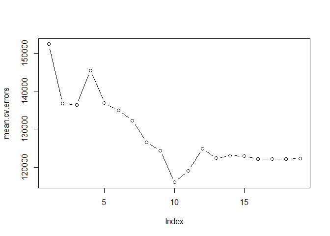
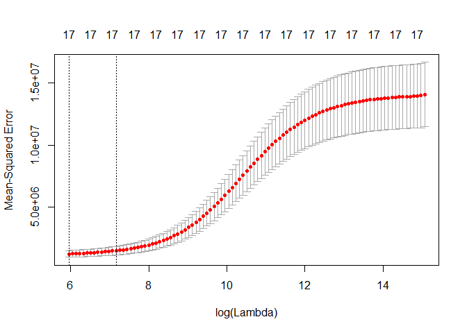

# 6.5.3 Choosing Among Models Using the Validation Set Approach and Cross-Validation


```r
library(ISLR)
library(leaps)
set.seed(1)
train <- sample(c(TRUE ,FALSE), nrow(Hitters),rep=TRUE)
test <- (!train)
regfit.best <- regsubsets(Salary ~ ., data=Hitters[train ,], nvmax=19)
test.mat <- model.matrix(Salary ~ ., data=Hitters [test ,])
val.errors <- rep(NA ,19)
for(i in 1:19){
  coefi <- coef(regfit.best, id=i)
  pred <- test.mat[,names(coefi)]%*%coefi
  val.errors[i] <- mean((na.omit(Hitters$Salary[test])-pred)^2)
}
val.errors
```

```
##  [1] 177714.2 157356.6 160619.2 164844.5 170205.2 162479.9 158430.2
##  [8] 152513.2 148932.0 143826.0 145388.6 147788.5 146810.4 149616.9
## [15] 144581.8 144993.9 146223.4 147094.8 148049.5
```

```r
which.min(val.errors)
```

```
## [1] 10
```

```r
coef(regfit.best ,10)
```

```
## (Intercept)       AtBat        Hits         RBI       Walks      CAtBat 
##  49.2616887  -1.7944396   5.5904675   2.7758087   3.9920711  -0.1752612 
##       CRuns      CWalks     LeagueN   DivisionW     PutOuts 
##   2.4302087  -0.7127743 114.1320379 -60.4814139   0.1600569
```

```r
predict.regsubsets <- function(object, newdata, id, ...){
  form <- as.formula(object$call[[2]])
  mat <- model.matrix(form, newdata)
  coefi <- coef(object, id=id)
  xvars <- names(coefi)
  mat[,xvars]%*%coefi
}

regfit.best <- regsubsets(Salary ~ .,data=Hitters ,nvmax=19)
coef(regfit.best, 10)
```

```
##  (Intercept)        AtBat         Hits        Walks       CAtBat 
##  162.5354420   -2.1686501    6.9180175    5.7732246   -0.1300798 
##        CRuns         CRBI       CWalks    DivisionW      PutOuts 
##    1.4082490    0.7743122   -0.8308264 -112.3800575    0.2973726 
##      Assists 
##    0.2831680
```

```r
k=10
set.seed(1)
folds <- sample(1:k, nrow(Hitters), replace=TRUE)
cv.errors <- matrix(NA,k,19, dimnames=list(NULL, paste(1:19)))

for(j in 1:k){
   best.fit <- regsubsets(Salary ~ ., data=Hitters[folds!=j,], nvmax=19)
    for(i in 1:19){
       pred <- predict(best.fit, Hitters[folds==j,], id=i)
      cv.errors[j,i] <- mean((na.omit(Hitters$Salary[folds==j])-pred)^2)
    }
}

mean.cv.errors <- apply(cv.errors, 2, mean)
mean.cv.errors
```

```
##        1        2        3        4        5        6        7        8 
## 152348.9 136702.2 136342.8 145399.3 136879.8 134925.7 132239.1 126518.4 
##        9       10       11       12       13       14       15       16 
## 124400.6 116020.4 119007.5 124923.1 122364.4 123022.7 122929.8 122133.3 
##       17       18       19 
## 122127.7 122155.8 122295.9
```

```r
par(mfrow=c(1,1))
plot(mean.cv.errors, type='b')
```

<!-- -->

```r
reg.best <- regsubsets(Salary ~ ., data=Hitters, nvmax=19)
coef(reg.best, 10)
```

```
##  (Intercept)        AtBat         Hits        Walks       CAtBat 
##  162.5354420   -2.1686501    6.9180175    5.7732246   -0.1300798 
##        CRuns         CRBI       CWalks    DivisionW      PutOuts 
##    1.4082490    0.7743122   -0.8308264 -112.3800575    0.2973726 
##      Assists 
##    0.2831680
```

# 6.6 Lab 2: Ridge Regression and the Lasso
## 6.6.1 Ridge Regression


```r
library(glmnet)
```

```
## Loading required package: Matrix
```

```
## Loading required package: foreach
```

```
## Loaded glmnet 2.0-13
```

```r
x <- model.matrix(Salary ~ ., Hitters)[,-1]
y <- na.omit(Hitters$Salary)
grid <- 10^seq(10, -2, length =100)
ridge.mod <- glmnet(x, y, alpha=0, lambda=grid)
dim(coef(ridge.mod))
```

```
## [1]  20 100
```

```r
ridge.mod$lambda[50]
```

```
## [1] 11497.57
```

```r
coef(ridge.mod)[,50]
```

```
##   (Intercept)         AtBat          Hits         HmRun          Runs 
## 407.356050200   0.036957182   0.138180344   0.524629976   0.230701523 
##           RBI         Walks         Years        CAtBat         CHits 
##   0.239841459   0.289618741   1.107702929   0.003131815   0.011653637 
##        CHmRun         CRuns          CRBI        CWalks       LeagueN 
##   0.087545670   0.023379882   0.024138320   0.025015421   0.085028114 
##     DivisionW       PutOuts       Assists        Errors    NewLeagueN 
##  -6.215440973   0.016482577   0.002612988  -0.020502690   0.301433531
```

```r
sqrt(sum(coef(ridge.mod)[-1,50]^2))
```

```
## [1] 6.360612
```

```r
ridge.mod$lambda[60]
```

```
## [1] 705.4802
```

```r
coef(ridge.mod)[,60]
```

```
##  (Intercept)        AtBat         Hits        HmRun         Runs 
##  54.32519950   0.11211115   0.65622409   1.17980910   0.93769713 
##          RBI        Walks        Years       CAtBat        CHits 
##   0.84718546   1.31987948   2.59640425   0.01083413   0.04674557 
##       CHmRun        CRuns         CRBI       CWalks      LeagueN 
##   0.33777318   0.09355528   0.09780402   0.07189612  13.68370191 
##    DivisionW      PutOuts      Assists       Errors   NewLeagueN 
## -54.65877750   0.11852289   0.01606037  -0.70358655   8.61181213
```

```r
sqrt(sum(coef(ridge.mod)[-1,60]^2))
```

```
## [1] 57.11001
```

```r
predict(ridge.mod, s=50, type="coefficients")[1:20,]
```

```
##   (Intercept)         AtBat          Hits         HmRun          Runs 
##  4.876610e+01 -3.580999e-01  1.969359e+00 -1.278248e+00  1.145892e+00 
##           RBI         Walks         Years        CAtBat         CHits 
##  8.038292e-01  2.716186e+00 -6.218319e+00  5.447837e-03  1.064895e-01 
##        CHmRun         CRuns          CRBI        CWalks       LeagueN 
##  6.244860e-01  2.214985e-01  2.186914e-01 -1.500245e-01  4.592589e+01 
##     DivisionW       PutOuts       Assists        Errors    NewLeagueN 
## -1.182011e+02  2.502322e-01  1.215665e-01 -3.278600e+00 -9.496680e+00
```

```r
set.seed(1)
train <- sample(1:nrow(x),nrow(x)/2)
test <- (-train)
y.test <- y[test]

ridge.mod <- glmnet(x[train,], y[train], alpha=0, lambda=grid, thresh=1e-12)
ridge.pred <- predict(ridge.mod, s=4, newx=x[test,])
mean((ridge.pred-y.test)^2)
```

```
## [1] 101036.8
```

```r
mean((mean(y[train])-y.test)^2)
```

```
## [1] 193253.1
```

```r
ridge.pred <- predict(ridge.mod, s=1e10, newx=x[test,])
mean((ridge.pred-y.test)^2)
```

```
## [1] 193253.1
```

```r
ridge.pred <- predict(ridge.mod, s=0, newx=x[test,], exact = T, x=x[train,], y=y[train])
mean((ridge.pred-y.test)^2)
```

```
## [1] 114783.1
```

```r
lm(y ~ x, subset=train)
```

```
## 
## Call:
## lm(formula = y ~ x, subset = train)
## 
## Coefficients:
## (Intercept)       xAtBat        xHits       xHmRun        xRuns  
##   299.42849     -2.54027      8.36682     11.64512     -9.09923  
##        xRBI       xWalks       xYears      xCAtBat       xCHits  
##     2.44105      9.23440    -22.93673     -0.18154     -0.11598  
##     xCHmRun       xCRuns        xCRBI      xCWalks     xLeagueN  
##    -1.33888      3.32838      0.07536     -1.07841     59.76065  
##  xDivisionW     xPutOuts     xAssists      xErrors  xNewLeagueN  
##   -98.86233      0.34087      0.34165     -0.64207     -0.67442
```

```r
predict(ridge.mod, s=0, exact=T, type="coefficients", x=x[train,], y=y[train])[1:20,]
```

```
##  (Intercept)        AtBat         Hits        HmRun         Runs 
## 299.42883596  -2.54014665   8.36611719  11.64400720  -9.09877719 
##          RBI        Walks        Years       CAtBat        CHits 
##   2.44152119   9.23403909 -22.93584442  -0.18160843  -0.11561496 
##       CHmRun        CRuns         CRBI       CWalks      LeagueN 
##  -1.33836534   3.32817777   0.07511771  -1.07828647  59.76529059 
##    DivisionW      PutOuts      Assists       Errors   NewLeagueN 
## -98.85996590   0.34086400   0.34165605  -0.64205839  -0.67606314
```

```r
set.seed(1)
cv.out <- cv.glmnet(x[train,], y[train], alpha=0)
plot(cv.out)
```

<!-- -->

```r
bestlam <- cv.out$lambda.min
bestlam
```

```
## [1] 211.7416
```

```r
ridge.pred <- predict(ridge.mod, s=bestlam, newx=x[test,])
mean((ridge.pred - y.test)^2)
```

```
## [1] 96015.51
```

```r
out <- glmnet(x, y, alpha=0)
predict(out, type="coefficients", s=bestlam)[1:20,]
```

```
##  (Intercept)        AtBat         Hits        HmRun         Runs 
##   9.88487157   0.03143991   1.00882875   0.13927624   1.11320781 
##          RBI        Walks        Years       CAtBat        CHits 
##   0.87318990   1.80410229   0.13074381   0.01113978   0.06489843 
##       CHmRun        CRuns         CRBI       CWalks      LeagueN 
##   0.45158546   0.12900049   0.13737712   0.02908572  27.18227535 
##    DivisionW      PutOuts      Assists       Errors   NewLeagueN 
## -91.63411299   0.19149252   0.04254536  -1.81244470   7.21208390
```

# 6.8 Exercises

### 3. Suppose we estimate the regression coefficients in a linear regression model by minimizing (equation) for a particular value of s. For parts (a) through (e), indicate which of i. through v. is correct. Justify your answer.

  (a) As we increase s from 0, the training RSS will:  
    Decrease steadily  
  (b) Repeat (a) for test RSS.  
    Decrease initially, and then eventually start increasing in a U shape  
  (c) Repeat (a) for variance.  
    Steadily increase.  
  (d) Repeat (a) for (squared) bias.  
    Steadily decrease.  
  (e) Repeat (a) for the irreducible error.  
    Remain constant.
    
### 4. Suppose we estimate the regression coefficients in a linear regression model by minimizing (function) for a particular value of λ. For parts (a) through (e), indicate which of i. through v. is correct. Justify your answer.

  (a) As we increase λ from 0, the training RSS will:  
    Steadily increase.  
  (b) Repeat (a) for test RSS.  
    Decrease initially, and then eventually start increasing in a U shape.  
  (c) Repeat (a) for variance.  
    Steadily decrease.  
  (d) Repeat (a) for (squared) bias.  
    Steadily increase.  
  (e) Repeat (a) for the irreducible error.  
    Remain constant.
    
### 5. It is well-known that ridge regression tends to give similar coefficient values to correlated variables, whereas the lasso may give quite different coefficient values to correlated variables. We will now explore this property in a very simple setting. Suppose that n = 2, p = 2, x11 = x12, x21 = x22. Furthermore, suppose that y1 +y2 = 0 and x11 +x21 = 0 and x12 +x22 = 0, so that the estimate for the intercept in a least squares, ridge regression, or lasso model is zero: βˆ0 = 0.

  (a) Write out the ridge regression optimization problem in this setting.  
    Uh...
  (b) Argue that in this setting, the ridge coefficient estimates satisfy βˆ1 = βˆ2.  
    Uh...
    

```r
X <- matrix(c(1,-1,1,-1),2,2)
Y <- c(-1,1)
X
```

```
##      [,1] [,2]
## [1,]    1    1
## [2,]   -1   -1
```

```r
Y
```

```
## [1] -1  1
```

```r
ridge.mod <- glmnet(X, Y, alpha=0)
coef(ridge.mod)[,3]
```

```
##  (Intercept)           V1           V2 
##  0.000000000 -0.001201609 -0.001201609
```

### 9. In this exercise, we will predict the number of applications received using the other variables in the College data set.

  (a) Split the data set into a training set and a test set.  

```r
summary(College)
```

```
##  Private        Apps           Accept          Enroll       Top10perc    
##  No :212   Min.   :   81   Min.   :   72   Min.   :  35   Min.   : 1.00  
##  Yes:565   1st Qu.:  776   1st Qu.:  604   1st Qu.: 242   1st Qu.:15.00  
##            Median : 1558   Median : 1110   Median : 434   Median :23.00  
##            Mean   : 3002   Mean   : 2019   Mean   : 780   Mean   :27.56  
##            3rd Qu.: 3624   3rd Qu.: 2424   3rd Qu.: 902   3rd Qu.:35.00  
##            Max.   :48094   Max.   :26330   Max.   :6392   Max.   :96.00  
##    Top25perc      F.Undergrad     P.Undergrad         Outstate    
##  Min.   :  9.0   Min.   :  139   Min.   :    1.0   Min.   : 2340  
##  1st Qu.: 41.0   1st Qu.:  992   1st Qu.:   95.0   1st Qu.: 7320  
##  Median : 54.0   Median : 1707   Median :  353.0   Median : 9990  
##  Mean   : 55.8   Mean   : 3700   Mean   :  855.3   Mean   :10441  
##  3rd Qu.: 69.0   3rd Qu.: 4005   3rd Qu.:  967.0   3rd Qu.:12925  
##  Max.   :100.0   Max.   :31643   Max.   :21836.0   Max.   :21700  
##    Room.Board       Books           Personal         PhD        
##  Min.   :1780   Min.   :  96.0   Min.   : 250   Min.   :  8.00  
##  1st Qu.:3597   1st Qu.: 470.0   1st Qu.: 850   1st Qu.: 62.00  
##  Median :4200   Median : 500.0   Median :1200   Median : 75.00  
##  Mean   :4358   Mean   : 549.4   Mean   :1341   Mean   : 72.66  
##  3rd Qu.:5050   3rd Qu.: 600.0   3rd Qu.:1700   3rd Qu.: 85.00  
##  Max.   :8124   Max.   :2340.0   Max.   :6800   Max.   :103.00  
##     Terminal       S.F.Ratio      perc.alumni        Expend     
##  Min.   : 24.0   Min.   : 2.50   Min.   : 0.00   Min.   : 3186  
##  1st Qu.: 71.0   1st Qu.:11.50   1st Qu.:13.00   1st Qu.: 6751  
##  Median : 82.0   Median :13.60   Median :21.00   Median : 8377  
##  Mean   : 79.7   Mean   :14.09   Mean   :22.74   Mean   : 9660  
##  3rd Qu.: 92.0   3rd Qu.:16.50   3rd Qu.:31.00   3rd Qu.:10830  
##  Max.   :100.0   Max.   :39.80   Max.   :64.00   Max.   :56233  
##    Grad.Rate     
##  Min.   : 10.00  
##  1st Qu.: 53.00  
##  Median : 65.00  
##  Mean   : 65.46  
##  3rd Qu.: 78.00  
##  Max.   :118.00
```

```r
set.seed(1)
train <- sample(c(TRUE ,FALSE), nrow(College),rep=TRUE)
test <- (!train)
y.test <- y[test]
```

  (b) Fit a linear model using least squares on the training set, and report the test error obtained.  

```r
lm.fit <- lm(Apps ~ ., data = College[train,])
summary(lm.fit)
```

```
## 
## Call:
## lm(formula = Apps ~ ., data = College[train, ])
## 
## Residuals:
##     Min      1Q  Median      3Q     Max 
## -2485.0  -392.4   -57.9   261.6  6637.3 
## 
## Coefficients:
##               Estimate Std. Error t value Pr(>|t|)    
## (Intercept) -756.88732  535.44217  -1.414 0.158301    
## PrivateYes  -515.36459  190.44202  -2.706 0.007112 ** 
## Accept         1.20916    0.07046  17.161  < 2e-16 ***
## Enroll        -0.29026    0.23380  -1.241 0.215188    
## Top10perc     52.53768    7.69358   6.829 3.38e-11 ***
## Top25perc    -16.38973    6.09706  -2.688 0.007500 ** 
## F.Undergrad    0.09625    0.04103   2.346 0.019495 *  
## P.Undergrad    0.02831    0.05417   0.523 0.601540    
## Outstate      -0.02161    0.02599  -0.831 0.406262    
## Room.Board     0.13204    0.06968   1.895 0.058847 .  
## Books          0.16642    0.34092   0.488 0.625726    
## Personal       0.16409    0.09270   1.770 0.077519 .  
## PhD           -8.51810    6.73921  -1.264 0.207015    
## Terminal      -0.35379    7.43056  -0.048 0.962049    
## S.F.Ratio      3.79436   16.20785   0.234 0.815028    
## perc.alumni   -2.86286    5.56666  -0.514 0.607349    
## Expend         0.05855    0.01528   3.832 0.000148 ***
## Grad.Rate      7.14929    3.91090   1.828 0.068323 .  
## ---
## Signif. codes:  0 '***' 0.001 '**' 0.01 '*' 0.05 '.' 0.1 ' ' 1
## 
## Residual standard error: 1001 on 382 degrees of freedom
## Multiple R-squared:  0.9314,	Adjusted R-squared:  0.9283 
## F-statistic: 304.9 on 17 and 382 DF,  p-value: < 2.2e-16
```

```r
pred <- predict(lm.fit, College[test,])
test.err <- mean((College[test,]$Apps - pred)^2)
test.err
```

```
## [1] 1520331
```

  (c) Fit a ridge regression model on the training set, with λ chosen by cross-validation. Report the test error obtained.  

```r
library(dplyr)
```

```
## 
## Attaching package: 'dplyr'
```

```
## The following objects are masked from 'package:stats':
## 
##     filter, lag
```

```
## The following objects are masked from 'package:base':
## 
##     intersect, setdiff, setequal, union
```

```r
X <- College[train,] %>% select(-Apps) %>% mutate(Private = as.numeric(Private)-1) %>% as.matrix()
Y <- College[train,] %>% select(Apps) %>% as.matrix()
X.test <- College[test,] %>% select(-Apps) %>% mutate(Private = as.numeric(Private)-1) %>% as.matrix()
Y.test <- College[test,] %>% select(Apps) %>% as.matrix()
ridge.mod <- glmnet(X, Y, alpha=0)
cv.out <- cv.glmnet(X, Y, alpha=0)
plot(cv.out)
```

<!-- -->

```r
bestlam <- cv.out$lambda.min
bestlam
```

```
## [1] 384.4944
```

```r
ridge.pred <- predict(ridge.mod, s=bestlam, newx=X.test)
mean((ridge.pred-Y.test)^2)
```

```
## [1] 2585067
```

