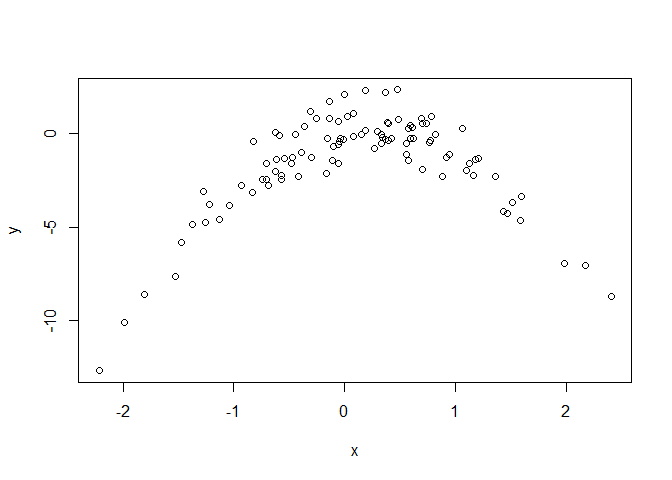

# 5.3 Lab: Cross-Validation and the Bootstrap

## 5.3.1 The Validation Set Approach


```r
library(ISLR)
set.seed(1)
train <- sample(392,196)

lm.fit <- lm(mpg∼horsepower, data=Auto, subset=train)

attach(Auto)
mean((mpg - predict(lm.fit, Auto))[-train ]^2)
```

```
## [1] 26.14142
```

```r
lm.fit2 <- lm(mpg∼poly(horsepower,2), data=Auto, subset=train)
mean((mpg - predict(lm.fit2, Auto))[-train]^2)
```

```
## [1] 19.82259
```

```r
lm.fit3 <- lm(mpg∼poly(horsepower,3), data=Auto, subset=train)
mean((mpg - predict(lm.fit3, Auto))[-train]^2)
```

```
## [1] 19.78252
```

```r
set.seed(2)
train <- sample(392,196)

lm.fit <- lm(mpg∼horsepower, data=Auto, subset=train)
mean((mpg - predict(lm.fit, Auto))[-train ]^2)
```

```
## [1] 23.29559
```

```r
lm.fit2 <- lm(mpg∼poly(horsepower,2), data=Auto, subset=train)
mean((mpg - predict(lm.fit2, Auto))[-train]^2)
```

```
## [1] 18.90124
```

```r
lm.fit3 <- lm(mpg∼poly(horsepower,3), data=Auto, subset=train)
mean((mpg - predict(lm.fit3, Auto))[-train]^2)
```

```
## [1] 19.2574
```

## 5.3.2 Leave-One-Out Cross-Validation


```r
library(boot)

glm.fit <- glm(mpg ~ horsepower, data=Auto)
coef(glm.fit)
```

```
## (Intercept)  horsepower 
##  39.9358610  -0.1578447
```

```r
lm.fit <- lm(mpg ~ horsepower, data=Auto)
coef(lm.fit)
```

```
## (Intercept)  horsepower 
##  39.9358610  -0.1578447
```

```r
glm.fit <- glm(mpg ~ horsepower, data=Auto)
cv.err <- cv.glm(Auto, glm.fit)
cv.err$delta
```

```
## [1] 24.23151 24.23114
```

```r
cv.error <- rep(0,5)
for(i in 1:5){
  glm.fit <- glm(mpg ~ poly(horsepower ,i), data=Auto)
  cv.error[i] <- cv.glm(Auto, glm.fit)$delta[1]
}
cv.error
```

```
## [1] 24.23151 19.24821 19.33498 19.42443 19.03321
```

## 5.3.3 k-Fold Cross-Validation


```r
set.seed(17)
cv.error.10=rep(0 ,10)
for(i in 1:10){
  glm.fit <- glm(mpg ~ poly(horsepower ,i), data=Auto)
  cv.error.10[i] <- cv.glm(Auto, glm.fit, K=10)$delta[1]
}
cv.error.10
```

```
##  [1] 24.20520 19.18924 19.30662 19.33799 18.87911 19.02103 18.89609
##  [8] 19.71201 18.95140 19.50196
```

## 5.3.4 The Bootstrap


```r
alpha.fn <- function(data ,index){
  X <- data$X[index]
  Y <- data$Y[index]
  return((var(Y) - cov(X,Y)) / (var(X) + var(Y) - 2 * cov(X,Y)))
}

alpha.fn(Portfolio, 1:100)
```

```
## [1] 0.5758321
```

```r
set.seed(1)
alpha.fn(Portfolio, sample(100, 100, replace=T))
```

```
## [1] 0.5963833
```

```r
boot(Portfolio, alpha.fn, R=1000)
```

```
## 
## ORDINARY NONPARAMETRIC BOOTSTRAP
## 
## 
## Call:
## boot(data = Portfolio, statistic = alpha.fn, R = 1000)
## 
## 
## Bootstrap Statistics :
##      original        bias    std. error
## t1* 0.5758321 -7.315422e-05  0.08861826
```

```r
boot.fn <-function (data ,index){
  return(coef(lm(mpg ~ horsepower, data=data, subset=index)))
}

boot.fn(Auto ,1:392)
```

```
## (Intercept)  horsepower 
##  39.9358610  -0.1578447
```

```r
set.seed(1)
boot.fn(Auto, sample(392,392, replace=T))
```

```
## (Intercept)  horsepower 
##  38.7387134  -0.1481952
```

```r
boot.fn(Auto, sample(392,392, replace=T))
```

```
## (Intercept)  horsepower 
##  40.0383086  -0.1596104
```

```r
boot(Auto ,boot.fn ,1000)
```

```
## 
## ORDINARY NONPARAMETRIC BOOTSTRAP
## 
## 
## Call:
## boot(data = Auto, statistic = boot.fn, R = 1000)
## 
## 
## Bootstrap Statistics :
##       original      bias    std. error
## t1* 39.9358610  0.02972191 0.860007896
## t2* -0.1578447 -0.00030823 0.007404467
```

```r
summary(lm(mpg∼horsepower, data=Auto))$coef
```

```
##               Estimate  Std. Error   t value      Pr(>|t|)
## (Intercept) 39.9358610 0.717498656  55.65984 1.220362e-187
## horsepower  -0.1578447 0.006445501 -24.48914  7.031989e-81
```

```r
boot.fn <- function(data ,index){
  coefficients(lm(mpg ~ horsepower + I(horsepower ^2), data=data, subset=index))
}
set.seed(1)
boot(Auto, boot.fn, 1000)
```

```
## 
## ORDINARY NONPARAMETRIC BOOTSTRAP
## 
## 
## Call:
## boot(data = Auto, statistic = boot.fn, R = 1000)
## 
## 
## Bootstrap Statistics :
##         original        bias     std. error
## t1* 56.900099702  6.098115e-03 2.0944855842
## t2* -0.466189630 -1.777108e-04 0.0334123802
## t3*  0.001230536  1.324315e-06 0.0001208339
```

```r
summary(lm(mpg ~ horsepower + I(horsepower^2), data=Auto))$coef
```

```
##                     Estimate   Std. Error   t value      Pr(>|t|)
## (Intercept)     56.900099702 1.8004268063  31.60367 1.740911e-109
## horsepower      -0.466189630 0.0311246171 -14.97816  2.289429e-40
## I(horsepower^2)  0.001230536 0.0001220759  10.08009  2.196340e-21
```

# 5.4 Exercises

  3. We now review k-fold cross-validation.
    (a) Explain how k-fold cross-validation is implemented.  
    K-fold cross-validation is performed by splitting the traing dataset into k approximately equal partitions. Then for as many k partitions you have, you fit a model using all k-ki partitions. Then you compute the test error using the ki partition which was left out in the fitting process. After performing this process k times, you take the average of the errors.
    
    (b) What are the advantages and disadvantages of k-fold crossvalidation relative to:  
    
      i. The validation set approach?  
      
      With the validation set approach k-fold crossvalidation provides for a lower variance. k-fold crossvalidation also provides a more stable bias and variance when the appropriate k is used.
      
      ii. LOOCV?  
      
      LOOCV is a special case of k-fold crossvalidation where k is equal to n. With least squares linear or polynomial regression LOOCV is can be performed faster than k-fold crossvalidation. This benefit diminishes as the model becomes more complex. k-fold crossvaldition is faster than LOOCV because you only have to fit the model k times instead of n times. LOOCV provides for very low bias at the cost of high variance since the model is tested against one observation
      
  5. In Chapter 4, we used logistic regression to predict the probability of default using income and balance on the Default data set. We will now estimate the test error of this logistic regression model using the validation set approach. Do not forget to set a random seed before beginning your analysis.
    
    (a) Fit a logistic regression model that uses income and balance to
predict default.


```r
summary(Default)
```

```
##  default    student       balance           income     
##  No :9667   No :7056   Min.   :   0.0   Min.   :  772  
##  Yes: 333   Yes:2944   1st Qu.: 481.7   1st Qu.:21340  
##                        Median : 823.6   Median :34553  
##                        Mean   : 835.4   Mean   :33517  
##                        3rd Qu.:1166.3   3rd Qu.:43808  
##                        Max.   :2654.3   Max.   :73554
```

```r
glm.fit <- glm(default ~ income + balance, data=Default ,family=binomial)
summary(glm.fit)
```

```
## 
## Call:
## glm(formula = default ~ income + balance, family = binomial, 
##     data = Default)
## 
## Deviance Residuals: 
##     Min       1Q   Median       3Q      Max  
## -2.4725  -0.1444  -0.0574  -0.0211   3.7245  
## 
## Coefficients:
##               Estimate Std. Error z value Pr(>|z|)    
## (Intercept) -1.154e+01  4.348e-01 -26.545  < 2e-16 ***
## income       2.081e-05  4.985e-06   4.174 2.99e-05 ***
## balance      5.647e-03  2.274e-04  24.836  < 2e-16 ***
## ---
## Signif. codes:  0 '***' 0.001 '**' 0.01 '*' 0.05 '.' 0.1 ' ' 1
## 
## (Dispersion parameter for binomial family taken to be 1)
## 
##     Null deviance: 2920.6  on 9999  degrees of freedom
## Residual deviance: 1579.0  on 9997  degrees of freedom
## AIC: 1585
## 
## Number of Fisher Scoring iterations: 8
```

  (b) Using the validation set approach, estimate the test error of this model. In order to do this, you must perform the following steps:
    i. Split the sample set into a training set and a validation set.
    ii. Fit a multiple logistic regression model using only the training observations.
    iii. Obtain a prediction of default status for each individual in the validation set by computing the posterior probability of default for that individual, and classifying the individual to the default category if the posterior probability is greater than 0.5.
    iv. Compute the validation set error, which is the fraction of the observations in the validation set that are misclassified
    

```r
#i
dim(Default)
```

```
## [1] 10000     4
```

```r
set.seed(1)
train <- sample(10000, 5000)

#ii
glm.fit2 <- glm(default ~ income + balance, data=Default ,family=binomial, subset = train)
summary(glm.fit2)
```

```
## 
## Call:
## glm(formula = default ~ income + balance, family = binomial, 
##     data = Default, subset = train)
## 
## Deviance Residuals: 
##     Min       1Q   Median       3Q      Max  
## -2.3583  -0.1268  -0.0475  -0.0165   3.8116  
## 
## Coefficients:
##               Estimate Std. Error z value Pr(>|z|)    
## (Intercept) -1.208e+01  6.658e-01 -18.148   <2e-16 ***
## income       1.858e-05  7.573e-06   2.454   0.0141 *  
## balance      6.053e-03  3.467e-04  17.457   <2e-16 ***
## ---
## Signif. codes:  0 '***' 0.001 '**' 0.01 '*' 0.05 '.' 0.1 ' ' 1
## 
## (Dispersion parameter for binomial family taken to be 1)
## 
##     Null deviance: 1457.0  on 4999  degrees of freedom
## Residual deviance:  734.4  on 4997  degrees of freedom
## AIC: 740.4
## 
## Number of Fisher Scoring iterations: 8
```

```r
#iii
glm.prob <- predict(glm.fit2, Default, type="response")[-train]
glm.pred <- rep("No",length(glm.prob))
glm.pred[glm.prob >.5]="Yes"

#iv
true.test <- Default$default[-train]
table(glm.pred ,true.test)
```

```
##         true.test
## glm.pred   No  Yes
##      No  4805  115
##      Yes   28   52
```

```r
mean(glm.pred != true.test)
```

```
## [1] 0.0286
```

  (c) Repeat the process in (b) three times, using three different splits of the observations into a training set and a validation set. Comment on the results obtained.
  

```r
set.seed(2)
cv.error <- rep(0,3)
for(i in 1:3){
  train <- sample(10000, 5000)
  glm.fit2 <- glm(default ~ income + balance, data=Default ,family=binomial, subset = train)
  glm.prob <- predict(glm.fit2, Default, type="response")[-train]
  glm.pred <- rep("No",length(glm.prob))
  glm.pred[glm.prob >.5]="Yes"
  true.test <- Default$default[-train]
  cv.error[i] <- mean(glm.pred != true.test)
}
cv.error
```

```
## [1] 0.0276 0.0278 0.0258
```

```r
var(cv.error)
```

```
## [1] 1.213333e-06
```

```r
summary(cv.error)
```

```
##    Min. 1st Qu.  Median    Mean 3rd Qu.    Max. 
## 0.02580 0.02670 0.02760 0.02707 0.02770 0.02780
```
  Error didn't change too much.

  (d) Now consider a logistic regression model that predicts the probability of default using income, balance, and a dummy variable for student. Estimate the test error for this model using the validation set approach. Comment on whether or not including a dummy variable for student leads to a reduction in the test error rate.
  

```r
set.seed(1)
train <- sample(10000, 5000)
glm.fit <- glm(default ~ income + balance + student, data=Default ,family=binomial, subset = train)
glm.prob <- predict(glm.fit, Default, type="response")[-train]
glm.pred <- rep("No",length(glm.prob))
glm.pred[glm.prob >.5]="Yes"
true.test <- Default$default[-train]
table(glm.pred ,true.test)
```

```
##         true.test
## glm.pred   No  Yes
##      No  4803  114
##      Yes   30   53
```

```r
mean(glm.pred != true.test)
```

```
## [1] 0.0288
```
  The error didn't really change by adding student.

7. In Sections 5.3.2 and 5.3.3, we saw that the cv.glm() function can be used in order to compute the LOOCV test error estimate. Alternatively, one could compute those quantities using just the glm() and predict.glm() functions, and a for loop. You will now take this approach in order to compute the LOOCV error for a simple logistic regression model on the Weekly data set. Recall that in the context of classification problems, the LOOCV error is given in (5.4)

  (a) Fit a logistic regression model that predicts Direction using Lag1 and Lag2.
  

```r
glm.fit <- glm(Direction ~ Lag1 + Lag2, Weekly, family = binomial)
```

  (b) Fit a logistic regression model that predicts Direction using Lag1
and Lag2 using all but the first observation.


```r
glm.fit2 <- glm(Direction ~ Lag1 + Lag2, Weekly, family = binomial, subset = -1)
```

  (c) Use the model from (b) to predict the direction of the first observation. You can do this by predicting that the first observation will go up if P(Direction="Up"|Lag1, Lag2) > 0.5. Was this observation correctly classified?
  

```r
glm.prob <- predict(glm.fit2, Weekly, type="response")[1]
Weekly$Direction[1]
```

```
## [1] Down
## Levels: Down Up
```

```r
glm.prob > .5
```

```
##    1 
## TRUE
```
  Not correct

  (d) Write a for loop from i = 1 to i = n, where n is the number of observations in the data set, that performs each of the following steps:
    i. Fit a logistic regression model using all but the ith observation to predict Direction using Lag1 and Lag2.
    ii. Compute the posterior probability of the market moving up for the ith observation.
    iii. Use the posterior probability for the ith observation in order to predict whether or not the market moves up.
    iv. Determine whether or not an error was made in predicting the direction for the ith observation. If an error was made, then indicate this as a 1, and otherwise indicate it as a 0.
    

```r
set.seed(1)
cv.error <- rep(0, nrow(Weekly))
for(i in 1:nrow(Weekly)){
  glm.fit <- glm(Direction ~ Lag1 + Lag2, Weekly[-i,], family = binomial)
  glm.prob <- predict(glm.fit, Weekly, type="response")[i]
  glm.prob <- ifelse(glm.prob > .5, "Up", "Down")
  if(glm.prob != Weekly$Direction[i]){
    cv.error[i] <- 1
  }
}
```

  (e) Take the average of the n numbers obtained in (d)iv in order to obtain the LOOCV estimate for the test error. Comment on the results.
  

```r
mean(cv.error)
```

```
## [1] 0.4499541
```

8. We will now perform cross-validation on a simulated data set.

  (a) Generate a simulated data set as follows:

```r
set.seed(1)
x <- rnorm(100)
y <- x-2*x^2+rnorm(100)
```
  In this data set, what is n and what is p? Write out the model used to generate the data in equation form.
  
  n is 100 and p is (x-2\*x^2) so 1. lm(y ~ x-2\*x^2 + e)
  
  (b) Create a scatterplot of X against Y . Comment on what you find.
  

```r
plot(x,y)
```

<!-- -->
It has a quadratic form

  (c) Set a random seed, and then compute the LOOCV errors that result from fitting the following four models using least squares:
    i. Y = β0 + β1X + e
    ii. Y = β0 + β1X + β2X2 + e
    iii. Y = β0 + β1X + β2X2 + β3X3 + e
    iv. Y = β0 + β1X + β2X2 + β3X3 + β4X4 + e
    

```r
library(boot)
df <- data.frame(x=x,y=y)
set.seed(3)
sapply(1:4, function(z) {
  glm.fit <- glm(y ~ poly(x,z), data = df)
  cv.glm(df,glm.fit)$delta[1]
})
```

```
## [1] 7.2881616 0.9374236 0.9566218 0.9539049
```

  (d) Repeat (c) using another random seed, and report your results. Are your results the same as what you got in (c)? Why?
  

```r
set.seed(9)
sapply(1:4, function(z) {
  glm.fit <- glm(y ~ poly(x,z), data = df)
  cv.glm(df,glm.fit)$delta[1]
})
```

```
## [1] 7.2881616 0.9374236 0.9566218 0.9539049
```

The results are the same due to LOOCV where we are always going to be doing the same model fits using the same data.

  (e) Which of the models in (c) had the smallest LOOCV error? Is this what you expected? Explain your answer.
  Y = β0 + β1X + β2X2 + e had the lowest error. I expected this since the plot of x vs y looked quadratic and the model was also of quadratic form.
  
  (f) Comment on the statistical significance of the coefficient estimates that results from fitting each of the models in (c) using least squares. Do these results agree with the conclusions drawn based on the cross-validation results?
  

```r
set.seed(3)
sapply(1:4, function(z) {
  glm.fit <- glm(y ~ poly(x,z), data = df)
  print(summary(glm.fit))
  cv.glm(df,glm.fit)$delta[1]
})
```

```
## 
## Call:
## glm(formula = y ~ poly(x, z), data = df)
## 
## Deviance Residuals: 
##     Min       1Q   Median       3Q      Max  
## -9.5161  -0.6800   0.6812   1.5491   3.8183  
## 
## Coefficients:
##             Estimate Std. Error t value Pr(>|t|)    
## (Intercept)   -1.550      0.260  -5.961 3.95e-08 ***
## poly(x, z)     6.189      2.600   2.380   0.0192 *  
## ---
## Signif. codes:  0 '***' 0.001 '**' 0.01 '*' 0.05 '.' 0.1 ' ' 1
## 
## (Dispersion parameter for gaussian family taken to be 6.760719)
## 
##     Null deviance: 700.85  on 99  degrees of freedom
## Residual deviance: 662.55  on 98  degrees of freedom
## AIC: 478.88
## 
## Number of Fisher Scoring iterations: 2
## 
## 
## Call:
## glm(formula = y ~ poly(x, z), data = df)
## 
## Deviance Residuals: 
##     Min       1Q   Median       3Q      Max  
## -1.9650  -0.6254  -0.1288   0.5803   2.2700  
## 
## Coefficients:
##             Estimate Std. Error t value Pr(>|t|)    
## (Intercept)  -1.5500     0.0958  -16.18  < 2e-16 ***
## poly(x, z)1   6.1888     0.9580    6.46 4.18e-09 ***
## poly(x, z)2 -23.9483     0.9580  -25.00  < 2e-16 ***
## ---
## Signif. codes:  0 '***' 0.001 '**' 0.01 '*' 0.05 '.' 0.1 ' ' 1
## 
## (Dispersion parameter for gaussian family taken to be 0.9178258)
## 
##     Null deviance: 700.852  on 99  degrees of freedom
## Residual deviance:  89.029  on 97  degrees of freedom
## AIC: 280.17
## 
## Number of Fisher Scoring iterations: 2
## 
## 
## Call:
## glm(formula = y ~ poly(x, z), data = df)
## 
## Deviance Residuals: 
##     Min       1Q   Median       3Q      Max  
## -1.9765  -0.6302  -0.1227   0.5545   2.2843  
## 
## Coefficients:
##              Estimate Std. Error t value Pr(>|t|)    
## (Intercept)  -1.55002    0.09626 -16.102  < 2e-16 ***
## poly(x, z)1   6.18883    0.96263   6.429 4.97e-09 ***
## poly(x, z)2 -23.94830    0.96263 -24.878  < 2e-16 ***
## poly(x, z)3   0.26411    0.96263   0.274    0.784    
## ---
## Signif. codes:  0 '***' 0.001 '**' 0.01 '*' 0.05 '.' 0.1 ' ' 1
## 
## (Dispersion parameter for gaussian family taken to be 0.9266599)
## 
##     Null deviance: 700.852  on 99  degrees of freedom
## Residual deviance:  88.959  on 96  degrees of freedom
## AIC: 282.09
## 
## Number of Fisher Scoring iterations: 2
## 
## 
## Call:
## glm(formula = y ~ poly(x, z), data = df)
## 
## Deviance Residuals: 
##     Min       1Q   Median       3Q      Max  
## -2.0550  -0.6212  -0.1567   0.5952   2.2267  
## 
## Coefficients:
##              Estimate Std. Error t value Pr(>|t|)    
## (Intercept)  -1.55002    0.09591 -16.162  < 2e-16 ***
## poly(x, z)1   6.18883    0.95905   6.453 4.59e-09 ***
## poly(x, z)2 -23.94830    0.95905 -24.971  < 2e-16 ***
## poly(x, z)3   0.26411    0.95905   0.275    0.784    
## poly(x, z)4   1.25710    0.95905   1.311    0.193    
## ---
## Signif. codes:  0 '***' 0.001 '**' 0.01 '*' 0.05 '.' 0.1 ' ' 1
## 
## (Dispersion parameter for gaussian family taken to be 0.9197797)
## 
##     Null deviance: 700.852  on 99  degrees of freedom
## Residual deviance:  87.379  on 95  degrees of freedom
## AIC: 282.3
## 
## Number of Fisher Scoring iterations: 2
```

```
## [1] 7.2881616 0.9374236 0.9566218 0.9539049
```

The statisical significance of the coefficient estimates agree with the results from cross-validation. A quadratic model has the most significant coefficients.
