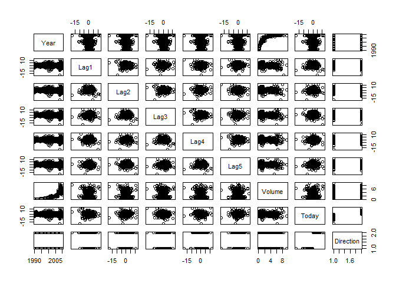
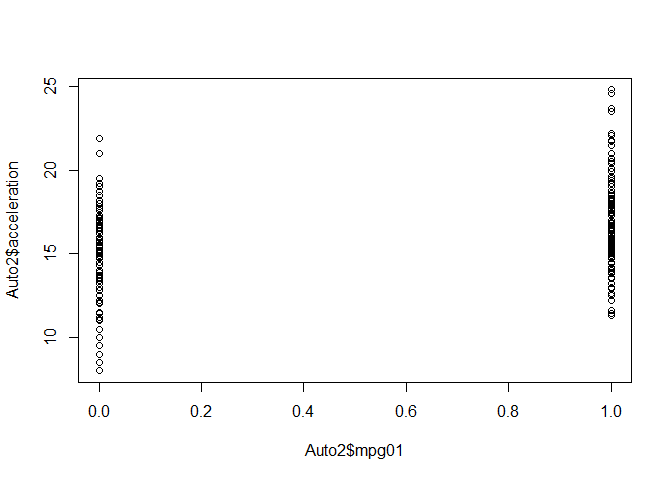
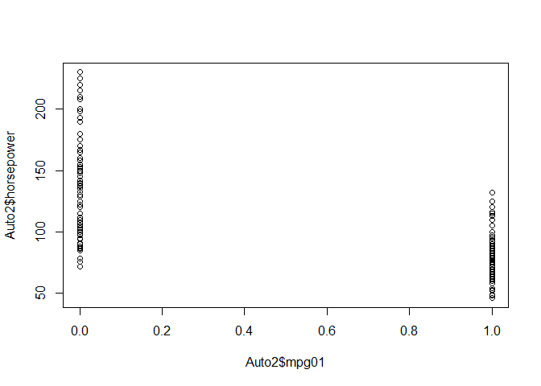
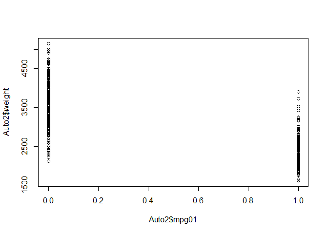
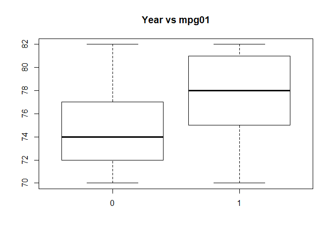
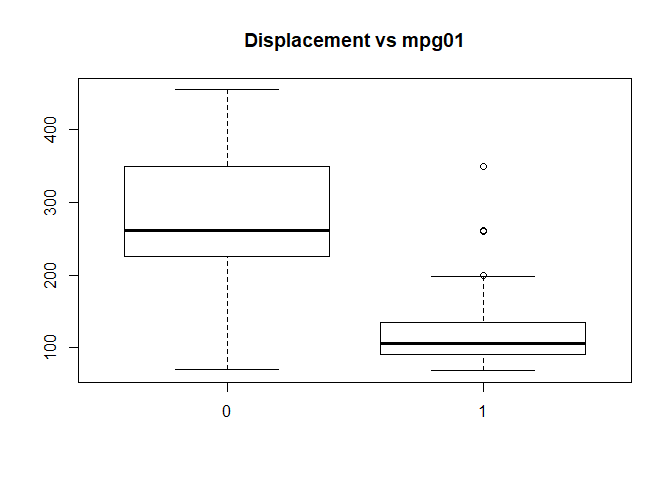
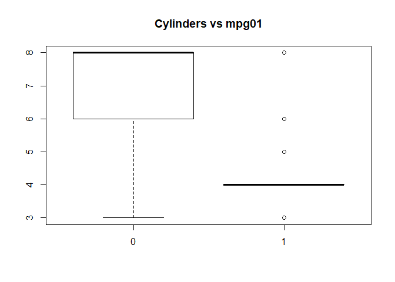
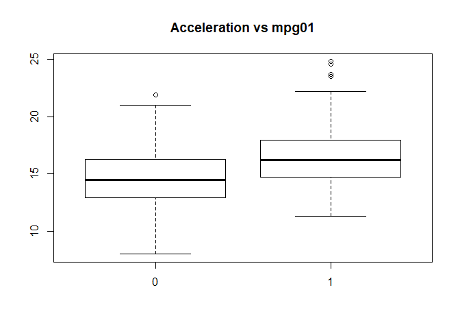

## 4.6.2 Logistic Regression


```r
library(ISLR)
attach(Smarket)
glm.fits=glm(Direction∼Lag1+Lag2+Lag3+Lag4+Lag5+Volume,
data=Smarket ,family=binomial)
summary(glm.fits)
```

```
## 
## Call:
## glm(formula = Direction ~ Lag1 + Lag2 + Lag3 + Lag4 + Lag5 + 
##     Volume, family = binomial, data = Smarket)
## 
## Deviance Residuals: 
##    Min      1Q  Median      3Q     Max  
## -1.446  -1.203   1.065   1.145   1.326  
## 
## Coefficients:
##              Estimate Std. Error z value Pr(>|z|)
## (Intercept) -0.126000   0.240736  -0.523    0.601
## Lag1        -0.073074   0.050167  -1.457    0.145
## Lag2        -0.042301   0.050086  -0.845    0.398
## Lag3         0.011085   0.049939   0.222    0.824
## Lag4         0.009359   0.049974   0.187    0.851
## Lag5         0.010313   0.049511   0.208    0.835
## Volume       0.135441   0.158360   0.855    0.392
## 
## (Dispersion parameter for binomial family taken to be 1)
## 
##     Null deviance: 1731.2  on 1249  degrees of freedom
## Residual deviance: 1727.6  on 1243  degrees of freedom
## AIC: 1741.6
## 
## Number of Fisher Scoring iterations: 3
```

```r
coef(glm.fits)
```

```
##  (Intercept)         Lag1         Lag2         Lag3         Lag4 
## -0.126000257 -0.073073746 -0.042301344  0.011085108  0.009358938 
##         Lag5       Volume 
##  0.010313068  0.135440659
```

```r
summary(glm.fits)$coef
```

```
##                 Estimate Std. Error    z value  Pr(>|z|)
## (Intercept) -0.126000257 0.24073574 -0.5233966 0.6006983
## Lag1        -0.073073746 0.05016739 -1.4565986 0.1452272
## Lag2        -0.042301344 0.05008605 -0.8445733 0.3983491
## Lag3         0.011085108 0.04993854  0.2219750 0.8243333
## Lag4         0.009358938 0.04997413  0.1872757 0.8514445
## Lag5         0.010313068 0.04951146  0.2082966 0.8349974
## Volume       0.135440659 0.15835970  0.8552723 0.3924004
```

```r
summary(glm.fits)$coef[,4]
```

```
## (Intercept)        Lag1        Lag2        Lag3        Lag4        Lag5 
##   0.6006983   0.1452272   0.3983491   0.8243333   0.8514445   0.8349974 
##      Volume 
##   0.3924004
```

```r
glm.probs=predict(glm.fits,type="response")
glm.probs [1:10]
```

```
##         1         2         3         4         5         6         7 
## 0.5070841 0.4814679 0.4811388 0.5152224 0.5107812 0.5069565 0.4926509 
##         8         9        10 
## 0.5092292 0.5176135 0.4888378
```

```r
contrasts(Direction)
```

```
##      Up
## Down  0
## Up    1
```

```r
glm.pred=rep("Down" ,1250)
glm.pred[glm.probs >.5]=" Up"

table(glm.pred ,Direction)
```

```
##         Direction
## glm.pred Down  Up
##      Up   457 507
##     Down  145 141
```

```r
(507+145) /1250
```

```
## [1] 0.5216
```

```r
mean(glm.pred==Direction )
```

```
## [1] 0.116
```

```r
train=(Year <2005)
Smarket.2005= Smarket [!train,]
dim(Smarket.2005)
```

```
## [1] 252   9
```

```r
Direction.2005=Direction[!train]

glm.fits=glm(Direction∼Lag1+Lag2+Lag3+Lag4+Lag5+Volume,data=Smarket ,family=binomial ,subset=train)
glm.probs=predict(glm.fits,Smarket.2005, type="response")
glm.pred=rep("Down",252)
glm.pred[glm.probs >.5]=" Up"
table(glm.pred ,Direction.2005)
```

```
##         Direction.2005
## glm.pred Down Up
##      Up    34 44
##     Down   77 97
```

```r
(77+44)/252
```

```
## [1] 0.4801587
```

```r
mean(glm.pred==Direction.2005)
```

```
## [1] 0.3055556
```

```r
mean(glm.pred!=Direction.2005)
```

```
## [1] 0.6944444
```

```r
glm.fits=glm(Direction∼Lag1+Lag2, data=Smarket, family=binomial, subset=train)
glm.probs=predict(glm.fits,Smarket.2005, type="response")
glm.pred=rep("Down",252)
glm.pred[glm.probs >.5]=" Up"
table(glm.pred ,Direction.2005)
```

```
##         Direction.2005
## glm.pred Down  Up
##      Up    76 106
##     Down   35  35
```

```r
(35+106)/252
```

```
## [1] 0.5595238
```

```r
mean(glm.pred==Direction.2005)
```

```
## [1] 0.1388889
```

```r
106/(106+76)
```

```
## [1] 0.5824176
```

```r
predict(glm.fits,newdata=data.frame(Lag1=c(1.2 ,1.5), Lag2=c(1.1,-0.8)),type="response")
```

```
##         1         2 
## 0.4791462 0.4960939
```

# Exercises

6. Suppose we collect data for a group of students in a statistics class with variables X1 = hours studied, X2 = undergrad GPA, and Y = receive an A. We fit a logistic regression and produce estimated coefficient, βˆ0 = −6, βˆ1 = 0.05, βˆ2 = 1.

  (a) Estimate the probability that a student who studies for 40 h and has an undergrad GPA of 3.5 gets an A in the class.
  

```r
e <- exp(1)
(e^(-6 + .05*40 + 1*3.5))/(1+e^(-6 + .05*40 + 1*3.5))
```

```
## [1] 0.3775407
```

  (b) How many hours would the student in part (a) need to study to have a 50 % chance of getting an A in the class?
  

```r
# .5 = e^(-6 + .05*x + 1*3.5))/(1+e^(-6 + .05*x + 1*3.5))
# .5 = e^(.05x - 2.5))/(1+e^(.05x - 2.5))
# e^(.05x - 2.5) = 1
# 50 hours
```

10. This question should be answered using the Weekly data set, which is part of the ISLR package. This data is similar in nature to the Smarket data from this chapter’s lab, except that it contains 1,089 weekly returns for 21 years, from the beginning of 1990 to the end of 2010.

  (a) Produce some numerical and graphical summaries of the Weekly data. Do there appear to be any patterns?

```r
library(ISLR)
detach(Smarket)
attach(Weekly)
summary(Weekly)
```

```
##       Year           Lag1               Lag2               Lag3         
##  Min.   :1990   Min.   :-18.1950   Min.   :-18.1950   Min.   :-18.1950  
##  1st Qu.:1995   1st Qu.: -1.1540   1st Qu.: -1.1540   1st Qu.: -1.1580  
##  Median :2000   Median :  0.2410   Median :  0.2410   Median :  0.2410  
##  Mean   :2000   Mean   :  0.1506   Mean   :  0.1511   Mean   :  0.1472  
##  3rd Qu.:2005   3rd Qu.:  1.4050   3rd Qu.:  1.4090   3rd Qu.:  1.4090  
##  Max.   :2010   Max.   : 12.0260   Max.   : 12.0260   Max.   : 12.0260  
##       Lag4               Lag5              Volume       
##  Min.   :-18.1950   Min.   :-18.1950   Min.   :0.08747  
##  1st Qu.: -1.1580   1st Qu.: -1.1660   1st Qu.:0.33202  
##  Median :  0.2380   Median :  0.2340   Median :1.00268  
##  Mean   :  0.1458   Mean   :  0.1399   Mean   :1.57462  
##  3rd Qu.:  1.4090   3rd Qu.:  1.4050   3rd Qu.:2.05373  
##  Max.   : 12.0260   Max.   : 12.0260   Max.   :9.32821  
##      Today          Direction 
##  Min.   :-18.1950   Down:484  
##  1st Qu.: -1.1540   Up  :605  
##  Median :  0.2410             
##  Mean   :  0.1499             
##  3rd Qu.:  1.4050             
##  Max.   : 12.0260
```

```r
cor(Weekly[, -9])
```

```
##               Year         Lag1        Lag2        Lag3         Lag4
## Year    1.00000000 -0.032289274 -0.03339001 -0.03000649 -0.031127923
## Lag1   -0.03228927  1.000000000 -0.07485305  0.05863568 -0.071273876
## Lag2   -0.03339001 -0.074853051  1.00000000 -0.07572091  0.058381535
## Lag3   -0.03000649  0.058635682 -0.07572091  1.00000000 -0.075395865
## Lag4   -0.03112792 -0.071273876  0.05838153 -0.07539587  1.000000000
## Lag5   -0.03051910 -0.008183096 -0.07249948  0.06065717 -0.075675027
## Volume  0.84194162 -0.064951313 -0.08551314 -0.06928771 -0.061074617
## Today  -0.03245989 -0.075031842  0.05916672 -0.07124364 -0.007825873
##                Lag5      Volume        Today
## Year   -0.030519101  0.84194162 -0.032459894
## Lag1   -0.008183096 -0.06495131 -0.075031842
## Lag2   -0.072499482 -0.08551314  0.059166717
## Lag3    0.060657175 -0.06928771 -0.071243639
## Lag4   -0.075675027 -0.06107462 -0.007825873
## Lag5    1.000000000 -0.05851741  0.011012698
## Volume -0.058517414  1.00000000 -0.033077783
## Today   0.011012698 -0.03307778  1.000000000
```

```r
plot(Weekly)
```

<!-- -->
  Volume and year look related

  (b) Use the full data set to perform a logistic regression with Direction as the response and the five lag variables plus Volume as predictors. Use the summary function to print the results. Do any of the predictors appear to be statistically significant? If so,which ones?

```r
glm.fits=glm(Direction∼Lag1+Lag2+Lag3+Lag4+Lag5+Volume, data=Weekly ,family=binomial)
summary(glm.fits)
```

```
## 
## Call:
## glm(formula = Direction ~ Lag1 + Lag2 + Lag3 + Lag4 + Lag5 + 
##     Volume, family = binomial, data = Weekly)
## 
## Deviance Residuals: 
##     Min       1Q   Median       3Q      Max  
## -1.6949  -1.2565   0.9913   1.0849   1.4579  
## 
## Coefficients:
##             Estimate Std. Error z value Pr(>|z|)   
## (Intercept)  0.26686    0.08593   3.106   0.0019 **
## Lag1        -0.04127    0.02641  -1.563   0.1181   
## Lag2         0.05844    0.02686   2.175   0.0296 * 
## Lag3        -0.01606    0.02666  -0.602   0.5469   
## Lag4        -0.02779    0.02646  -1.050   0.2937   
## Lag5        -0.01447    0.02638  -0.549   0.5833   
## Volume      -0.02274    0.03690  -0.616   0.5377   
## ---
## Signif. codes:  0 '***' 0.001 '**' 0.01 '*' 0.05 '.' 0.1 ' ' 1
## 
## (Dispersion parameter for binomial family taken to be 1)
## 
##     Null deviance: 1496.2  on 1088  degrees of freedom
## Residual deviance: 1486.4  on 1082  degrees of freedom
## AIC: 1500.4
## 
## Number of Fisher Scoring iterations: 4
```
  Lag2 appears to be statistically significant

  (c) Compute the confusion matrix and overall fraction of correct predictions. Explain what the confusion matrix is telling you about the types of mistakes made by logistic regression.

```r
dim(Weekly)
```

```
## [1] 1089    9
```

```r
glm.probs=predict(glm.fits,type="response")
glm.pred=rep("Down" ,1089)
glm.pred[glm.probs >.5]=" Up"
table(glm.pred ,Direction)
```

```
##         Direction
## glm.pred Down  Up
##      Up   430 557
##     Down   54  48
```

```r
#Training error rate
(557+54)/1089
```

```
## [1] 0.5610652
```

```r
# Error rate when predicting up
557/(557+430)
```

```
## [1] 0.5643364
```

```r
54/(54+48)
```

```
## [1] 0.5294118
```
  The model is poor at making predictions when the using the training set. Training error of about 43% which is high.
  
  (d) Now fit the logistic regression model using a training data period from 1990 to 2008, with Lag2 as the only predictor. Compute the confusion matrix and the overall fraction of correct predictions for the held out data (that is, the data from 2009 and 2010).


```r
train=(Year < 2009)
Weekly2= Weekly[!train,]
dim(Weekly2)
```

```
## [1] 104   9
```

```r
Direction2=Direction[!train]

glm.fits=glm(Direction ∼ Lag2, data=Weekly ,family=binomial ,subset=train)

glm.probs=predict(glm.fits,Weekly2, type="response")
glm.pred=rep("Down",length(glm.probs))
glm.pred[glm.probs >.5]=" Up"
table(glm.pred ,Direction2)
```

```
##         Direction2
## glm.pred Down Up
##      Up    34 56
##     Down    9  5
```

```r
(56+9)/104
```

```
## [1] 0.625
```

```r
56/(34+56)
```

```
## [1] 0.6222222
```
  The model has a test error rate of 37.5%


11. In this problem, you will develop a model to predict whether a given car gets high or low gas mileage based on the Auto data set.
  (a) Create a binary variable, mpg01, that contains a 1 if mpg contains a value above its median, and a 0 if mpg contains a value below its median. You can compute the median using the median() function. Note you may find it helpful to use the data.frame() function to create a single data set containing both mpg01 and the other Auto variables.
  

```r
attach(Auto)
mpg01 <- rep(0, length(mpg))
mpg01[mpg > median(mpg)] <- 1
Auto2 <- data.frame(Auto, mpg01)
```

  (b) Explore the data graphically in order to investigate the association between mpg01 and the other features. Which of the other features seem most likely to be useful in predicting mpg01? Scatterplots and boxplots may be useful tools to answer this question. Describe your findings.


```r
cor(Auto2[, -9])
```

```
##                     mpg  cylinders displacement horsepower     weight
## mpg           1.0000000 -0.7776175   -0.8051269 -0.7784268 -0.8322442
## cylinders    -0.7776175  1.0000000    0.9508233  0.8429834  0.8975273
## displacement -0.8051269  0.9508233    1.0000000  0.8972570  0.9329944
## horsepower   -0.7784268  0.8429834    0.8972570  1.0000000  0.8645377
## weight       -0.8322442  0.8975273    0.9329944  0.8645377  1.0000000
## acceleration  0.4233285 -0.5046834   -0.5438005 -0.6891955 -0.4168392
## year          0.5805410 -0.3456474   -0.3698552 -0.4163615 -0.3091199
## origin        0.5652088 -0.5689316   -0.6145351 -0.4551715 -0.5850054
## mpg01         0.8369392 -0.7591939   -0.7534766 -0.6670526 -0.7577566
##              acceleration       year     origin      mpg01
## mpg             0.4233285  0.5805410  0.5652088  0.8369392
## cylinders      -0.5046834 -0.3456474 -0.5689316 -0.7591939
## displacement   -0.5438005 -0.3698552 -0.6145351 -0.7534766
## horsepower     -0.6891955 -0.4163615 -0.4551715 -0.6670526
## weight         -0.4168392 -0.3091199 -0.5850054 -0.7577566
## acceleration    1.0000000  0.2903161  0.2127458  0.3468215
## year            0.2903161  1.0000000  0.1815277  0.4299042
## origin          0.2127458  0.1815277  1.0000000  0.5136984
## mpg01           0.3468215  0.4299042  0.5136984  1.0000000
```

```r
plot(Auto2)
```

<!-- -->

```r
plot(Auto2$mpg01, Auto2$acceleration)
```

<!-- -->

```r
plot(Auto2$mpg01, Auto2$horsepower)
```

<!-- -->

```r
plot(Auto2$mpg01, Auto2$weight)
```

<!-- -->

```r
boxplot(year ~ mpg01, data = Auto, main = "Year vs mpg01")
```

<!-- -->

```r
boxplot(displacement ~ mpg01, data = Auto, main = "Displacement vs mpg01")
```

<!-- -->

```r
boxplot(cylinders ~ mpg01, data = Auto, main = "Cylinders vs mpg01")
```

<!-- -->

```r
boxplot(acceleration ~ mpg01, data = Auto, main = "Acceleration vs mpg01")
```

<!-- -->
  Based on the plots, it appears there is a relationship between mpp01 and weight, displacement, horsepower, ang cylinders.
  
  (c) Split the data into a training set and a test set
  

```r
summary(Auto2)
```

```
##       mpg          cylinders      displacement     horsepower   
##  Min.   : 9.00   Min.   :3.000   Min.   : 68.0   Min.   : 46.0  
##  1st Qu.:17.00   1st Qu.:4.000   1st Qu.:105.0   1st Qu.: 75.0  
##  Median :22.75   Median :4.000   Median :151.0   Median : 93.5  
##  Mean   :23.45   Mean   :5.472   Mean   :194.4   Mean   :104.5  
##  3rd Qu.:29.00   3rd Qu.:8.000   3rd Qu.:275.8   3rd Qu.:126.0  
##  Max.   :46.60   Max.   :8.000   Max.   :455.0   Max.   :230.0  
##                                                                 
##      weight      acceleration        year           origin     
##  Min.   :1613   Min.   : 8.00   Min.   :70.00   Min.   :1.000  
##  1st Qu.:2225   1st Qu.:13.78   1st Qu.:73.00   1st Qu.:1.000  
##  Median :2804   Median :15.50   Median :76.00   Median :1.000  
##  Mean   :2978   Mean   :15.54   Mean   :75.98   Mean   :1.577  
##  3rd Qu.:3615   3rd Qu.:17.02   3rd Qu.:79.00   3rd Qu.:2.000  
##  Max.   :5140   Max.   :24.80   Max.   :82.00   Max.   :3.000  
##                                                                
##                  name         mpg01    
##  amc matador       :  5   Min.   :0.0  
##  ford pinto        :  5   1st Qu.:0.0  
##  toyota corolla    :  5   Median :0.5  
##  amc gremlin       :  4   Mean   :0.5  
##  amc hornet        :  4   3rd Qu.:1.0  
##  chevrolet chevette:  4   Max.   :1.0  
##  (Other)           :365
```

```r
train <- Auto2$year < 80
eighties <- Auto2[!train,]
noteighties <- Auto2[train,]
```

  (f) Perform logistic regression on the training data in order to predict mpg01 using the variables that seemed most associated with mpg01 in (b). What is the test error of the model obtained?
  

```r
mpg2=mpg01[!train]
glm.fits=glm(mpg01 ∼ horsepower + cylinders + weight + displacement, data=Auto2 ,family=binomial ,subset=train)
summary(glm.fits)
```

```
## 
## Call:
## glm(formula = mpg01 ~ horsepower + cylinders + weight + displacement, 
##     family = binomial, data = Auto2, subset = train)
## 
## Deviance Residuals: 
##     Min       1Q   Median       3Q      Max  
## -2.2251  -0.2522  -0.0146   0.3038   3.6209  
## 
## Coefficients:
##                Estimate Std. Error z value Pr(>|z|)    
## (Intercept)  12.2264405  2.1360013   5.724 1.04e-08 ***
## horsepower   -0.0461824  0.0176901  -2.611  0.00904 ** 
## cylinders     0.0018765  0.4655142   0.004  0.99678    
## weight       -0.0022942  0.0008673  -2.645  0.00817 ** 
## displacement -0.0116436  0.0111859  -1.041  0.29792    
## ---
## Signif. codes:  0 '***' 0.001 '**' 0.01 '*' 0.05 '.' 0.1 ' ' 1
## 
## (Dispersion parameter for binomial family taken to be 1)
## 
##     Null deviance: 407.08  on 306  degrees of freedom
## Residual deviance: 147.47  on 302  degrees of freedom
## AIC: 157.47
## 
## Number of Fisher Scoring iterations: 7
```

```r
glm.probs=predict(glm.fits,eighties, type="response")
glm.pred=rep(0,length(glm.probs))
glm.pred[glm.probs >.5]= 1
table(glm.pred , mpg2)
```

```
##         mpg2
## glm.pred  0  1
##        0  5 15
##        1  0 65
```

```r
(60+5)/85
```

```
## [1] 0.7647059
```

```r
1 - .76
```

```
## [1] 0.24
```
  There is a test error rate of ~ 24%
