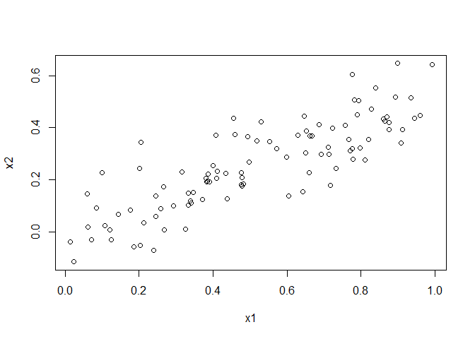

# Exercises

2. Carefully explain the differences between the KNN classifier and KNN regression methods.

KNN (K nearest neighbors) is a nonparametric method which uses surrounding observations to make decisions. In KNN classifer the output is the class which occurs most in the K surrounding neighbors. In KNN regression the output is the average of the K surrounding neighbors. In both cases, when K = 1 the output takes on either the class of value of the closest neighbor.

14. This problem focuses on the collinearity problem.
  
  (a) Perform the following commands in R:


```r
set.seed(1)
x1=runif(100)
x2=0.5*x1+rnorm(100)/10
y=2+2*x1+0.3*x2+rnorm(100)
```

  The last line corresponds to creating a linear model in which y is a function of x1 and x2. Write out the form of the linear model. What are the regression coefficients?

y = 2 + 2*x1 + 0.3*x2 + error
Coefficients for x1 and x2 are 2 and 0.3 respectively.

  (b) What is the correlation between x1 and x2? Create a scatterplot displaying the relationship between the variables.


```r
plot(x1, x2)
```

<!-- -->

```r
cor(x1, x2)
```

```
## [1] 0.8351212
```

  (c) Using this data, fit a least squares regression to predict y using x1 and x2. Describe the results obtained. What are βˆ0, βˆ1, and βˆ2?  How do these relate to the true β0, β1, and β2? Can you reject the null hypothesis H0 : β1 = 0? How about the null hypothesis H0 : β2 = 0?
  

```r
fit <- lm(y ~ x1 + x2)
summary(fit)
```

```
## 
## Call:
## lm(formula = y ~ x1 + x2)
## 
## Residuals:
##     Min      1Q  Median      3Q     Max 
## -2.8311 -0.7273 -0.0537  0.6338  2.3359 
## 
## Coefficients:
##             Estimate Std. Error t value Pr(>|t|)    
## (Intercept)   2.1305     0.2319   9.188 7.61e-15 ***
## x1            1.4396     0.7212   1.996   0.0487 *  
## x2            1.0097     1.1337   0.891   0.3754    
## ---
## Signif. codes:  0 '***' 0.001 '**' 0.01 '*' 0.05 '.' 0.1 ' ' 1
## 
## Residual standard error: 1.056 on 97 degrees of freedom
## Multiple R-squared:  0.2088,	Adjusted R-squared:  0.1925 
## F-statistic:  12.8 on 2 and 97 DF,  p-value: 1.164e-05
```

```r
summary(fit)$coefficients
```

```
##             Estimate Std. Error   t value     Pr(>|t|)
## (Intercept) 2.130500  0.2318817 9.1878742 7.606713e-15
## x1          1.439555  0.7211795 1.9961126 4.872517e-02
## x2          1.009674  1.1337225 0.8905831 3.753565e-01
```

The null hypothesis H0 : β1 = 0 can be rejected, p = .04

The null hypothesis H0 : β2 = 0 cannot be rejected, p = .37

  (d) Now fit a least squares regression to predict y using only x1. Comment on your results. Can you reject the null hypothesis H0 : β1 = 0?
  

```r
fit2 <- lm(y ~ x1)
summary(fit2)
```

```
## 
## Call:
## lm(formula = y ~ x1)
## 
## Residuals:
##      Min       1Q   Median       3Q      Max 
## -2.89495 -0.66874 -0.07785  0.59221  2.45560 
## 
## Coefficients:
##             Estimate Std. Error t value Pr(>|t|)    
## (Intercept)   2.1124     0.2307   9.155 8.27e-15 ***
## x1            1.9759     0.3963   4.986 2.66e-06 ***
## ---
## Signif. codes:  0 '***' 0.001 '**' 0.01 '*' 0.05 '.' 0.1 ' ' 1
## 
## Residual standard error: 1.055 on 98 degrees of freedom
## Multiple R-squared:  0.2024,	Adjusted R-squared:  0.1942 
## F-statistic: 24.86 on 1 and 98 DF,  p-value: 2.661e-06
```

```r
summary(fit2)$coefficients
```

```
##             Estimate Std. Error  t value     Pr(>|t|)
## (Intercept) 2.112394  0.2307448 9.154676 8.269388e-15
## x1          1.975929  0.3962774 4.986227 2.660579e-06
```

the null hypothesis H0 : β1 = 0 can be rejected, p = 2.6e-06

  (e) Now fit a least squares regression to predict y using only x2. Comment on your results. Can you reject the null hypothesis H0 : β1 = 0?
  

```r
fit3 <- lm(y ~ x2)
summary(fit3)
```

```
## 
## Call:
## lm(formula = y ~ x2)
## 
## Residuals:
##      Min       1Q   Median       3Q      Max 
## -2.62687 -0.75156 -0.03598  0.72383  2.44890 
## 
## Coefficients:
##             Estimate Std. Error t value Pr(>|t|)    
## (Intercept)   2.3899     0.1949   12.26  < 2e-16 ***
## x2            2.8996     0.6330    4.58 1.37e-05 ***
## ---
## Signif. codes:  0 '***' 0.001 '**' 0.01 '*' 0.05 '.' 0.1 ' ' 1
## 
## Residual standard error: 1.072 on 98 degrees of freedom
## Multiple R-squared:  0.1763,	Adjusted R-squared:  0.1679 
## F-statistic: 20.98 on 1 and 98 DF,  p-value: 1.366e-05
```

```r
summary(fit3)$coefficients
```

```
##             Estimate Std. Error   t value     Pr(>|t|)
## (Intercept) 2.389949  0.1949307 12.260508 1.682395e-21
## x2          2.899585  0.6330467  4.580365 1.366430e-05
```

The null hypothesis H0 : β1 = 0 can be rejected, p = 1.36e-05

 (f) Do the results obtained in (c)–(e) contradict each other? Explain your answer


```r
library(car)
vif(fit)
```

```
##       x1       x2 
## 3.304993 3.304993
```

In the first fit we cannot reject the null hypothesis H0 : β2 = 0. In the later fits where we only look at one predictor at a time, we can are able to reject the null hypotheis for the coefficient of x2. This suggests the possibility of collinearity. The results from `vif(fit)` suggests that there is some collinearity present.

  (g) Now suppose we obtain one additional observation, which was unfortunately mismeasured.


```r
x1 <- c(x1, 0.1)
x2 <- c(x2, 0.8)
y <- c(y,6)
```

Re-fit the linear models from (c) to (e) using this new data. What effect does this new observation have on the each of the models? In each model, is this observation an outlier? A high-leverage point? Both? Explain your answers.


```r
fit4 <- lm(y ~ x1 + x2)
fit5 <- lm(y ~ x1)
fit6 <- lm(y ~ x2)
summary(fit4)
```

```
## 
## Call:
## lm(formula = y ~ x1 + x2)
## 
## Residuals:
##      Min       1Q   Median       3Q      Max 
## -2.73348 -0.69318 -0.05263  0.66385  2.30619 
## 
## Coefficients:
##             Estimate Std. Error t value Pr(>|t|)    
## (Intercept)   2.2267     0.2314   9.624 7.91e-16 ***
## x1            0.5394     0.5922   0.911  0.36458    
## x2            2.5146     0.8977   2.801  0.00614 ** 
## ---
## Signif. codes:  0 '***' 0.001 '**' 0.01 '*' 0.05 '.' 0.1 ' ' 1
## 
## Residual standard error: 1.075 on 98 degrees of freedom
## Multiple R-squared:  0.2188,	Adjusted R-squared:  0.2029 
## F-statistic: 13.72 on 2 and 98 DF,  p-value: 5.564e-06
```

```r
summary(fit4)$coefficients
```

```
##              Estimate Std. Error   t value     Pr(>|t|)
## (Intercept) 2.2266917  0.2313578 9.6244495 7.909712e-16
## x1          0.5394397  0.5921970 0.9109125 3.645766e-01
## x2          2.5145694  0.8976915 2.8011508 6.135787e-03
```

```r
vif(fit4)
```

```
##       x1       x2 
## 2.204867 2.204867
```

```r
par(mfrow=c(2,2))
plot(fit4)
```

<!-- -->

```r
summary(fit5)
```

```
## 
## Call:
## lm(formula = y ~ x1)
## 
## Residuals:
##     Min      1Q  Median      3Q     Max 
## -2.8897 -0.6556 -0.0909  0.5682  3.5665 
## 
## Coefficients:
##             Estimate Std. Error t value Pr(>|t|)    
## (Intercept)   2.2569     0.2390   9.445 1.78e-15 ***
## x1            1.7657     0.4124   4.282 4.29e-05 ***
## ---
## Signif. codes:  0 '***' 0.001 '**' 0.01 '*' 0.05 '.' 0.1 ' ' 1
## 
## Residual standard error: 1.111 on 99 degrees of freedom
## Multiple R-squared:  0.1562,	Adjusted R-squared:  0.1477 
## F-statistic: 18.33 on 1 and 99 DF,  p-value: 4.295e-05
```

```r
summary(fit5)$coefficients
```

```
##             Estimate Std. Error  t value     Pr(>|t|)
## (Intercept) 2.256927  0.2389635 9.444654 1.780749e-15
## x1          1.765695  0.4123781 4.281739 4.294817e-05
```

```r
par(mfrow=c(2,2))
plot(fit5)
```

<!-- -->

```r
summary(fit6)
```

```
## 
## Call:
## lm(formula = y ~ x2)
## 
## Residuals:
##      Min       1Q   Median       3Q      Max 
## -2.64729 -0.71021 -0.06899  0.72699  2.38074 
## 
## Coefficients:
##             Estimate Std. Error t value Pr(>|t|)    
## (Intercept)   2.3451     0.1912  12.264  < 2e-16 ***
## x2            3.1190     0.6040   5.164 1.25e-06 ***
## ---
## Signif. codes:  0 '***' 0.001 '**' 0.01 '*' 0.05 '.' 0.1 ' ' 1
## 
## Residual standard error: 1.074 on 99 degrees of freedom
## Multiple R-squared:  0.2122,	Adjusted R-squared:  0.2042 
## F-statistic: 26.66 on 1 and 99 DF,  p-value: 1.253e-06
```

```r
summary(fit6)$coefficients
```

```
##             Estimate Std. Error   t value     Pr(>|t|)
## (Intercept) 2.345107  0.1912183 12.264029 1.403060e-21
## x2          3.119050  0.6040352  5.163689 1.253125e-06
```

```r
par(mfrow=c(2,2))
plot(fit6)
```

<!-- -->

With both predictors, the null hypothesis for B1 can no longer be rejected, but B2's can be rejected. Both can reject the null when they are separate though. The amount of collinearity has gone down though. In the first model the point has high leverage. In the second model the point is an outlier. In the last model the point has high leverage.
