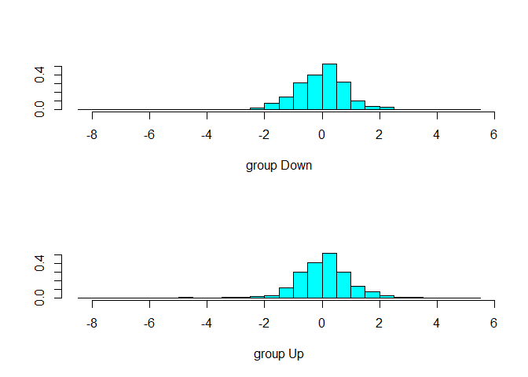
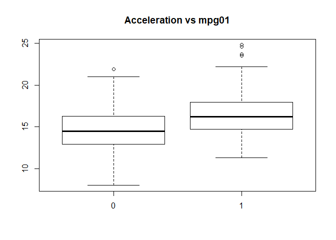

# 4.6 Lab: Logistic Regression, LDA, QDA, and KNN

## 4.6.1 The Stock Market Data


```r
library(ISLR)
names(Smarket)
```

```
## [1] "Year"      "Lag1"      "Lag2"      "Lag3"      "Lag4"      "Lag5"     
## [7] "Volume"    "Today"     "Direction"
```

```r
dim(Smarket)
```

```
## [1] 1250    9
```

```r
summary(Smarket)
```

```
##       Year           Lag1                Lag2          
##  Min.   :2001   Min.   :-4.922000   Min.   :-4.922000  
##  1st Qu.:2002   1st Qu.:-0.639500   1st Qu.:-0.639500  
##  Median :2003   Median : 0.039000   Median : 0.039000  
##  Mean   :2003   Mean   : 0.003834   Mean   : 0.003919  
##  3rd Qu.:2004   3rd Qu.: 0.596750   3rd Qu.: 0.596750  
##  Max.   :2005   Max.   : 5.733000   Max.   : 5.733000  
##       Lag3                Lag4                Lag5         
##  Min.   :-4.922000   Min.   :-4.922000   Min.   :-4.92200  
##  1st Qu.:-0.640000   1st Qu.:-0.640000   1st Qu.:-0.64000  
##  Median : 0.038500   Median : 0.038500   Median : 0.03850  
##  Mean   : 0.001716   Mean   : 0.001636   Mean   : 0.00561  
##  3rd Qu.: 0.596750   3rd Qu.: 0.596750   3rd Qu.: 0.59700  
##  Max.   : 5.733000   Max.   : 5.733000   Max.   : 5.73300  
##      Volume           Today           Direction 
##  Min.   :0.3561   Min.   :-4.922000   Down:602  
##  1st Qu.:1.2574   1st Qu.:-0.639500   Up  :648  
##  Median :1.4229   Median : 0.038500             
##  Mean   :1.4783   Mean   : 0.003138             
##  3rd Qu.:1.6417   3rd Qu.: 0.596750             
##  Max.   :3.1525   Max.   : 5.733000
```

```r
pairs(Smarket)
```

<!-- -->

```r
cor(Smarket)
```

```
## Error in cor(Smarket): 'x' must be numeric
```

```r
cor(Smarket[,-9])
```

```
##              Year         Lag1         Lag2         Lag3         Lag4
## Year   1.00000000  0.029699649  0.030596422  0.033194581  0.035688718
## Lag1   0.02969965  1.000000000 -0.026294328 -0.010803402 -0.002985911
## Lag2   0.03059642 -0.026294328  1.000000000 -0.025896670 -0.010853533
## Lag3   0.03319458 -0.010803402 -0.025896670  1.000000000 -0.024051036
## Lag4   0.03568872 -0.002985911 -0.010853533 -0.024051036  1.000000000
## Lag5   0.02978799 -0.005674606 -0.003557949 -0.018808338 -0.027083641
## Volume 0.53900647  0.040909908 -0.043383215 -0.041823686 -0.048414246
## Today  0.03009523 -0.026155045 -0.010250033 -0.002447647 -0.006899527
##                Lag5      Volume        Today
## Year    0.029787995  0.53900647  0.030095229
## Lag1   -0.005674606  0.04090991 -0.026155045
## Lag2   -0.003557949 -0.04338321 -0.010250033
## Lag3   -0.018808338 -0.04182369 -0.002447647
## Lag4   -0.027083641 -0.04841425 -0.006899527
## Lag5    1.000000000 -0.02200231 -0.034860083
## Volume -0.022002315  1.00000000  0.014591823
## Today  -0.034860083  0.01459182  1.000000000
```

```r
attach(Smarket)
plot(Volume)
```

<!-- -->

## 4.6.2 Logistic Regression


```r
glm.fits <- glm(Direction∼Lag1+Lag2+Lag3+Lag4+Lag5+Volume ,data=Smarket ,family=binomial)
summary(glm.fits)
```

```
## 
## Call:
## glm(formula = Direction ~ Lag1 + Lag2 + Lag3 + Lag4 + Lag5 + 
##     Volume, family = binomial, data = Smarket)
## 
## Deviance Residuals: 
##    Min      1Q  Median      3Q     Max  
## -1.446  -1.203   1.065   1.145   1.326  
## 
## Coefficients:
##              Estimate Std. Error z value Pr(>|z|)
## (Intercept) -0.126000   0.240736  -0.523    0.601
## Lag1        -0.073074   0.050167  -1.457    0.145
## Lag2        -0.042301   0.050086  -0.845    0.398
## Lag3         0.011085   0.049939   0.222    0.824
## Lag4         0.009359   0.049974   0.187    0.851
## Lag5         0.010313   0.049511   0.208    0.835
## Volume       0.135441   0.158360   0.855    0.392
## 
## (Dispersion parameter for binomial family taken to be 1)
## 
##     Null deviance: 1731.2  on 1249  degrees of freedom
## Residual deviance: 1727.6  on 1243  degrees of freedom
## AIC: 1741.6
## 
## Number of Fisher Scoring iterations: 3
```

```r
coef(glm.fits)
```

```
##  (Intercept)         Lag1         Lag2         Lag3         Lag4 
## -0.126000257 -0.073073746 -0.042301344  0.011085108  0.009358938 
##         Lag5       Volume 
##  0.010313068  0.135440659
```

```r
summary(glm.fits)$coef
```

```
##                 Estimate Std. Error    z value  Pr(>|z|)
## (Intercept) -0.126000257 0.24073574 -0.5233966 0.6006983
## Lag1        -0.073073746 0.05016739 -1.4565986 0.1452272
## Lag2        -0.042301344 0.05008605 -0.8445733 0.3983491
## Lag3         0.011085108 0.04993854  0.2219750 0.8243333
## Lag4         0.009358938 0.04997413  0.1872757 0.8514445
## Lag5         0.010313068 0.04951146  0.2082966 0.8349974
## Volume       0.135440659 0.15835970  0.8552723 0.3924004
```

```r
contrasts(Direction)
```

```
##      Up
## Down  0
## Up    1
```

```r
glm.probs <- predict(glm.fits, type="response")
glm.probs[1:10]
```

```
##         1         2         3         4         5         6         7 
## 0.5070841 0.4814679 0.4811388 0.5152224 0.5107812 0.5069565 0.4926509 
##         8         9        10 
## 0.5092292 0.5176135 0.4888378
```

```r
glm.pred <- rep("Down", 1250)
glm.pred[glm.probs >.5] <- "Up"
table(glm.pred, Direction)
```

```
##         Direction
## glm.pred Down  Up
##     Down  145 141
##     Up    457 507
```

```r
mean(glm.pred==Direction)
```

```
## [1] 0.5216
```

```r
train <- Year<2005
Smarket.2005 <- Smarket[!train,]
dim(Smarket.2005)
```

```
## [1] 252   9
```

```r
Direction.2005 <- Direction[!train]
glm.fits <- glm(Direction ∼ Lag1 + Lag2 + Lag3 + Lag4 + Lag5 + Volume, data=Smarket, family=binomial, subset=train)
glm.probs <- predict(glm.fits, Smarket.2005, type="response")
glm.pred <- rep("Down",252)
glm.pred[glm.probs >.5]="Up"
table(glm.pred, Direction.2005)
```

```
##         Direction.2005
## glm.pred Down Up
##     Down   77 97
##     Up     34 44
```

```r
mean(glm.pred==Direction.2005)
```

```
## [1] 0.4801587
```

```r
mean(glm.pred!=Direction.2005)
```

```
## [1] 0.5198413
```

```r
glm.fits <- glm(Direction ∼ Lag1 + Lag2, data=Smarket, family=binomial, subset=train)
glm.probs <- predict(glm.fits,Smarket.2005, type="response")
glm.pred <- rep("Down",252)
glm.pred[glm.probs >.5]="Up"
table(glm.pred ,Direction.2005)
```

```
##         Direction.2005
## glm.pred Down  Up
##     Down   35  35
##     Up     76 106
```

```r
mean(glm.pred==Direction.2005)
```

```
## [1] 0.5595238
```

```r
106/(106+76)
```

```
## [1] 0.5824176
```

```r
predict(glm.fits,newdata=data.frame(Lag1=c(1.2 ,1.5),Lag2=c(1.1,-0.8)), type="response")
```

```
##         1         2 
## 0.4791462 0.4960939
```

## 4.6.3 Linear Discriminant Analysis


```r
library(MASS)
lda.fit <- lda(Direction ~ Lag1 + Lag2, data = Smarket, subset = train)
lda.fit
```

```
## Call:
## lda(Direction ~ Lag1 + Lag2, data = Smarket, subset = train)
## 
## Prior probabilities of groups:
##     Down       Up 
## 0.491984 0.508016 
## 
## Group means:
##             Lag1        Lag2
## Down  0.04279022  0.03389409
## Up   -0.03954635 -0.03132544
## 
## Coefficients of linear discriminants:
##             LD1
## Lag1 -0.6420190
## Lag2 -0.5135293
```

```r
lda.pred <- predict(lda.fit, Smarket.2005)
names(lda.pred)
```

```
## [1] "class"     "posterior" "x"
```

```r
lda.class <- lda.pred$class
table(lda.class, Direction.2005)
```

```
##          Direction.2005
## lda.class Down  Up
##      Down   35  35
##      Up     76 106
```

```r
mean(lda.class==Direction.2005)
```

```
## [1] 0.5595238
```

```r
sum(lda.pred$posterior[,1]>=.5)
```

```
## [1] 70
```

```r
sum(lda.pred$posterior[,1]<.5)
```

```
## [1] 182
```

```r
lda.pred$posterior[1:20,1]
```

```
##       999      1000      1001      1002      1003      1004      1005 
## 0.4901792 0.4792185 0.4668185 0.4740011 0.4927877 0.4938562 0.4951016 
##      1006      1007      1008      1009      1010      1011      1012 
## 0.4872861 0.4907013 0.4844026 0.4906963 0.5119988 0.4895152 0.4706761 
##      1013      1014      1015      1016      1017      1018 
## 0.4744593 0.4799583 0.4935775 0.5030894 0.4978806 0.4886331
```

```r
lda.class[1:20]
```

```
##  [1] Up   Up   Up   Up   Up   Up   Up   Up   Up   Up   Up   Down Up   Up  
## [15] Up   Up   Up   Down Up   Up  
## Levels: Down Up
```

```r
contrasts(lda.pred$class)
```

```
##      Up
## Down  0
## Up    1
```

```r
sum(lda.pred$posterior[,1]>.9)
```

```
## [1] 0
```

## 4.6.4 Quadratic Discriminant Analysis


```r
qda.fit <- qda(Direction ∼ Lag1 + Lag2, data=Smarket, subset=train)
qda.fit
```

```
## Call:
## qda(Direction ~ Lag1 + Lag2, data = Smarket, subset = train)
## 
## Prior probabilities of groups:
##     Down       Up 
## 0.491984 0.508016 
## 
## Group means:
##             Lag1        Lag2
## Down  0.04279022  0.03389409
## Up   -0.03954635 -0.03132544
```

```r
qda.class <- predict(qda.fit, Smarket.2005)$class
table(qda.class, Direction.2005)
```

```
##          Direction.2005
## qda.class Down  Up
##      Down   30  20
##      Up     81 121
```

```r
mean(qda.class==Direction.2005)
```

```
## [1] 0.5992063
```

## 4.6.5 K-Nearest Neighbors


```r
library(class)
train.X <- cbind(Lag1, Lag2)[train,]
test.X <- cbind(Lag1, Lag2)[!train,]
train.Direction <- Direction[train]

set.seed(1)
knn.pred <- knn(train.X, test.X, train.Direction, k=1)
table(knn.pred, Direction.2005)
```

```
##         Direction.2005
## knn.pred Down Up
##     Down   43 58
##     Up     68 83
```

```r
(83+43)/252
```

```
## [1] 0.5
```

```r
knn.pred <- knn(train.X, test.X, train.Direction, k=2)
table(knn.pred, Direction.2005)
```

```
##         Direction.2005
## knn.pred Down Up
##     Down   43 53
##     Up     68 88
```

```r
mean(knn.pred==Direction.2005)
```

```
## [1] 0.5198413
```

## 4.6.6 An Application to Caravan Insurance Data


```r
dim(Caravan)
```

```
## [1] 5822   86
```

```r
attach(Caravan)
summary(Purchase)
```

```
##   No  Yes 
## 5474  348
```

```r
348/5822
```

```
## [1] 0.05977327
```

```r
standardized.X <- scale(Caravan[,-86])
var(Caravan[,1])
```

```
## [1] 165.0378
```

```r
var(Caravan[,2])
```

```
## [1] 0.1647078
```

```r
var(standardized.X[,1])
```

```
## [1] 1
```

```r
var(standardized.X[,2])
```

```
## [1] 1
```

```r
test <- 1:1000
train.X <- standardized.X[-test,]
test.X <- standardized.X[test,]
train.Y <- Purchase[-test]
test.Y <- Purchase[test]
set.seed(1)
knn.pred <- knn(train.X, test.X, train.Y, k=1)
mean(test.Y != knn.pred)
```

```
## [1] 0.118
```

```r
mean(test.Y != "No")
```

```
## [1] 0.059
```

```r
table(knn.pred, test.Y)
```

```
##         test.Y
## knn.pred  No Yes
##      No  873  50
##      Yes  68   9
```

```r
9/(68+9)
```

```
## [1] 0.1168831
```

```r
knn.pred <- knn(train.X, test.X, train.Y, k=3)
table(knn.pred, test.Y)
```

```
##         test.Y
## knn.pred  No Yes
##      No  920  54
##      Yes  21   5
```

```r
5/26
```

```
## [1] 0.1923077
```

```r
knn.pred <- knn(train.X, test.X, train.Y, k=5)
table(knn.pred, test.Y)
```

```
##         test.Y
## knn.pred  No Yes
##      No  930  55
##      Yes  11   4
```

```r
4/15
```

```
## [1] 0.2666667
```

```r
glm.fits <- glm(Purchase ~ ., data = Caravan, family = binomial, subset = -test)
```

```
## Warning: glm.fit: fitted probabilities numerically 0 or 1 occurred
```

```r
glm.probs <- predict(glm.fits,Caravan[test,], type="response")
glm.pred <- rep("No", 1000)
glm.pred[glm.probs > .5] <- "Yes"
table(glm.pred, test.Y)
```

```
##         test.Y
## glm.pred  No Yes
##      No  934  59
##      Yes   7   0
```

```r
glm.pred <- rep("No",1000)
glm.pred[glm.probs > .25] <- "Yes"
table(glm.pred, test.Y)
```

```
##         test.Y
## glm.pred  No Yes
##      No  919  48
##      Yes  22  11
```

```r
11/(22+11)
```

```
## [1] 0.3333333
```

# 4.7 Exercises

### 5. We now examine the differences between LDA and QDA
  (a) If the Bayes decision boundary is linear, do we expect LDA or QDA to perform better on the training set? On the test set?
  
  We expect LDA to do better on the test and QDA may do better on the train
  
  (b) If the Bayes decision boundary is non-linear, do we expect LDA or QDA to perform better on the training set? On the test set?
  
  We expect QDA to do better on both

  (c) In general, as the sample size n increases, do we expect the test prediction accuracy of QDA relative to LDA to improve, decline, or be unchanged? Why?
  
  QDA is expected to go increase in accuracy as sample size increases and variance of the classifiers becomes not a concern.
  
  (d) True or False: Even if the Bayes decision boundary for a given problem is linear, we will probably achieve a superior test error rate using QDA rather than LDA because QDA is flexible enough to model a linear decision boundary. Justify your answer.
  
  False. QDA is too flexible. LDA will do better since the decision boundary is linear.

### 6. Suppose we collect data for a group of students in a statistics class with variables X1 = hours studied, X2 = undergrad GPA, and Y = receive an A. We fit a logistic regression and produce estimated coefficient, βˆ0 = −6, βˆ1 = 0.05, βˆ2 = 1.
  (a) Estimate the probability that a student who studies for 40 h and
has an undergrad GPA of 3.5 gets an A in the class.


```r
e <- exp(1)
(e^(-6 + .05*40 + 1*3.5))/(1+e^(-6 + .05*40 + 1*3.5))
```

```
## [1] 0.3775407
```

(b) How many hours would the student in part (a) need to study to have a 50 % chance of getting an A in the class?
  

```r
# .5 = e^(-6 + .05*x + 1*3.5))/(1+e^(-6 + .05*x + 1*3.5))
# .5 = e^(.05x - 2.5))/(1+e^(.05x - 2.5))
# e^(.05x - 2.5) = 1
# 50 hours
```

### 8. Suppose that we take a data set, divide it into equally-sized training and test sets, and then try out two different classification procedures. First we use logistic regression and get an error rate of 20 % on the training data and 30 % on the test data. Next we use 1-nearest neighbors (i.e. K = 1) and get an average error rate (averaged over both test and training data sets) of 18 %. Based on these results, which method should we prefer to use for classification of new observations? Why?

  Want logistic regression. When using K=1, the training set should have an error of 0%. Since the average error for KNN is 18%, this means that the test error for KNN is 36%. 36% is worse than 30%, therefore we want logisti regression.
  
### 9. This problem has to do with odds.

  (a) On average, what fraction of people with an odds of 0.37 of defaulting on their credit card payment will in fact default?
  

```r
#.37 = (x/1-x)
#.37-.37x = x
#.37 = 1.37x
#.37/1.37 = x
# 37/137 people
37/137
```

```
## [1] 0.270073
```

  (b) Suppose that an individual has a 16 % chance of defaulting on her credit card payment. What are the odds that she will default?
  

```r
.16/(1-.16)
```

```
## [1] 0.1904762
```

### 10. This question should be answered using the Weekly data set, which is part of the ISLR package. This data is similar in nature to the Smarket data from this chapter’s lab, except that it contains 1,089 weekly returns for 21 years, from the beginning of 1990 to the end of 2010.

  (a) Produce some numerical and graphical summaries of the Weekly data. Do there appear to be any patterns?


```r
detach(Smarket)
attach(Weekly)
summary(Weekly)
```

```
##       Year           Lag1               Lag2               Lag3         
##  Min.   :1990   Min.   :-18.1950   Min.   :-18.1950   Min.   :-18.1950  
##  1st Qu.:1995   1st Qu.: -1.1540   1st Qu.: -1.1540   1st Qu.: -1.1580  
##  Median :2000   Median :  0.2410   Median :  0.2410   Median :  0.2410  
##  Mean   :2000   Mean   :  0.1506   Mean   :  0.1511   Mean   :  0.1472  
##  3rd Qu.:2005   3rd Qu.:  1.4050   3rd Qu.:  1.4090   3rd Qu.:  1.4090  
##  Max.   :2010   Max.   : 12.0260   Max.   : 12.0260   Max.   : 12.0260  
##       Lag4               Lag5              Volume       
##  Min.   :-18.1950   Min.   :-18.1950   Min.   :0.08747  
##  1st Qu.: -1.1580   1st Qu.: -1.1660   1st Qu.:0.33202  
##  Median :  0.2380   Median :  0.2340   Median :1.00268  
##  Mean   :  0.1458   Mean   :  0.1399   Mean   :1.57462  
##  3rd Qu.:  1.4090   3rd Qu.:  1.4050   3rd Qu.:2.05373  
##  Max.   : 12.0260   Max.   : 12.0260   Max.   :9.32821  
##      Today          Direction 
##  Min.   :-18.1950   Down:484  
##  1st Qu.: -1.1540   Up  :605  
##  Median :  0.2410             
##  Mean   :  0.1499             
##  3rd Qu.:  1.4050             
##  Max.   : 12.0260
```

```r
cor(Weekly[, -9])
```

```
##               Year         Lag1        Lag2        Lag3         Lag4
## Year    1.00000000 -0.032289274 -0.03339001 -0.03000649 -0.031127923
## Lag1   -0.03228927  1.000000000 -0.07485305  0.05863568 -0.071273876
## Lag2   -0.03339001 -0.074853051  1.00000000 -0.07572091  0.058381535
## Lag3   -0.03000649  0.058635682 -0.07572091  1.00000000 -0.075395865
## Lag4   -0.03112792 -0.071273876  0.05838153 -0.07539587  1.000000000
## Lag5   -0.03051910 -0.008183096 -0.07249948  0.06065717 -0.075675027
## Volume  0.84194162 -0.064951313 -0.08551314 -0.06928771 -0.061074617
## Today  -0.03245989 -0.075031842  0.05916672 -0.07124364 -0.007825873
##                Lag5      Volume        Today
## Year   -0.030519101  0.84194162 -0.032459894
## Lag1   -0.008183096 -0.06495131 -0.075031842
## Lag2   -0.072499482 -0.08551314  0.059166717
## Lag3    0.060657175 -0.06928771 -0.071243639
## Lag4   -0.075675027 -0.06107462 -0.007825873
## Lag5    1.000000000 -0.05851741  0.011012698
## Volume -0.058517414  1.00000000 -0.033077783
## Today   0.011012698 -0.03307778  1.000000000
```

```r
plot(Weekly)
```

<!-- -->
  Volume and year look related
  
  (b) Use the full data set to perform a logistic regression with Direction as the response and the five lag variables plus Volume as predictors. Use the summary function to print the results. Do any of the predictors appear to be statistically significant? If so,which ones?

```r
glm.fits=glm(Direction∼Lag1+Lag2+Lag3+Lag4+Lag5+Volume, data=Weekly ,family=binomial)
summary(glm.fits)
```

```
## 
## Call:
## glm(formula = Direction ~ Lag1 + Lag2 + Lag3 + Lag4 + Lag5 + 
##     Volume, family = binomial, data = Weekly)
## 
## Deviance Residuals: 
##     Min       1Q   Median       3Q      Max  
## -1.6949  -1.2565   0.9913   1.0849   1.4579  
## 
## Coefficients:
##             Estimate Std. Error z value Pr(>|z|)   
## (Intercept)  0.26686    0.08593   3.106   0.0019 **
## Lag1        -0.04127    0.02641  -1.563   0.1181   
## Lag2         0.05844    0.02686   2.175   0.0296 * 
## Lag3        -0.01606    0.02666  -0.602   0.5469   
## Lag4        -0.02779    0.02646  -1.050   0.2937   
## Lag5        -0.01447    0.02638  -0.549   0.5833   
## Volume      -0.02274    0.03690  -0.616   0.5377   
## ---
## Signif. codes:  0 '***' 0.001 '**' 0.01 '*' 0.05 '.' 0.1 ' ' 1
## 
## (Dispersion parameter for binomial family taken to be 1)
## 
##     Null deviance: 1496.2  on 1088  degrees of freedom
## Residual deviance: 1486.4  on 1082  degrees of freedom
## AIC: 1500.4
## 
## Number of Fisher Scoring iterations: 4
```
  Lag2 appears to be statistically significant

  (c) Compute the confusion matrix and overall fraction of correct predictions. Explain what the confusion matrix is telling you about the types of mistakes made by logistic regression.

```r
dim(Weekly)
```

```
## [1] 1089    9
```

```r
glm.probs=predict(glm.fits,type="response")
glm.pred=rep("Down" ,1089)
glm.pred[glm.probs >.5]=" Up"
table(glm.pred ,Direction)
```

```
##         Direction
## glm.pred Down  Up
##      Up   430 557
##     Down   54  48
```

```r
#Training error rate
(557+54)/1089
```

```
## [1] 0.5610652
```

```r
# Error rate when predicting up
557/(557+430)
```

```
## [1] 0.5643364
```

```r
54/(54+48)
```

```
## [1] 0.5294118
```
  The model is poor at making predictions when the using the training set. Training error of about 43% which is high.
  
  (d) Now fit the logistic regression model using a training data period from 1990 to 2008, with Lag2 as the only predictor. Compute the confusion matrix and the overall fraction of correct predictions for the held out data (that is, the data from 2009 and 2010).


```r
train <- (Year < 2009)
Weekly2 <- Weekly[!train,]
dim(Weekly2)
```

```
## [1] 104   9
```

```r
Direction2=Direction[!train]

glm.fits=glm(Direction ∼ Lag2, data=Weekly ,family=binomial ,subset=train)

glm.probs=predict(glm.fits,Weekly2, type="response")
glm.pred=rep("Down",length(glm.probs))
glm.pred[glm.probs >.5]=" Up"
table(glm.pred ,Direction2)
```

```
##         Direction2
## glm.pred Down Up
##      Up    34 56
##     Down    9  5
```

```r
mean(glm.pred != Direction2)
```

```
## [1] 0.9134615
```

```r
(56+9)/104
```

```
## [1] 0.625
```

```r
56/(34+56)
```

```
## [1] 0.6222222
```
  The model has a test error rate of 37.5%

  (e) Repeat (d) using LDA.
  

```r
lda.fit <- lda(Direction ~ Lag2, data = Weekly, subset = train)
plot(lda.fit)
```

<!-- -->

```r
lda.pred <- predict(lda.fit , Weekly2)
names(lda.pred)
```

```
## [1] "class"     "posterior" "x"
```

```r
lda.class <- lda.pred$class
table(lda.class, Direction2)
```

```
##          Direction2
## lda.class Down Up
##      Down    9  5
##      Up     34 56
```

```r
mean(lda.class!=Direction2)
```

```
## [1] 0.375
```

  (f) Repeat (d) using QDA.
  

```r
qda.fit <- qda(Direction ~ Lag2, data = Weekly, subset = train)
qda.pred <- predict(qda.fit , Weekly2)
names(qda.pred)
```

```
## [1] "class"     "posterior"
```

```r
qda.class <- qda.pred$class
table(qda.class, Direction2)
```

```
##          Direction2
## qda.class Down Up
##      Down    0  0
##      Up     43 61
```

```r
mean(qda.class!=Direction2)
```

```
## [1] 0.4134615
```

  (g) Repeat (d) using KNN with K = 1
  

```r
train.X <- matrix(Weekly[train,]$Lag2)
test.X <- matrix(Weekly[!train,]$Lag2)
train.Direction <- Direction[train]

set.seed(1)
knn.pred <- knn(train.X, test.X, train.Direction, k=1)
table(knn.pred, Direction2)
```

```
##         Direction2
## knn.pred Down Up
##     Down   21 30
##     Up     22 31
```

```r
mean(knn.pred != Direction2)
```

```
## [1] 0.5
```

  (h) Which of these methods appears to provide the best results on this data?

  Logistic regression and LDA perform the best with the lowest test error. Next is QDA followed by knn.
  
  (i) Experiment with different combinations of predictors, including possible transformations and interactions, for each of the methods. Report the variables, method, and associated confusion matrix that appears to provide the best results on the held out data. Note that you should also experiment with values for K in the KNN classifier.
  

```r
set.seed(1)
knn.pred <- knn(train.X, test.X, train.Direction, k=3)
table(knn.pred, Direction2)
```

```
##         Direction2
## knn.pred Down Up
##     Down   16 20
##     Up     27 41
```

```r
mean(knn.pred != Direction2)
```

```
## [1] 0.4519231
```

```r
set.seed(1)
knn.pred <- knn(train.X, test.X, train.Direction, k=5)
table(knn.pred, Direction2)
```

```
##         Direction2
## knn.pred Down Up
##     Down   16 21
##     Up     27 40
```

```r
mean(knn.pred != Direction2)
```

```
## [1] 0.4615385
```

  KNN does not appear to improve too much.
  
### 11. In this problem, you will develop a model to predict whether a given car gets high or low gas mileage based on the Auto data set.

  (a) Create a binary variable, mpg01, that contains a 1 if mpg contains a value above its median, and a 0 if mpg contains a value below its median. You can compute the median using the median() function. Note you may find it helpful to use the data.frame() function to create a single data set containing both mpg01 and the other Auto variables.
  

```r
attach(Auto)
mpg01 <- rep(0, length(mpg))
mpg01[mpg > median(mpg)] <- 1
Auto2 <- data.frame(Auto, mpg01)
```

  (b) Explore the data graphically in order to investigate the association between mpg01 and the other features. Which of the other features seem most likely to be useful in predicting mpg01? Scatterplots and boxplots may be useful tools to answer this question. Describe your findings.


```r
cor(Auto2[, -9])
```

```
##                     mpg  cylinders displacement horsepower     weight
## mpg           1.0000000 -0.7776175   -0.8051269 -0.7784268 -0.8322442
## cylinders    -0.7776175  1.0000000    0.9508233  0.8429834  0.8975273
## displacement -0.8051269  0.9508233    1.0000000  0.8972570  0.9329944
## horsepower   -0.7784268  0.8429834    0.8972570  1.0000000  0.8645377
## weight       -0.8322442  0.8975273    0.9329944  0.8645377  1.0000000
## acceleration  0.4233285 -0.5046834   -0.5438005 -0.6891955 -0.4168392
## year          0.5805410 -0.3456474   -0.3698552 -0.4163615 -0.3091199
## origin        0.5652088 -0.5689316   -0.6145351 -0.4551715 -0.5850054
## mpg01         0.8369392 -0.7591939   -0.7534766 -0.6670526 -0.7577566
##              acceleration       year     origin      mpg01
## mpg             0.4233285  0.5805410  0.5652088  0.8369392
## cylinders      -0.5046834 -0.3456474 -0.5689316 -0.7591939
## displacement   -0.5438005 -0.3698552 -0.6145351 -0.7534766
## horsepower     -0.6891955 -0.4163615 -0.4551715 -0.6670526
## weight         -0.4168392 -0.3091199 -0.5850054 -0.7577566
## acceleration    1.0000000  0.2903161  0.2127458  0.3468215
## year            0.2903161  1.0000000  0.1815277  0.4299042
## origin          0.2127458  0.1815277  1.0000000  0.5136984
## mpg01           0.3468215  0.4299042  0.5136984  1.0000000
```

```r
plot(Auto2)
```

<!-- -->

```r
plot(Auto2$mpg01, Auto2$acceleration)
```

<!-- -->

```r
plot(Auto2$mpg01, Auto2$horsepower)
```

<!-- -->

```r
plot(Auto2$mpg01, Auto2$weight)
```

<!-- -->

```r
boxplot(year ~ mpg01, data = Auto, main = "Year vs mpg01")
```

<!-- -->

```r
boxplot(displacement ~ mpg01, data = Auto, main = "Displacement vs mpg01")
```

<!-- -->

```r
boxplot(cylinders ~ mpg01, data = Auto, main = "Cylinders vs mpg01")
```

<!-- -->

```r
boxplot(acceleration ~ mpg01, data = Auto, main = "Acceleration vs mpg01")
```

<!-- -->
  Based on the plots, it appears there is a relationship between mpp01 and weight, displacement, horsepower, ang cylinders.
  
  (c) Split the data into a training set and a test set
  

```r
summary(Auto2)
```

```
##       mpg          cylinders      displacement     horsepower   
##  Min.   : 9.00   Min.   :3.000   Min.   : 68.0   Min.   : 46.0  
##  1st Qu.:17.00   1st Qu.:4.000   1st Qu.:105.0   1st Qu.: 75.0  
##  Median :22.75   Median :4.000   Median :151.0   Median : 93.5  
##  Mean   :23.45   Mean   :5.472   Mean   :194.4   Mean   :104.5  
##  3rd Qu.:29.00   3rd Qu.:8.000   3rd Qu.:275.8   3rd Qu.:126.0  
##  Max.   :46.60   Max.   :8.000   Max.   :455.0   Max.   :230.0  
##                                                                 
##      weight      acceleration        year           origin     
##  Min.   :1613   Min.   : 8.00   Min.   :70.00   Min.   :1.000  
##  1st Qu.:2225   1st Qu.:13.78   1st Qu.:73.00   1st Qu.:1.000  
##  Median :2804   Median :15.50   Median :76.00   Median :1.000  
##  Mean   :2978   Mean   :15.54   Mean   :75.98   Mean   :1.577  
##  3rd Qu.:3615   3rd Qu.:17.02   3rd Qu.:79.00   3rd Qu.:2.000  
##  Max.   :5140   Max.   :24.80   Max.   :82.00   Max.   :3.000  
##                                                                
##                  name         mpg01    
##  amc matador       :  5   Min.   :0.0  
##  ford pinto        :  5   1st Qu.:0.0  
##  toyota corolla    :  5   Median :0.5  
##  amc gremlin       :  4   Mean   :0.5  
##  amc hornet        :  4   3rd Qu.:1.0  
##  chevrolet chevette:  4   Max.   :1.0  
##  (Other)           :365
```

```r
spliter <- rep(c(T,F),196)
train <- Auto2[spliter,]
test <- Auto2[!spliter,]
```

  (d) Perform LDA on the training data in order to predict mpg01 using the variables that seemed most associated with mpg01 in (b). What is the test error of the model obtained?
  

```r
lda.fit <- lda(mpg01 ~ weight + displacement + horsepower + cylinders, data = train)
plot(lda.fit)
```

<!-- -->

```r
lda.pred <- predict(lda.fit , test)
names(lda.pred)
```

```
## [1] "class"     "posterior" "x"
```

```r
lda.class <- lda.pred$class
table(lda.class, test$mpg01)
```

```
##          
## lda.class  0  1
##         0 83  5
##         1 13 95
```

```r
mean(lda.class != test$mpg01)
```

```
## [1] 0.09183673
```

  (e) Perform QDA on the training data in order to predict mpg01 using the variables that seemed most associated with mpg01 in (b). What is the test error of the model obtained?
  

```r
qda.fit <- qda(mpg01 ~ weight + displacement + horsepower + cylinders, data = train)
qda.pred <- predict(qda.fit , test)
names(qda.pred)
```

```
## [1] "class"     "posterior"
```

```r
qda.class <- qda.pred$class
table(qda.class, test$mpg01)
```

```
##          
## qda.class  0  1
##         0 84 10
##         1 12 90
```

```r
mean(qda.class != test$mpg01)
```

```
## [1] 0.1122449
```

  (f) Perform logistic regression on the training data in order to predict mpg01 using the variables that seemed most associated with mpg01 in (b). What is the test error of the model obtained?
  

```r
glm.fits=glm(mpg01 ∼ horsepower + cylinders + weight + displacement, data=train, family=binomial)
summary(glm.fits)
```

```
## 
## Call:
## glm(formula = mpg01 ~ horsepower + cylinders + weight + displacement, 
##     family = binomial, data = train)
## 
## Deviance Residuals: 
##     Min       1Q   Median       3Q      Max  
## -2.4158  -0.2776  -0.0027   0.4221   3.4108  
## 
## Coefficients:
##                Estimate Std. Error z value Pr(>|z|)    
## (Intercept)   9.8858042  2.4469111   4.040 5.34e-05 ***
## horsepower   -0.0411509  0.0205477  -2.003   0.0452 *  
## cylinders     0.0903466  0.5022001   0.180   0.8572    
## weight       -0.0009933  0.0011167  -0.889   0.3737    
## displacement -0.0211561  0.0130344  -1.623   0.1046    
## ---
## Signif. codes:  0 '***' 0.001 '**' 0.01 '*' 0.05 '.' 0.1 ' ' 1
## 
## (Dispersion parameter for binomial family taken to be 1)
## 
##     Null deviance: 271.63  on 195  degrees of freedom
## Residual deviance: 108.67  on 191  degrees of freedom
## AIC: 118.67
## 
## Number of Fisher Scoring iterations: 7
```

```r
glm.probs=predict(glm.fits,test, type="response")
glm.pred=rep(0,length(glm.probs))
glm.pred[glm.probs >.5]= 1
table(glm.pred, test$mpg01)
```

```
##         
## glm.pred  0  1
##        0 81  9
##        1 15 91
```

```r
(81+91)/196
```

```
## [1] 0.877551
```

```r
1 - .88
```

```
## [1] 0.12
```
  There is a test error rate of ~ 12%
  
  (g) Perform KNN on the training data, with several values of K, in order to predict mpg01. Use only the variables that seemed most associated with mpg01 in (b). What test errors do you obtain? Which value of K seems to perform the best on this data set?
  

```r
train.X <- subset(train, select = c("horsepower", "cylinders", "weight", "displacement"))
test.X <- subset(test, select = c("horsepower", "cylinders", "weight", "displacement"))
train.mpg01 <- train$mpg01
test.mpg01 <- test$mpg01

set.seed(1)
knn.pred <- knn(train.X, test.X, train.mpg01, k=1)
table(knn.pred, test.mpg01)
```

```
##         test.mpg01
## knn.pred  0  1
##        0 82 11
##        1 14 89
```

```r
mean(knn.pred != test.mpg01)
```

```
## [1] 0.127551
```

```r
set.seed(1)
knn.pred <- knn(train.X, test.X, train.mpg01, k=3)
table(knn.pred, test.mpg01)
```

```
##         test.mpg01
## knn.pred  0  1
##        0 82  7
##        1 14 93
```

```r
mean(knn.pred != test.mpg01)
```

```
## [1] 0.1071429
```

```r
set.seed(1)
knn.pred <- knn(train.X, test.X, train.mpg01, k=5)
table(knn.pred, test.mpg01)
```

```
##         test.mpg01
## knn.pred  0  1
##        0 83  9
##        1 13 91
```

```r
mean(knn.pred != test.mpg01)
```

```
## [1] 0.1122449
```

```r
set.seed(1)
knn.pred <- knn(train.X, test.X, train.mpg01, k=10)
table(knn.pred, test.mpg01)
```

```
##         test.mpg01
## knn.pred  0  1
##        0 82  7
##        1 14 93
```

```r
mean(knn.pred != test.mpg01)
```

```
## [1] 0.1071429
```

K of 3 performs well

### 13. Using the Boston data set, fit classification models in order to predict whether a given suburb has a crime rate above or below the median. Explore logistic regression, LDA, and KNN models using various subsets of the predictors. Describe your findings.


```r
detach(Weekly)
attach(Boston)
med.crim <- median(crim)
names(Boston)
```

```
##  [1] "crim"    "zn"      "indus"   "chas"    "nox"     "rm"      "age"    
##  [8] "dis"     "rad"     "tax"     "ptratio" "black"   "lstat"   "medv"
```

```r
Boston$crim[crim > med.crim] <- "Up"
Boston$crim[crim <= med.crim] <- "Down"
Boston$crim <- as.factor(Boston$crim)

splitter <- rep(c(T,F), length(Boston$crim)/2)
train <- Boston[splitter,]
test <- Boston[!splitter,]

### Logistic
glm.fits <- glm(crim ~ ., data=train, family=binomial)
glm.probs=predict(glm.fits,test, type="response")
glm.pred=rep("Down",length(glm.probs))
glm.pred[glm.probs > med.crim]="Up"
table(glm.pred , test$crim)
```

```
##         
## glm.pred Down  Up
##     Down  102   4
##     Up     26 121
```

```r
mean(glm.pred != test$crim)
```

```
## [1] 0.1185771
```

```r
### LDA
lda.fit <- lda(crim ~ ., data = train)
plot(lda.fit)
```

<!-- -->

```r
lda.pred <- predict(lda.fit , test)
names(lda.pred)
```

```
## [1] "class"     "posterior" "x"
```

```r
lda.class <- lda.pred$class
table(lda.class, test$crim)
```

```
##          
## lda.class Down  Up
##      Down  124  28
##      Up      4  97
```

```r
mean(lda.class != test$crim)
```

```
## [1] 0.1264822
```

```r
### KNN
train.X <- train
test.X <- test
train.crim <- train$crim
test.crim <- test$crim

set.seed(1)
knn.pred <- knn(train[,-1], test[,-1], train$crim, k=1)
table(knn.pred, test.crim)
```

```
##         test.crim
## knn.pred Down  Up
##     Down  116  10
##     Up     12 115
```

```r
mean(knn.pred != test.crim)
```

```
## [1] 0.08695652
```

```r
set.seed(1)
knn.pred <- knn(train[,-1], test[,-1], train$crim, k=3)
table(knn.pred, test.crim)
```

```
##         test.crim
## knn.pred Down  Up
##     Down  116  11
##     Up     12 114
```

```r
mean(knn.pred != test.crim)
```

```
## [1] 0.09090909
```

```r
set.seed(1)
knn.pred <- knn(train[,-1], test[,-1], train$crim, k=5)
table(knn.pred, test.crim)
```

```
##         test.crim
## knn.pred Down  Up
##     Down  116  10
##     Up     12 115
```

```r
mean(knn.pred != test.crim)
```

```
## [1] 0.08695652
```

```r
set.seed(1)
knn.pred <- knn(train[,-1], test[,-1], train$crim, k=10)
table(knn.pred, test.crim)
```

```
##         test.crim
## knn.pred Down  Up
##     Down  114  12
##     Up     14 113
```

```r
mean(knn.pred != test.crim)
```

```
## [1] 0.1027668
```

