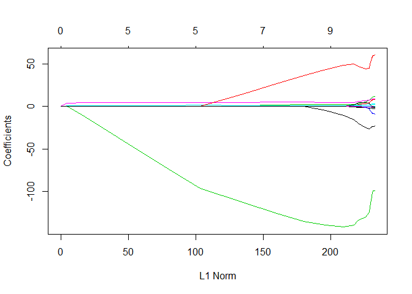
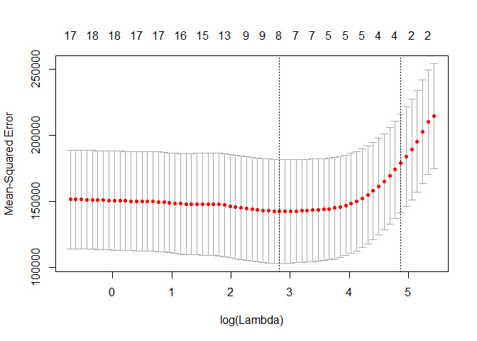

# 6.5.3 Choosing Among Models Using the Validation Set Approach and Cross-Validation


```r
library(ISLR)
library(leaps)
set.seed(1)
train <- sample(c(TRUE ,FALSE), nrow(Hitters),rep=TRUE)
test <- (!train)
regfit.best <- regsubsets(Salary ~ ., data=Hitters[train ,], nvmax=19)
test.mat <- model.matrix(Salary ~ ., data=Hitters [test ,])
val.errors <- rep(NA ,19)
for(i in 1:19){
  coefi <- coef(regfit.best, id=i)
  pred <- test.mat[,names(coefi)]%*%coefi
  val.errors[i] <- mean((na.omit(Hitters$Salary[test])-pred)^2)
}
val.errors
```

```
##  [1] 177714.2 157356.6 160619.2 164844.5 170205.2 162479.9 158430.2
##  [8] 152513.2 148932.0 143826.0 145388.6 147788.5 146810.4 149616.9
## [15] 144581.8 144993.9 146223.4 147094.8 148049.5
```

```r
which.min(val.errors)
```

```
## [1] 10
```

```r
coef(regfit.best ,10)
```

```
## (Intercept)       AtBat        Hits         RBI       Walks      CAtBat 
##  49.2616887  -1.7944396   5.5904675   2.7758087   3.9920711  -0.1752612 
##       CRuns      CWalks     LeagueN   DivisionW     PutOuts 
##   2.4302087  -0.7127743 114.1320379 -60.4814139   0.1600569
```

```r
predict.regsubsets <- function(object, newdata, id, ...){
  form <- as.formula(object$call[[2]])
  mat <- model.matrix(form, newdata)
  coefi <- coef(object, id=id)
  xvars <- names(coefi)
  mat[,xvars]%*%coefi
}

regfit.best <- regsubsets(Salary ~ .,data=Hitters ,nvmax=19)
coef(regfit.best, 10)
```

```
##  (Intercept)        AtBat         Hits        Walks       CAtBat 
##  162.5354420   -2.1686501    6.9180175    5.7732246   -0.1300798 
##        CRuns         CRBI       CWalks    DivisionW      PutOuts 
##    1.4082490    0.7743122   -0.8308264 -112.3800575    0.2973726 
##      Assists 
##    0.2831680
```

```r
k=10
set.seed(1)
folds <- sample(1:k, nrow(Hitters), replace=TRUE)
cv.errors <- matrix(NA,k,19, dimnames=list(NULL, paste(1:19)))

for(j in 1:k){
   best.fit <- regsubsets(Salary ~ ., data=Hitters[folds!=j,], nvmax=19)
    for(i in 1:19){
       pred <- predict(best.fit, Hitters[folds==j,], id=i)
      cv.errors[j,i] <- mean((na.omit(Hitters$Salary[folds==j])-pred)^2)
    }
}

mean.cv.errors <- apply(cv.errors, 2, mean)
mean.cv.errors
```

```
##        1        2        3        4        5        6        7        8 
## 152348.9 136702.2 136342.8 145399.3 136879.8 134925.7 132239.1 126518.4 
##        9       10       11       12       13       14       15       16 
## 124400.6 116020.4 119007.5 124923.1 122364.4 123022.7 122929.8 122133.3 
##       17       18       19 
## 122127.7 122155.8 122295.9
```

```r
par(mfrow=c(1,1))
plot(mean.cv.errors, type='b')
```

<!-- -->

```r
reg.best <- regsubsets(Salary ~ ., data=Hitters, nvmax=19)
coef(reg.best, 10)
```

```
##  (Intercept)        AtBat         Hits        Walks       CAtBat 
##  162.5354420   -2.1686501    6.9180175    5.7732246   -0.1300798 
##        CRuns         CRBI       CWalks    DivisionW      PutOuts 
##    1.4082490    0.7743122   -0.8308264 -112.3800575    0.2973726 
##      Assists 
##    0.2831680
```

# 6.6 Lab 2: Ridge Regression and the Lasso
## 6.6.1 Ridge Regression


```r
library(glmnet)
```

```
## Loading required package: Matrix
```

```
## Loading required package: foreach
```

```
## Loaded glmnet 2.0-13
```

```r
x <- model.matrix(Salary ~ ., Hitters)[,-1]
y <- na.omit(Hitters$Salary)
grid <- 10^seq(10, -2, length =100)
ridge.mod <- glmnet(x, y, alpha=0, lambda=grid)
dim(coef(ridge.mod))
```

```
## [1]  20 100
```

```r
ridge.mod$lambda[50]
```

```
## [1] 11497.57
```

```r
coef(ridge.mod)[,50]
```

```
##   (Intercept)         AtBat          Hits         HmRun          Runs 
## 407.356050200   0.036957182   0.138180344   0.524629976   0.230701523 
##           RBI         Walks         Years        CAtBat         CHits 
##   0.239841459   0.289618741   1.107702929   0.003131815   0.011653637 
##        CHmRun         CRuns          CRBI        CWalks       LeagueN 
##   0.087545670   0.023379882   0.024138320   0.025015421   0.085028114 
##     DivisionW       PutOuts       Assists        Errors    NewLeagueN 
##  -6.215440973   0.016482577   0.002612988  -0.020502690   0.301433531
```

```r
sqrt(sum(coef(ridge.mod)[-1,50]^2))
```

```
## [1] 6.360612
```

```r
ridge.mod$lambda[60]
```

```
## [1] 705.4802
```

```r
coef(ridge.mod)[,60]
```

```
##  (Intercept)        AtBat         Hits        HmRun         Runs 
##  54.32519950   0.11211115   0.65622409   1.17980910   0.93769713 
##          RBI        Walks        Years       CAtBat        CHits 
##   0.84718546   1.31987948   2.59640425   0.01083413   0.04674557 
##       CHmRun        CRuns         CRBI       CWalks      LeagueN 
##   0.33777318   0.09355528   0.09780402   0.07189612  13.68370191 
##    DivisionW      PutOuts      Assists       Errors   NewLeagueN 
## -54.65877750   0.11852289   0.01606037  -0.70358655   8.61181213
```

```r
sqrt(sum(coef(ridge.mod)[-1,60]^2))
```

```
## [1] 57.11001
```

```r
predict(ridge.mod, s=50, type="coefficients")[1:20,]
```

```
##   (Intercept)         AtBat          Hits         HmRun          Runs 
##  4.876610e+01 -3.580999e-01  1.969359e+00 -1.278248e+00  1.145892e+00 
##           RBI         Walks         Years        CAtBat         CHits 
##  8.038292e-01  2.716186e+00 -6.218319e+00  5.447837e-03  1.064895e-01 
##        CHmRun         CRuns          CRBI        CWalks       LeagueN 
##  6.244860e-01  2.214985e-01  2.186914e-01 -1.500245e-01  4.592589e+01 
##     DivisionW       PutOuts       Assists        Errors    NewLeagueN 
## -1.182011e+02  2.502322e-01  1.215665e-01 -3.278600e+00 -9.496680e+00
```

```r
set.seed(1)
train <- sample(1:nrow(x),nrow(x)/2)
test <- (-train)
y.test <- y[test]

ridge.mod <- glmnet(x[train,], y[train], alpha=0, lambda=grid, thresh=1e-12)
ridge.pred <- predict(ridge.mod, s=4, newx=x[test,])
mean((ridge.pred-y.test)^2)
```

```
## [1] 101036.8
```

```r
mean((mean(y[train])-y.test)^2)
```

```
## [1] 193253.1
```

```r
ridge.pred <- predict(ridge.mod, s=1e10, newx=x[test,])
mean((ridge.pred-y.test)^2)
```

```
## [1] 193253.1
```

```r
ridge.pred <- predict(ridge.mod, s=0, newx=x[test,], exact = T, x=x[train,], y=y[train])
mean((ridge.pred-y.test)^2)
```

```
## [1] 114783.1
```

```r
lm(y ~ x, subset=train)
```

```
## 
## Call:
## lm(formula = y ~ x, subset = train)
## 
## Coefficients:
## (Intercept)       xAtBat        xHits       xHmRun        xRuns  
##   299.42849     -2.54027      8.36682     11.64512     -9.09923  
##        xRBI       xWalks       xYears      xCAtBat       xCHits  
##     2.44105      9.23440    -22.93673     -0.18154     -0.11598  
##     xCHmRun       xCRuns        xCRBI      xCWalks     xLeagueN  
##    -1.33888      3.32838      0.07536     -1.07841     59.76065  
##  xDivisionW     xPutOuts     xAssists      xErrors  xNewLeagueN  
##   -98.86233      0.34087      0.34165     -0.64207     -0.67442
```

```r
predict(ridge.mod, s=0, exact=T, type="coefficients", x=x[train,], y=y[train])[1:20,]
```

```
##  (Intercept)        AtBat         Hits        HmRun         Runs 
## 299.42883596  -2.54014665   8.36611719  11.64400720  -9.09877719 
##          RBI        Walks        Years       CAtBat        CHits 
##   2.44152119   9.23403909 -22.93584442  -0.18160843  -0.11561496 
##       CHmRun        CRuns         CRBI       CWalks      LeagueN 
##  -1.33836534   3.32817777   0.07511771  -1.07828647  59.76529059 
##    DivisionW      PutOuts      Assists       Errors   NewLeagueN 
## -98.85996590   0.34086400   0.34165605  -0.64205839  -0.67606314
```

```r
set.seed(1)
cv.out <- cv.glmnet(x[train,], y[train], alpha=0)
plot(cv.out)
```

<!-- -->

```r
bestlam <- cv.out$lambda.min
bestlam
```

```
## [1] 211.7416
```

```r
ridge.pred <- predict(ridge.mod, s=bestlam, newx=x[test,])
mean((ridge.pred - y.test)^2)
```

```
## [1] 96015.51
```

```r
out <- glmnet(x, y, alpha=0)
predict(out, type="coefficients", s=bestlam)[1:20,]
```

```
##  (Intercept)        AtBat         Hits        HmRun         Runs 
##   9.88487157   0.03143991   1.00882875   0.13927624   1.11320781 
##          RBI        Walks        Years       CAtBat        CHits 
##   0.87318990   1.80410229   0.13074381   0.01113978   0.06489843 
##       CHmRun        CRuns         CRBI       CWalks      LeagueN 
##   0.45158546   0.12900049   0.13737712   0.02908572  27.18227535 
##    DivisionW      PutOuts      Assists       Errors   NewLeagueN 
## -91.63411299   0.19149252   0.04254536  -1.81244470   7.21208390
```

## 6.6.2 The Lasso


```r
lasso.mod <- glmnet(x[train,], y[train], alpha=1, lambda=grid)
plot(lasso.mod)
```

<!-- -->

```r
set.seed(1)
cv.out <- cv.glmnet(x[train,], y[train], alpha=1)
plot(cv.out)
```

<!-- -->

```r
bestlam <- cv.out$lambda.min
lasso.pred <- predict(lasso.mod, s=bestlam, newx=x[test,])
mean((lasso.pred - y.test)^2)
```

```
## [1] 100743.4
```

```r
out <- glmnet(x, y, alpha=1, lambda=grid)
lasso.coef <- predict(out, type="coefficients", s= bestlam)[1:20,]
lasso.coef
```

```
##  (Intercept)        AtBat         Hits        HmRun         Runs 
##   18.5394844    0.0000000    1.8735390    0.0000000    0.0000000 
##          RBI        Walks        Years       CAtBat        CHits 
##    0.0000000    2.2178444    0.0000000    0.0000000    0.0000000 
##       CHmRun        CRuns         CRBI       CWalks      LeagueN 
##    0.0000000    0.2071252    0.4130132    0.0000000    3.2666677 
##    DivisionW      PutOuts      Assists       Errors   NewLeagueN 
## -103.4845458    0.2204284    0.0000000    0.0000000    0.0000000
```

# 6.7 Lab 3: PCR and PLS Regression
## 6.7.1 Principal Components Regression


```r
library(pls)
```

```
## 
## Attaching package: 'pls'
```

```
## The following object is masked from 'package:stats':
## 
##     loadings
```

```r
set.seed(2)
pcr.fit <- pcr(Salary ~ ., data=Hitters, scale=TRUE, validation ="CV")

summary(pcr.fit)
```

```
## Data: 	X dimension: 263 19 
## 	Y dimension: 263 1
## Fit method: svdpc
## Number of components considered: 19
## 
## VALIDATION: RMSEP
## Cross-validated using 10 random segments.
##        (Intercept)  1 comps  2 comps  3 comps  4 comps  5 comps  6 comps
## CV             452    348.9    352.2    353.5    352.8    350.1    349.1
## adjCV          452    348.7    351.8    352.9    352.1    349.3    348.0
##        7 comps  8 comps  9 comps  10 comps  11 comps  12 comps  13 comps
## CV       349.6    350.9    352.9     353.8     355.0     356.2     363.5
## adjCV    348.5    349.8    351.6     352.3     353.4     354.5     361.6
##        14 comps  15 comps  16 comps  17 comps  18 comps  19 comps
## CV        355.2     357.4     347.6     350.1     349.2     352.6
## adjCV     352.8     355.2     345.5     347.6     346.7     349.8
## 
## TRAINING: % variance explained
##         1 comps  2 comps  3 comps  4 comps  5 comps  6 comps  7 comps
## X         38.31    60.16    70.84    79.03    84.29    88.63    92.26
## Salary    40.63    41.58    42.17    43.22    44.90    46.48    46.69
##         8 comps  9 comps  10 comps  11 comps  12 comps  13 comps  14 comps
## X         94.96    96.28     97.26     97.98     98.65     99.15     99.47
## Salary    46.75    46.86     47.76     47.82     47.85     48.10     50.40
##         15 comps  16 comps  17 comps  18 comps  19 comps
## X          99.75     99.89     99.97     99.99    100.00
## Salary     50.55     53.01     53.85     54.61     54.61
```

```r
validationplot(pcr.fit, val.type="MSEP")
```

<!-- -->

```r
set.seed(1)
pcr.fit <- pcr(Salary ~ ., data=Hitters, subset=train, scale=TRUE, validation ="CV")
validationplot(pcr.fit, val.type="MSEP")
```

<!-- -->

```r
pcr.pred <- predict(pcr.fit, x[test ,], ncomp =7)
mean((pcr.pred - y.test)^2)
```

```
## [1] 100556.7
```

```r
pcr.fit <- pcr(y ~ x, scale=TRUE, ncomp=7)
summary(pcr.fit)
```

```
## Data: 	X dimension: 263 19 
## 	Y dimension: 263 1
## Fit method: svdpc
## Number of components considered: 7
## TRAINING: % variance explained
##    1 comps  2 comps  3 comps  4 comps  5 comps  6 comps  7 comps
## X    38.31    60.16    70.84    79.03    84.29    88.63    92.26
## y    40.63    41.58    42.17    43.22    44.90    46.48    46.69
```

## 6.7.2 Partial Least Squares


```r
set.seed(1)
pls.fit <- plsr(Salary ~ ., data=Hitters, subset=train, scale=TRUE, validation ="CV")
summary(pls.fit)
```

```
## Data: 	X dimension: 98 19 
## 	Y dimension: 98 1
## Fit method: kernelpls
## Number of components considered: 19
## 
## VALIDATION: RMSEP
## Cross-validated using 10 random segments.
##        (Intercept)  1 comps  2 comps  3 comps  4 comps  5 comps  6 comps
## CV           510.9    369.4    371.5    365.0    362.1    381.4    382.5
## adjCV        510.9    368.6    369.0    362.4    359.6    377.1    377.9
##        7 comps  8 comps  9 comps  10 comps  11 comps  12 comps  13 comps
## CV       392.2    397.6      401     399.7     399.5     394.3     391.1
## adjCV    387.3    392.2      395     393.8     393.5     389.0     385.7
##        14 comps  15 comps  16 comps  17 comps  18 comps  19 comps
## CV        397.9     404.8     410.3     411.1     411.6     411.4
## adjCV     392.0     398.4     402.8     404.1     404.8     404.4
## 
## TRAINING: % variance explained
##         1 comps  2 comps  3 comps  4 comps  5 comps  6 comps  7 comps
## X         37.84    52.90    65.98    72.19    76.13    81.69    88.39
## Salary    52.51    58.53    61.78    62.61    63.28    63.75    64.08
##         8 comps  9 comps  10 comps  11 comps  12 comps  13 comps  14 comps
## X         91.93    94.01     96.19     97.08     97.74     97.95     98.64
## Salary    64.50    65.16     65.47     65.79     65.96     66.38     66.60
##         15 comps  16 comps  17 comps  18 comps  19 comps
## X          99.13     99.23     99.49     99.99    100.00
## Salary     66.86     67.19     67.34     67.39     67.58
```

```r
validationplot(pls.fit, val.type="MSEP")
```

<!-- -->

```r
pls.pred <- predict(pls.fit, x[test ,], ncomp =2)
mean((pls.pred - y.test)^2)
```

```
## [1] 102726.2
```

```r
pls.fit <- plsr(Salary ~ ., data=Hitters, scale=TRUE, ncomp=2)
summary(pls.fit)
```

```
## Data: 	X dimension: 263 19 
## 	Y dimension: 263 1
## Fit method: kernelpls
## Number of components considered: 2
## TRAINING: % variance explained
##         1 comps  2 comps
## X         38.08    51.03
## Salary    43.05    46.40
```

# 6.8 Exercises

## 9. In this exercise, we will predict the number of applications received using the other variables in the College data set.

  (a) Split the data set into a training set and a test set.
  

```r
set.seed(1)
train <- sample(1:nrow(College), nrow(College)/2)
test <- -train
College.train <- College[train, ]
College.test <- College[test, ]
err.list <- c(rep(NA,5))
```

  (b) Fit a linear model using least squares on the training set, and report the test error obtained.
  

```r
lm.fit <- lm(Apps ~ ., data = College.train)
lm.pred <- predict(lm.fit, College.test)
(err.list[1] <- mean((lm.pred - College.test$Apps)^2))
```

```
## [1] 1108531
```

  (c) Fit a ridge regression model on the training set, with λ chosen by cross-validation. Report the test error obtained.
  

```r
train.mat <- model.matrix(Apps ~ ., data = College.train)
test.mat <- model.matrix(Apps ~ ., data = College.test)
fit.rr <- cv.glmnet(train.mat, College.train$Apps, alpha = 0)
plot(fit.rr)
```

<!-- -->

```r
fit.rr$lambda.min
```

```
## [1] 450.7435
```

```r
fit.rr$lambda.1se
```

```
## [1] 3179.906
```

```r
pred.rr <- predict(fit.rr, newx = test.mat)
(err.list[2] <- mean((pred.rr - College.test$Apps)^2))
```

```
## [1] 1600257
```

  (d) Fit a lasso model on the training set, with λ chosen by crossvalidation. Report the test error obtained, along with the number of non-zero coefficient estimates
  

```r
fit.las <- cv.glmnet(train.mat, College.train$Apps)
plot(fit.las)
```

<!-- -->

```r
fit.las$lambda.min
```

```
## [1] 29.65591
```

```r
fit.las$lambda.1se
```

```
## [1] 638.9172
```

```r
pred.las <- predict(fit.las, newx = test.mat)
(err.list[3] <- mean((pred.las - College.test$Apps)^2))
```

```
## [1] 1452453
```

```r
predict(fit.las, type = "coefficients")
```

```
## 19 x 1 sparse Matrix of class "dgCMatrix"
##                      1
## (Intercept) 214.314101
## (Intercept)   .       
## PrivateYes    .       
## Accept        1.257884
## Enroll        .       
## Top10perc     9.903469
## Top25perc     .       
## F.Undergrad   .       
## P.Undergrad   .       
## Outstate      .       
## Room.Board    .       
## Books         .       
## Personal      .       
## PhD           .       
## Terminal      .       
## S.F.Ratio     .       
## perc.alumni   .       
## Expend        .       
## Grad.Rate     .
```

  (e) Fit a PCR model on the training set, with M chosen by crossvalidation. Report the test error obtained, along with the value of M selected by cross-validation.


```r
set.seed(1)
pcr.fit <- pcr(Apps ~ ., data=College.train, scale=TRUE, validation ="CV")
validationplot(pcr.fit, val.type="MSEP")
```

<!-- -->

```r
summary(pcr.fit)
```

```
## Data: 	X dimension: 388 17 
## 	Y dimension: 388 1
## Fit method: svdpc
## Number of components considered: 17
## 
## VALIDATION: RMSEP
## Cross-validated using 10 random segments.
##        (Intercept)  1 comps  2 comps  3 comps  4 comps  5 comps  6 comps
## CV            4335     4179     2364     2374     1996     1844     1845
## adjCV         4335     4182     2360     2374     1788     1831     1838
##        7 comps  8 comps  9 comps  10 comps  11 comps  12 comps  13 comps
## CV        1850     1863     1809      1809      1812      1815      1825
## adjCV     1844     1857     1801      1800      1804      1808      1817
##        14 comps  15 comps  16 comps  17 comps
## CV         1810      1823      1273      1281
## adjCV      1806      1789      1260      1268
## 
## TRAINING: % variance explained
##       1 comps  2 comps  3 comps  4 comps  5 comps  6 comps  7 comps
## X      31.216    57.68    64.73    70.55    76.33    81.30    85.01
## Apps    6.976    71.47    71.58    83.32    83.44    83.45    83.46
##       8 comps  9 comps  10 comps  11 comps  12 comps  13 comps  14 comps
## X       88.40    91.16     93.36     95.38     96.94     97.96     98.76
## Apps    83.47    84.53     84.86     84.98     84.98     84.99     85.24
##       15 comps  16 comps  17 comps
## X        99.40     99.87    100.00
## Apps     90.87     93.93     93.97
```

```r
pcr.pred <- predict(pcr.fit, College.test, ncomp =5)
(err.list[4] <- mean((pcr.pred - College.test$Apps)^2))
```

```
## [1] 1907827
```

  (f) Fit a PLS model on the training set, with M chosen by crossvalidation. Report the test error obtained, along with the value of M selected by cross-validation.


```r
set.seed(1)
pls.fit <- plsr(Apps ~ ., data=College.train, scale=TRUE, validation ="CV")
validationplot(pls.fit, val.type="MSEP")
```

<!-- -->

```r
summary(pls.fit)
```

```
## Data: 	X dimension: 388 17 
## 	Y dimension: 388 1
## Fit method: kernelpls
## Number of components considered: 17
## 
## VALIDATION: RMSEP
## Cross-validated using 10 random segments.
##        (Intercept)  1 comps  2 comps  3 comps  4 comps  5 comps  6 comps
## CV            4335     2176     1893     1725     1613     1406     1312
## adjCV         4335     2171     1884     1715     1578     1375     1295
##        7 comps  8 comps  9 comps  10 comps  11 comps  12 comps  13 comps
## CV        1297     1285     1280      1278      1279      1282      1281
## adjCV     1281     1271     1267      1265      1266      1269      1268
##        14 comps  15 comps  16 comps  17 comps
## CV         1281      1281      1281      1281
## adjCV      1267      1267      1268      1268
## 
## TRAINING: % variance explained
##       1 comps  2 comps  3 comps  4 comps  5 comps  6 comps  7 comps
## X       26.91    43.08    63.26    65.16    68.50    73.75    76.10
## Apps    76.64    83.93    87.14    91.90    93.49    93.85    93.91
##       8 comps  9 comps  10 comps  11 comps  12 comps  13 comps  14 comps
## X       79.03    81.76     85.41     89.03     91.38     93.31     95.43
## Apps    93.94    93.96     93.96     93.96     93.97     93.97     93.97
##       15 comps  16 comps  17 comps
## X        97.41     98.78    100.00
## Apps     93.97     93.97     93.97
```

```r
pls.pred <- predict(pls.fit, College.test, ncomp = 6)
(err.list[5] <-mean((pls.pred - College.test$Apps)^2))
```

```
## [1] 1112189
```

  (g) Comment on the results obtained. How accurately can we predict the number of college applications received? Is there much difference among the test errors resulting from these five approaches?


```r
names(err.list) <- c("Least square", "Ridge Regression", "Lasso", "PCR", "PLS")
err.list
```

```
##     Least square Ridge Regression            Lasso              PCR 
##          1108531          1600257          1452453          1907827 
##              PLS 
##          1112189
```

```r
sqrt(err.list)
```

```
##     Least square Ridge Regression            Lasso              PCR 
##         1052.868         1265.013         1205.177         1381.241 
##              PLS 
##         1054.604
```
  Pretty sure my results are incorrect, but looks like it goes in order of least squares, pls, lasso, ridge regression, then PCR.
  
## 11. We will now try to predict per capita crime rate in the Boston data set.

  (a) Try out some of the regression methods explored in this chapter, such as best subset selection, the lasso, ridge regression, and PCR. Present and discuss results for the approaches that you consider.
  

```r
library(MASS)
set.seed(1)
# Split Data
train <- sample(1:nrow(Boston), nrow(Boston)/2)
test <- -train
Boston.train <- Boston[train, ]
Boston.test <- Boston[test, ]
err.list <- c(rep(NA,6))


# Linear model
lm.fit <- lm(crim ~ ., data = Boston.train)
lm.pred <- predict(lm.fit, Boston.test)
(err.list[1] <- mean((lm.pred - Boston.test$crim)^2))
```

```
## [1] 39.27592
```

```r
# Best subset selection
regsubsets.10 <- regsubsets(crim ~ ., data = Boston.test, nvmax = 14)
reg.summary <- summary(regsubsets.10)
par(mfrow = c(2, 2))
plot(reg.summary$cp, xlab = "Number of variables", ylab = "Cp", type = "l")
points(which.min(reg.summary$cp), reg.summary$cp[which.min(reg.summary$cp)], col = "red", cex = 2, pch = 20)
plot(reg.summary$bic, xlab = "Number of variables", ylab = "BIC", type = "l")
points(which.min(reg.summary$bic), reg.summary$bic[which.min(reg.summary$bic)], col = "red", cex = 2, pch = 20)
plot(reg.summary$adjr2, xlab = "Number of variables", ylab = "Adjusted R^2", type = "l")
points(which.max(reg.summary$adjr2), reg.summary$adjr2[which.max(reg.summary$adjr2)], col = "red", cex = 2, pch = 20)

coef(regsubsets.10, which.min(reg.summary$cp))
```

```
## (Intercept)         rad       black        medv 
##  6.83608083  0.49479121 -0.01395852 -0.13131476
```

```r
coef(regsubsets.10, which.min(reg.summary$bic))
```

```
## (Intercept)         rad       black        medv 
##  6.83608083  0.49479121 -0.01395852 -0.13131476
```

```r
coef(regsubsets.10, which.max(reg.summary$adjr2))
```

```
## (Intercept)          zn       indus          rm         dis         rad 
## 17.63818641  0.04280922 -0.14650227 -1.14550359 -0.68913356  0.50126067 
##       black        medv 
## -0.01447534 -0.11697628
```

```r
sub.pred <- predict(regsubsets.10, Boston.test, id = 3)
(err.list[2] <- mean((sub.pred - Boston.test$crim)^2))
```

```
## [1] 37.97104
```

```r
# Ridge Regression
train.mat <- model.matrix(crim ~ ., data = Boston.train)[, -1]
test.mat <- model.matrix(crim ~ ., data = Boston.test)[, -1]
fit.rr <- cv.glmnet(train.mat, Boston.train$crim, alpha = 0)
plot(fit.rr)
```

<!-- -->

```r
fit.rr$lambda.min
```

```
## [1] 0.5982585
```

```r
fit.rr$lambda.1se
```

```
## [1] 367.0859
```

```r
pred.rr <- predict(fit.rr, newx = test.mat)
(err.list[3] <- mean((pred.rr - Boston.test$crim)^2))
```

```
## [1] 63.43635
```

```r
predict(fit.rr, type = "coefficients")
```

```
## 14 x 1 sparse Matrix of class "dgCMatrix"
##                         1
## (Intercept)  3.0608836683
## zn          -0.0015840985
## indus        0.0114657940
## chas        -0.0486968254
## nox          0.6362839736
## rm          -0.0548185899
## age          0.0025038310
## dis         -0.0364158541
## rad          0.0134059346
## tax          0.0006419905
## ptratio      0.0270974508
## black       -0.0006728827
## lstat        0.0125891973
## medv        -0.0080876619
```

```r
# Lasso
fit.las <- cv.glmnet(train.mat, Boston.train$crim)
plot(fit.las)
fit.las$lambda.min
```

```
## [1] 0.2530181
```

```r
fit.las$lambda.1se
```

```
## [1] 4.525606
```

```r
pred.las <- predict(fit.las, newx = test.mat)
(err.list[4] <- mean((pred.las - Boston.test$crim)^2))
```

```
## [1] 60.62877
```

```r
predict(fit.las, type = "coefficients")
```

```
## 14 x 1 sparse Matrix of class "dgCMatrix"
##                     1
## (Intercept) 2.7912168
## zn          .        
## indus       .        
## chas        .        
## nox         .        
## rm          .        
## age         .        
## dis         .        
## rad         0.1046173
## tax         .        
## ptratio     .        
## black       .        
## lstat       .        
## medv        .
```

```r
# PCR
pcr.fit <- pcr(crim ~ ., data = Boston.train, scale=TRUE, validation ="CV")
validationplot(pcr.fit, val.type="MSEP")
summary(pcr.fit)
```

```
## Data: 	X dimension: 253 13 
## 	Y dimension: 253 1
## Fit method: svdpc
## Number of components considered: 13
## 
## VALIDATION: RMSEP
## Cross-validated using 10 random segments.
##        (Intercept)  1 comps  2 comps  3 comps  4 comps  5 comps  6 comps
## CV           8.892    7.447    7.419    7.150    7.117    7.132    7.182
## adjCV        8.892    7.444    7.416    7.142    7.102    7.127    7.171
##        7 comps  8 comps  9 comps  10 comps  11 comps  12 comps  13 comps
## CV       7.156    7.085    7.112     7.072     7.100     7.131     7.033
## adjCV    7.145    7.087    7.092     7.051     7.079     7.106     7.007
## 
## TRAINING: % variance explained
##       1 comps  2 comps  3 comps  4 comps  5 comps  6 comps  7 comps
## X       49.04    60.72    69.75    76.49    83.02    88.40    91.73
## crim    30.39    30.93    36.63    37.31    37.35    37.98    38.85
##       8 comps  9 comps  10 comps  11 comps  12 comps  13 comps
## X       93.77    95.73     97.36     98.62     99.57    100.00
## crim    39.94    41.89     42.73     42.73     43.55     45.48
```

```r
pcr.pred <- predict(pcr.fit, Boston.test, ncomp = 5)
(err.list[5] <- mean((pcr.pred - Boston.test$crim)^2))
```

```
## [1] 40.5594
```

```r
# PLS
pls.fit <- plsr(crim ~ ., data = Boston.train, scale=TRUE, validation ="CV")
validationplot(pls.fit, val.type="MSEP")
summary(pls.fit)
```

```
## Data: 	X dimension: 253 13 
## 	Y dimension: 253 1
## Fit method: kernelpls
## Number of components considered: 13
## 
## VALIDATION: RMSEP
## Cross-validated using 10 random segments.
##        (Intercept)  1 comps  2 comps  3 comps  4 comps  5 comps  6 comps
## CV           8.892    7.338    7.029    6.992    7.007    7.023    7.067
## adjCV        8.892    7.334    7.020    6.977    6.988    7.002    7.040
##        7 comps  8 comps  9 comps  10 comps  11 comps  12 comps  13 comps
## CV       7.081    7.077    7.046     7.044     7.042     7.041     7.041
## adjCV    7.050    7.047    7.019     7.017     7.015     7.015     7.015
## 
## TRAINING: % variance explained
##       1 comps  2 comps  3 comps  4 comps  5 comps  6 comps  7 comps
## X       48.70    57.72    63.00    70.98    76.61    80.06    83.65
## crim    33.37    40.66    43.35    44.26    44.72    45.15    45.37
##       8 comps  9 comps  10 comps  11 comps  12 comps  13 comps
## X       87.40    88.87     94.22     96.76     98.71    100.00
## crim    45.44    45.47     45.48     45.48     45.48     45.48
```

```r
pls.pred <- predict(pls.fit, Boston.test, ncomp = 5)
(err.list[6] <- mean((pls.pred - Boston.test$crim)^2))
```

```
## [1] 39.24921
```

```r
# Overall
names(err.list) <- c("Least square", "Best Subset", "Ridge Regression", "Lasso", "PCR", "PLS")
err.list
```

```
##     Least square      Best Subset Ridge Regression            Lasso 
##         39.27592         37.97104         63.43635         60.62877 
##              PCR              PLS 
##         40.55940         39.24921
```

```r
sqrt(err.list)
```

```
##     Least square      Best Subset Ridge Regression            Lasso 
##         6.267050         6.162065         7.964694         7.786448 
##              PCR              PLS 
##         6.368626         6.264919
```

<!-- -->

  (b) Propose a model (or set of models) that seem to perform well on this data set, and justify your answer. Make sure that you are evaluating model performance using validation set error, crossvalidation, or some other reasonable alternative, as opposed to using training error.  
    The best subset selection had the lowest error according to validation set testing.  
    
  (c) Does your chosen model involve all of the features in the data set? Why or why not?  
    No, some predictors are uninformative.

