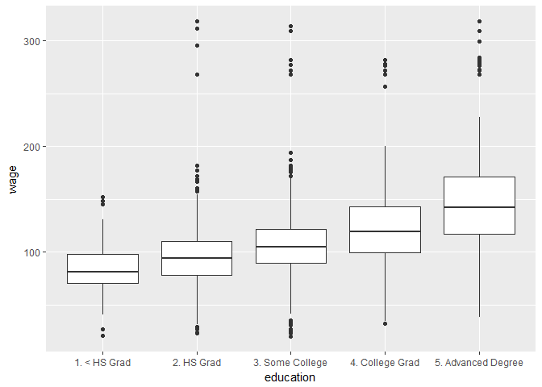
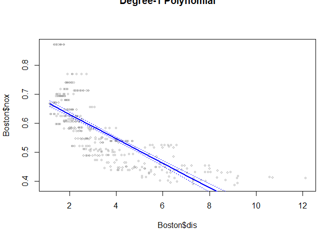

# 7.8 Lab: Non-linear Modeling
## 7.8.1 Polynomial Regression and Step Functions


```r
library(ISLR)

fit <- lm(wage ~ poly(age, 4), data=Wage)
coef(summary(fit))
```

```
##                 Estimate Std. Error    t value     Pr(>|t|)
## (Intercept)    111.70361  0.7287409 153.283015 0.000000e+00
## poly(age, 4)1  447.06785 39.9147851  11.200558 1.484604e-28
## poly(age, 4)2 -478.31581 39.9147851 -11.983424 2.355831e-32
## poly(age, 4)3  125.52169 39.9147851   3.144742 1.678622e-03
## poly(age, 4)4  -77.91118 39.9147851  -1.951938 5.103865e-02
```

```r
fit2 <- lm(wage ~ poly(age, 4, raw=T), data=Wage)
coef(summary(fit2))
```

```
##                             Estimate   Std. Error   t value     Pr(>|t|)
## (Intercept)            -1.841542e+02 6.004038e+01 -3.067172 0.0021802539
## poly(age, 4, raw = T)1  2.124552e+01 5.886748e+00  3.609042 0.0003123618
## poly(age, 4, raw = T)2 -5.638593e-01 2.061083e-01 -2.735743 0.0062606446
## poly(age, 4, raw = T)3  6.810688e-03 3.065931e-03  2.221409 0.0263977518
## poly(age, 4, raw = T)4 -3.203830e-05 1.641359e-05 -1.951938 0.0510386498
```

```r
fit2a <- lm(wage ~ age + I(age^2) + I(age^3) + I(age^4), data=Wage)
coef(fit2a)
```

```
##   (Intercept)           age      I(age^2)      I(age^3)      I(age^4) 
## -1.841542e+02  2.124552e+01 -5.638593e-01  6.810688e-03 -3.203830e-05
```

```r
fit2b=lm(wage ~ cbind(age, age^2, age^3, age^4), data=Wage)

agelims <- range(Wage$age)
age.grid <- seq(from = agelims[1], to = agelims[2])
preds <- predict(fit, newdata = list(age=age.grid), se=TRUE)
se.bands <- cbind(preds$fit + 2*preds$se.fit, preds$fit - 2*preds$se.fit)

par(mfrow=c(1,2), mar=c(4.5,4.5,1,1), oma=c(0,0,4,0))
plot(Wage$age, Wage$wage, xlim=agelims, cex =.5, col="darkgrey")
title("Degree-4 Polynomial", outer=T)
lines(age.grid, preds$fit, lwd=2, col="blue")
matlines(age.grid, se.bands, lwd=1, col="blue", lty=3)

preds2 <- predict(fit2, newdata = list(age=age.grid), se=TRUE)
max(abs(preds$fit - preds2$fit))
```

```
## [1] 7.81597e-11
```

```r
fit.1 <- lm(wage ~ age, data=Wage)
fit.2 <- lm(wage ~ poly(age, 2), data=Wage)
fit.3 <- lm(wage ~ poly(age, 3), data=Wage)
fit.4 <- lm(wage ~ poly(age, 4), data=Wage)
fit.5 <- lm(wage ~ poly(age, 5), data=Wage)
anova(fit.1, fit.2, fit.3, fit.4, fit.5)
```

```
## Analysis of Variance Table
## 
## Model 1: wage ~ age
## Model 2: wage ~ poly(age, 2)
## Model 3: wage ~ poly(age, 3)
## Model 4: wage ~ poly(age, 4)
## Model 5: wage ~ poly(age, 5)
##   Res.Df     RSS Df Sum of Sq        F    Pr(>F)    
## 1   2998 5022216                                    
## 2   2997 4793430  1    228786 143.5931 < 2.2e-16 ***
## 3   2996 4777674  1     15756   9.8888  0.001679 ** 
## 4   2995 4771604  1      6070   3.8098  0.051046 .  
## 5   2994 4770322  1      1283   0.8050  0.369682    
## ---
## Signif. codes:  0 '***' 0.001 '**' 0.01 '*' 0.05 '.' 0.1 ' ' 1
```

```r
coef(summary(fit.5))
```

```
##                 Estimate Std. Error     t value     Pr(>|t|)
## (Intercept)    111.70361  0.7287647 153.2780243 0.000000e+00
## poly(age, 5)1  447.06785 39.9160847  11.2001930 1.491111e-28
## poly(age, 5)2 -478.31581 39.9160847 -11.9830341 2.367734e-32
## poly(age, 5)3  125.52169 39.9160847   3.1446392 1.679213e-03
## poly(age, 5)4  -77.91118 39.9160847  -1.9518743 5.104623e-02
## poly(age, 5)5  -35.81289 39.9160847  -0.8972045 3.696820e-01
```

```r
(-11.983)^2
```

```
## [1] 143.5923
```

```r
fit.1 <- lm(wage ~ education + age, data=Wage)
fit.2 <- lm(wage ~ education + poly(age, 2), data=Wage)
fit.3 <- lm(wage ~ education + poly(age, 3), data=Wage)
anova(fit.1,fit.2,fit.3)
```

```
## Analysis of Variance Table
## 
## Model 1: wage ~ education + age
## Model 2: wage ~ education + poly(age, 2)
## Model 3: wage ~ education + poly(age, 3)
##   Res.Df     RSS Df Sum of Sq        F Pr(>F)    
## 1   2994 3867992                                 
## 2   2993 3725395  1    142597 114.6969 <2e-16 ***
## 3   2992 3719809  1      5587   4.4936 0.0341 *  
## ---
## Signif. codes:  0 '***' 0.001 '**' 0.01 '*' 0.05 '.' 0.1 ' ' 1
```

```r
fit <- glm(I(wage>250) ~ poly(age, 4), data=Wage, family=binomial )

preds <- predict(fit, newdata = list(age = age.grid), se=T)

pfit <- exp(preds$fit)/(1+exp(preds$fit))
se.bands.logit <- cbind(preds$fit + 2*preds$se.fit, preds$fit - 2*preds$se.fit)
se.bands <- exp(se.bands.logit)/(1+exp(se.bands.logit))

preds <- predict(fit, newdata = list(age=age.grid), type="response", se=T)

plot(Wage$age, I(Wage$wage>250), xlim=agelims, type="n", ylim=c(0,.2))
points(jitter(Wage$age), I((Wage$wage>250)/5), cex=.5, pch ="|", col="darkgrey ")
lines(age.grid, pfit, lwd=2, col ="blue")
matlines(age.grid, se.bands, lwd=1, col="blue", lty=3)
```

<!-- -->

```r
table(cut(Wage$age, 4))
```

```
## 
## (17.9,33.5]   (33.5,49]   (49,64.5] (64.5,80.1] 
##         750        1399         779          72
```

```r
fit <- lm(wage ~ cut(age, 4), data=Wage)
coef(summary (fit))
```

```
##                         Estimate Std. Error   t value     Pr(>|t|)
## (Intercept)            94.158392   1.476069 63.789970 0.000000e+00
## cut(age, 4)(33.5,49]   24.053491   1.829431 13.148074 1.982315e-38
## cut(age, 4)(49,64.5]   23.664559   2.067958 11.443444 1.040750e-29
## cut(age, 4)(64.5,80.1]  7.640592   4.987424  1.531972 1.256350e-01
```

## 7.8.2 Splines


```r
library(splines)
fit <- lm(wage ~ bs(age, knots=c(25,40,60)), data=Wage)
pred <- predict(fit, newdata = list(age=age.grid), se=T)
plot(Wage$age, Wage$wage, col="gray")
lines(age.grid, pred$fit, lwd=2)
lines(age.grid, pred$fit + 2*pred$se, lty="dashed")
lines(age.grid, pred$fit - 2*pred$se, lty="dashed")

dim(bs(Wage$age, knots=c(25,40,60)))
```

```
## [1] 3000    6
```

```r
dim(bs(Wage$age, df=6))
```

```
## [1] 3000    6
```

```r
attr(bs(Wage$age, df=6), "knots")
```

```
##   25%   50%   75% 
## 33.75 42.00 51.00
```

```r
fit2 <- lm(wage ~ ns(age, df=4), data=Wage)
pred2 <- predict(fit2, newdata = list(age=age.grid), se=T)
lines(age.grid, pred2$fit, col="red", lwd=2)
```

<!-- -->

```r
plot(Wage$age, Wage$wage, xlim = agelims, cex =.5, col="darkgrey")
title("Smoothing Spline")
fit <- smooth.spline(Wage$age, Wage$wage, df=16)
fit2 <- smooth.spline(Wage$age, Wage$wage, cv=TRUE)
```

```
## Warning in smooth.spline(Wage$age, Wage$wage, cv = TRUE): cross-validation
## with non-unique 'x' values seems doubtful
```

```r
fit2$df
```

```
## [1] 6.794596
```

```r
lines(fit, col="red", lwd=2)
lines(fit2 ,col="blue",lwd=2)
legend("topright", legend=c("16 DF", "6.8 DF"), col=c("red","blue"), lty=1, lwd=2, cex=.8)
```

<!-- -->

```r
plot(Wage$age, Wage$wage, xlim=agelims, cex =.5, col="darkgrey")
title("Local Regression")
fit <- loess(wage ~ age, span=.2, data=Wage)
fit2 <-loess(wage ~ age, span=.5, data=Wage)
lines(age.grid, predict(fit, data.frame(age=age.grid)), col="red", lwd=2)
lines(age.grid, predict(fit2, data.frame(age=age.grid)), col="blue", lwd=2)
legend("topright", legend=c("Span=0.2", "Span=0.5"), col=c("red","blue"), lty=1, lwd=2, cex =.8)
```

<!-- -->

## 7.9 Exercises

###6. In this exercise, you will further analyze the Wage data set considered throughout this chapter.

  (a) Perform polynomial regression to predict wage using age. Use cross-validation to select the optimal degree d for the polynomial. What degree was chosen, and how does this compare to the results of hypothesis testing using ANOVA? Make a plot of the resulting polynomial fit to the data.  
  

```r
# Anova testing
fit.1 <- lm(wage ~ age, data=Wage)
fit.2 <- lm(wage ~ poly(age, 2), data=Wage)
fit.3 <- lm(wage ~ poly(age, 3), data=Wage)
fit.4 <- lm(wage ~ poly(age, 4), data=Wage)
fit.5 <- lm(wage ~ poly(age, 5), data=Wage)
anova(fit.1, fit.2, fit.3, fit.4, fit.5)
```

```
## Analysis of Variance Table
## 
## Model 1: wage ~ age
## Model 2: wage ~ poly(age, 2)
## Model 3: wage ~ poly(age, 3)
## Model 4: wage ~ poly(age, 4)
## Model 5: wage ~ poly(age, 5)
##   Res.Df     RSS Df Sum of Sq        F    Pr(>F)    
## 1   2998 5022216                                    
## 2   2997 4793430  1    228786 143.5931 < 2.2e-16 ***
## 3   2996 4777674  1     15756   9.8888  0.001679 ** 
## 4   2995 4771604  1      6070   3.8098  0.051046 .  
## 5   2994 4770322  1      1283   0.8050  0.369682    
## ---
## Signif. codes:  0 '***' 0.001 '**' 0.01 '*' 0.05 '.' 0.1 ' ' 1
```

```r
# K-fold testing K = 10
set.seed(1)
deltas <- rep(NA, 10)
library(boot)
for(i in 1:10){
    fit <- glm(wage ~ poly(age, i), data = Wage)
    deltas[i] <- cv.glm(Wage, fit, K = 10)$delta[1]
    names(deltas)[i] <- paste0("Degree = ", i)
}
deltas
```

```
##  Degree = 1  Degree = 2  Degree = 3  Degree = 4  Degree = 5  Degree = 6 
##    1675.837    1601.012    1598.801    1594.217    1594.625    1594.888 
##  Degree = 7  Degree = 8  Degree = 9 Degree = 10 
##    1595.500    1595.436    1596.335    1595.835
```

```r
plot(1:10, deltas, xlab = "Degree", ylab = "Test MSE", type = "l")
(d.min <- which.min(deltas))
```

```
## Degree = 4 
##          4
```

```r
points(d.min, deltas[d.min], col = "red", cex = 2, pch = 20)
```

<!-- -->

```r
fit <- lm(wage ~ poly(age, d.min), data=Wage)
preds <- predict(fit, newdata = list(age=age.grid), se=TRUE)
se.bands <- cbind(preds$fit + 2*preds$se.fit, preds$fit - 2*preds$se.fit)

plot(Wage$age, Wage$wage, xlim=agelims, cex =.5, col="darkgrey")
title(paste0("Degree-", d.min," Polynomial"), outer=T)
lines(age.grid, preds$fit, lwd=2, col="blue")
matlines(age.grid, se.bands, lwd=1, col="blue", lty=3)
```

<!-- -->
  CV tests suggest 4 degrees while ANOVA suggests 3. 4 is possible but just slightly over the arbitary .05 cutoff.

  (b) Fit a step function to predict wage using age, and perform crossvalidation to choose the optimal number of cuts. Make a plot of the fit obtained. 


```r
deltas <- rep(NA, 9)
for (i in 2:10) {
    Wage$age.cut <- cut(Wage$age, i)
    fit <- glm(wage ~ age.cut, data = Wage)
    deltas[i-1] <- cv.glm(Wage, fit, K = 10)$delta[1]
    names(deltas)[i-1] <- paste0("Cuts = ", i-1)
}
deltas
```

```
## Cuts = 1 Cuts = 2 Cuts = 3 Cuts = 4 Cuts = 5 Cuts = 6 Cuts = 7 Cuts = 8 
## 1733.880 1683.337 1635.042 1633.382 1622.835 1610.996 1605.042 1609.491 
## Cuts = 9 
## 1606.329
```

```r
plot(1:9, deltas, xlab = "Cuts", ylab = "Test MSE", type = "l")
(d.min <- which.min(deltas))
```

```
## Cuts = 7 
##        7
```

```r
points(d.min, deltas[d.min], col = "red", cex = 2, pch = 20)
```

<!-- -->

```r
plot(wage ~ age, data = Wage, col = "darkgrey")
fit <- glm(wage ~ cut(age, d.min), data = Wage)
preds <- predict(fit, data.frame(age = age.grid))
lines(age.grid, preds, col = "red", lwd = 2)
```

<!-- -->

### 7. The Wage data set contains a number of other features not explored in this chapter, such as marital status (maritl), job class (jobclass), and others. Explore the relationships between some of these other predictors and wage, and use non-linear fitting techniques in order to it flexible models to the data. Create plots of the results obtained, and write a summary of your findings.


```r
library(ggplot2)
summary(Wage)
```

```
##       year           age                     maritl           race     
##  Min.   :2003   Min.   :18.00   1. Never Married: 648   1. White:2480  
##  1st Qu.:2004   1st Qu.:33.75   2. Married      :2074   2. Black: 293  
##  Median :2006   Median :42.00   3. Widowed      :  19   3. Asian: 190  
##  Mean   :2006   Mean   :42.41   4. Divorced     : 204   4. Other:  37  
##  3rd Qu.:2008   3rd Qu.:51.00   5. Separated    :  55                  
##  Max.   :2009   Max.   :80.00                                          
##                                                                        
##               education                     region    
##  1. < HS Grad      :268   2. Middle Atlantic   :3000  
##  2. HS Grad        :971   1. New England       :   0  
##  3. Some College   :650   3. East North Central:   0  
##  4. College Grad   :685   4. West North Central:   0  
##  5. Advanced Degree:426   5. South Atlantic    :   0  
##                           6. East South Central:   0  
##                           (Other)              :   0  
##            jobclass               health      health_ins      logwage     
##  1. Industrial :1544   1. <=Good     : 858   1. Yes:2083   Min.   :3.000  
##  2. Information:1456   2. >=Very Good:2142   2. No : 917   1st Qu.:4.447  
##                                                            Median :4.653  
##                                                            Mean   :4.654  
##                                                            3rd Qu.:4.857  
##                                                            Max.   :5.763  
##                                                                           
##       wage               age.cut   
##  Min.   : 20.09   (42.8,49]  :640  
##  1st Qu.: 85.38   (36.6,42.8]:542  
##  Median :104.92   (30.4,36.6]:445  
##  Mean   :111.70   (49,55.2]  :441  
##  3rd Qu.:128.68   (24.2,30.4]:347  
##  Max.   :318.34   (55.2,61.4]:270  
##                   (Other)    :315
```

```r
fit.1 <- lm(wage ~ education, data=Wage)
fit.2 <- lm(wage ~ education + maritl, data=Wage)
fit.3 <- lm(wage ~ education + maritl + age, data=Wage)
fit.4 <- lm(wage ~ education + maritl + poly(age, 2), data=Wage)
fit.5 <- lm(wage ~ education + maritl + poly(age, 3), data=Wage)

anova(fit.1,fit.2,fit.3,fit.4,fit.5)
```

```
## Analysis of Variance Table
## 
## Model 1: wage ~ education
## Model 2: wage ~ education + maritl
## Model 3: wage ~ education + maritl + age
## Model 4: wage ~ education + maritl + poly(age, 2)
## Model 5: wage ~ education + maritl + poly(age, 3)
##   Res.Df     RSS Df Sum of Sq       F    Pr(>F)    
## 1   2995 3995721                                   
## 2   2991 3738343  4    257378 53.0306 < 2.2e-16 ***
## 3   2990 3705884  1     32460 26.7521 2.466e-07 ***
## 4   2989 3626853  1     79030 65.1342 1.003e-15 ***
## 5   2988 3625481  1      1372  1.1306    0.2877    
## ---
## Signif. codes:  0 '***' 0.001 '**' 0.01 '*' 0.05 '.' 0.1 ' ' 1
```

```r
summary(fit.4)
```

```
## 
## Call:
## lm(formula = wage ~ education + maritl + poly(age, 2), data = Wage)
## 
## Residuals:
##      Min       1Q   Median       3Q      Max 
## -116.033  -19.354   -3.154   14.459  213.308 
## 
## Coefficients:
##                              Estimate Std. Error t value Pr(>|t|)    
## (Intercept)                   75.7134     2.5824  29.319  < 2e-16 ***
## education2. HS Grad           10.9538     2.4095   4.546 5.68e-06 ***
## education3. Some College      23.5542     2.5373   9.283  < 2e-16 ***
## education4. College Grad      37.9991     2.5233  15.060  < 2e-16 ***
## education5. Advanced Degree   62.0815     2.7418  22.643  < 2e-16 ***
## maritl2. Married              13.9990     1.8329   7.638 2.96e-14 ***
## maritl3. Widowed              -0.4873     8.1902  -0.059    0.953    
## maritl4. Divorced              0.4906     3.0035   0.163    0.870    
## maritl5. Separated             7.6989     4.9985   1.540    0.124    
## poly(age, 2)1                250.0901    39.6420   6.309 3.23e-10 ***
## poly(age, 2)2               -297.5155    36.8650  -8.070 1.00e-15 ***
## ---
## Signif. codes:  0 '***' 0.001 '**' 0.01 '*' 0.05 '.' 0.1 ' ' 1
## 
## Residual standard error: 34.83 on 2989 degrees of freedom
## Multiple R-squared:  0.3055,	Adjusted R-squared:  0.3032 
## F-statistic: 131.5 on 10 and 2989 DF,  p-value: < 2.2e-16
```

```r
ggplot(Wage, aes(maritl, wage)) +
  geom_boxplot()
```

<!-- -->

```r
ggplot(Wage, aes(education, wage)) +
  geom_boxplot()
```

<!-- -->

### 8. Fit some of the non-linear models investigated in this chapter to the Auto data set. Is there evidence for non-linear relationships in this data set? Create some informative plots to justify your answer.


```r
summary(Auto)
```

```
##       mpg          cylinders      displacement     horsepower   
##  Min.   : 9.00   Min.   :3.000   Min.   : 68.0   Min.   : 46.0  
##  1st Qu.:17.00   1st Qu.:4.000   1st Qu.:105.0   1st Qu.: 75.0  
##  Median :22.75   Median :4.000   Median :151.0   Median : 93.5  
##  Mean   :23.45   Mean   :5.472   Mean   :194.4   Mean   :104.5  
##  3rd Qu.:29.00   3rd Qu.:8.000   3rd Qu.:275.8   3rd Qu.:126.0  
##  Max.   :46.60   Max.   :8.000   Max.   :455.0   Max.   :230.0  
##                                                                 
##      weight      acceleration        year           origin     
##  Min.   :1613   Min.   : 8.00   Min.   :70.00   Min.   :1.000  
##  1st Qu.:2225   1st Qu.:13.78   1st Qu.:73.00   1st Qu.:1.000  
##  Median :2804   Median :15.50   Median :76.00   Median :1.000  
##  Mean   :2978   Mean   :15.54   Mean   :75.98   Mean   :1.577  
##  3rd Qu.:3615   3rd Qu.:17.02   3rd Qu.:79.00   3rd Qu.:2.000  
##  Max.   :5140   Max.   :24.80   Max.   :82.00   Max.   :3.000  
##                                                                
##                  name    
##  amc matador       :  5  
##  ford pinto        :  5  
##  toyota corolla    :  5  
##  amc gremlin       :  4  
##  amc hornet        :  4  
##  chevrolet chevette:  4  
##  (Other)           :365
```

```r
small.auto <- Auto[,-9]
summary(small.auto)
```

```
##       mpg          cylinders      displacement     horsepower   
##  Min.   : 9.00   Min.   :3.000   Min.   : 68.0   Min.   : 46.0  
##  1st Qu.:17.00   1st Qu.:4.000   1st Qu.:105.0   1st Qu.: 75.0  
##  Median :22.75   Median :4.000   Median :151.0   Median : 93.5  
##  Mean   :23.45   Mean   :5.472   Mean   :194.4   Mean   :104.5  
##  3rd Qu.:29.00   3rd Qu.:8.000   3rd Qu.:275.8   3rd Qu.:126.0  
##  Max.   :46.60   Max.   :8.000   Max.   :455.0   Max.   :230.0  
##      weight      acceleration        year           origin     
##  Min.   :1613   Min.   : 8.00   Min.   :70.00   Min.   :1.000  
##  1st Qu.:2225   1st Qu.:13.78   1st Qu.:73.00   1st Qu.:1.000  
##  Median :2804   Median :15.50   Median :76.00   Median :1.000  
##  Mean   :2978   Mean   :15.54   Mean   :75.98   Mean   :1.577  
##  3rd Qu.:3615   3rd Qu.:17.02   3rd Qu.:79.00   3rd Qu.:2.000  
##  Max.   :5140   Max.   :24.80   Max.   :82.00   Max.   :3.000
```

```r
fit <- lm(mpg ~ ., data = small.auto)
summary(fit)
```

```
## 
## Call:
## lm(formula = mpg ~ ., data = small.auto)
## 
## Residuals:
##     Min      1Q  Median      3Q     Max 
## -9.5903 -2.1565 -0.1169  1.8690 13.0604 
## 
## Coefficients:
##                Estimate Std. Error t value Pr(>|t|)    
## (Intercept)  -17.218435   4.644294  -3.707  0.00024 ***
## cylinders     -0.493376   0.323282  -1.526  0.12780    
## displacement   0.019896   0.007515   2.647  0.00844 ** 
## horsepower    -0.016951   0.013787  -1.230  0.21963    
## weight        -0.006474   0.000652  -9.929  < 2e-16 ***
## acceleration   0.080576   0.098845   0.815  0.41548    
## year           0.750773   0.050973  14.729  < 2e-16 ***
## origin         1.426141   0.278136   5.127 4.67e-07 ***
## ---
## Signif. codes:  0 '***' 0.001 '**' 0.01 '*' 0.05 '.' 0.1 ' ' 1
## 
## Residual standard error: 3.328 on 384 degrees of freedom
## Multiple R-squared:  0.8215,	Adjusted R-squared:  0.8182 
## F-statistic: 252.4 on 7 and 384 DF,  p-value: < 2.2e-16
```

```r
# Focus on weight
weight.range <- range(small.auto$weight)
weight.grid <- seq(weight.range[1],weight.range[2])
deltas <- rep(NA,10)
for(i in 1:10){
    fit <- glm(mpg ~ poly(weight, i), data = small.auto)
    deltas[i] <- cv.glm(small.auto, fit, K = 10)$delta[1]
    names(deltas)[i] <- paste0("Degree = ", i)
}
deltas
```

```
##  Degree = 1  Degree = 2  Degree = 3  Degree = 4  Degree = 5  Degree = 6 
##    18.75550    17.66774    17.47049    17.61963    17.67948    17.63979 
##  Degree = 7  Degree = 8  Degree = 9 Degree = 10 
##    17.86716    17.85835    18.41426    19.24497
```

```r
plot(1:10, deltas, xlab = "Degree", ylab = "Test MSE", type = "l")
(d.min <- which.min(deltas))
```

```
## Degree = 3 
##          3
```

```r
points(d.min, deltas[d.min], col = "red", cex = 2, pch = 20)
```

<!-- -->

```r
fit <- lm(mpg ~ poly(weight, d.min), data=small.auto)
preds <- predict(fit, newdata = list(weight=weight.grid), se=TRUE)
se.bands <- cbind(preds$fit + 2*preds$se.fit, preds$fit - 2*preds$se.fit)

plot(small.auto$weight, small.auto$mpg, xlim=weight.range, cex =.5, col="darkgrey")
title(paste0("Degree-", d.min," Polynomial"), outer=T)
lines(weight.grid, preds$fit, lwd=2, col="blue")
matlines(weight.grid, se.bands, lwd=1, col="blue", lty=3)
```

<!-- -->
  Weight has a non-linear relationship to mpg.

### 9. This question uses the variables dis (the weighted mean of distances to five Boston employment centers) and nox (nitrogen oxides concentration in parts per 10 million) from the Boston data. We will treat dis as the predictor and nox as the response.

  (a) Use the poly() function to fit a cubic polynomial regression to predict nox using dis. Report the regression output, and plot the resulting data and polynomial fits.  

```r
library(MASS)
summary(Boston)
```

```
##       crim                zn             indus            chas        
##  Min.   : 0.00632   Min.   :  0.00   Min.   : 0.46   Min.   :0.00000  
##  1st Qu.: 0.08204   1st Qu.:  0.00   1st Qu.: 5.19   1st Qu.:0.00000  
##  Median : 0.25651   Median :  0.00   Median : 9.69   Median :0.00000  
##  Mean   : 3.61352   Mean   : 11.36   Mean   :11.14   Mean   :0.06917  
##  3rd Qu.: 3.67708   3rd Qu.: 12.50   3rd Qu.:18.10   3rd Qu.:0.00000  
##  Max.   :88.97620   Max.   :100.00   Max.   :27.74   Max.   :1.00000  
##       nox               rm             age              dis        
##  Min.   :0.3850   Min.   :3.561   Min.   :  2.90   Min.   : 1.130  
##  1st Qu.:0.4490   1st Qu.:5.886   1st Qu.: 45.02   1st Qu.: 2.100  
##  Median :0.5380   Median :6.208   Median : 77.50   Median : 3.207  
##  Mean   :0.5547   Mean   :6.285   Mean   : 68.57   Mean   : 3.795  
##  3rd Qu.:0.6240   3rd Qu.:6.623   3rd Qu.: 94.08   3rd Qu.: 5.188  
##  Max.   :0.8710   Max.   :8.780   Max.   :100.00   Max.   :12.127  
##       rad              tax           ptratio          black       
##  Min.   : 1.000   Min.   :187.0   Min.   :12.60   Min.   :  0.32  
##  1st Qu.: 4.000   1st Qu.:279.0   1st Qu.:17.40   1st Qu.:375.38  
##  Median : 5.000   Median :330.0   Median :19.05   Median :391.44  
##  Mean   : 9.549   Mean   :408.2   Mean   :18.46   Mean   :356.67  
##  3rd Qu.:24.000   3rd Qu.:666.0   3rd Qu.:20.20   3rd Qu.:396.23  
##  Max.   :24.000   Max.   :711.0   Max.   :22.00   Max.   :396.90  
##      lstat            medv      
##  Min.   : 1.73   Min.   : 5.00  
##  1st Qu.: 6.95   1st Qu.:17.02  
##  Median :11.36   Median :21.20  
##  Mean   :12.65   Mean   :22.53  
##  3rd Qu.:16.95   3rd Qu.:25.00  
##  Max.   :37.97   Max.   :50.00
```

```r
fit <- lm(nox ~ poly(dis,3), data = Boston)
summary(fit)
```

```
## 
## Call:
## lm(formula = nox ~ poly(dis, 3), data = Boston)
## 
## Residuals:
##       Min        1Q    Median        3Q       Max 
## -0.121130 -0.040619 -0.009738  0.023385  0.194904 
## 
## Coefficients:
##                Estimate Std. Error t value Pr(>|t|)    
## (Intercept)    0.554695   0.002759 201.021  < 2e-16 ***
## poly(dis, 3)1 -2.003096   0.062071 -32.271  < 2e-16 ***
## poly(dis, 3)2  0.856330   0.062071  13.796  < 2e-16 ***
## poly(dis, 3)3 -0.318049   0.062071  -5.124 4.27e-07 ***
## ---
## Signif. codes:  0 '***' 0.001 '**' 0.01 '*' 0.05 '.' 0.1 ' ' 1
## 
## Residual standard error: 0.06207 on 502 degrees of freedom
## Multiple R-squared:  0.7148,	Adjusted R-squared:  0.7131 
## F-statistic: 419.3 on 3 and 502 DF,  p-value: < 2.2e-16
```

```r
dis.range <- range(Boston$dis)
dis.grid <- seq(dis.range[1],dis.range[2])
preds <- predict(fit, newdata = list(dis=dis.grid), se=TRUE)
se.bands <- cbind(preds$fit + 2*preds$se.fit, preds$fit - 2*preds$se.fit)

plot(Boston$dis, Boston$nox, xlim=range(Boston$dis), cex =.5, col="darkgrey")
title(paste0("Degree-", 3," Polynomial"), outer=T)
lines(dis.grid, preds$fit, lwd=2, col="blue")
matlines(dis.grid, se.bands, lwd=1, col="blue", lty=3)
```

<!-- -->

  (b) Plot the polynomial fits for a range of different polynomial degrees (say, from 1 to 10), and report the associated residual sum of squares.

```r
rss <- rep(NA,10)
for(i in 1:10){
  fit <- lm(nox ~ poly(dis, i), data = Boston)
  rss[i] <- with(summary(fit), df[2] * sigma^2)
  names(rss)[i] <- paste0("Degree = ", i)
  preds <- predict(fit, newdata = list(dis=dis.grid), se=TRUE)
  se.bands <- cbind(preds$fit + 2*preds$se.fit, preds$fit - 2*preds$se.fit)
  plot(Boston$dis, Boston$nox, xlim=range(Boston$dis), cex =.5, col="darkgrey")
  title(paste0("Degree-", i," Polynomial"), outer=T)
  lines(dis.grid, preds$fit, lwd=2, col="blue")
  matlines(dis.grid, se.bands, lwd=1, col="blue", lty=3)
}
```

<!-- --><!-- --><!-- --><!-- --><!-- --><!-- --><!-- --><!-- --><!-- --><!-- -->

```r
rss
```

```
##  Degree = 1  Degree = 2  Degree = 3  Degree = 4  Degree = 5  Degree = 6 
##    2.768563    2.035262    1.934107    1.932981    1.915290    1.878257 
##  Degree = 7  Degree = 8  Degree = 9 Degree = 10 
##    1.849484    1.835630    1.833331    1.832171
```

  (c) Perform cross-validation or another approach to select the optimal degree for the polynomial, and explain your results. 
  

```r
deltas <- rep(NA,10)
for(i in 1:10){
  fit <- glm(nox ~ poly(dis, i), data = Boston)
  deltas[i] <- cv.glm(Boston, fit, K = 10)$delta[1]
  names(deltas)[i] <- paste0("Degree = ", i)
}
deltas
```

```
##  Degree = 1  Degree = 2  Degree = 3  Degree = 4  Degree = 5  Degree = 6 
## 0.005524073 0.004098299 0.003858799 0.003904430 0.004139624 0.005531751 
##  Degree = 7  Degree = 8  Degree = 9 Degree = 10 
## 0.011917531 0.011721217 0.051762123 0.025557561
```

```r
plot(1:10, deltas, xlab = "Degree", ylab = "Test MSE", type = "l")
(d.min <- which.min(deltas))
```

```
## Degree = 3 
##          3
```

```r
points(d.min, deltas[d.min], col = "red", cex = 2, pch = 20)
```

<!-- -->

  (d) Use the bs() function to fit a regression spline to predict nox using dis. Report the output for the fit using four degrees of freedom. How did you choose the knots? Plot the resulting fit.  

```r
fit <- lm(nox ~ bs(dis, df=4), data=Boston)
pred <- predict(fit, newdata = list(dis=dis.grid), se=T)
plot(Boston$dis, Boston$nox, col="gray")
lines(dis.grid, pred$fit, lwd=2)
lines(dis.grid, pred$fit + 2*pred$se, lty="dashed")
lines(dis.grid, pred$fit - 2*pred$se, lty="dashed")
```

<!-- -->
  Knots picked by program
  
  (e) Now fit a regression spline for a range of degrees of freedom, and plot the resulting fits and report the resulting RSS. Describe the results obtained.  

```r
rss <- rep(NA,15)
for(i in 1:15){
  fit <- lm(nox ~ bs(dis, df=i), data = Boston)
  rss[i] <- with(summary(fit), df[2] * sigma^2)
  names(rss)[i] <- paste0("Degree = ", i)
  preds <- predict(fit, newdata = list(dis=dis.grid), se=TRUE)
  se.bands <- cbind(preds$fit + 2*preds$se.fit, preds$fit - 2*preds$se.fit)
  plot(Boston$dis, Boston$nox, xlim=range(Boston$dis), cex =.5, col="darkgrey")
  title(paste0("Degree-", i," Polynomial"), outer=T)
  lines(dis.grid, preds$fit, lwd=2, col="blue")
  matlines(dis.grid, se.bands, lwd=1, col="blue", lty=3)
}
```

```
## Warning in bs(dis, df = i): 'df' was too small; have used 3

## Warning in bs(dis, df = i): 'df' was too small; have used 3
```

<!-- --><!-- --><!-- --><!-- --><!-- --><!-- --><!-- --><!-- --><!-- --><!-- --><!-- --><!-- --><!-- --><!-- --><!-- -->

```r
rss
```

```
##  Degree = 1  Degree = 2  Degree = 3  Degree = 4  Degree = 5  Degree = 6 
##    1.934107    1.934107    1.934107    1.922775    1.840173    1.833966 
##  Degree = 7  Degree = 8  Degree = 9 Degree = 10 Degree = 11 Degree = 12 
##    1.829884    1.816995    1.825653    1.792535    1.796992    1.788999 
## Degree = 13 Degree = 14 Degree = 15 
##    1.782350    1.781838    1.782798
```

  (f) Perform cross-validation or another approach in order to select the best degrees of freedom for a regression spline on this data. Describe your results

```r
deltas <- rep(NA,15)
for(i in 1:15){
  fit <- glm(nox ~ bs(dis, df=i), data = Boston)
  deltas[i] <- cv.glm(Boston, fit, K = 10)$delta[1]
  names(deltas)[i] <- paste0("Degree = ", i)
}
```

```
## Warning in bs(dis, df = i): 'df' was too small; have used 3

## Warning in bs(dis, df = i): 'df' was too small; have used 3

## Warning in bs(dis, df = i): 'df' was too small; have used 3
```

```
## Warning in bs(dis, degree = 3L, knots = numeric(0), Boundary.knots =
## c(1.1296, : some 'x' values beyond boundary knots may cause ill-conditioned
## bases

## Warning in bs(dis, degree = 3L, knots = numeric(0), Boundary.knots =
## c(1.1296, : some 'x' values beyond boundary knots may cause ill-conditioned
## bases
```

```
## Warning in bs(dis, df = i): 'df' was too small; have used 3

## Warning in bs(dis, df = i): 'df' was too small; have used 3

## Warning in bs(dis, df = i): 'df' was too small; have used 3
```

```
## Warning in bs(dis, degree = 3L, knots = numeric(0), Boundary.knots =
## c(1.137, : some 'x' values beyond boundary knots may cause ill-conditioned
## bases

## Warning in bs(dis, degree = 3L, knots = numeric(0), Boundary.knots =
## c(1.137, : some 'x' values beyond boundary knots may cause ill-conditioned
## bases
```

```
## Warning in bs(dis, df = i): 'df' was too small; have used 3

## Warning in bs(dis, df = i): 'df' was too small; have used 3

## Warning in bs(dis, df = i): 'df' was too small; have used 3

## Warning in bs(dis, df = i): 'df' was too small; have used 3

## Warning in bs(dis, df = i): 'df' was too small; have used 3

## Warning in bs(dis, df = i): 'df' was too small; have used 3

## Warning in bs(dis, df = i): 'df' was too small; have used 3
```

```
## Warning in bs(dis, degree = 3L, knots = numeric(0), Boundary.knots =
## c(1.1296, : some 'x' values beyond boundary knots may cause ill-conditioned
## bases

## Warning in bs(dis, degree = 3L, knots = numeric(0), Boundary.knots =
## c(1.1296, : some 'x' values beyond boundary knots may cause ill-conditioned
## bases
```

```
## Warning in bs(dis, df = i): 'df' was too small; have used 3

## Warning in bs(dis, df = i): 'df' was too small; have used 3

## Warning in bs(dis, df = i): 'df' was too small; have used 3

## Warning in bs(dis, df = i): 'df' was too small; have used 3

## Warning in bs(dis, df = i): 'df' was too small; have used 3

## Warning in bs(dis, df = i): 'df' was too small; have used 3

## Warning in bs(dis, df = i): 'df' was too small; have used 3
```

```
## Warning in bs(dis, degree = 3L, knots = numeric(0), Boundary.knots =
## c(1.137, : some 'x' values beyond boundary knots may cause ill-conditioned
## bases

## Warning in bs(dis, degree = 3L, knots = numeric(0), Boundary.knots =
## c(1.137, : some 'x' values beyond boundary knots may cause ill-conditioned
## bases
```

```
## Warning in bs(dis, df = i): 'df' was too small; have used 3

## Warning in bs(dis, df = i): 'df' was too small; have used 3
```

```
## Warning in bs(dis, degree = 3L, knots = numeric(0), Boundary.knots =
## c(1.1296, : some 'x' values beyond boundary knots may cause ill-conditioned
## bases

## Warning in bs(dis, degree = 3L, knots = numeric(0), Boundary.knots =
## c(1.1296, : some 'x' values beyond boundary knots may cause ill-conditioned
## bases
```

```
## Warning in bs(dis, degree = 3L, knots = numeric(0), Boundary.knots =
## c(1.137, : some 'x' values beyond boundary knots may cause ill-conditioned
## bases

## Warning in bs(dis, degree = 3L, knots = numeric(0), Boundary.knots =
## c(1.137, : some 'x' values beyond boundary knots may cause ill-conditioned
## bases
```

```
## Warning in bs(dis, degree = 3L, knots = structure(3.09575, .Names =
## "50%"), : some 'x' values beyond boundary knots may cause ill-conditioned
## bases

## Warning in bs(dis, degree = 3L, knots = structure(3.09575, .Names =
## "50%"), : some 'x' values beyond boundary knots may cause ill-conditioned
## bases
```

```
## Warning in bs(dis, degree = 3L, knots = structure(3.1121, .Names =
## "50%"), : some 'x' values beyond boundary knots may cause ill-conditioned
## bases

## Warning in bs(dis, degree = 3L, knots = structure(3.1121, .Names =
## "50%"), : some 'x' values beyond boundary knots may cause ill-conditioned
## bases
```

```
## Warning in bs(dis, degree = 3L, knots = structure(c(2.40296666666667,
## 4.26416666666667: some 'x' values beyond boundary knots may cause ill-
## conditioned bases

## Warning in bs(dis, degree = 3L, knots = structure(c(2.40296666666667,
## 4.26416666666667: some 'x' values beyond boundary knots may cause ill-
## conditioned bases
```

```
## Warning in bs(dis, degree = 3L, knots = structure(c(2.34846666666667,
## 4.2474: some 'x' values beyond boundary knots may cause ill-conditioned
## bases

## Warning in bs(dis, degree = 3L, knots = structure(c(2.34846666666667,
## 4.2474: some 'x' values beyond boundary knots may cause ill-conditioned
## bases
```

```
## Warning in bs(dis, degree = 3L, knots = structure(c(2.084875, 3.1423,
## 5.141475: some 'x' values beyond boundary knots may cause ill-conditioned
## bases

## Warning in bs(dis, degree = 3L, knots = structure(c(2.084875, 3.1423,
## 5.141475: some 'x' values beyond boundary knots may cause ill-conditioned
## bases
```

```
## Warning in bs(dis, degree = 3L, knots = structure(c(2.0771, 3.1073, 5.118:
## some 'x' values beyond boundary knots may cause ill-conditioned bases

## Warning in bs(dis, degree = 3L, knots = structure(c(2.0771, 3.1073, 5.118:
## some 'x' values beyond boundary knots may cause ill-conditioned bases
```

```
## Warning in bs(dis, degree = 3L, knots = structure(c(1.96376, 2.5899,
## 3.84196, : some 'x' values beyond boundary knots may cause ill-conditioned
## bases

## Warning in bs(dis, degree = 3L, knots = structure(c(1.96376, 2.5899,
## 3.84196, : some 'x' values beyond boundary knots may cause ill-conditioned
## bases
```

```
## Warning in bs(dis, degree = 3L, knots = structure(c(1.9796, 2.72714,
## 3.9454, : some 'x' values beyond boundary knots may cause ill-conditioned
## bases

## Warning in bs(dis, degree = 3L, knots = structure(c(1.9796, 2.72714,
## 3.9454, : some 'x' values beyond boundary knots may cause ill-conditioned
## bases
```

```
## Warning in bs(dis, degree = 3L, knots = structure(c(1.86223333333333,
## 2.3817, : some 'x' values beyond boundary knots may cause ill-conditioned
## bases

## Warning in bs(dis, degree = 3L, knots = structure(c(1.86223333333333,
## 2.3817, : some 'x' values beyond boundary knots may cause ill-conditioned
## bases
```

```
## Warning in bs(dis, degree = 3L, knots = structure(c(1.86156666666667,
## 2.39256666666667, : some 'x' values beyond boundary knots may cause ill-
## conditioned bases

## Warning in bs(dis, degree = 3L, knots = structure(c(1.86156666666667,
## 2.39256666666667, : some 'x' values beyond boundary knots may cause ill-
## conditioned bases
```

```
## Warning in bs(dis, degree = 3L, knots = structure(c(1.78741428571429,
## 2.16771428571429, : some 'x' values beyond boundary knots may cause ill-
## conditioned bases

## Warning in bs(dis, degree = 3L, knots = structure(c(1.78741428571429,
## 2.16771428571429, : some 'x' values beyond boundary knots may cause ill-
## conditioned bases
```

```
## Warning in bs(dis, degree = 3L, knots = structure(c(1.8,
## 2.19782857142857, : some 'x' values beyond boundary knots may cause ill-
## conditioned bases

## Warning in bs(dis, degree = 3L, knots = structure(c(1.8,
## 2.19782857142857, : some 'x' values beyond boundary knots may cause ill-
## conditioned bases
```

```
## Warning in bs(dis, degree = 3L, knots = structure(c(1.754625, 2.10035,
## 2.506175, : some 'x' values beyond boundary knots may cause ill-conditioned
## bases

## Warning in bs(dis, degree = 3L, knots = structure(c(1.754625, 2.10035,
## 2.506175, : some 'x' values beyond boundary knots may cause ill-conditioned
## bases
```

```
## Warning in bs(dis, degree = 3L, knots = structure(c(1.674775, 2.06855,
## 2.4999, : some 'x' values beyond boundary knots may cause ill-conditioned
## bases

## Warning in bs(dis, degree = 3L, knots = structure(c(1.674775, 2.06855,
## 2.4999, : some 'x' values beyond boundary knots may cause ill-conditioned
## bases
```

```
## Warning in bs(dis, degree = 3L, knots = structure(c(1.71297777777778,
## 2.00588888888889, : some 'x' values beyond boundary knots may cause ill-
## conditioned bases

## Warning in bs(dis, degree = 3L, knots = structure(c(1.71297777777778,
## 2.00588888888889, : some 'x' values beyond boundary knots may cause ill-
## conditioned bases
```

```
## Warning in bs(dis, degree = 3L, knots = structure(c(1.71297777777778,
## 2.04532222222222, : some 'x' values beyond boundary knots may cause ill-
## conditioned bases

## Warning in bs(dis, degree = 3L, knots = structure(c(1.71297777777778,
## 2.04532222222222, : some 'x' values beyond boundary knots may cause ill-
## conditioned bases
```

```
## Warning in bs(dis, degree = 3L, knots = structure(c(1.62008, 1.9796,
## 2.28422, : some 'x' values beyond boundary knots may cause ill-conditioned
## bases

## Warning in bs(dis, degree = 3L, knots = structure(c(1.62008, 1.9796,
## 2.28422, : some 'x' values beyond boundary knots may cause ill-conditioned
## bases
```

```
## Warning in bs(dis, degree = 3L, knots = structure(c(1.62728, 1.94264,
## 2.21324, : some 'x' values beyond boundary knots may cause ill-conditioned
## bases

## Warning in bs(dis, degree = 3L, knots = structure(c(1.62728, 1.94264,
## 2.21324, : some 'x' values beyond boundary knots may cause ill-conditioned
## bases
```

```
## Warning in bs(dis, degree = 3L, knots = structure(c(1.61225454545455,
## 1.90056363636364, : some 'x' values beyond boundary knots may cause ill-
## conditioned bases

## Warning in bs(dis, degree = 3L, knots = structure(c(1.61225454545455,
## 1.90056363636364, : some 'x' values beyond boundary knots may cause ill-
## conditioned bases
```

```
## Warning in bs(dis, degree = 3L, knots = structure(c(1.61081818181818,
## 1.87656363636364, : some 'x' values beyond boundary knots may cause ill-
## conditioned bases

## Warning in bs(dis, degree = 3L, knots = structure(c(1.61081818181818,
## 1.87656363636364, : some 'x' values beyond boundary knots may cause ill-
## conditioned bases
```

```
## Warning in bs(dis, degree = 3L, knots = structure(c(1.591425, 1.8324,
## 2.087875, : some 'x' values beyond boundary knots may cause ill-conditioned
## bases

## Warning in bs(dis, degree = 3L, knots = structure(c(1.591425, 1.8324,
## 2.087875, : some 'x' values beyond boundary knots may cause ill-conditioned
## bases
```

```
## Warning in bs(dis, degree = 3L, knots = structure(c(1.59141666666667,
## 1.86498333333333, : some 'x' values beyond boundary knots may cause ill-
## conditioned bases

## Warning in bs(dis, degree = 3L, knots = structure(c(1.59141666666667,
## 1.86498333333333, : some 'x' values beyond boundary knots may cause ill-
## conditioned bases
```

```
## Warning in bs(dis, degree = 3L, knots = structure(c(1.57254615384615,
## 1.80235384615385, : some 'x' values beyond boundary knots may cause ill-
## conditioned bases

## Warning in bs(dis, degree = 3L, knots = structure(c(1.57254615384615,
## 1.80235384615385, : some 'x' values beyond boundary knots may cause ill-
## conditioned bases
```

```
## Warning in bs(dis, degree = 3L, knots = structure(c(1.5894, 1.8206,
## 2.0459, : some 'x' values beyond boundary knots may cause ill-conditioned
## bases

## Warning in bs(dis, degree = 3L, knots = structure(c(1.5894, 1.8206,
## 2.0459, : some 'x' values beyond boundary knots may cause ill-conditioned
## bases
```

```r
deltas
```

```
##  Degree = 1  Degree = 2  Degree = 3  Degree = 4  Degree = 5  Degree = 6 
## 0.003873100 0.003886668 0.003920740 0.003982294 0.003700290 0.003690194 
##  Degree = 7  Degree = 8  Degree = 9 Degree = 10 Degree = 11 Degree = 12 
## 0.003711733 0.003722078 0.003722619 0.003678125 0.003725114 0.003713786 
## Degree = 13 Degree = 14 Degree = 15 
## 0.003715892 0.003711189 0.003760649
```

```r
plot(1:15, deltas, xlab = "Degree", ylab = "Test MSE", type = "l")
(d.min <- which.min(deltas))
```

```
## Degree = 10 
##          10
```

```r
points(d.min, deltas[d.min], col = "red", cex = 2, pch = 20)
```

<!-- -->

