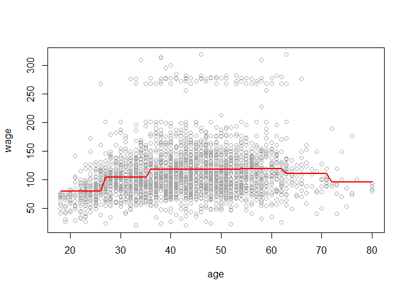

# 7.8 Lab: Non-linear Modeling
## 7.8.1 Polynomial Regression and Step Functions


```r
library(ISLR)

fit <- lm(wage ~ poly(age, 4), data=Wage)
coef(summary(fit))
```

```
##                 Estimate Std. Error    t value     Pr(>|t|)
## (Intercept)    111.70361  0.7287409 153.283015 0.000000e+00
## poly(age, 4)1  447.06785 39.9147851  11.200558 1.484604e-28
## poly(age, 4)2 -478.31581 39.9147851 -11.983424 2.355831e-32
## poly(age, 4)3  125.52169 39.9147851   3.144742 1.678622e-03
## poly(age, 4)4  -77.91118 39.9147851  -1.951938 5.103865e-02
```

```r
fit2 <- lm(wage ~ poly(age, 4, raw=T), data=Wage)
coef(summary(fit2))
```

```
##                             Estimate   Std. Error   t value     Pr(>|t|)
## (Intercept)            -1.841542e+02 6.004038e+01 -3.067172 0.0021802539
## poly(age, 4, raw = T)1  2.124552e+01 5.886748e+00  3.609042 0.0003123618
## poly(age, 4, raw = T)2 -5.638593e-01 2.061083e-01 -2.735743 0.0062606446
## poly(age, 4, raw = T)3  6.810688e-03 3.065931e-03  2.221409 0.0263977518
## poly(age, 4, raw = T)4 -3.203830e-05 1.641359e-05 -1.951938 0.0510386498
```

```r
fit2a <- lm(wage ~ age + I(age^2) + I(age^3) + I(age^4), data=Wage)
coef(fit2a)
```

```
##   (Intercept)           age      I(age^2)      I(age^3)      I(age^4) 
## -1.841542e+02  2.124552e+01 -5.638593e-01  6.810688e-03 -3.203830e-05
```

```r
fit2b=lm(wage ~ cbind(age, age^2, age^3, age^4), data=Wage)

agelims <- range(Wage$age)
age.grid <- seq(from = agelims[1], to = agelims[2])
preds <- predict(fit, newdata = list(age=age.grid), se=TRUE)
se.bands <- cbind(preds$fit + 2*preds$se.fit, preds$fit - 2*preds$se.fit)

par(mfrow=c(1,2), mar=c(4.5,4.5,1,1), oma=c(0,0,4,0))
plot(Wage$age, Wage$wage, xlim=agelims, cex =.5, col="darkgrey")
title("Degree-4 Polynomial", outer=T)
lines(age.grid, preds$fit, lwd=2, col="blue")
matlines(age.grid, se.bands, lwd=1, col="blue", lty=3)

preds2 <- predict(fit2, newdata = list(age=age.grid), se=TRUE)
max(abs(preds$fit - preds2$fit))
```

```
## [1] 7.81597e-11
```

```r
fit.1 <- lm(wage ~ age, data=Wage)
fit.2 <- lm(wage ~ poly(age, 2), data=Wage)
fit.3 <- lm(wage ~ poly(age, 3), data=Wage)
fit.4 <- lm(wage ~ poly(age, 4), data=Wage)
fit.5 <- lm(wage ~ poly(age, 5), data=Wage)
anova(fit.1, fit.2, fit.3, fit.4, fit.5)
```

```
## Analysis of Variance Table
## 
## Model 1: wage ~ age
## Model 2: wage ~ poly(age, 2)
## Model 3: wage ~ poly(age, 3)
## Model 4: wage ~ poly(age, 4)
## Model 5: wage ~ poly(age, 5)
##   Res.Df     RSS Df Sum of Sq        F    Pr(>F)    
## 1   2998 5022216                                    
## 2   2997 4793430  1    228786 143.5931 < 2.2e-16 ***
## 3   2996 4777674  1     15756   9.8888  0.001679 ** 
## 4   2995 4771604  1      6070   3.8098  0.051046 .  
## 5   2994 4770322  1      1283   0.8050  0.369682    
## ---
## Signif. codes:  0 '***' 0.001 '**' 0.01 '*' 0.05 '.' 0.1 ' ' 1
```

```r
coef(summary(fit.5))
```

```
##                 Estimate Std. Error     t value     Pr(>|t|)
## (Intercept)    111.70361  0.7287647 153.2780243 0.000000e+00
## poly(age, 5)1  447.06785 39.9160847  11.2001930 1.491111e-28
## poly(age, 5)2 -478.31581 39.9160847 -11.9830341 2.367734e-32
## poly(age, 5)3  125.52169 39.9160847   3.1446392 1.679213e-03
## poly(age, 5)4  -77.91118 39.9160847  -1.9518743 5.104623e-02
## poly(age, 5)5  -35.81289 39.9160847  -0.8972045 3.696820e-01
```

```r
(-11.983)^2
```

```
## [1] 143.5923
```

```r
fit.1 <- lm(wage ~ education + age, data=Wage)
fit.2 <- lm(wage ~ education + poly(age, 2), data=Wage)
fit.3 <- lm(wage ~ education + poly(age, 3), data=Wage)
anova(fit.1,fit.2,fit.3)
```

```
## Analysis of Variance Table
## 
## Model 1: wage ~ education + age
## Model 2: wage ~ education + poly(age, 2)
## Model 3: wage ~ education + poly(age, 3)
##   Res.Df     RSS Df Sum of Sq        F Pr(>F)    
## 1   2994 3867992                                 
## 2   2993 3725395  1    142597 114.6969 <2e-16 ***
## 3   2992 3719809  1      5587   4.4936 0.0341 *  
## ---
## Signif. codes:  0 '***' 0.001 '**' 0.01 '*' 0.05 '.' 0.1 ' ' 1
```

```r
fit <- glm(I(wage>250) ~ poly(age, 4), data=Wage, family=binomial )

preds <- predict(fit, newdata = list(age = age.grid), se=T)

pfit <- exp(preds$fit)/(1+exp(preds$fit))
se.bands.logit <- cbind(preds$fit + 2*preds$se.fit, preds$fit - 2*preds$se.fit)
se.bands <- exp(se.bands.logit)/(1+exp(se.bands.logit))

preds <- predict(fit, newdata = list(age=age.grid), type="response", se=T)

plot(Wage$age, I(Wage$wage>250), xlim=agelims, type="n", ylim=c(0,.2))
points(jitter(Wage$age), I((Wage$wage>250)/5), cex=.5, pch ="|", col="darkgrey ")
lines(age.grid, pfit, lwd=2, col ="blue")
matlines(age.grid, se.bands, lwd=1, col="blue", lty=3)
```

<!-- -->

```r
table(cut(Wage$age, 4))
```

```
## 
## (17.9,33.5]   (33.5,49]   (49,64.5] (64.5,80.1] 
##         750        1399         779          72
```

```r
fit <- lm(wage ~ cut(age, 4), data=Wage)
coef(summary (fit))
```

```
##                         Estimate Std. Error   t value     Pr(>|t|)
## (Intercept)            94.158392   1.476069 63.789970 0.000000e+00
## cut(age, 4)(33.5,49]   24.053491   1.829431 13.148074 1.982315e-38
## cut(age, 4)(49,64.5]   23.664559   2.067958 11.443444 1.040750e-29
## cut(age, 4)(64.5,80.1]  7.640592   4.987424  1.531972 1.256350e-01
```

## 7.8.2 Splines


```r
library(splines)
fit <- lm(wage ~ bs(age, knots=c(25,40,60)), data=Wage)
pred <- predict(fit, newdata = list(age=age.grid), se=T)
plot(Wage$age, Wage$wage, col="gray")
lines(age.grid, pred$fit, lwd=2)
lines(age.grid, pred$fit + 2*pred$se, lty="dashed")
lines(age.grid, pred$fit - 2*pred$se, lty="dashed")

dim(bs(Wage$age, knots=c(25,40,60)))
```

```
## [1] 3000    6
```

```r
dim(bs(Wage$age, df=6))
```

```
## [1] 3000    6
```

```r
attr(bs(Wage$age, df=6), "knots")
```

```
##   25%   50%   75% 
## 33.75 42.00 51.00
```

```r
fit2 <- lm(wage ~ ns(age, df=4), data=Wage)
pred2 <- predict(fit2, newdata = list(age=age.grid), se=T)
lines(age.grid, pred2$fit, col="red", lwd=2)
```

<!-- -->

```r
plot(Wage$age, Wage$wage, xlim = agelims, cex =.5, col="darkgrey")
title("Smoothing Spline")
fit <- smooth.spline(Wage$age, Wage$wage, df=16)
fit2 <- smooth.spline(Wage$age, Wage$wage, cv=TRUE)
```

```
## Warning in smooth.spline(Wage$age, Wage$wage, cv = TRUE): cross-validation
## with non-unique 'x' values seems doubtful
```

```r
fit2$df
```

```
## [1] 6.794596
```

```r
lines(fit, col="red", lwd=2)
lines(fit2 ,col="blue",lwd=2)
legend("topright", legend=c("16 DF", "6.8 DF"), col=c("red","blue"), lty=1, lwd=2, cex=.8)
```

<!-- -->

```r
plot(Wage$age, Wage$wage, xlim=agelims, cex =.5, col="darkgrey")
title("Local Regression")
fit <- loess(wage ~ age, span=.2, data=Wage)
fit2 <-loess(wage ~ age, span=.5, data=Wage)
lines(age.grid, predict(fit, data.frame(age=age.grid)), col="red", lwd=2)
lines(age.grid, predict(fit2, data.frame(age=age.grid)), col="blue", lwd=2)
legend("topright", legend=c("Span=0.2", "Span=0.5"), col=c("red","blue"), lty=1, lwd=2, cex =.8)
```

<!-- -->

## 7.9 Exercises

###6. In this exercise, you will further analyze the Wage data set considered throughout this chapter.

  (a) Perform polynomial regression to predict wage using age. Use cross-validation to select the optimal degree d for the polynomial. What degree was chosen, and how does this compare to the results of hypothesis testing using ANOVA? Make a plot of the resulting polynomial fit to the data.  
  

```r
library(boot)

fit.1 <- lm(wage ~ age, data=Wage)
fit.2 <- lm(wage ~ poly(age, 2), data=Wage)
fit.3 <- lm(wage ~ poly(age, 3), data=Wage)
fit.4 <- lm(wage ~ poly(age, 4), data=Wage)
fit.5 <- lm(wage ~ poly(age, 5), data=Wage)
anova(fit.1, fit.2, fit.3, fit.4, fit.5)
```

```
## Analysis of Variance Table
## 
## Model 1: wage ~ age
## Model 2: wage ~ poly(age, 2)
## Model 3: wage ~ poly(age, 3)
## Model 4: wage ~ poly(age, 4)
## Model 5: wage ~ poly(age, 5)
##   Res.Df     RSS Df Sum of Sq        F    Pr(>F)    
## 1   2998 5022216                                    
## 2   2997 4793430  1    228786 143.5931 < 2.2e-16 ***
## 3   2996 4777674  1     15756   9.8888  0.001679 ** 
## 4   2995 4771604  1      6070   3.8098  0.051046 .  
## 5   2994 4770322  1      1283   0.8050  0.369682    
## ---
## Signif. codes:  0 '***' 0.001 '**' 0.01 '*' 0.05 '.' 0.1 ' ' 1
```

```r
set.seed(1)
deltas <- rep(NA, 10)
for(i in 1:10){
    fit <- glm(wage ~ poly(age, i), data = Wage)
    deltas[i] <- cv.glm(Wage, fit, K = 10)$delta[1]
}
plot(1:10, deltas, xlab = "Degree", ylab = "Test MSE", type = "l")
(d.min <- which.min(deltas))
```

```
## [1] 4
```

```r
points(which.min(deltas), deltas[which.min(deltas)], col = "red", cex = 2, pch = 20)
```

<!-- -->

```r
fit <- lm(wage ~ poly(age, d.min), data=Wage)
preds <- predict(fit, newdata = list(age=age.grid), se=TRUE)
se.bands <- cbind(preds$fit + 2*preds$se.fit, preds$fit - 2*preds$se.fit)

plot(Wage$age, Wage$wage, xlim=agelims, cex =.5, col="darkgrey")
title(paste0("Degree-", d.min," Polynomial"), outer=T)
lines(age.grid, preds$fit, lwd=2, col="blue")
matlines(age.grid, se.bands, lwd=1, col="blue", lty=3)
```

<!-- -->

  (b) Fit a step function to predict wage using age, and perform crossvalidation to choose the optimal number of cuts. Make a plot of the fit obtained. 


```r
deltas <- rep(NA, 10)
for (i in 2:10) {
    Wage$age.cut <- cut(Wage$age, i)
    fit <- glm(wage ~ age.cut, data = Wage)
    deltas[i] <- cv.glm(Wage, fit, K = 10)$delta[1]
}
plot(2:10, deltas[-1], xlab = "Cuts", ylab = "Test MSE", type = "l")
(d.min <- which.min(deltas))
```

```
## [1] 8
```

```r
points(which.min(deltas), deltas[which.min(deltas)], col = "red", cex = 2, pch = 20)
```

<!-- -->

```r
plot(wage ~ age, data = Wage, col = "darkgrey")
fit <- glm(wage ~ cut(age, d.min), data = Wage)
preds <- predict(fit, data.frame(age = age.grid))
lines(age.grid, preds, col = "red", lwd = 2)
```

<!-- -->

### 7. The Wage data set contains a number of other features not exploredin this chapter, such as marital status (maritl), job class (jobclass), and others. Explore the relationships between some of these other predictors and wage, and use non-linear fitting techniques in order to it flexible models to the data. Create plots of the results obtained, and write a summary of your findings.


```r
library(ggplot2)
summary(Wage)
```

```
##       year           age                     maritl           race     
##  Min.   :2003   Min.   :18.00   1. Never Married: 648   1. White:2480  
##  1st Qu.:2004   1st Qu.:33.75   2. Married      :2074   2. Black: 293  
##  Median :2006   Median :42.00   3. Widowed      :  19   3. Asian: 190  
##  Mean   :2006   Mean   :42.41   4. Divorced     : 204   4. Other:  37  
##  3rd Qu.:2008   3rd Qu.:51.00   5. Separated    :  55                  
##  Max.   :2009   Max.   :80.00                                          
##                                                                        
##               education                     region    
##  1. < HS Grad      :268   2. Middle Atlantic   :3000  
##  2. HS Grad        :971   1. New England       :   0  
##  3. Some College   :650   3. East North Central:   0  
##  4. College Grad   :685   4. West North Central:   0  
##  5. Advanced Degree:426   5. South Atlantic    :   0  
##                           6. East South Central:   0  
##                           (Other)              :   0  
##            jobclass               health      health_ins      logwage     
##  1. Industrial :1544   1. <=Good     : 858   1. Yes:2083   Min.   :3.000  
##  2. Information:1456   2. >=Very Good:2142   2. No : 917   1st Qu.:4.447  
##                                                            Median :4.653  
##                                                            Mean   :4.654  
##                                                            3rd Qu.:4.857  
##                                                            Max.   :5.763  
##                                                                           
##       wage               age.cut   
##  Min.   : 20.09   (42.8,49]  :640  
##  1st Qu.: 85.38   (36.6,42.8]:542  
##  Median :104.92   (30.4,36.6]:445  
##  Mean   :111.70   (49,55.2]  :441  
##  3rd Qu.:128.68   (24.2,30.4]:347  
##  Max.   :318.34   (55.2,61.4]:270  
##                   (Other)    :315
```

```r
fit.1 <- lm(wage ~ education, data=Wage)
fit.2 <- lm(wage ~ education + maritl, data=Wage)
fit.3 <- lm(wage ~ education + maritl + poly(age, 4), data=Wage)
anova(fit.1,fit.2,fit.3)
```

```
## Analysis of Variance Table
## 
## Model 1: wage ~ education
## Model 2: wage ~ education + maritl
## Model 3: wage ~ education + maritl + poly(age, 4)
##   Res.Df     RSS Df Sum of Sq      F    Pr(>F)    
## 1   2995 3995721                                  
## 2   2991 3738343  4    257378 53.014 < 2.2e-16 ***
## 3   2987 3625419  4    112924 23.260 < 2.2e-16 ***
## ---
## Signif. codes:  0 '***' 0.001 '**' 0.01 '*' 0.05 '.' 0.1 ' ' 1
```

```r
summary(fit.3)
```

```
## 
## Call:
## lm(formula = wage ~ education + maritl + poly(age, 4), data = Wage)
## 
## Residuals:
##      Min       1Q   Median       3Q      Max 
## -116.076  -19.184   -3.139   14.372  212.555 
## 
## Coefficients:
##                              Estimate Std. Error t value Pr(>|t|)    
## (Intercept)                   75.9258     2.5962  29.245  < 2e-16 ***
## education2. HS Grad           10.9849     2.4100   4.558 5.37e-06 ***
## education3. Some College      23.5648     2.5394   9.280  < 2e-16 ***
## education4. College Grad      37.9811     2.5263  15.034  < 2e-16 ***
## education5. Advanced Degree   62.0402     2.7460  22.593  < 2e-16 ***
## maritl2. Married              13.7227     1.8561   7.393 1.85e-13 ***
## maritl3. Widowed              -0.8866     8.2051  -0.108    0.914    
## maritl4. Divorced              0.2288     3.0147   0.076    0.940    
## maritl5. Separated             7.5097     5.0044   1.501    0.134    
## poly(age, 4)1                252.9758    39.7653   6.362 2.30e-10 ***
## poly(age, 4)2               -299.3186    36.9241  -8.106 7.53e-16 ***
## poly(age, 4)3                 37.4384    35.3001   1.061    0.289    
## poly(age, 4)4                  7.9520    34.9951   0.227    0.820    
## ---
## Signif. codes:  0 '***' 0.001 '**' 0.01 '*' 0.05 '.' 0.1 ' ' 1
## 
## Residual standard error: 34.84 on 2987 degrees of freedom
## Multiple R-squared:  0.3058,	Adjusted R-squared:  0.303 
## F-statistic: 109.6 on 12 and 2987 DF,  p-value: < 2.2e-16
```

```r
ggplot(Wage, aes(maritl, wage)) +
  geom_boxplot()
```

<!-- -->

```r
ggplot(Wage, aes(education, wage)) +
  geom_boxplot()
```

<!-- -->

### 8. Fit some of the non-linear models investigated in this chapter to the Auto data set. Is there evidence for non-linear relationships in this data set? Create some informative plots to justify your answer.

### 9. This question uses the variables dis (the weighted mean of distances to five Boston employment centers) and nox (nitrogen oxides concentration in parts per 10 million) from the Boston data. We will treat dis as the predictor and nox as the response.

  (a) Use the poly() function to fit a cubic polynomial regression to predict nox using dis. Report the regression output, and plot the resulting data and polynomial fits.  

  (b) Plot the polynomial fits for a range of different polynomial degrees (say, from 1 to 10), and report the associated residual sum of squares.  

  (c) Perform cross-validation or another approach to select the optimal degree for the polynomial, and explain your results.  

  (d) Use the bs() function to fit a regression spline to predict nox using dis. Report the output for the fit using four degrees of freedom. How did you choose the knots? Plot the resulting fit.  

  (e) Now fit a regression spline for a range of degrees of freedom, and plot the resulting fits and report the resulting RSS. Describe the results obtained.  

  (f) Perform cross-validation or another approach in order to select the best degrees of freedom for a regression spline on this data. Describe your results.
