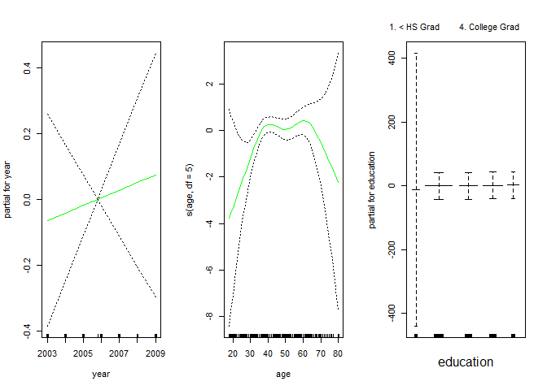
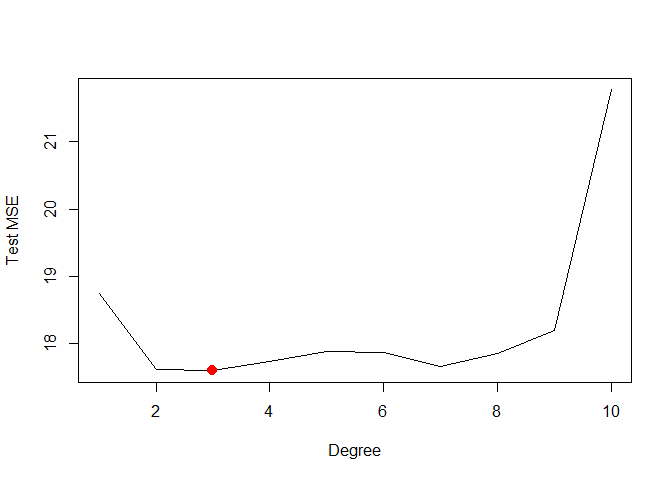
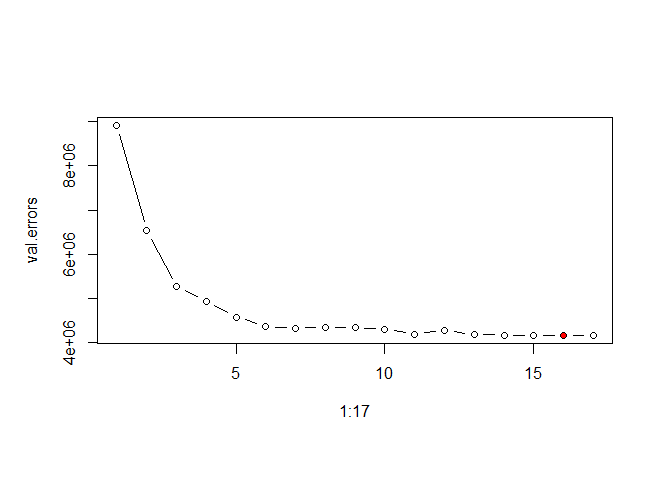
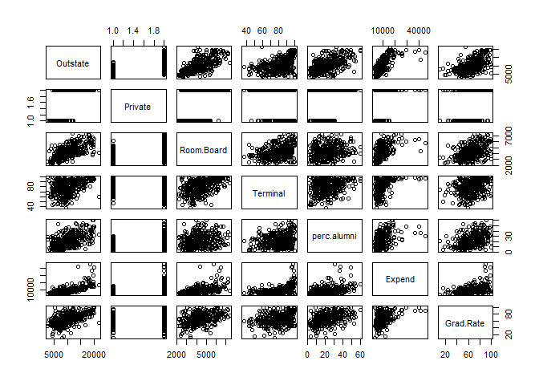

## load data


```
## 
## Attaching package: 'dplyr'
```

```
## The following objects are masked from 'package:stats':
## 
##     filter, lag
```

```
## The following objects are masked from 'package:base':
## 
##     intersect, setdiff, setequal, union
```

# 7.8 Lab: Non-linear Modeling
## 7.8.1 Polynomial Regression and Step Functions


```r
fit <- lm(wage ~ poly(age,4), data = Wage)
coef(summary(fit))
```

```
##                 Estimate Std. Error    t value     Pr(>|t|)
## (Intercept)    111.70361  0.7287409 153.283015 0.000000e+00
## poly(age, 4)1  447.06785 39.9147851  11.200558 1.484604e-28
## poly(age, 4)2 -478.31581 39.9147851 -11.983424 2.355831e-32
## poly(age, 4)3  125.52169 39.9147851   3.144742 1.678622e-03
## poly(age, 4)4  -77.91118 39.9147851  -1.951938 5.103865e-02
```

```r
fit2 <- lm(wage ~ poly(age,4,raw=T), data = Wage)
coef(summary(fit2))
```

```
##                             Estimate   Std. Error   t value     Pr(>|t|)
## (Intercept)            -1.841542e+02 6.004038e+01 -3.067172 0.0021802539
## poly(age, 4, raw = T)1  2.124552e+01 5.886748e+00  3.609042 0.0003123618
## poly(age, 4, raw = T)2 -5.638593e-01 2.061083e-01 -2.735743 0.0062606446
## poly(age, 4, raw = T)3  6.810688e-03 3.065931e-03  2.221409 0.0263977518
## poly(age, 4, raw = T)4 -3.203830e-05 1.641359e-05 -1.951938 0.0510386498
```

```r
fit2a <- lm(wage ~ age + I(age^2) + I(age^3) + I(age^4), data = Wage)
coef(fit2a)
```

```
##   (Intercept)           age      I(age^2)      I(age^3)      I(age^4) 
## -1.841542e+02  2.124552e+01 -5.638593e-01  6.810688e-03 -3.203830e-05
```

```r
fit2b <- lm(wage ~ age + age^2 + age^3 + age^4, data = Wage)
coef(fit2b)
```

```
## (Intercept)         age 
##  81.7047354   0.7072759
```

```r
agelims <- range(Wage$age)
age.grid <- seq(agelims[1], agelims[2])
preds <- predict(fit, newdata = list(age = age.grid), se = T)
se.bands <- cbind(preds$fit + 2*preds$se.fit, preds$fit - 2*preds$se.fit)

plot(Wage$age, Wage$wage, xlim=agelims, cex =.5, col="darkgrey")
title("Degree-4 Polynomial", outer=T)
lines(age.grid, preds$fit, lwd=2, col="blue")
matlines(age.grid, se.bands, lwd=1, col="blue", lty=3)
```

<!-- -->

```r
preds2 <- predict(fit2, newdata = list(age=age.grid), se=TRUE)
max(abs(preds$fit - preds2$fit))
```

```
## [1] 7.81597e-11
```

```r
fit.1 <- lm(wage ~ age, data=Wage)
fit.2 <- lm(wage ~ poly(age ,2), data=Wage)
fit.3 <- lm(wage ~ poly(age ,3), data=Wage)
fit.4 <- lm(wage ~ poly(age ,4), data=Wage)
fit.5 <- lm(wage ~ poly(age ,5), data=Wage)
anova(fit.1,fit.2,fit.3,fit.4,fit.5)
```

```
## Analysis of Variance Table
## 
## Model 1: wage ~ age
## Model 2: wage ~ poly(age, 2)
## Model 3: wage ~ poly(age, 3)
## Model 4: wage ~ poly(age, 4)
## Model 5: wage ~ poly(age, 5)
##   Res.Df     RSS Df Sum of Sq        F    Pr(>F)    
## 1   2998 5022216                                    
## 2   2997 4793430  1    228786 143.5931 < 2.2e-16 ***
## 3   2996 4777674  1     15756   9.8888  0.001679 ** 
## 4   2995 4771604  1      6070   3.8098  0.051046 .  
## 5   2994 4770322  1      1283   0.8050  0.369682    
## ---
## Signif. codes:  0 '***' 0.001 '**' 0.01 '*' 0.05 '.' 0.1 ' ' 1
```

```r
coef(summary(fit.5))
```

```
##                 Estimate Std. Error     t value     Pr(>|t|)
## (Intercept)    111.70361  0.7287647 153.2780243 0.000000e+00
## poly(age, 5)1  447.06785 39.9160847  11.2001930 1.491111e-28
## poly(age, 5)2 -478.31581 39.9160847 -11.9830341 2.367734e-32
## poly(age, 5)3  125.52169 39.9160847   3.1446392 1.679213e-03
## poly(age, 5)4  -77.91118 39.9160847  -1.9518743 5.104623e-02
## poly(age, 5)5  -35.81289 39.9160847  -0.8972045 3.696820e-01
```

```r
(-11.983)^2
```

```
## [1] 143.5923
```

```r
fit.1 <- lm(wage ~ education + age, data=Wage)
fit.2 <- lm(wage ~ education + poly(age, 2), data=Wage)
fit.3 <- lm(wage ~ education + poly(age, 3), data=Wage)
anova(fit.1,fit.2,fit.3)
```

```
## Analysis of Variance Table
## 
## Model 1: wage ~ education + age
## Model 2: wage ~ education + poly(age, 2)
## Model 3: wage ~ education + poly(age, 3)
##   Res.Df     RSS Df Sum of Sq        F Pr(>F)    
## 1   2994 3867992                                 
## 2   2993 3725395  1    142597 114.6969 <2e-16 ***
## 3   2992 3719809  1      5587   4.4936 0.0341 *  
## ---
## Signif. codes:  0 '***' 0.001 '**' 0.01 '*' 0.05 '.' 0.1 ' ' 1
```

```r
fit <- glm(I(wage>250) ~ poly(age, 4), data=Wage, family=binomial)
preds <- predict(fit, newdata = list(age=age.grid), se=T)

pfit <- exp(preds$fit)/(1+exp(preds$fit))
se.bands.logit <- cbind(preds$fit + 2*preds$se.fit, preds$fit - 2*preds$se.fit)
se.bands <- exp(se.bands.logit)/(1+exp(se.bands.logit))

preds <- predict(fit, newdata = list(age=age.grid), type="response", se=T)

plot(Wage$age, I(Wage$wage>250), xlim=agelims, type="n", ylim=c(0,.2))
points(jitter(Wage$age), I((Wage$wage>250)/5), cex=.5, pch ="|", col="darkgrey")
lines(age.grid, pfit, lwd=2, col="blue")
matlines(age.grid, se.bands, lwd=1, col="blue", lty=3)
```

<!-- -->

```r
table(cut(Wage$age, 4))
```

```
## 
## (17.9,33.5]   (33.5,49]   (49,64.5] (64.5,80.1] 
##         750        1399         779          72
```

```r
fit <- lm(wage ~ cut(age, 4), data=Wage)
coef(summary(fit))
```

```
##                         Estimate Std. Error   t value     Pr(>|t|)
## (Intercept)            94.158392   1.476069 63.789970 0.000000e+00
## cut(age, 4)(33.5,49]   24.053491   1.829431 13.148074 1.982315e-38
## cut(age, 4)(49,64.5]   23.664559   2.067958 11.443444 1.040750e-29
## cut(age, 4)(64.5,80.1]  7.640592   4.987424  1.531972 1.256350e-01
```

## 7.8.2 Splines


```r
library(splines)
fit <- lm(wage ~ bs(age, knots=c(25,40,60)), data=Wage)
pred <- predict(fit, newdata = list(age=age.grid), se=T)
plot(Wage$age, Wage$wage, col="gray")
lines(age.grid, pred$fit, lwd=2)
lines(age.grid, pred$fit + 2*pred$se, lty="dashed")
lines(age.grid, pred$fit - 2*pred$se, lty="dashed")

dim(bs(Wage$age, knots=c(25,40,60)))
```

```
## [1] 3000    6
```

```r
dim(bs(Wage$age, df=6))
```

```
## [1] 3000    6
```

```r
attr(bs(Wage$age, df=6), "knots")
```

```
##   25%   50%   75% 
## 33.75 42.00 51.00
```

```r
fit2 <- lm(wage ~ ns(age, df=4), data=Wage)
pred2 <- predict(fit2, newdata=list(age=age.grid), se=T)
lines(age.grid, pred2$fit, col="red", lwd=2)
```

<!-- -->

```r
plot(Wage$age, Wage$wage, xlim=agelims, cex=.5, col="darkgrey")
title("Smoothing Spline")
fit <- smooth.spline(Wage$age, Wage$wage, df=16)
fit2 <- smooth.spline(Wage$age, Wage$wage, cv=TRUE)
```

```
## Warning in smooth.spline(Wage$age, Wage$wage, cv = TRUE): cross-validation
## with non-unique 'x' values seems doubtful
```

```r
fit2$df
```

```
## [1] 6.794596
```

```r
lines(fit, col="red", lwd=2)
lines(fit2, col="blue", lwd=2)
legend("topright", legend=c("16 DF", "6.8 DF"), col=c("red","blue"), lty=1, lwd=2, cex=.8)
```

<!-- -->

```r
plot(Wage$age, Wage$wage, xlim=agelims, cex=.5, col="darkgrey")
title("Local Regression")
fit <- loess(wage ~ age, span=.2, data=Wage)
fit2 <- loess(wage ~ age, span=.5, data=Wage)
lines(age.grid, predict(fit, data.frame(age=age.grid)), col="red", lwd=2)
lines(age.grid, predict(fit2, data.frame(age=age.grid)), col="blue", lwd=2)
legend("topright", legend=c("Span=0.2","Span=0.5"), col=c("red","blue"), lty=1, lwd=2, cex=.8)
```

<!-- -->

## 7.8.3 GAMs


```r
library(gam)
```

```
## Warning: package 'gam' was built under R version 3.4.4
```

```
## Loading required package: foreach
```

```
## Loaded gam 1.15
```

```r
gam1 <- lm(wage ~ ns(year, 4) + ns(age, 5) + education, data=Wage)
gam.m3 <- gam(wage ~ s(year, 4) + s(age, 5) + education, data=Wage)

plot(gam.m3, se=TRUE ,col ="blue")
```

<!-- --><!-- --><!-- -->

```r
par(mfrow=c(1,3))
plot.Gam(gam1, se=TRUE, col="red")
```

<!-- -->

```r
gam.m1 <- gam(wage ~ s(age, 5) + education, data=Wage)
gam.m2 <- gam(wage ~ year + s(age, 5) + education, data=Wage)
gam.m3 <- gam(wage ~ s(year, 4) + s(age, 5) + education, data=Wage)
anova(gam.m1,gam.m2,gam.m3,test="F")
```

```
## Analysis of Deviance Table
## 
## Model 1: wage ~ s(age, 5) + education
## Model 2: wage ~ year + s(age, 5) + education
## Model 3: wage ~ s(year, 4) + s(age, 5) + education
##   Resid. Df Resid. Dev Df Deviance       F    Pr(>F)    
## 1      2990    3711731                                  
## 2      2989    3693842  1  17889.2 14.4771 0.0001447 ***
## 3      2986    3689770  3   4071.1  1.0982 0.3485661    
## ---
## Signif. codes:  0 '***' 0.001 '**' 0.01 '*' 0.05 '.' 0.1 ' ' 1
```

```r
summary (gam.m3)
```

```
## 
## Call: gam(formula = wage ~ s(year, 4) + s(age, 5) + education, data = Wage)
## Deviance Residuals:
##     Min      1Q  Median      3Q     Max 
## -119.43  -19.70   -3.33   14.17  213.48 
## 
## (Dispersion Parameter for gaussian family taken to be 1235.69)
## 
##     Null Deviance: 5222086 on 2999 degrees of freedom
## Residual Deviance: 3689770 on 2986 degrees of freedom
## AIC: 29887.75 
## 
## Number of Local Scoring Iterations: 2 
## 
## Anova for Parametric Effects
##              Df  Sum Sq Mean Sq F value    Pr(>F)    
## s(year, 4)    1   27162   27162  21.981 2.877e-06 ***
## s(age, 5)     1  195338  195338 158.081 < 2.2e-16 ***
## education     4 1069726  267432 216.423 < 2.2e-16 ***
## Residuals  2986 3689770    1236                      
## ---
## Signif. codes:  0 '***' 0.001 '**' 0.01 '*' 0.05 '.' 0.1 ' ' 1
## 
## Anova for Nonparametric Effects
##             Npar Df Npar F  Pr(F)    
## (Intercept)                          
## s(year, 4)        3  1.086 0.3537    
## s(age, 5)         4 32.380 <2e-16 ***
## education                            
## ---
## Signif. codes:  0 '***' 0.001 '**' 0.01 '*' 0.05 '.' 0.1 ' ' 1
```

```r
preds <- predict(gam.m2, newdata=Wage)

gam.lo <- gam(wage ~ s(year, df=4) + lo(age, span=0.7) + education, data=Wage)
plot.Gam(gam.lo, se=TRUE, col="green")
```

<!-- -->

```r
gam.lo.i <- gam(wage ~ lo(year, age, span=0.5) + education, data=Wage)
```

```
## Warning in lo.wam(x, z, wz, fit$smooth, which, fit$smooth.frame,
## bf.maxit, : liv too small. (Discovered by lowesd)
```

```
## Warning in lo.wam(x, z, wz, fit$smooth, which, fit$smooth.frame,
## bf.maxit, : lv too small. (Discovered by lowesd)
```

```
## Warning in lo.wam(x, z, wz, fit$smooth, which, fit$smooth.frame,
## bf.maxit, : liv too small. (Discovered by lowesd)
```

```
## Warning in lo.wam(x, z, wz, fit$smooth, which, fit$smooth.frame,
## bf.maxit, : lv too small. (Discovered by lowesd)
```

```r
library(akima)
```

```
## Warning: package 'akima' was built under R version 3.4.4
```

```r
par(mfrow=c(1,1))
plot(gam.lo.i)
```

<!-- --><!-- -->

```r
gam.lr <- gam(I(wage>250) ~ year + s(age, df=5) + education, family=binomial, data=Wage)
par(mfrow=c(1,3))
plot(gam.lr, se=T, col="green")
```

<!-- -->

```r
table(Wage$education, I(Wage$wage>250))
```

```
##                     
##                      FALSE TRUE
##   1. < HS Grad         268    0
##   2. HS Grad           966    5
##   3. Some College      643    7
##   4. College Grad      663   22
##   5. Advanced Degree   381   45
```

```r
gam.lr.s <- gam(I(wage>250) ~ year + s(age, df=5) + education, family=binomial, data=Wage, subset=(education !="1. < HS Grad"))
plot(gam.lr.s, se=T, col="green")
```

<!-- -->

# 7.9 Exercises

### 7. The Wage data set contains a number of other features not explored in this chapter, such as marital status (maritl), job class (jobclass), and others. Explore the relationships between some of these other predictors and wage, and use non-linear fitting techniques in order to it flexible models to the data. Create plots of the results obtained, and write a summary of your findings.


```r
library(ggplot2)
summary(Wage)
```

```
##       year           age                     maritl           race     
##  Min.   :2003   Min.   :18.00   1. Never Married: 648   1. White:2480  
##  1st Qu.:2004   1st Qu.:33.75   2. Married      :2074   2. Black: 293  
##  Median :2006   Median :42.00   3. Widowed      :  19   3. Asian: 190  
##  Mean   :2006   Mean   :42.41   4. Divorced     : 204   4. Other:  37  
##  3rd Qu.:2008   3rd Qu.:51.00   5. Separated    :  55                  
##  Max.   :2009   Max.   :80.00                                          
##                                                                        
##               education                     region    
##  1. < HS Grad      :268   2. Middle Atlantic   :3000  
##  2. HS Grad        :971   1. New England       :   0  
##  3. Some College   :650   3. East North Central:   0  
##  4. College Grad   :685   4. West North Central:   0  
##  5. Advanced Degree:426   5. South Atlantic    :   0  
##                           6. East South Central:   0  
##                           (Other)              :   0  
##            jobclass               health      health_ins      logwage     
##  1. Industrial :1544   1. <=Good     : 858   1. Yes:2083   Min.   :3.000  
##  2. Information:1456   2. >=Very Good:2142   2. No : 917   1st Qu.:4.447  
##                                                            Median :4.653  
##                                                            Mean   :4.654  
##                                                            3rd Qu.:4.857  
##                                                            Max.   :5.763  
##                                                                           
##       wage       
##  Min.   : 20.09  
##  1st Qu.: 85.38  
##  Median :104.92  
##  Mean   :111.70  
##  3rd Qu.:128.68  
##  Max.   :318.34  
## 
```

```r
fit.1 <- lm(wage ~ education, data=Wage)
fit.2 <- lm(wage ~ education + maritl, data=Wage)
fit.3 <- lm(wage ~ education + maritl + age, data=Wage)
fit.4 <- lm(wage ~ education + maritl + poly(age, 2), data=Wage)
fit.5 <- lm(wage ~ education + maritl + poly(age, 3), data=Wage)

anova(fit.1,fit.2,fit.3,fit.4,fit.5)
```

```
## Analysis of Variance Table
## 
## Model 1: wage ~ education
## Model 2: wage ~ education + maritl
## Model 3: wage ~ education + maritl + age
## Model 4: wage ~ education + maritl + poly(age, 2)
## Model 5: wage ~ education + maritl + poly(age, 3)
##   Res.Df     RSS Df Sum of Sq       F    Pr(>F)    
## 1   2995 3995721                                   
## 2   2991 3738343  4    257378 53.0306 < 2.2e-16 ***
## 3   2990 3705884  1     32460 26.7521 2.466e-07 ***
## 4   2989 3626853  1     79030 65.1342 1.003e-15 ***
## 5   2988 3625481  1      1372  1.1306    0.2877    
## ---
## Signif. codes:  0 '***' 0.001 '**' 0.01 '*' 0.05 '.' 0.1 ' ' 1
```

```r
summary(fit.4)
```

```
## 
## Call:
## lm(formula = wage ~ education + maritl + poly(age, 2), data = Wage)
## 
## Residuals:
##      Min       1Q   Median       3Q      Max 
## -116.033  -19.354   -3.154   14.459  213.308 
## 
## Coefficients:
##                              Estimate Std. Error t value Pr(>|t|)    
## (Intercept)                   75.7134     2.5824  29.319  < 2e-16 ***
## education2. HS Grad           10.9538     2.4095   4.546 5.68e-06 ***
## education3. Some College      23.5542     2.5373   9.283  < 2e-16 ***
## education4. College Grad      37.9991     2.5233  15.060  < 2e-16 ***
## education5. Advanced Degree   62.0815     2.7418  22.643  < 2e-16 ***
## maritl2. Married              13.9990     1.8329   7.638 2.96e-14 ***
## maritl3. Widowed              -0.4873     8.1902  -0.059    0.953    
## maritl4. Divorced              0.4906     3.0035   0.163    0.870    
## maritl5. Separated             7.6989     4.9985   1.540    0.124    
## poly(age, 2)1                250.0901    39.6420   6.309 3.23e-10 ***
## poly(age, 2)2               -297.5155    36.8650  -8.070 1.00e-15 ***
## ---
## Signif. codes:  0 '***' 0.001 '**' 0.01 '*' 0.05 '.' 0.1 ' ' 1
## 
## Residual standard error: 34.83 on 2989 degrees of freedom
## Multiple R-squared:  0.3055,	Adjusted R-squared:  0.3032 
## F-statistic: 131.5 on 10 and 2989 DF,  p-value: < 2.2e-16
```

```r
plot.Gam(fit.4, se=TRUE, col="red")
```

<!-- --><!-- --><!-- -->

```r
gam.m1 <- gam(wage ~ race, data=Wage)
gam.m2 <- gam(wage ~ race + education, data=Wage)
gam.m3 <- gam(wage ~ race + education + jobclass, data=Wage)
anova(gam.m1,gam.m2,gam.m3,test="F")
```

```
## Analysis of Deviance Table
## 
## Model 1: wage ~ race
## Model 2: wage ~ race + education
## Model 3: wage ~ race + education + jobclass
##   Resid. Df Resid. Dev Df Deviance       F    Pr(>F)    
## 1      2996    5158874                                  
## 2      2992    3979117  4  1179757 223.047 < 2.2e-16 ***
## 3      2991    3955059  1    24058  18.194 2.057e-05 ***
## ---
## Signif. codes:  0 '***' 0.001 '**' 0.01 '*' 0.05 '.' 0.1 ' ' 1
```

```r
summary (gam.m3)
```

```
## 
## Call: gam(formula = wage ~ race + education + jobclass, data = Wage)
## Deviance Residuals:
##      Min       1Q   Median       3Q      Max 
## -108.808  -20.848   -3.575   15.489  225.064 
## 
## (Dispersion Parameter for gaussian family taken to be 1322.32)
## 
##     Null Deviance: 5222086 on 2999 degrees of freedom
## Residual Deviance: 3955059 on 2991 degrees of freedom
## AIC: 30086.05 
## 
## Number of Local Scoring Iterations: 2 
## 
## Anova for Parametric Effects
##             Df  Sum Sq Mean Sq F value    Pr(>F)    
## race         3   63212   21071  15.935 2.811e-10 ***
## education    4 1179757  294939 223.047 < 2.2e-16 ***
## jobclass     1   24058   24058  18.194 2.057e-05 ***
## Residuals 2991 3955059    1322                      
## ---
## Signif. codes:  0 '***' 0.001 '**' 0.01 '*' 0.05 '.' 0.1 ' ' 1
```

```r
plot(gam.m3)
```

<!-- --><!-- --><!-- -->

```r
par(mfrow = c(1,1))
preds <- predict(gam.m3, newdata=Wage)
df <- cbind(Observed = Wage$wage, Predicted = preds)
plot(df)
abline(0,1, col="red")
```

<!-- -->

```r
# Remove high earners
gam.m3 <- gam(wage ~ race + education + jobclass, data=subset(Wage, subset = wage < 250))
preds <- predict(gam.m3, newdata=subset(Wage, subset = wage < 250))
df <- cbind(Observed = subset(Wage, subset = wage < 250)$wage, Predicted = preds)
plot(df)
abline(0,1, col="red")
```

<!-- -->

```r
# Add more in
gam.m4 <- gam(wage ~ race + education + jobclass + s(age, df=5), data=Wage)
preds <- predict(gam.m4, newdata=Wage)
df <- cbind(Observed = Wage$wage, Predicted = preds)
plot(df)
abline(0,1, col="red")
```

<!-- -->

```r
# Add more in
gam.m5 <- gam(wage ~ race + education + jobclass + s(age, df=5) + maritl, data=Wage)
preds <- predict(gam.m5, newdata=Wage)
df <- cbind(Observed = Wage$wage, Predicted = preds)
plot(df)
abline(0,1, col="red")
```

<!-- -->

```r
# Add more in
gam.m6 <- gam(wage ~ race + education + jobclass + s(age, df=5) + maritl + year, data=Wage)
preds <- predict(gam.m6, newdata=Wage)
df <- cbind(Observed = Wage$wage, Predicted = preds)
plot(df)
abline(0,1, col="red")
```

<!-- -->

```r
# Plot all 6 but with high earners removed
gam.m1 <- gam(wage ~ race, data=subset(Wage, subset = wage < 250))
gam.m2 <- gam(wage ~ race + education, data=subset(Wage, subset = wage < 250))
gam.m3 <- gam(wage ~ race + education + jobclass, data=subset(Wage, subset = wage < 250))
gam.m4 <- gam(wage ~ race + education + jobclass + s(age, df=5), data=subset(Wage, subset = wage < 250))
gam.m5 <- gam(wage ~ race + education + jobclass + s(age, df=5) + maritl, data=subset(Wage, subset = wage < 250))
gam.m6 <- gam(wage ~ race + education + jobclass + s(age, df=5) + maritl + year, data=subset(Wage, subset = wage < 250))

par(mfrow=c(2,3))
for(i in 1:6){
  fit <- get(paste0("gam.m",i))
  preds <- predict(fit, newdata=subset(Wage, subset = wage < 250))
  df <- cbind(Observed = subset(Wage, subset = wage < 250)$wage, Predicted = preds)
  plot(df)
  title(paste("Model", i))
  abline(0,1, col="red")
}
```

<!-- -->

```r
fits <- paste0("anova(",paste0("gam.m",1:6, collapse = ","),")")
fits
```

```
## [1] "anova(gam.m1,gam.m2,gam.m3,gam.m4,gam.m5,gam.m6)"
```

```r
eval(parse(text = fits))
```

```
## Analysis of Deviance Table
## 
## Model 1: wage ~ race
## Model 2: wage ~ race + education
## Model 3: wage ~ race + education + jobclass
## Model 4: wage ~ race + education + jobclass + s(age, df = 5)
## Model 5: wage ~ race + education + jobclass + s(age, df = 5) + maritl
## Model 6: wage ~ race + education + jobclass + s(age, df = 5) + maritl + 
##     year
##   Resid. Df Resid. Dev     Df Deviance  Pr(>Chi)    
## 1      2917    2930116                              
## 2      2913    2254704 4.0000   675412 < 2.2e-16 ***
## 3      2912    2243995 1.0000    10709 6.553e-05 ***
## 4      2907    2031095 5.0002   212900 < 2.2e-16 ***
## 5      2903    1967973 4.0000    63123 < 2.2e-16 ***
## 6      2902    1950171 1.0000    17802 2.648e-07 ***
## ---
## Signif. codes:  0 '***' 0.001 '**' 0.01 '*' 0.05 '.' 0.1 ' ' 1
```

### 8. Fit some of the non-linear models investigated in this chapter to the Auto data set. Is there evidence for non-linear relationships in this data set? Create some informative plots to justify your answer.


```r
library(boot)
summary(Auto)
```

```
##       mpg          cylinders      displacement     horsepower   
##  Min.   : 9.00   Min.   :3.000   Min.   : 68.0   Min.   : 46.0  
##  1st Qu.:17.00   1st Qu.:4.000   1st Qu.:105.0   1st Qu.: 75.0  
##  Median :22.75   Median :4.000   Median :151.0   Median : 93.5  
##  Mean   :23.45   Mean   :5.472   Mean   :194.4   Mean   :104.5  
##  3rd Qu.:29.00   3rd Qu.:8.000   3rd Qu.:275.8   3rd Qu.:126.0  
##  Max.   :46.60   Max.   :8.000   Max.   :455.0   Max.   :230.0  
##                                                                 
##      weight      acceleration        year           origin     
##  Min.   :1613   Min.   : 8.00   Min.   :70.00   Min.   :1.000  
##  1st Qu.:2225   1st Qu.:13.78   1st Qu.:73.00   1st Qu.:1.000  
##  Median :2804   Median :15.50   Median :76.00   Median :1.000  
##  Mean   :2978   Mean   :15.54   Mean   :75.98   Mean   :1.577  
##  3rd Qu.:3615   3rd Qu.:17.02   3rd Qu.:79.00   3rd Qu.:2.000  
##  Max.   :5140   Max.   :24.80   Max.   :82.00   Max.   :3.000  
##                                                                
##                  name    
##  amc matador       :  5  
##  ford pinto        :  5  
##  toyota corolla    :  5  
##  amc gremlin       :  4  
##  amc hornet        :  4  
##  chevrolet chevette:  4  
##  (Other)           :365
```

```r
small.auto <- Auto[,-9]
summary(small.auto)
```

```
##       mpg          cylinders      displacement     horsepower   
##  Min.   : 9.00   Min.   :3.000   Min.   : 68.0   Min.   : 46.0  
##  1st Qu.:17.00   1st Qu.:4.000   1st Qu.:105.0   1st Qu.: 75.0  
##  Median :22.75   Median :4.000   Median :151.0   Median : 93.5  
##  Mean   :23.45   Mean   :5.472   Mean   :194.4   Mean   :104.5  
##  3rd Qu.:29.00   3rd Qu.:8.000   3rd Qu.:275.8   3rd Qu.:126.0  
##  Max.   :46.60   Max.   :8.000   Max.   :455.0   Max.   :230.0  
##      weight      acceleration        year           origin     
##  Min.   :1613   Min.   : 8.00   Min.   :70.00   Min.   :1.000  
##  1st Qu.:2225   1st Qu.:13.78   1st Qu.:73.00   1st Qu.:1.000  
##  Median :2804   Median :15.50   Median :76.00   Median :1.000  
##  Mean   :2978   Mean   :15.54   Mean   :75.98   Mean   :1.577  
##  3rd Qu.:3615   3rd Qu.:17.02   3rd Qu.:79.00   3rd Qu.:2.000  
##  Max.   :5140   Max.   :24.80   Max.   :82.00   Max.   :3.000
```

```r
fit <- lm(mpg ~ ., data = small.auto)
summary(fit)
```

```
## 
## Call:
## lm(formula = mpg ~ ., data = small.auto)
## 
## Residuals:
##     Min      1Q  Median      3Q     Max 
## -9.5903 -2.1565 -0.1169  1.8690 13.0604 
## 
## Coefficients:
##                Estimate Std. Error t value Pr(>|t|)    
## (Intercept)  -17.218435   4.644294  -3.707  0.00024 ***
## cylinders     -0.493376   0.323282  -1.526  0.12780    
## displacement   0.019896   0.007515   2.647  0.00844 ** 
## horsepower    -0.016951   0.013787  -1.230  0.21963    
## weight        -0.006474   0.000652  -9.929  < 2e-16 ***
## acceleration   0.080576   0.098845   0.815  0.41548    
## year           0.750773   0.050973  14.729  < 2e-16 ***
## origin         1.426141   0.278136   5.127 4.67e-07 ***
## ---
## Signif. codes:  0 '***' 0.001 '**' 0.01 '*' 0.05 '.' 0.1 ' ' 1
## 
## Residual standard error: 3.328 on 384 degrees of freedom
## Multiple R-squared:  0.8215,	Adjusted R-squared:  0.8182 
## F-statistic: 252.4 on 7 and 384 DF,  p-value: < 2.2e-16
```

```r
# Focus on weight
weight.range <- range(small.auto$weight)
weight.grid <- seq(weight.range[1],weight.range[2])
deltas <- rep(NA,10)
for(i in 1:10){
    fit <- glm(mpg ~ poly(weight, i), data = small.auto)
    deltas[i] <- cv.glm(small.auto, fit, K = 10)$delta[1]
    names(deltas)[i] <- paste0("Degree = ", i)
}
deltas
```

```
##  Degree = 1  Degree = 2  Degree = 3  Degree = 4  Degree = 5  Degree = 6 
##    18.90436    17.49091    17.59658    17.82971    17.52283    17.71260 
##  Degree = 7  Degree = 8  Degree = 9 Degree = 10 
##    17.70201    17.89738    18.76646    18.95916
```

```r
plot(1:10, deltas, xlab = "Degree", ylab = "Test MSE", type = "l")
(d.min <- which.min(deltas))
```

```
## Degree = 2 
##          2
```

```r
points(d.min, deltas[d.min], col = "red", cex = 2, pch = 20)
```

<!-- -->

```r
fit <- lm(mpg ~ poly(weight, d.min), data=small.auto)
preds <- predict(fit, newdata = list(weight=weight.grid), se=TRUE)
se.bands <- cbind(preds$fit + 2*preds$se.fit, preds$fit - 2*preds$se.fit)

plot(small.auto$weight, small.auto$mpg, xlim=weight.range, cex =.5, col="darkgrey")
title(paste0("Degree-", d.min," Polynomial"), outer=T)
lines(weight.grid, preds$fit, lwd=2, col="blue")
matlines(weight.grid, se.bands, lwd=1, col="blue", lty=3)
```

<!-- -->

```r
### New methods weight,displacement, and cylinders
gam.m1 <- gam(mpg ~ weight, data=small.auto)
gam.m2 <- gam(mpg ~ s(weight, 5), data=small.auto)
gam.m3 <- gam(mpg ~ s(weight, 5) + displacement, data=small.auto)
gam.m4 <- gam(mpg ~ s(weight, 5) + s(displacement, 5), data=small.auto)
gam.m5 <- gam(mpg ~ s(weight, 5) + s(displacement, 5) + cylinders, data=small.auto)

par(mfrow=c(1,1))

for(i in 1:5){
  fit <- get(paste0("gam.m",i))
  preds <- predict(fit, newdata=small.auto)
  df <- cbind(Observed = small.auto$mpg, Predicted = preds)
  plot(df)
  title(paste("Model", i))
  abline(0,1, col="red")
}
```

<!-- --><!-- --><!-- --><!-- --><!-- -->

```r
fits <- paste0("anova(",paste0("gam.m",1:5, collapse = ","),")")
fits
```

```
## [1] "anova(gam.m1,gam.m2,gam.m3,gam.m4,gam.m5)"
```

```r
eval(parse(text = fits))
```

```
## Analysis of Deviance Table
## 
## Model 1: mpg ~ weight
## Model 2: mpg ~ s(weight, 5)
## Model 3: mpg ~ s(weight, 5) + displacement
## Model 4: mpg ~ s(weight, 5) + s(displacement, 5)
## Model 5: mpg ~ s(weight, 5) + s(displacement, 5) + cylinders
##   Resid. Df Resid. Dev     Df Deviance  Pr(>Chi)    
## 1       390     7321.2                              
## 2       386     6738.0 4.0000   583.25 5.013e-07 ***
## 3       385     6525.8 1.0000   212.18 0.0003708 ***
## 4       381     6362.6 3.9998   163.20 0.0448783 *  
## 5       380     6361.6 1.0000     0.98 0.8091580    
## ---
## Signif. codes:  0 '***' 0.001 '**' 0.01 '*' 0.05 '.' 0.1 ' ' 1
```

## 10. This question relates to the College data set.
  (a) Split the data into a training set and a test set. Using out-of-state tuition as the response and the other variables as the predictors, perform forward stepwise selection on the training set in order to identify a satisfactory model that uses just a subset of the predictors.  
  

```r
library(leaps)
set.seed(1)
train.split <- sample(1:nrow(College), nrow(College)/2, replace = F)
train.vector <- 1:nrow(College)
train.vector[train.split] <- FALSE
train.vector <- as.logical(train.vector)
train <- College[train.vector,]
test <- College[!train.vector,]
forward.fit.1 <- regsubsets(Outstate ~ ., data=train, nvmax=17, method = "forward")
summary(forward.fit.1)
```

```
## Subset selection object
## Call: regsubsets.formula(Outstate ~ ., data = train, nvmax = 17, method = "forward")
## 17 Variables  (and intercept)
##             Forced in Forced out
## PrivateYes      FALSE      FALSE
## Apps            FALSE      FALSE
## Accept          FALSE      FALSE
## Enroll          FALSE      FALSE
## Top10perc       FALSE      FALSE
## Top25perc       FALSE      FALSE
## F.Undergrad     FALSE      FALSE
## P.Undergrad     FALSE      FALSE
## Room.Board      FALSE      FALSE
## Books           FALSE      FALSE
## Personal        FALSE      FALSE
## PhD             FALSE      FALSE
## Terminal        FALSE      FALSE
## S.F.Ratio       FALSE      FALSE
## perc.alumni     FALSE      FALSE
## Expend          FALSE      FALSE
## Grad.Rate       FALSE      FALSE
## 1 subsets of each size up to 17
## Selection Algorithm: forward
##           PrivateYes Apps Accept Enroll Top10perc Top25perc F.Undergrad
## 1  ( 1 )  " "        " "  " "    " "    " "       " "       " "        
## 2  ( 1 )  "*"        " "  " "    " "    " "       " "       " "        
## 3  ( 1 )  "*"        " "  " "    " "    " "       " "       " "        
## 4  ( 1 )  "*"        " "  " "    " "    " "       " "       " "        
## 5  ( 1 )  "*"        " "  " "    " "    " "       " "       " "        
## 6  ( 1 )  "*"        " "  " "    " "    " "       " "       " "        
## 7  ( 1 )  "*"        " "  " "    " "    " "       " "       " "        
## 8  ( 1 )  "*"        " "  " "    " "    " "       "*"       " "        
## 9  ( 1 )  "*"        " "  " "    " "    " "       "*"       " "        
## 10  ( 1 ) "*"        " "  " "    " "    " "       "*"       " "        
## 11  ( 1 ) "*"        " "  "*"    " "    " "       "*"       " "        
## 12  ( 1 ) "*"        " "  "*"    " "    " "       "*"       "*"        
## 13  ( 1 ) "*"        "*"  "*"    " "    " "       "*"       "*"        
## 14  ( 1 ) "*"        "*"  "*"    " "    "*"       "*"       "*"        
## 15  ( 1 ) "*"        "*"  "*"    "*"    "*"       "*"       "*"        
## 16  ( 1 ) "*"        "*"  "*"    "*"    "*"       "*"       "*"        
## 17  ( 1 ) "*"        "*"  "*"    "*"    "*"       "*"       "*"        
##           P.Undergrad Room.Board Books Personal PhD Terminal S.F.Ratio
## 1  ( 1 )  " "         " "        " "   " "      " " " "      " "      
## 2  ( 1 )  " "         " "        " "   " "      " " " "      " "      
## 3  ( 1 )  " "         "*"        " "   " "      " " " "      " "      
## 4  ( 1 )  " "         "*"        " "   " "      "*" " "      " "      
## 5  ( 1 )  " "         "*"        " "   " "      "*" " "      " "      
## 6  ( 1 )  " "         "*"        " "   " "      "*" " "      " "      
## 7  ( 1 )  "*"         "*"        " "   " "      "*" " "      " "      
## 8  ( 1 )  "*"         "*"        " "   " "      "*" " "      " "      
## 9  ( 1 )  "*"         "*"        "*"   " "      "*" " "      " "      
## 10  ( 1 ) "*"         "*"        "*"   " "      "*" "*"      " "      
## 11  ( 1 ) "*"         "*"        "*"   " "      "*" "*"      " "      
## 12  ( 1 ) "*"         "*"        "*"   " "      "*" "*"      " "      
## 13  ( 1 ) "*"         "*"        "*"   " "      "*" "*"      " "      
## 14  ( 1 ) "*"         "*"        "*"   " "      "*" "*"      " "      
## 15  ( 1 ) "*"         "*"        "*"   " "      "*" "*"      " "      
## 16  ( 1 ) "*"         "*"        "*"   "*"      "*" "*"      " "      
## 17  ( 1 ) "*"         "*"        "*"   "*"      "*" "*"      "*"      
##           perc.alumni Expend Grad.Rate
## 1  ( 1 )  " "         "*"    " "      
## 2  ( 1 )  " "         "*"    " "      
## 3  ( 1 )  " "         "*"    " "      
## 4  ( 1 )  " "         "*"    " "      
## 5  ( 1 )  " "         "*"    "*"      
## 6  ( 1 )  "*"         "*"    "*"      
## 7  ( 1 )  "*"         "*"    "*"      
## 8  ( 1 )  "*"         "*"    "*"      
## 9  ( 1 )  "*"         "*"    "*"      
## 10  ( 1 ) "*"         "*"    "*"      
## 11  ( 1 ) "*"         "*"    "*"      
## 12  ( 1 ) "*"         "*"    "*"      
## 13  ( 1 ) "*"         "*"    "*"      
## 14  ( 1 ) "*"         "*"    "*"      
## 15  ( 1 ) "*"         "*"    "*"      
## 16  ( 1 ) "*"         "*"    "*"      
## 17  ( 1 ) "*"         "*"    "*"
```

```r
plot(forward.fit.1)
```

<!-- -->

```r
test.mat <- model.matrix(Outstate ~ ., data=test)
val.errors <- rep(NA ,17)
for(i in 1:17){
  coefi <- coef(forward.fit.1, id=i)
  pred <- test.mat[,names(coefi)]%*%coefi
  val.errors[i] <- mean((test$Outstate-pred)^2)
}
val.errors
```

```
##  [1] 8821185 6203907 5010720 4634997 4303272 4005357 4048535 4101797
##  [9] 4118359 4062706 4046491 4097157 3952826 3930382 3955786 3934331
## [17] 3915644
```

```r
(fit.min <- which.min(val.errors))
```

```
## [1] 17
```

```r
coef(forward.fit.1, fit.min)
```

```
##   (Intercept)    PrivateYes          Apps        Accept        Enroll 
## -1.347552e+03  2.272420e+03 -2.753420e-01  9.683167e-01 -1.001099e+00 
##     Top10perc     Top25perc   F.Undergrad   P.Undergrad    Room.Board 
##  3.315370e+01  2.216477e+00 -9.888497e-02 -3.138594e-02  8.209705e-01 
##         Books      Personal           PhD      Terminal     S.F.Ratio 
## -9.117607e-01 -1.136580e-01  1.391817e+01  1.935739e+01 -1.969134e+01 
##   perc.alumni        Expend     Grad.Rate 
##  3.145744e+01  2.092755e-01  1.874930e+01
```

```r
plot(1:17, val.errors, type = "b")
points(fit.min,val.errors[fit.min], col="red", pch = 20)
```

<!-- -->

  6 looks like a good number to use

  (b) Fit a GAM on the training data, using out-of-state tuition as the response and the features selected in the previous step as the predictors. Plot the results, and explain your findings.  
  

```r
selected <- sub("Yes","",names(coef(forward.fit.1, 6)[-1]))
selected
```

```
## [1] "Private"     "Room.Board"  "PhD"         "perc.alumni" "Expend"     
## [6] "Grad.Rate"
```

```r
small.train <- train %>% dplyr::select(Outstate, selected)
plot(small.train)
```

<!-- -->


  (c) Evaluate the model obtained on the test set, and explain the results obtained.  

  (d) For which variables, if any, is there evidence of a non-linear relationship with the response?  
