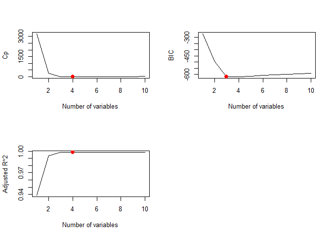
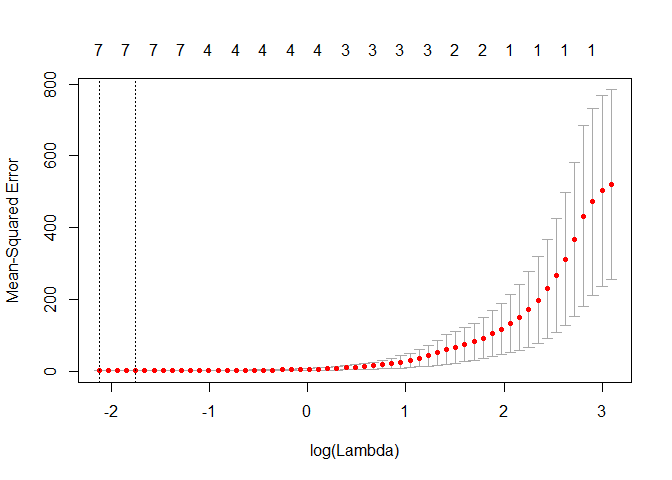
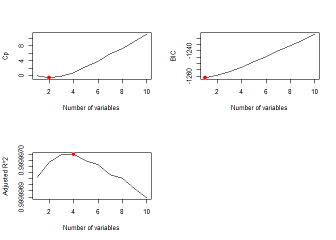
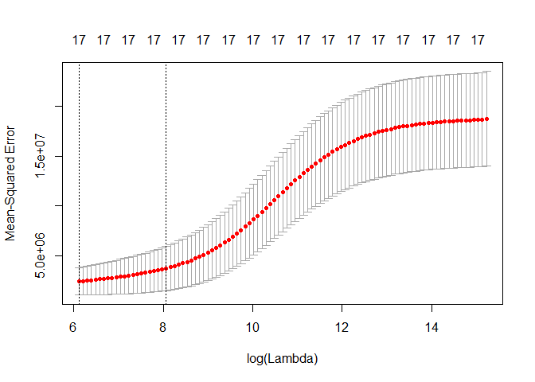
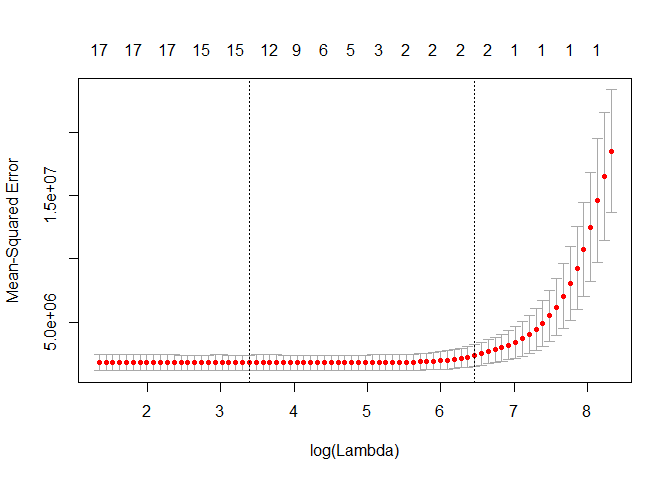
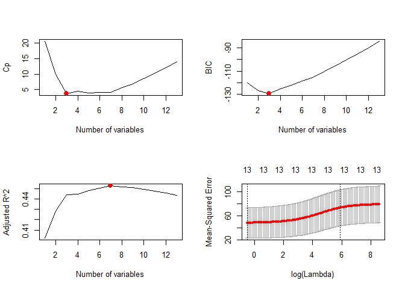
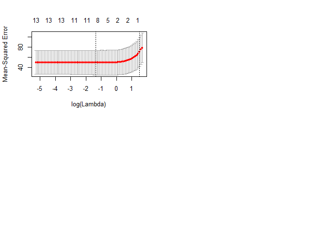

# 6.5.3 Choosing Among Models Using the Validation Set Approach and Cross-Validation


```r
library(ISLR)
library(leaps)
set.seed(1)
train <- sample(c(TRUE ,FALSE), nrow(Hitters),rep=TRUE)
test <- (!train)
regfit.best <- regsubsets(Salary ~ ., data=Hitters[train ,], nvmax=19)
test.mat <- model.matrix(Salary ~ ., data=Hitters [test ,])
val.errors <- rep(NA ,19)
for(i in 1:19){
  coefi <- coef(regfit.best, id=i)
  pred <- test.mat[,names(coefi)]%*%coefi
  val.errors[i] <- mean((na.omit(Hitters$Salary[test])-pred)^2)
}
val.errors
```

```
##  [1] 177714.2 157356.6 160619.2 164844.5 170205.2 162479.9 158430.2
##  [8] 152513.2 148932.0 143826.0 145388.6 147788.5 146810.4 149616.9
## [15] 144581.8 144993.9 146223.4 147094.8 148049.5
```

```r
which.min(val.errors)
```

```
## [1] 10
```

```r
coef(regfit.best ,10)
```

```
## (Intercept)       AtBat        Hits         RBI       Walks      CAtBat 
##  49.2616887  -1.7944396   5.5904675   2.7758087   3.9920711  -0.1752612 
##       CRuns      CWalks     LeagueN   DivisionW     PutOuts 
##   2.4302087  -0.7127743 114.1320379 -60.4814139   0.1600569
```

```r
predict.regsubsets <- function(object, newdata, id, ...){
  form <- as.formula(object$call[[2]])
  mat <- model.matrix(form, newdata)
  coefi <- coef(object, id=id)
  xvars <- names(coefi)
  mat[,xvars]%*%coefi
}

regfit.best <- regsubsets(Salary ~ .,data=Hitters ,nvmax=19)
coef(regfit.best, 10)
```

```
##  (Intercept)        AtBat         Hits        Walks       CAtBat 
##  162.5354420   -2.1686501    6.9180175    5.7732246   -0.1300798 
##        CRuns         CRBI       CWalks    DivisionW      PutOuts 
##    1.4082490    0.7743122   -0.8308264 -112.3800575    0.2973726 
##      Assists 
##    0.2831680
```

```r
k=10
set.seed(1)
folds <- sample(1:k, nrow(Hitters), replace=TRUE)
cv.errors <- matrix(NA,k,19, dimnames=list(NULL, paste(1:19)))

for(j in 1:k){
   best.fit <- regsubsets(Salary ~ ., data=Hitters[folds!=j,], nvmax=19)
    for(i in 1:19){
       pred <- predict(best.fit, Hitters[folds==j,], id=i)
      cv.errors[j,i] <- mean((na.omit(Hitters$Salary[folds==j])-pred)^2)
    }
}

mean.cv.errors <- apply(cv.errors, 2, mean)
mean.cv.errors
```

```
##        1        2        3        4        5        6        7        8 
## 152348.9 136702.2 136342.8 145399.3 136879.8 134925.7 132239.1 126518.4 
##        9       10       11       12       13       14       15       16 
## 124400.6 116020.4 119007.5 124923.1 122364.4 123022.7 122929.8 122133.3 
##       17       18       19 
## 122127.7 122155.8 122295.9
```

```r
par(mfrow=c(1,1))
plot(mean.cv.errors, type='b')
```

<!-- -->

```r
reg.best <- regsubsets(Salary ~ ., data=Hitters, nvmax=19)
coef(reg.best, 10)
```

```
##  (Intercept)        AtBat         Hits        Walks       CAtBat 
##  162.5354420   -2.1686501    6.9180175    5.7732246   -0.1300798 
##        CRuns         CRBI       CWalks    DivisionW      PutOuts 
##    1.4082490    0.7743122   -0.8308264 -112.3800575    0.2973726 
##      Assists 
##    0.2831680
```

# 6.6 Lab 2: Ridge Regression and the Lasso
## 6.6.1 Ridge Regression


```r
library(glmnet)
```

```
## Loading required package: Matrix
```

```
## Loading required package: foreach
```

```
## Loaded glmnet 2.0-13
```

```r
x <- model.matrix(Salary ~ ., Hitters)[,-1]
y <- na.omit(Hitters$Salary)
grid <- 10^seq(10, -2, length =100)
ridge.mod <- glmnet(x, y, alpha=0, lambda=grid)
dim(coef(ridge.mod))
```

```
## [1]  20 100
```

```r
ridge.mod$lambda[50]
```

```
## [1] 11497.57
```

```r
coef(ridge.mod)[,50]
```

```
##   (Intercept)         AtBat          Hits         HmRun          Runs 
## 407.356050200   0.036957182   0.138180344   0.524629976   0.230701523 
##           RBI         Walks         Years        CAtBat         CHits 
##   0.239841459   0.289618741   1.107702929   0.003131815   0.011653637 
##        CHmRun         CRuns          CRBI        CWalks       LeagueN 
##   0.087545670   0.023379882   0.024138320   0.025015421   0.085028114 
##     DivisionW       PutOuts       Assists        Errors    NewLeagueN 
##  -6.215440973   0.016482577   0.002612988  -0.020502690   0.301433531
```

```r
sqrt(sum(coef(ridge.mod)[-1,50]^2))
```

```
## [1] 6.360612
```

```r
ridge.mod$lambda[60]
```

```
## [1] 705.4802
```

```r
coef(ridge.mod)[,60]
```

```
##  (Intercept)        AtBat         Hits        HmRun         Runs 
##  54.32519950   0.11211115   0.65622409   1.17980910   0.93769713 
##          RBI        Walks        Years       CAtBat        CHits 
##   0.84718546   1.31987948   2.59640425   0.01083413   0.04674557 
##       CHmRun        CRuns         CRBI       CWalks      LeagueN 
##   0.33777318   0.09355528   0.09780402   0.07189612  13.68370191 
##    DivisionW      PutOuts      Assists       Errors   NewLeagueN 
## -54.65877750   0.11852289   0.01606037  -0.70358655   8.61181213
```

```r
sqrt(sum(coef(ridge.mod)[-1,60]^2))
```

```
## [1] 57.11001
```

```r
predict(ridge.mod, s=50, type="coefficients")[1:20,]
```

```
##   (Intercept)         AtBat          Hits         HmRun          Runs 
##  4.876610e+01 -3.580999e-01  1.969359e+00 -1.278248e+00  1.145892e+00 
##           RBI         Walks         Years        CAtBat         CHits 
##  8.038292e-01  2.716186e+00 -6.218319e+00  5.447837e-03  1.064895e-01 
##        CHmRun         CRuns          CRBI        CWalks       LeagueN 
##  6.244860e-01  2.214985e-01  2.186914e-01 -1.500245e-01  4.592589e+01 
##     DivisionW       PutOuts       Assists        Errors    NewLeagueN 
## -1.182011e+02  2.502322e-01  1.215665e-01 -3.278600e+00 -9.496680e+00
```

```r
set.seed(1)
train <- sample(1:nrow(x),nrow(x)/2)
test <- (-train)
y.test <- y[test]

ridge.mod <- glmnet(x[train,], y[train], alpha=0, lambda=grid, thresh=1e-12)
ridge.pred <- predict(ridge.mod, s=4, newx=x[test,])
mean((ridge.pred-y.test)^2)
```

```
## [1] 101036.8
```

```r
mean((mean(y[train])-y.test)^2)
```

```
## [1] 193253.1
```

```r
ridge.pred <- predict(ridge.mod, s=1e10, newx=x[test,])
mean((ridge.pred-y.test)^2)
```

```
## [1] 193253.1
```

```r
ridge.pred <- predict(ridge.mod, s=0, newx=x[test,], exact = T, x=x[train,], y=y[train])
mean((ridge.pred-y.test)^2)
```

```
## [1] 114783.1
```

```r
lm(y ~ x, subset=train)
```

```
## 
## Call:
## lm(formula = y ~ x, subset = train)
## 
## Coefficients:
## (Intercept)       xAtBat        xHits       xHmRun        xRuns  
##   299.42849     -2.54027      8.36682     11.64512     -9.09923  
##        xRBI       xWalks       xYears      xCAtBat       xCHits  
##     2.44105      9.23440    -22.93673     -0.18154     -0.11598  
##     xCHmRun       xCRuns        xCRBI      xCWalks     xLeagueN  
##    -1.33888      3.32838      0.07536     -1.07841     59.76065  
##  xDivisionW     xPutOuts     xAssists      xErrors  xNewLeagueN  
##   -98.86233      0.34087      0.34165     -0.64207     -0.67442
```

```r
predict(ridge.mod, s=0, exact=T, type="coefficients", x=x[train,], y=y[train])[1:20,]
```

```
##  (Intercept)        AtBat         Hits        HmRun         Runs 
## 299.42883596  -2.54014665   8.36611719  11.64400720  -9.09877719 
##          RBI        Walks        Years       CAtBat        CHits 
##   2.44152119   9.23403909 -22.93584442  -0.18160843  -0.11561496 
##       CHmRun        CRuns         CRBI       CWalks      LeagueN 
##  -1.33836534   3.32817777   0.07511771  -1.07828647  59.76529059 
##    DivisionW      PutOuts      Assists       Errors   NewLeagueN 
## -98.85996590   0.34086400   0.34165605  -0.64205839  -0.67606314
```

```r
set.seed(1)
cv.out <- cv.glmnet(x[train,], y[train], alpha=0)
plot(cv.out)
```

<!-- -->

```r
bestlam <- cv.out$lambda.min
bestlam
```

```
## [1] 211.7416
```

```r
ridge.pred <- predict(ridge.mod, s=bestlam, newx=x[test,])
mean((ridge.pred - y.test)^2)
```

```
## [1] 96015.51
```

```r
out <- glmnet(x, y, alpha=0)
predict(out, type="coefficients", s=bestlam)[1:20,]
```

```
##  (Intercept)        AtBat         Hits        HmRun         Runs 
##   9.88487157   0.03143991   1.00882875   0.13927624   1.11320781 
##          RBI        Walks        Years       CAtBat        CHits 
##   0.87318990   1.80410229   0.13074381   0.01113978   0.06489843 
##       CHmRun        CRuns         CRBI       CWalks      LeagueN 
##   0.45158546   0.12900049   0.13737712   0.02908572  27.18227535 
##    DivisionW      PutOuts      Assists       Errors   NewLeagueN 
## -91.63411299   0.19149252   0.04254536  -1.81244470   7.21208390
```

## 6.6.2 The Lasso


```r
lasso.mod <- glmnet(x[train,], y[train], alpha=1, lambda=grid)
plot(lasso.mod)
```

<!-- -->

```r
set.seed(1)
cv.out <- cv.glmnet(x[train,], y[train], alpha=1)
plot(cv.out)
```

<!-- -->

```r
bestlam <- cv.out$lambda.min
lasso.pred <- predict(lasso.mod, s=bestlam, newx=x[test,])
mean((lasso.pred - y.test)^2)
```

```
## [1] 100743.4
```

```r
out <- glmnet(x, y, alpha=1, lambda=grid)
lasso.coef <- predict(out, type="coefficients", s= bestlam)[1:20,]
lasso.coef
```

```
##  (Intercept)        AtBat         Hits        HmRun         Runs 
##   18.5394844    0.0000000    1.8735390    0.0000000    0.0000000 
##          RBI        Walks        Years       CAtBat        CHits 
##    0.0000000    2.2178444    0.0000000    0.0000000    0.0000000 
##       CHmRun        CRuns         CRBI       CWalks      LeagueN 
##    0.0000000    0.2071252    0.4130132    0.0000000    3.2666677 
##    DivisionW      PutOuts      Assists       Errors   NewLeagueN 
## -103.4845458    0.2204284    0.0000000    0.0000000    0.0000000
```

# 6.8 Exercises

## 2. For parts (a) through (c), indicate which of i. through iv. is correct. Justify your answer.

  (a) The lasso, relative to least squares, is:  
    iii. Less flexible and hence will give improved prediction accuracy when its increase in bias is less than its decrease in variance.
  (b) Repeat (a) for ridge regression relative to least squares  
    iii. Less flexible and hence will give improved prediction accuracy when its increase in bias is less than its decrease in variance.
  (c) Repeat (a) for non-linear methods relative to least squares.  
    More flexible and hence will give improved prediction accuracy when its increase in variance is less than its decrease in bias.
    
## 5. It is well-known that ridge regression tends to give similar coefficient values to correlated variables, whereas the lasso may give quite different coefficient values to correlated variables. We will now explore this property in a very simple setting.

  (c) Write out the lasso optimization problem in this setting.  
  (d) Argue that in this setting, the lasso coefficients βˆ1 and βˆ2 are not unique—in other words, there are many possible solutions to the optimization problem in (c). Describe these solutions.
  
  
  
## 8. In this exercise, we will generate simulated data, and will then use this data to perform best subset selection.

  (a) Use the `rnorm()` function to generate a predictor X of length n = 100, as well as a noise vector e of length n = 100.  

```r
set.seed(1)
x <- rnorm(100)
e <- rnorm(100)
```
  (b) Generate a response vector Y of length n = 100 according to
the model *Y = β0 + β1X + β2X^2 + β3X^3 + e*, where β0, β1, β2, and β3 are constants of your choice.

```r
b0 <- 1
b1 <- 3
b2 <- 5
b3 <- 7
y <- b0 + b1*x + b2*x^2 + b3*x^3 + e
```
  (c) Use the `regsubsets()` function to perform best subset selection in order to choose the best model containing the predictors X, X2,...,X10. What is the best model obtained according to Cp, BIC, and adjusted R2? Show some plots to provide evidence for your answer, and report the coefficients of the best model obtained. Note you will need to use the `data.frame()` function to create a single data set containing both X and Y.

```r
df <- data.frame(x = x, y = y)
regsubsets.10 <- regsubsets(y ~ x + I(x^2) + I(x^3) + 
                              I(x^4) + I(x^5) + I(x^6) + 
                              I(x^7) + I(x^8) + I(x^9) + I(x^10), data = df, nvmax = 10)
reg.summary <- summary(regsubsets.10)
par(mfrow = c(2, 2))
plot(reg.summary$cp, xlab = "Number of variables", ylab = "Cp", type = "l")
points(which.min(reg.summary$cp), reg.summary$cp[which.min(reg.summary$cp)], col = "red", cex = 2, pch = 20)
plot(reg.summary$bic, xlab = "Number of variables", ylab = "BIC", type = "l")
points(which.min(reg.summary$bic), reg.summary$bic[which.min(reg.summary$bic)], col = "red", cex = 2, pch = 20)
plot(reg.summary$adjr2, xlab = "Number of variables", ylab = "Adjusted R^2", type = "l")
points(which.max(reg.summary$adjr2), reg.summary$adjr2[which.max(reg.summary$adjr2)], col = "red", cex = 2, pch = 20)

coef(regsubsets.10, which.min(reg.summary$cp))
```

```
## (Intercept)           x      I(x^2)      I(x^3)      I(x^5) 
##  1.07200775  3.38745596  4.84575641  6.55797426  0.08072292
```

```r
coef(regsubsets.10, which.min(reg.summary$bic))
```

```
## (Intercept)           x      I(x^2)      I(x^3) 
##    1.061507    2.975280    4.876209    7.017639
```

```r
coef(regsubsets.10, which.max(reg.summary$adjr2))
```

```
## (Intercept)           x      I(x^2)      I(x^3)      I(x^5) 
##  1.07200775  3.38745596  4.84575641  6.55797426  0.08072292
```

<!-- -->
  (d) Repeat (c), using forward stepwise selection and also using backwards stepwise selection. How does your answer compare to the results in (c)?

```r
# Forward
regsubsets.10.fwd <- regsubsets(y ~ x + I(x^2) + I(x^3) + 
                              I(x^4) + I(x^5) + I(x^6) + 
                              I(x^7) + I(x^8) + I(x^9) + I(x^10), data = df, nvmax = 10, method = "forward")
reg.summary.fwd <- summary(regsubsets.10.fwd)
par(mfrow = c(2, 2))
plot(reg.summary.fwd$cp, xlab = "Number of variables", ylab = "Cp", type = "l")
points(which.min(reg.summary.fwd$cp), reg.summary.fwd$cp[which.min(reg.summary.fwd$cp)], col = "red", cex = 2, pch = 20)
plot(reg.summary.fwd$bic, xlab = "Number of variables", ylab = "BIC", type = "l")
points(which.min(reg.summary.fwd$bic), reg.summary.fwd$bic[which.min(reg.summary.fwd$bic)], col = "red", cex = 2, pch = 20)
plot(reg.summary.fwd$adjr2, xlab = "Number of variables", ylab = "Adjusted R^2", type = "l")
points(which.max(reg.summary.fwd$adjr2), reg.summary.fwd$adjr2[which.max(reg.summary.fwd$adjr2)], col = "red", cex = 2, pch = 20)

coef(regsubsets.10.fwd, which.min(reg.summary.fwd$cp))
```

```
## (Intercept)           x      I(x^2)      I(x^3)      I(x^5) 
##  1.07200775  3.38745596  4.84575641  6.55797426  0.08072292
```

```r
coef(regsubsets.10.fwd, which.min(reg.summary.fwd$bic))
```

```
## (Intercept)           x      I(x^2)      I(x^3) 
##    1.061507    2.975280    4.876209    7.017639
```

```r
coef(regsubsets.10.fwd, which.max(reg.summary.fwd$adjr2))
```

```
## (Intercept)           x      I(x^2)      I(x^3)      I(x^5) 
##  1.07200775  3.38745596  4.84575641  6.55797426  0.08072292
```

```r
# Backwards
regsubsets.10.bwd <- regsubsets(y ~ x + I(x^2) + I(x^3) + 
                              I(x^4) + I(x^5) + I(x^6) + 
                              I(x^7) + I(x^8) + I(x^9) + I(x^10), data = df, nvmax = 10, method = "backward")
reg.summary.bwd <- summary(regsubsets.10.bwd)
par(mfrow = c(2, 2))
```

<!-- -->

```r
plot(reg.summary.bwd$cp, xlab = "Number of variables", ylab = "Cp", type = "l")
points(which.min(reg.summary.bwd$cp), reg.summary.bwd$cp[which.min(reg.summary.bwd$cp)], col = "red", cex = 2, pch = 20)
plot(reg.summary.bwd$bic, xlab = "Number of variables", ylab = "BIC", type = "l")
points(which.min(reg.summary.bwd$bic), reg.summary.bwd$bic[which.min(reg.summary.bwd$bic)], col = "red", cex = 2, pch = 20)
plot(reg.summary.bwd$adjr2, xlab = "Number of variables", ylab = "Adjusted R^2", type = "l")
points(which.max(reg.summary.bwd$adjr2), reg.summary.bwd$adjr2[which.max(reg.summary.bwd$adjr2)], col = "red", cex = 2, pch = 20)

coef(regsubsets.10.bwd, which.min(reg.summary.bwd$cp))
```

```
## (Intercept)           x      I(x^2)      I(x^3)      I(x^9) 
## 1.079236362 3.231905828 4.833494180 6.819555807 0.001290827
```

```r
coef(regsubsets.10.bwd, which.min(reg.summary.bwd$bic))
```

```
## (Intercept)           x      I(x^2)      I(x^3) 
##    1.061507    2.975280    4.876209    7.017639
```

```r
coef(regsubsets.10.bwd, which.max(reg.summary.bwd$adjr2))
```

```
## (Intercept)           x      I(x^2)      I(x^3)      I(x^9) 
## 1.079236362 3.231905828 4.833494180 6.819555807 0.001290827
```

<!-- -->

  (e) Now fit a lasso model to the simulated data, again using X, X2, ...,X10 as predictors. Use cross-validation to select the optimal value of λ. Create plots of the cross-validation error as a function of λ. Report the resulting coefficient estimates, and discuss the results obtained.

```r
library(glmnet)
summary(df)
```

```
##        x                 y           
##  Min.   :-2.2147   Min.   :-57.8104  
##  1st Qu.:-0.4942   1st Qu.: -0.5743  
##  Median : 0.1139   Median :  2.0801  
##  Mean   : 0.1089   Mean   :  6.8161  
##  3rd Qu.: 0.6915   3rd Qu.:  7.2579  
##  Max.   : 2.4016   Max.   :134.4326
```

```r
mat <- model.matrix(y ~ x + I(x^2) + I(x^3) + I(x^4) + I(x^5) + I(x^6) + I(x^7) + I(x^8) + I(x^9) + I(x^10), data = df)[,-1]
cv.lasso <- cv.glmnet(mat, y, alpha = 1)
plot(cv.lasso)
```

<!-- -->

```r
coef(cv.lasso)
```

```
## 11 x 1 sparse Matrix of class "dgCMatrix"
##                        1
## (Intercept) 1.257524e+00
## x           2.950213e+00
## I(x^2)      4.534691e+00
## I(x^3)      6.913326e+00
## I(x^4)      4.844713e-02
## I(x^5)      2.138174e-03
## I(x^6)      .           
## I(x^7)      1.834050e-03
## I(x^8)      .           
## I(x^9)      5.837743e-05
## I(x^10)     .
```

```r
bestlam <- cv.lasso$lambda.min
bestlam
```

```
## [1] 0.1198253
```
  (f) Now generate a response vector Y according to the model Y = β0 + β7X7 + and perform best subset selection and the lasso. Discuss the results obtained.
  

```r
b7 <- 9
y <- b0 + b7 * x^7 + e
new.df <- data.frame(y = y, x = x)
regsubsets.10 <- regsubsets(y ~ x + I(x^2) + I(x^3) + I(x^4) + I(x^5) + I(x^6) + I(x^7) + I(x^8) + I(x^9) + I(x^10), data = new.df, nvmax = 10)
reg.summary <- summary(regsubsets.10)
par(mfrow = c(2, 2))
plot(reg.summary$cp, xlab = "Number of variables", ylab = "Cp", type = "l")
points(which.min(reg.summary$cp), reg.summary$cp[which.min(reg.summary$cp)], col = "red", cex = 2, pch = 20)
plot(reg.summary$bic, xlab = "Number of variables", ylab = "BIC", type = "l")
points(which.min(reg.summary$bic), reg.summary$bic[which.min(reg.summary$bic)], col = "red", cex = 2, pch = 20)
plot(reg.summary$adjr2, xlab = "Number of variables", ylab = "Adjusted R^2", type = "l")
points(which.max(reg.summary$adjr2), reg.summary$adjr2[which.max(reg.summary$adjr2)], col = "red", cex = 2, pch = 20)

coef(regsubsets.10, which.min(reg.summary$cp))
```

```
## (Intercept)      I(x^2)      I(x^7) 
##   1.0704904  -0.1417084   9.0015552
```

```r
coef(regsubsets.10, which.min(reg.summary$bic))
```

```
## (Intercept)      I(x^7) 
##   0.9589402   9.0007705
```

```r
coef(regsubsets.10, which.max(reg.summary$adjr2))
```

```
## (Intercept)           x      I(x^2)      I(x^3)      I(x^7) 
##   1.0762524   0.2914016  -0.1617671  -0.2526527   9.0091338
```

```r
mat <- model.matrix(y ~ x + I(x^2) + I(x^3) + I(x^4) + I(x^5) + I(x^6) + I(x^7) + I(x^8) + I(x^9) + I(x^10) , data = new.df)[,-1]
cv.lasso <- cv.glmnet(mat, y, alpha = 1)
bestlam <- cv.lasso$lambda.min
bestlam
```

```
## [1] 17.45287
```

```r
fit.lasso <- glmnet(mat, y, alpha = 1)
predict(fit.lasso, s = bestlam, type = "coefficients")[1:11, ]
```

```
## (Intercept)           x      I(x^2)      I(x^3)      I(x^4)      I(x^5) 
##    2.174229    0.000000    0.000000    0.000000    0.000000    0.000000 
##      I(x^6)      I(x^7)      I(x^8)      I(x^9)     I(x^10) 
##    0.000000    8.712812    0.000000    0.000000    0.000000
```

<!-- -->

## 9. In this exercise, we will predict the number of applications received using the other variables in the College data set.

  (a) Split the data set into a training set and a test set.
  

```r
set.seed(1)
train <- sample(1:nrow(College), nrow(College)/2)
test <- -train
College.train <- College[train, ]
College.test <- College[test, ]
```

  (b) Fit a linear model using least squares on the training set, and report the test error obtained.
  

```r
lm.fit <- lm(Apps ~ ., data = College.train)
lm.pred <- predict(lm.fit, College.test)
mean((lm.pred - College.test$Apps)^2)
```

```
## [1] 1108531
```

  (c) Fit a ridge regression model on the training set, with λ chosen by cross-validation. Report the test error obtained.
  

```r
train.mat <- model.matrix(Apps ~ ., data = College.train)
test.mat <- model.matrix(Apps ~ ., data = College.test)
fit.rr <- cv.glmnet(train.mat, College.train$Apps, alpha = 0)
plot(fit.rr)
```

<!-- -->

```r
fit.rr$lambda.min
```

```
## [1] 450.7435
```

```r
fit.rr$lambda.1se
```

```
## [1] 3179.906
```

```r
pred.rr <- predict(fit.rr, newx = test.mat)
mean((pred.rr - College.test$Apps)^2)
```

```
## [1] 1600257
```

  (d) Fit a lasso model on the training set, with λ chosen by crossvalidation. Report the test error obtained, along with the number of non-zero coefficient estimates
  

```r
fit.las <- cv.glmnet(train.mat, College.train$Apps)
plot(fit.las)
```

<!-- -->

```r
fit.las$lambda.min
```

```
## [1] 29.65591
```

```r
fit.las$lambda.1se
```

```
## [1] 638.9172
```

```r
pred.las <- predict(fit.las, newx = test.mat)
mean((pred.las - College.test$Apps)^2)
```

```
## [1] 1452453
```

```r
predict(fit.las, type = "coefficients")
```

```
## 19 x 1 sparse Matrix of class "dgCMatrix"
##                      1
## (Intercept) 214.314101
## (Intercept)   .       
## PrivateYes    .       
## Accept        1.257884
## Enroll        .       
## Top10perc     9.903469
## Top25perc     .       
## F.Undergrad   .       
## P.Undergrad   .       
## Outstate      .       
## Room.Board    .       
## Books         .       
## Personal      .       
## PhD           .       
## Terminal      .       
## S.F.Ratio     .       
## perc.alumni   .       
## Expend        .       
## Grad.Rate     .
```

## 11. We will now try to predict per capita crime rate in the Boston data set.

  (a) Try out some of the regression methods explored in this chapter, such as best subset selection, the lasso, ridge regression, and PCR. Present and discuss results for the approaches that you consider.
  

```r
library(MASS)
set.seed(1)
# Split Data
train <- sample(1:nrow(Boston), nrow(Boston)/2)
test <- -train
Boston.train <- Boston[train, ]
Boston.test <- Boston[test, ]

# Linear model
lm.fit <- lm(crim ~ ., data = Boston.train)
lm.pred <- predict(lm.fit, Boston.test)
mean((lm.pred - Boston.test$crim)^2)
```

```
## [1] 39.27592
```

```r
# Best subset selection
regsubsets.10 <- regsubsets(crim ~ ., data = Boston.test, nvmax = 14)
reg.summary <- summary(regsubsets.10)
par(mfrow = c(2, 2))
plot(reg.summary$cp, xlab = "Number of variables", ylab = "Cp", type = "l")
points(which.min(reg.summary$cp), reg.summary$cp[which.min(reg.summary$cp)], col = "red", cex = 2, pch = 20)
plot(reg.summary$bic, xlab = "Number of variables", ylab = "BIC", type = "l")
points(which.min(reg.summary$bic), reg.summary$bic[which.min(reg.summary$bic)], col = "red", cex = 2, pch = 20)
plot(reg.summary$adjr2, xlab = "Number of variables", ylab = "Adjusted R^2", type = "l")
points(which.max(reg.summary$adjr2), reg.summary$adjr2[which.max(reg.summary$adjr2)], col = "red", cex = 2, pch = 20)

coef(regsubsets.10, which.min(reg.summary$cp))
```

```
## (Intercept)         rad       black        medv 
##  6.83608083  0.49479121 -0.01395852 -0.13131476
```

```r
coef(regsubsets.10, which.min(reg.summary$bic))
```

```
## (Intercept)         rad       black        medv 
##  6.83608083  0.49479121 -0.01395852 -0.13131476
```

```r
coef(regsubsets.10, which.max(reg.summary$adjr2))
```

```
## (Intercept)          zn       indus          rm         dis         rad 
## 17.63818641  0.04280922 -0.14650227 -1.14550359 -0.68913356  0.50126067 
##       black        medv 
## -0.01447534 -0.11697628
```

```r
sub.pred <- predict(regsubsets.10, Boston.test, id = 3)
mean((sub.pred - Boston.test$crim)^2)
```

```
## [1] 37.97104
```

```r
# Ridge Regression
train.mat <- model.matrix(crim ~ ., data = Boston.train)[, -1]
test.mat <- model.matrix(crim ~ ., data = Boston.test)[, -1]
fit.rr <- cv.glmnet(train.mat, Boston.train$crim, alpha = 0)
plot(fit.rr)
```

<!-- -->

```r
fit.rr$lambda.min
```

```
## [1] 0.5982585
```

```r
fit.rr$lambda.1se
```

```
## [1] 367.0859
```

```r
pred.rr <- predict(fit.rr, newx = test.mat)
mean((pred.rr - Boston.test$crim)^2)
```

```
## [1] 63.43635
```

```r
predict(fit.rr, type = "coefficients")
```

```
## 14 x 1 sparse Matrix of class "dgCMatrix"
##                         1
## (Intercept)  3.0608836683
## zn          -0.0015840985
## indus        0.0114657940
## chas        -0.0486968254
## nox          0.6362839736
## rm          -0.0548185899
## age          0.0025038310
## dis         -0.0364158541
## rad          0.0134059346
## tax          0.0006419905
## ptratio      0.0270974508
## black       -0.0006728827
## lstat        0.0125891973
## medv        -0.0080876619
```

```r
# Lasso
fit.las <- cv.glmnet(train.mat, Boston.train$crim)
plot(fit.las)
fit.las$lambda.min
```

```
## [1] 0.2530181
```

```r
fit.las$lambda.1se
```

```
## [1] 4.525606
```

```r
pred.las <- predict(fit.las, newx = test.mat)
mean((pred.las - Boston.test$crim)^2)
```

```
## [1] 60.62877
```

```r
predict(fit.las, type = "coefficients")
```

```
## 14 x 1 sparse Matrix of class "dgCMatrix"
##                     1
## (Intercept) 2.7912168
## zn          .        
## indus       .        
## chas        .        
## nox         .        
## rm          .        
## age         .        
## dis         .        
## rad         0.1046173
## tax         .        
## ptratio     .        
## black       .        
## lstat       .        
## medv        .
```

<!-- -->

  (b) Propose a model (or set of models) that seem to perform well on this data set, and justify your answer. Make sure that you are evaluating model performance using validation set error, crossvalidation, or some other reasonable alternative, as opposed to using training error.  
    The best subset selection had the lowest error according to validation set testing.  
    
  (c) Does your chosen model involve all of the features in the data set? Why or why not?  
    No, some predictors are uninformative.
