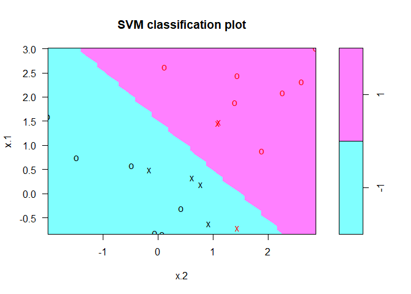

## load data


```r
library(ISLR)
library(ggplot2)
library(dplyr)
```

```
## 
## Attaching package: 'dplyr'
```

```
## The following objects are masked from 'package:stats':
## 
##     filter, lag
```

```
## The following objects are masked from 'package:base':
## 
##     intersect, setdiff, setequal, union
```

```r
library(e1071)
library(ROCR)
```

```
## Loading required package: gplots
```

```
## 
## Attaching package: 'gplots'
```

```
## The following object is masked from 'package:stats':
## 
##     lowess
```

```r
library(reshape2)
```

# 9.6 Lab: Support Vector Machines
## 9.6.1 Support Vector Classifier

```r
set.seed(1)
x <- matrix(rnorm(20*2), ncol=2)
y <- c(rep(-1,10), rep(1,10))
x[y==1,] <- x[y==1,] + 1
plot(x, col=(3-y))
```

<!-- -->

```r
dat <- data.frame(x=x, y=as.factor(y))
svmfit <- svm(y ~., data=dat, kernel = "linear", cost = 10, scale = FALSE)

plot(svmfit, dat)
```

<!-- -->

```r
svmfit$index
```

```
## [1]  1  2  5  7 14 16 17
```

```r
summary(svmfit)
```

```
## 
## Call:
## svm(formula = y ~ ., data = dat, kernel = "linear", cost = 10, 
##     scale = FALSE)
## 
## 
## Parameters:
##    SVM-Type:  C-classification 
##  SVM-Kernel:  linear 
##        cost:  10 
##       gamma:  0.5 
## 
## Number of Support Vectors:  7
## 
##  ( 4 3 )
## 
## 
## Number of Classes:  2 
## 
## Levels: 
##  -1 1
```

```r
svmfit <- svm(y ~ ., data=dat, kernel = "linear", cost = 0.1, scale=FALSE)
plot(svmfit, dat)
```

<!-- -->

```r
svmfit$index
```

```
##  [1]  1  2  3  4  5  7  9 10 12 13 14 15 16 17 18 20
```

```r
set.seed(1)
tune.out <- tune(svm, y ~ ., data=dat, kernel = "linear", ranges=list(cost=c(0.001, 0.01, 0.1, 1, 5, 10, 100)))

summary(tune.out)
```

```
## 
## Parameter tuning of 'svm':
## 
## - sampling method: 10-fold cross validation 
## 
## - best parameters:
##  cost
##   0.1
## 
## - best performance: 0.1 
## 
## - Detailed performance results:
##    cost error dispersion
## 1 1e-03  0.70  0.4216370
## 2 1e-02  0.70  0.4216370
## 3 1e-01  0.10  0.2108185
## 4 1e+00  0.15  0.2415229
## 5 5e+00  0.15  0.2415229
## 6 1e+01  0.15  0.2415229
## 7 1e+02  0.15  0.2415229
```

```r
bestmod <- tune.out$best.model
summary(bestmod)
```

```
## 
## Call:
## best.tune(method = svm, train.x = y ~ ., data = dat, ranges = list(cost = c(0.001, 
##     0.01, 0.1, 1, 5, 10, 100)), kernel = "linear")
## 
## 
## Parameters:
##    SVM-Type:  C-classification 
##  SVM-Kernel:  linear 
##        cost:  0.1 
##       gamma:  0.5 
## 
## Number of Support Vectors:  16
## 
##  ( 8 8 )
## 
## 
## Number of Classes:  2 
## 
## Levels: 
##  -1 1
```

```r
xtest <- matrix(rnorm(20*2), ncol=2)
ytest <- sample (c(-1,1), 20, rep=TRUE)
xtest[ytest==1,] <-  xtest[ytest==1,] + 1
testdat <- data.frame(x = xtest, y = as.factor(ytest))

ypred <- predict(bestmod, testdat)
table(predict = ypred, truth = testdat$y)
```

```
##        truth
## predict -1  1
##      -1 11  1
##      1   0  8
```

```r
svmfit <- svm(y ~ ., data=dat, kernel = "linear", cost = .01, scale=FALSE)
ypred <- predict(svmfit, testdat)
table(predict = ypred, truth = testdat$y)
```

```
##        truth
## predict -1  1
##      -1 11  2
##      1   0  7
```

```r
x[y==1,] <- x[y==1,] + 0.5
plot(x, col = (y+3)/2, pch = 19)
```

<!-- -->

```r
dat <- data.frame(x = x, y = as.factor(y))
svmfit <- svm(y ~ ., data=dat, kernel = "linear", cost = 1e5)
summary(svmfit)
```

```
## 
## Call:
## svm(formula = y ~ ., data = dat, kernel = "linear", cost = 1e+05)
## 
## 
## Parameters:
##    SVM-Type:  C-classification 
##  SVM-Kernel:  linear 
##        cost:  1e+05 
##       gamma:  0.5 
## 
## Number of Support Vectors:  3
## 
##  ( 1 2 )
## 
## 
## Number of Classes:  2 
## 
## Levels: 
##  -1 1
```

```r
plot(svmfit, dat)
```

<!-- -->

```r
svmfit <- svm(y ~ ., data=dat, kernel = "linear", cost = 1)
summary(svmfit)
```

```
## 
## Call:
## svm(formula = y ~ ., data = dat, kernel = "linear", cost = 1)
## 
## 
## Parameters:
##    SVM-Type:  C-classification 
##  SVM-Kernel:  linear 
##        cost:  1 
##       gamma:  0.5 
## 
## Number of Support Vectors:  7
## 
##  ( 4 3 )
## 
## 
## Number of Classes:  2 
## 
## Levels: 
##  -1 1
```

```r
plot(svmfit, dat)
```

<!-- -->

## 9.6.2 Support Vector Machine


```r
set.seed(1)
x=matrix(rnorm (200*2) , ncol=2)
x[1:100,]=x[1:100,]+2
x[101:150,] = x[101:150,]-2
y=c(rep(1,150) ,rep(2,50))
dat=data.frame(x=x,y=as.factor(y))

plot(x, col=y)
```

<!-- -->

```r
train=sample(200,100)
svmfit=svm(y∼., data=dat[train ,], kernel ="radial", gamma=1,cost=1)
plot(svmfit , dat[train ,])
```

<!-- -->

```r
summary(svmfit)
```

```
## 
## Call:
## svm(formula = y ~ ., data = dat[train, ], kernel = "radial", 
##     gamma = 1, cost = 1)
## 
## 
## Parameters:
##    SVM-Type:  C-classification 
##  SVM-Kernel:  radial 
##        cost:  1 
##       gamma:  1 
## 
## Number of Support Vectors:  37
## 
##  ( 17 20 )
## 
## 
## Number of Classes:  2 
## 
## Levels: 
##  1 2
```

```r
svmfit=svm(y∼., data=dat[train ,], kernel ="radial",gamma=1,cost=1e5)
plot(svmfit ,dat[train ,])
```

<!-- -->

```r
set.seed(1)
tune.out=tune(svm , y∼., data=dat[train ,], kernel="radial",ranges=list(cost=c(0.1,1,10,100,1000),gamma=c(0.5,1,2,3,4) ))
summary(tune.out)
```

```
## 
## Parameter tuning of 'svm':
## 
## - sampling method: 10-fold cross validation 
## 
## - best parameters:
##  cost gamma
##     1     2
## 
## - best performance: 0.12 
## 
## - Detailed performance results:
##     cost gamma error dispersion
## 1  1e-01   0.5  0.27 0.11595018
## 2  1e+00   0.5  0.13 0.08232726
## 3  1e+01   0.5  0.15 0.07071068
## 4  1e+02   0.5  0.17 0.08232726
## 5  1e+03   0.5  0.21 0.09944289
## 6  1e-01   1.0  0.25 0.13540064
## 7  1e+00   1.0  0.13 0.08232726
## 8  1e+01   1.0  0.16 0.06992059
## 9  1e+02   1.0  0.20 0.09428090
## 10 1e+03   1.0  0.20 0.08164966
## 11 1e-01   2.0  0.25 0.12692955
## 12 1e+00   2.0  0.12 0.09189366
## 13 1e+01   2.0  0.17 0.09486833
## 14 1e+02   2.0  0.19 0.09944289
## 15 1e+03   2.0  0.20 0.09428090
## 16 1e-01   3.0  0.27 0.11595018
## 17 1e+00   3.0  0.13 0.09486833
## 18 1e+01   3.0  0.18 0.10327956
## 19 1e+02   3.0  0.21 0.08755950
## 20 1e+03   3.0  0.22 0.10327956
## 21 1e-01   4.0  0.27 0.11595018
## 22 1e+00   4.0  0.15 0.10801234
## 23 1e+01   4.0  0.18 0.11352924
## 24 1e+02   4.0  0.21 0.08755950
## 25 1e+03   4.0  0.24 0.10749677
```

```r
table(true=dat[-train ,"y"], pred=predict(tune.out$best.model ,newdata =dat[-train ,]))
```

```
##     pred
## true  1  2
##    1 74  3
##    2  7 16
```

## 9.6.3 ROC Curves


```r
rocplot =function (pred, truth, ...){
  predob = prediction(pred, truth)
  perf = performance(predob, "tpr", "fpr")
  plot(perf,...)}

svmfit.opt=svm(y∼., data=dat[train ,], kernel ="radial", gamma=2, cost=1, decision.values =T)
fitted =attributes(predict(svmfit.opt ,dat[train ,], decision.values=TRUE))$decision.values

par(mfrow=c(1,2))
rocplot(fitted ,dat[train ,"y"], main="Training Data")

svmfit.flex=svm(y∼., data=dat[train ,], kernel ="radial",gamma=50, cost=1, decision.values =T)
fitted=attributes(predict (svmfit.flex ,dat[train ,], decision.values=T))$decision.values
rocplot(fitted ,dat[train ,"y"],add=T,col="red ")

fitted=attributes(predict (svmfit.opt ,dat[-train ,], decision.values=T))$decision.values
rocplot (fitted ,dat[-train ,"y"], main="Test Data")
fitted=attributes (predict (svmfit.flex ,dat[- train ,], decision.values=T))$decision.values
rocplot(fitted ,dat[-train ,"y"],add=T,col="red")
```

<!-- -->

## 9.6.4 SVM with Multiple Classes


```r
set.seed(1)
x=rbind(x, matrix(rnorm (50*2) , ncol=2))
y=c(y, rep(0,50))
x[y==0,2] = x[y==0 ,2]+2
dat=data.frame(x=x, y=as.factor(y))
par(mfrow=c(1,1))
plot(x,col=(y+1))
```

<!-- -->

```r
svmfit=svm(y∼., data=dat , kernel ="radial", cost=10, gamma =1)
plot(svmfit, dat)
```

<!-- -->

## 9.6.5 Application to Gene Expression Data


```r
names(Khan)
```

```
## [1] "xtrain" "xtest"  "ytrain" "ytest"
```

```r
dim(Khan$xtrain)
```

```
## [1]   63 2308
```

```r
dim(Khan$xtest)
```

```
## [1]   20 2308
```

```r
length(Khan$ytrain)
```

```
## [1] 63
```

```r
length(Khan$ytest)
```

```
## [1] 20
```

```r
table(Khan$ytrain)
```

```
## 
##  1  2  3  4 
##  8 23 12 20
```

```r
table(Khan$ytest)
```

```
## 
## 1 2 3 4 
## 3 6 6 5
```

```r
dat=data.frame(x=Khan$xtrain , y=as.factor(Khan$ytrain ))
out=svm(y∼., data=dat, kernel ="linear",cost=10)
summary(out)
```

```
## 
## Call:
## svm(formula = y ~ ., data = dat, kernel = "linear", cost = 10)
## 
## 
## Parameters:
##    SVM-Type:  C-classification 
##  SVM-Kernel:  linear 
##        cost:  10 
##       gamma:  0.0004332756 
## 
## Number of Support Vectors:  58
## 
##  ( 20 20 11 7 )
## 
## 
## Number of Classes:  4 
## 
## Levels: 
##  1 2 3 4
```

```r
table(out$fitted , dat$y)
```

```
##    
##      1  2  3  4
##   1  8  0  0  0
##   2  0 23  0  0
##   3  0  0 12  0
##   4  0  0  0 20
```

```r
dat.te=data.frame(x=Khan$xtest , y=as.factor(Khan$ytest ))
pred.te=predict(out, newdata=dat.te)
table(pred.te, dat.te$y)
```

```
##        
## pred.te 1 2 3 4
##       1 3 0 0 0
##       2 0 6 2 0
##       3 0 0 4 0
##       4 0 0 0 5
```

## 4. Generate a simulated two-class data set with 100 observations and two features in which there is a visible but non-linear separation between the two classes. Show that in this setting, a support vector machine with a polynomial kernel (with degree greater than 1) or a radial kernel will outperform a support vector classifier on the training data. Which technique performs best on the test data? Make plots and report training and test error rates in order to back up your assertions.


```r
# Make data
set.seed(123)
x <- matrix(rnorm (100*2) , ncol=2)
y <- ifelse(x[,1] > -.1 & x[,1] < .75 & x[,2] > 0 & x[,2] < 1.5, -1, 1)
dat=data.frame(x=x, y=as.factor(y))
par(mfrow=c(1,1))
plot(x,col=(y+3))
```

<!-- -->

```r
# Create training set
train <- sample(100, 75)

# Linear
linear.tune<- tune(svm, y ~ ., data=dat[train,], kernel = "linear", ranges=list(cost=c(0.01, 0.1, 1, 5, 10)))
summary(linear.tune)
```

```
## 
## Parameter tuning of 'svm':
## 
## - sampling method: 10-fold cross validation 
## 
## - best parameters:
##  cost
##  0.01
## 
## - best performance: 0.1857143 
## 
## - Detailed performance results:
##    cost     error dispersion
## 1  0.01 0.1857143  0.1645701
## 2  0.10 0.1857143  0.1645701
## 3  1.00 0.1857143  0.1645701
## 4  5.00 0.1857143  0.1645701
## 5 10.00 0.1857143  0.1645701
```

```r
linear.bestmod <- linear.tune$best.model
summary(linear.bestmod)
```

```
## 
## Call:
## best.tune(method = svm, train.x = y ~ ., data = dat[train, ], 
##     ranges = list(cost = c(0.01, 0.1, 1, 5, 10)), kernel = "linear")
## 
## 
## Parameters:
##    SVM-Type:  C-classification 
##  SVM-Kernel:  linear 
##        cost:  0.01 
##       gamma:  0.5 
## 
## Number of Support Vectors:  30
## 
##  ( 16 14 )
## 
## 
## Number of Classes:  2 
## 
## Levels: 
##  -1 1
```

```r
table(predict = predict(linear.bestmod, dat[train,]), truth = dat[train,3])
```

```
##        truth
## predict -1  1
##      -1  0  0
##      1  14 61
```

```r
100 - sum(predict(linear.bestmod, dat[train,]) == dat[train,3])/length(dat[train,3])*100
```

```
## [1] 18.66667
```

```r
# 18.67% training error

table(predict = predict(linear.bestmod, dat[-train,]), truth = dat[-train,3])
```

```
##        truth
## predict -1  1
##      -1  0  0
##      1   3 22
```

```r
100 - sum(predict(linear.bestmod, dat[-train,]) == dat[-train,3])/length(dat[-train,3])*100
```

```
## [1] 12
```

```r
# 12% test error

plot(linear.bestmod, dat[train,])
```

<!-- -->

```r
plot(linear.bestmod, dat[-train,])
```

<!-- -->

```r
# Radial
radial.tune<- tune(svm, y ~ ., data=dat[train,], kernel="radial",ranges=list(cost=c(0.1,1,10,100,1000),gamma=c(0.5,1,2,3,4)))
summary(radial.tune)
```

```
## 
## Parameter tuning of 'svm':
## 
## - sampling method: 10-fold cross validation 
## 
## - best parameters:
##  cost gamma
##   100   0.5
## 
## - best performance: 0 
## 
## - Detailed performance results:
##     cost gamma      error dispersion
## 1  1e-01   0.5 0.18035714 0.11858541
## 2  1e+00   0.5 0.06607143 0.06994997
## 3  1e+01   0.5 0.05178571 0.06705351
## 4  1e+02   0.5 0.00000000 0.00000000
## 5  1e+03   0.5 0.00000000 0.00000000
## 6  1e-01   1.0 0.18035714 0.11858541
## 7  1e+00   1.0 0.05178571 0.06705351
## 8  1e+01   1.0 0.02678571 0.05662589
## 9  1e+02   1.0 0.00000000 0.00000000
## 10 1e+03   1.0 0.00000000 0.00000000
## 11 1e-01   2.0 0.18035714 0.11858541
## 12 1e+00   2.0 0.02500000 0.05270463
## 13 1e+01   2.0 0.00000000 0.00000000
## 14 1e+02   2.0 0.00000000 0.00000000
## 15 1e+03   2.0 0.00000000 0.00000000
## 16 1e-01   3.0 0.18035714 0.11858541
## 17 1e+00   3.0 0.03750000 0.06038074
## 18 1e+01   3.0 0.00000000 0.00000000
## 19 1e+02   3.0 0.00000000 0.00000000
## 20 1e+03   3.0 0.00000000 0.00000000
## 21 1e-01   4.0 0.18035714 0.11858541
## 22 1e+00   4.0 0.05000000 0.08740074
## 23 1e+01   4.0 0.00000000 0.00000000
## 24 1e+02   4.0 0.00000000 0.00000000
## 25 1e+03   4.0 0.00000000 0.00000000
```

```r
radial.bestmod <- radial.tune$best.model
summary(radial.bestmod)
```

```
## 
## Call:
## best.tune(method = svm, train.x = y ~ ., data = dat[train, ], 
##     ranges = list(cost = c(0.1, 1, 10, 100, 1000), gamma = c(0.5, 
##         1, 2, 3, 4)), kernel = "radial")
## 
## 
## Parameters:
##    SVM-Type:  C-classification 
##  SVM-Kernel:  radial 
##        cost:  100 
##       gamma:  0.5 
## 
## Number of Support Vectors:  7
## 
##  ( 3 4 )
## 
## 
## Number of Classes:  2 
## 
## Levels: 
##  -1 1
```

```r
table(predict = predict(radial.bestmod, dat[train,]), truth = dat[train,3])
```

```
##        truth
## predict -1  1
##      -1 14  0
##      1   0 61
```

```r
100 - sum(predict(radial.bestmod, dat[train,]) == dat[train,3])/length(dat[train,3])*100
```

```
## [1] 0
```

```r
# 0% training error

table(predict = predict(radial.bestmod, dat[-train,]), truth = dat[-train,3])
```

```
##        truth
## predict -1  1
##      -1  3  0
##      1   0 22
```

```r
100 - sum(predict(radial.bestmod, dat[-train,]) == dat[-train,3])/length(dat[-train,3])*100
```

```
## [1] 0
```

```r
# 0% test error

plot(radial.bestmod, dat[train,])
```

<!-- -->

```r
plot(radial.bestmod, dat[-train,])
```

<!-- -->

## 5. We have seen that we can fit an SVM with a non-linear kernel in order to perform classification using a non-linear decision boundary. We will now see that we can also obtain a non-linear decision boundary by performing logistic regression using non-linear transformations of the features.

  (a) Generate a data set with n = 500 and p = 2, such that the observations belong to two classes with a quadratic decision boundary between them. For instance, you can do this as follows:


```r
x1 <- runif(500)-0.5
x2 <- runif(500)-0.5
y <- 1*(x1^2-x2^2 > 0)
```

  (b) Plot the observations, colored according to their class labels. Your plot should display X1 on the x-axis, and X2 on the yaxis.
  

```r
plot(x1,x2, col = c(y + 2))
```

<!-- -->


  (c) Fit a logistic regression model to the data, using X1 and X2 as predictors.


```r
train <- sample(500,400)
dat <- data.frame(x1,x2, y = factor(y))
glm.fits=glm(y ∼ ., data=dat[train,] ,family=binomial)
summary(glm.fits)
```

```
## 
## Call:
## glm(formula = y ~ ., family = binomial, data = dat[train, ])
## 
## Deviance Residuals: 
##    Min      1Q  Median      3Q     Max  
## -1.263  -1.160  -1.081   1.188   1.287  
## 
## Coefficients:
##             Estimate Std. Error z value Pr(>|z|)
## (Intercept) -0.03987    0.10022  -0.398    0.691
## x1          -0.26243    0.35733  -0.734    0.463
## x2           0.21798    0.34902   0.625    0.532
## 
## (Dispersion parameter for binomial family taken to be 1)
## 
##     Null deviance: 554.36  on 399  degrees of freedom
## Residual deviance: 553.42  on 397  degrees of freedom
## AIC: 559.42
## 
## Number of Fisher Scoring iterations: 3
```

  (d) Apply this model to the training data in order to obtain a predicted class label for each training observation. Plot the observations, colored according to the predicted class labels. The decision boundary should be linear.


```r
glm.probs <- predict(glm.fits, type="response")
contrasts(dat$y)
```

```
##   1
## 0 0
## 1 1
```

```r
glm.pred <- rep(0 ,400)
glm.pred[glm.probs >.5] <- 1
table(glm.pred, dat[train,]$y)
```

```
##         
## glm.pred   0   1
##        0 139 123
##        1  65  73
```

```r
mean(glm.pred == dat[train,]$y)
```

```
## [1] 0.53
```

```r
plot(dat$x1[train], dat$x2[train], col = c(glm.pred + 2))
```

<!-- -->


  (e) Now fit a logistic regression model to the data using non-linear functions of X1 and X2 as predictors (e.g. X2 1 , X1×X2, log(X2), and so forth).

```r
glm.fits=glm(y ∼ x1 + x2 + I(x1^2) + I(x2^2) + x1*x2, data=dat[train,] ,family=binomial)
```

```
## Warning: glm.fit: algorithm did not converge
```

```
## Warning: glm.fit: fitted probabilities numerically 0 or 1 occurred
```

```r
summary(glm.fits)
```

```
## 
## Call:
## glm(formula = y ~ x1 + x2 + I(x1^2) + I(x2^2) + x1 * x2, family = binomial, 
##     data = dat[train, ])
## 
## Deviance Residuals: 
##        Min          1Q      Median          3Q         Max  
## -1.305e-03  -2.000e-08  -2.000e-08   2.000e-08   9.856e-04  
## 
## Coefficients:
##               Estimate Std. Error z value Pr(>|z|)
## (Intercept)    -12.706   1107.082  -0.011    0.991
## x1             192.974  56431.754   0.003    0.997
## x2             -17.824 107483.251   0.000    1.000
## I(x1^2)      17089.348 591419.534   0.029    0.977
## I(x2^2)     -16520.621 629297.749  -0.026    0.979
## x1:x2           -5.035 305950.994   0.000    1.000
## 
## (Dispersion parameter for binomial family taken to be 1)
## 
##     Null deviance: 5.5436e+02  on 399  degrees of freedom
## Residual deviance: 3.3076e-06  on 394  degrees of freedom
## AIC: 12
## 
## Number of Fisher Scoring iterations: 25
```

  (f) Apply this model to the training data in order to obtain a predicted class label for each training observation. Plot the observations, colored according to the predicted class labels. The decision boundary should be obviously non-linear. If it is not, then repeat (a)-(e) until you come up with an example in which the predicted class labels are obviously non-linear.


```r
glm.probs <- predict(glm.fits, type="response")
glm.pred <- rep(0 ,400)
glm.pred[glm.probs >.5] <- 1
table(glm.pred, dat[train,]$y)
```

```
##         
## glm.pred   0   1
##        0 204   0
##        1   0 196
```

```r
mean(glm.pred == dat[train,]$y)
```

```
## [1] 1
```

```r
plot(dat$x1[train], dat$x2[train], col = c(glm.pred + 2))
```

<!-- -->

  (g) Fit a support vector classifier to the data with X1 and X2 as predictors. Obtain a class prediction for each training observation. Plot the observations, colored according to the predicted class labels.


```r
svc.tune  <- tune(svm, y ∼ . , data=dat[train,], kernel="linear", ranges=list(cost=c(0.001, 0.01, 0.1, 1, 5, 10, 100)))
svc.fit <- svc.tune$best.model

table(predict = predict(svc.fit, dat[train,]), truth = dat[train,3])
```

```
##        truth
## predict   0   1
##       0 140  98
##       1  64  98
```

```r
100 - sum(predict(svc.fit, dat[train,]) == dat[train,3])/length(dat[train,3])*100
```

```
## [1] 40.5
```

```r
plot(dat$x1, dat$x2, col = c(predict(svc.fit, dat[train,])))
```

<!-- -->

  (h) Fit a SVM using a non-linear kernel to the data. Obtain a class prediction for each training observation. Plot the observations, colored according to the predicted class labels.


```r
# Radial
svm.tune  <- tune(svm, y ∼ . , data=dat[train,], kernel="radial",ranges=list(cost=c(0.1,1,10,100,1000),gamma=c(0.5,1,2,3,4)))
svm.fit <- svm.tune$best.model

table(predict = predict(svm.fit, dat[train,]), truth = dat[train,3])
```

```
##        truth
## predict   0   1
##       0 203   1
##       1   1 195
```

```r
100 - sum(predict(svm.fit, dat[train,]) == dat[train,3])/length(dat[train,3])*100
```

```
## [1] 0.5
```

```r
plot(dat$x1[train], dat$x2[train], col = c(predict(svm.fit, dat[train,])))
```

<!-- -->

```r
# Polynomial
svm.tune  <- tune(svm, y ∼ . , data=dat[train,], kernel="polynomial",ranges=list(cost=c(0.1,1,10,100,1000),degree=c(1,2,3)))
svm.fit <- svm.tune$best.model

table(predict = predict(svm.fit, dat[train,]), truth = dat[train,3])
```

```
##        truth
## predict   0   1
##       0 202   1
##       1   2 195
```

```r
100 - sum(predict(svm.fit, dat[train,]) == dat[train,3])/length(dat[train,3])*100
```

```
## [1] 0.75
```

```r
plot(dat$x1[train], dat$x2[train], col = c(predict(svm.fit, dat[train,])))
```

<!-- -->


  (i) Comment on your results.

Similar

# #7. In this problem, you will use support vector approaches in order to predict whether a given car gets high or low gas mileage based on the Auto data set.

(a) Create a binary variable that takes on a 1 for cars with gas mileage above the median, and a 0 for cars with gas mileage below the median.


```r
summary(Auto)
```

```
##       mpg          cylinders      displacement     horsepower   
##  Min.   : 9.00   Min.   :3.000   Min.   : 68.0   Min.   : 46.0  
##  1st Qu.:17.00   1st Qu.:4.000   1st Qu.:105.0   1st Qu.: 75.0  
##  Median :22.75   Median :4.000   Median :151.0   Median : 93.5  
##  Mean   :23.45   Mean   :5.472   Mean   :194.4   Mean   :104.5  
##  3rd Qu.:29.00   3rd Qu.:8.000   3rd Qu.:275.8   3rd Qu.:126.0  
##  Max.   :46.60   Max.   :8.000   Max.   :455.0   Max.   :230.0  
##                                                                 
##      weight      acceleration        year           origin     
##  Min.   :1613   Min.   : 8.00   Min.   :70.00   Min.   :1.000  
##  1st Qu.:2225   1st Qu.:13.78   1st Qu.:73.00   1st Qu.:1.000  
##  Median :2804   Median :15.50   Median :76.00   Median :1.000  
##  Mean   :2978   Mean   :15.54   Mean   :75.98   Mean   :1.577  
##  3rd Qu.:3615   3rd Qu.:17.02   3rd Qu.:79.00   3rd Qu.:2.000  
##  Max.   :5140   Max.   :24.80   Max.   :82.00   Max.   :3.000  
##                                                                
##                  name    
##  amc matador       :  5  
##  ford pinto        :  5  
##  toyota corolla    :  5  
##  amc gremlin       :  4  
##  amc hornet        :  4  
##  chevrolet chevette:  4  
##  (Other)           :365
```

```r
Auto$efficiency <- as.factor(ifelse(Auto$mpg > median(Auto$mpg), 1, 0))
```

(b) Fit a support vector classifier to the data with various values of cost, in order to predict whether a car gets high or low gas mileage. Report the cross-validation errors associated with different values of this parameter. Comment on your results.


```r
set.seed(1)
tune.out <- tune(svm, efficiency ~ ., data=Auto, kernel = "linear", ranges=list(cost=c(0.001, 0.01, 0.1, 1, 5, 10, 100)))

summary(tune.out)
```

```
## 
## Parameter tuning of 'svm':
## 
## - sampling method: 10-fold cross validation 
## 
## - best parameters:
##  cost
##     1
## 
## - best performance: 0.01275641 
## 
## - Detailed performance results:
##    cost      error dispersion
## 1 1e-03 0.09442308 0.03837365
## 2 1e-02 0.07403846 0.05471525
## 3 1e-01 0.03826923 0.05148114
## 4 1e+00 0.01275641 0.01344780
## 5 5e+00 0.01782051 0.01229997
## 6 1e+01 0.02038462 0.01074682
## 7 1e+02 0.03820513 0.01773427
```

```r
summary(tune.out)$best.performance
```

```
## [1] 0.01275641
```

```r
linear.bestmod <- tune.out$best.model
summary(linear.bestmod)
```

```
## 
## Call:
## best.tune(method = svm, train.x = efficiency ~ ., data = Auto, 
##     ranges = list(cost = c(0.001, 0.01, 0.1, 1, 5, 10, 100)), 
##     kernel = "linear")
## 
## 
## Parameters:
##    SVM-Type:  C-classification 
##  SVM-Kernel:  linear 
##        cost:  1 
##       gamma:  0.003205128 
## 
## Number of Support Vectors:  56
## 
##  ( 26 30 )
## 
## 
## Number of Classes:  2 
## 
## Levels: 
##  0 1
```

Best cost was somewhere around 1 and 5.

  (c) Now repeat (b), this time using SVMs with radial and polynomial basis kernels, with different values of gamma and degree and cost. Comment on your results.


```r
#Radial
tune.out <- tune(svm, efficiency ~ ., data=Auto, kernel = "radial", ranges=list(cost=c(0.1,1,10,100,1000),gamma=c(0.5,1,2,3,4)))

summary(tune.out)
```

```
## 
## Parameter tuning of 'svm':
## 
## - sampling method: 10-fold cross validation 
## 
## - best parameters:
##  cost gamma
##     1   0.5
## 
## - best performance: 0.04596154 
## 
## - Detailed performance results:
##     cost gamma      error dispersion
## 1  1e-01   0.5 0.07916667 0.04084188
## 2  1e+00   0.5 0.04596154 0.02026662
## 3  1e+01   0.5 0.04839744 0.01859159
## 4  1e+02   0.5 0.04839744 0.01859159
## 5  1e+03   0.5 0.04839744 0.01859159
## 6  1e-01   1.0 0.55871795 0.05068311
## 7  1e+00   1.0 0.06634615 0.03842264
## 8  1e+01   1.0 0.06628205 0.03999233
## 9  1e+02   1.0 0.06628205 0.03999233
## 10 1e+03   1.0 0.06628205 0.03999233
## 11 1e-01   2.0 0.55871795 0.05068311
## 12 1e+00   2.0 0.11493590 0.09230772
## 13 1e+01   2.0 0.11493590 0.09230772
## 14 1e+02   2.0 0.11493590 0.09230772
## 15 1e+03   2.0 0.11493590 0.09230772
## 16 1e-01   3.0 0.55871795 0.05068311
## 17 1e+00   3.0 0.37435897 0.18793801
## 18 1e+01   3.0 0.35403846 0.18582768
## 19 1e+02   3.0 0.35403846 0.18582768
## 20 1e+03   3.0 0.35403846 0.18582768
## 21 1e-01   4.0 0.55871795 0.05068311
## 22 1e+00   4.0 0.48205128 0.08140100
## 23 1e+01   4.0 0.47948718 0.07702036
## 24 1e+02   4.0 0.47948718 0.07702036
## 25 1e+03   4.0 0.47948718 0.07702036
```

```r
summary(tune.out)$best.performance
```

```
## [1] 0.04596154
```

```r
radial.bestmod <- tune.out$best.model
summary(radial.bestmod)
```

```
## 
## Call:
## best.tune(method = svm, train.x = efficiency ~ ., data = Auto, 
##     ranges = list(cost = c(0.1, 1, 10, 100, 1000), gamma = c(0.5, 
##         1, 2, 3, 4)), kernel = "radial")
## 
## 
## Parameters:
##    SVM-Type:  C-classification 
##  SVM-Kernel:  radial 
##        cost:  1 
##       gamma:  0.5 
## 
## Number of Support Vectors:  276
## 
##  ( 136 140 )
## 
## 
## Number of Classes:  2 
## 
## Levels: 
##  0 1
```

```r
tune.out <- tune(svm, efficiency ~ ., data=Auto, kernel = "polynomial", ranges=list(cost=c(0.1,1,10,100,1000),degree=c(1,2,3)))

summary(tune.out)
```

```
## 
## Parameter tuning of 'svm':
## 
## - sampling method: 10-fold cross validation 
## 
## - best parameters:
##  cost degree
##  1000      1
## 
## - best performance: 0.01269231 
## 
## - Detailed performance results:
##     cost degree      error dispersion
## 1  1e-01      1 0.18102564 0.11678135
## 2  1e+00      1 0.08166667 0.04624398
## 3  1e+01      1 0.07147436 0.04943915
## 4  1e+02      1 0.01275641 0.01344780
## 5  1e+03      1 0.01269231 0.01783081
## 6  1e-01      2 0.58673077 0.03560377
## 7  1e+00      2 0.58673077 0.03560377
## 8  1e+01      2 0.57647436 0.02810467
## 9  1e+02      2 0.30346154 0.07928888
## 10 1e+03      2 0.25217949 0.08777199
## 11 1e-01      3 0.58673077 0.03560377
## 12 1e+00      3 0.58673077 0.03560377
## 13 1e+01      3 0.58673077 0.03560377
## 14 1e+02      3 0.34948718 0.11255059
## 15 1e+03      3 0.24993590 0.05389739
```

```r
summary(tune.out)$best.performance
```

```
## [1] 0.01269231
```

```r
poly.bestmod <- tune.out$best.model
summary(poly.bestmod)
```

```
## 
## Call:
## best.tune(method = svm, train.x = efficiency ~ ., data = Auto, 
##     ranges = list(cost = c(0.1, 1, 10, 100, 1000), degree = c(1, 
##         2, 3)), kernel = "polynomial")
## 
## 
## Parameters:
##    SVM-Type:  C-classification 
##  SVM-Kernel:  polynomial 
##        cost:  1000 
##      degree:  1 
##       gamma:  0.003205128 
##      coef.0:  0 
## 
## Number of Support Vectors:  49
## 
##  ( 25 24 )
## 
## 
## Number of Classes:  2 
## 
## Levels: 
##  0 1
```

  (d) Make some plots to back up your assertions in (b) and (c).
  

```r
dat <- data.frame(Observation = 1:nrow(Auto), Truth = Auto$efficiency, linear = predict(linear.bestmod, Auto),
                  radial = predict(radial.bestmod, Auto), polynomial = predict(poly.bestmod, Auto))
par(mfrow=c(2,2))
plot(dat$Observation,dat$Truth, col = 1)
plot(dat$Observation,dat$linear, col = 2)
plot(dat$Observation,dat$radial, col = 3)
plot(dat$Observation,dat$polynomial, col = 4)
```

<!-- -->

## 8. This problem involves the OJ data set which is part of the ISLR package.

(a) Create a training set containing a random sample of 800 observations, and a test set containing the remaining observations.


```r
summary(OJ)
```

```
##  Purchase WeekofPurchase     StoreID        PriceCH         PriceMM     
##  CH:653   Min.   :227.0   Min.   :1.00   Min.   :1.690   Min.   :1.690  
##  MM:417   1st Qu.:240.0   1st Qu.:2.00   1st Qu.:1.790   1st Qu.:1.990  
##           Median :257.0   Median :3.00   Median :1.860   Median :2.090  
##           Mean   :254.4   Mean   :3.96   Mean   :1.867   Mean   :2.085  
##           3rd Qu.:268.0   3rd Qu.:7.00   3rd Qu.:1.990   3rd Qu.:2.180  
##           Max.   :278.0   Max.   :7.00   Max.   :2.090   Max.   :2.290  
##      DiscCH            DiscMM         SpecialCH        SpecialMM     
##  Min.   :0.00000   Min.   :0.0000   Min.   :0.0000   Min.   :0.0000  
##  1st Qu.:0.00000   1st Qu.:0.0000   1st Qu.:0.0000   1st Qu.:0.0000  
##  Median :0.00000   Median :0.0000   Median :0.0000   Median :0.0000  
##  Mean   :0.05186   Mean   :0.1234   Mean   :0.1477   Mean   :0.1617  
##  3rd Qu.:0.00000   3rd Qu.:0.2300   3rd Qu.:0.0000   3rd Qu.:0.0000  
##  Max.   :0.50000   Max.   :0.8000   Max.   :1.0000   Max.   :1.0000  
##     LoyalCH          SalePriceMM     SalePriceCH      PriceDiff      
##  Min.   :0.000011   Min.   :1.190   Min.   :1.390   Min.   :-0.6700  
##  1st Qu.:0.325257   1st Qu.:1.690   1st Qu.:1.750   1st Qu.: 0.0000  
##  Median :0.600000   Median :2.090   Median :1.860   Median : 0.2300  
##  Mean   :0.565782   Mean   :1.962   Mean   :1.816   Mean   : 0.1465  
##  3rd Qu.:0.850873   3rd Qu.:2.130   3rd Qu.:1.890   3rd Qu.: 0.3200  
##  Max.   :0.999947   Max.   :2.290   Max.   :2.090   Max.   : 0.6400  
##  Store7      PctDiscMM        PctDiscCH       ListPriceDiff  
##  No :714   Min.   :0.0000   Min.   :0.00000   Min.   :0.000  
##  Yes:356   1st Qu.:0.0000   1st Qu.:0.00000   1st Qu.:0.140  
##            Median :0.0000   Median :0.00000   Median :0.240  
##            Mean   :0.0593   Mean   :0.02731   Mean   :0.218  
##            3rd Qu.:0.1127   3rd Qu.:0.00000   3rd Qu.:0.300  
##            Max.   :0.4020   Max.   :0.25269   Max.   :0.440  
##      STORE      
##  Min.   :0.000  
##  1st Qu.:0.000  
##  Median :2.000  
##  Mean   :1.631  
##  3rd Qu.:3.000  
##  Max.   :4.000
```

```r
set.seed(3251)
train <- sample(1:nrow(OJ), 800, replace = F)
dat.train <- OJ[train,]
dat.test <- OJ[-train,]
```

(b) Fit a support vector classifier to the training data using cost=0.01, with Purchase as the response and the other variables as predictors. Use the summary() function to produce summary statistics, and describe the results obtained.


```r
svmfit <- svm(Purchase ~ ., data = dat.train, kernel = "linear", cost = 0.01, scale = TRUE)
summary(svmfit)
```

```
## 
## Call:
## svm(formula = Purchase ~ ., data = dat.train, kernel = "linear", 
##     cost = 0.01, scale = TRUE)
## 
## 
## Parameters:
##    SVM-Type:  C-classification 
##  SVM-Kernel:  linear 
##        cost:  0.01 
##       gamma:  0.05555556 
## 
## Number of Support Vectors:  437
## 
##  ( 219 218 )
## 
## 
## Number of Classes:  2 
## 
## Levels: 
##  CH MM
```
About 218 support vectors from each class

(c) What are the training and test error rates?


```r
pred.train <- predict(svmfit, dat.train)
table(predict = pred.train, truth = dat.train$Purchase)
```

```
##        truth
## predict  CH  MM
##      CH 441  76
##      MM  56 227
```

```r
100 - sum(pred.train == dat.train$Purchase)/length(dat.train$Purchase)*100
```

```
## [1] 16.5
```

```r
# 16.5% training error

pred.test <- predict(svmfit, dat.test)
table(predict = pred.test, truth = dat.test$Purchase)
```

```
##        truth
## predict  CH  MM
##      CH 145  34
##      MM  11  80
```

```r
100 - sum(pred.test == dat.test$Purchase)/length(dat.test$Purchase)*100
```

```
## [1] 16.66667
```

```r
# 16.7% test error
```


(d) Use the tune() function to select an optimal cost. Consider values in the range 0.01 to 10.


```r
set.seed(567)
tune.out <- tune(svm, Purchase ~ ., data=dat.train, kernel = "linear", ranges=list(cost=c(0.01, 0.1, 1, 5, 10)), scale = T)

summary(tune.out)
```

```
## 
## Parameter tuning of 'svm':
## 
## - sampling method: 10-fold cross validation 
## 
## - best parameters:
##  cost
##  0.01
## 
## - best performance: 0.17 
## 
## - Detailed performance results:
##    cost   error dispersion
## 1  0.01 0.17000 0.05809475
## 2  0.10 0.17000 0.05439056
## 3  1.00 0.17125 0.05684103
## 4  5.00 0.17750 0.05552777
## 5 10.00 0.17875 0.05529278
```

```r
bestmod <- tune.out$best.model
summary(bestmod)
```

```
## 
## Call:
## best.tune(method = svm, train.x = Purchase ~ ., data = dat.train, 
##     ranges = list(cost = c(0.01, 0.1, 1, 5, 10)), kernel = "linear", 
##     scale = T)
## 
## 
## Parameters:
##    SVM-Type:  C-classification 
##  SVM-Kernel:  linear 
##        cost:  0.01 
##       gamma:  0.05555556 
## 
## Number of Support Vectors:  437
## 
##  ( 219 218 )
## 
## 
## Number of Classes:  2 
## 
## Levels: 
##  CH MM
```

(e) Compute the training and test error rates using this new value for cost.


```r
pred.train <- predict(bestmod, dat.train)
table(predict = pred.train, truth = dat.train$Purchase)
```

```
##        truth
## predict  CH  MM
##      CH 441  76
##      MM  56 227
```

```r
100 - sum(pred.train == dat.train$Purchase)/length(dat.train$Purchase)*100
```

```
## [1] 16.5
```

```r
# 16.5% training error

pred.test <- predict(bestmod, dat.test)
table(predict = pred.test, truth = dat.test$Purchase)
```

```
##        truth
## predict  CH  MM
##      CH 145  34
##      MM  11  80
```

```r
100 - sum(pred.test == dat.test$Purchase)/length(dat.test$Purchase)*100
```

```
## [1] 16.66667
```

```r
# 16.7% test error
```

The predicted best cost is the same as the previous steps

(f) Repeat parts (b) through (e) using a support vector machine with a radial kernel. Use the default value for gamma.


```r
svmfit <- svm(Purchase ~ ., data = dat.train, kernel = "radial", cost = .01, scale = T)
summary(svmfit)
```

```
## 
## Call:
## svm(formula = Purchase ~ ., data = dat.train, kernel = "radial", 
##     cost = 0.01, scale = T)
## 
## 
## Parameters:
##    SVM-Type:  C-classification 
##  SVM-Kernel:  radial 
##        cost:  0.01 
##       gamma:  0.05555556 
## 
## Number of Support Vectors:  610
## 
##  ( 307 303 )
## 
## 
## Number of Classes:  2 
## 
## Levels: 
##  CH MM
```

```r
pred.train <- predict(svmfit, dat.train)
table(predict = pred.train, truth = dat.train$Purchase)
```

```
##        truth
## predict  CH  MM
##      CH 497 303
##      MM   0   0
```

```r
100 - sum(pred.train == dat.train$Purchase)/length(dat.train$Purchase)*100
```

```
## [1] 37.875
```

```r
# 37.88% training error

pred.test <- predict(svmfit, dat.test)
table(predict = pred.test, truth = dat.test$Purchase)
```

```
##        truth
## predict  CH  MM
##      CH 156 114
##      MM   0   0
```

```r
100 - sum(pred.test == dat.test$Purchase)/length(dat.test$Purchase)*100
```

```
## [1] 42.22222
```

```r
# 42.22% test error

tune.out <- tune(svm, Purchase ~ ., data=dat.train, kernel = "radial", ranges=list(cost=c(0.01, 0.1, 1, 5, 10)), scale = T)

summary(tune.out)
```

```
## 
## Parameter tuning of 'svm':
## 
## - sampling method: 10-fold cross validation 
## 
## - best parameters:
##  cost
##     5
## 
## - best performance: 0.165 
## 
## - Detailed performance results:
##    cost   error dispersion
## 1  0.01 0.37875 0.06998264
## 2  0.10 0.18375 0.03821086
## 3  1.00 0.16875 0.03186887
## 4  5.00 0.16500 0.03525699
## 5 10.00 0.16875 0.02447363
```

```r
bestmod <- tune.out$best.model
summary(bestmod)
```

```
## 
## Call:
## best.tune(method = svm, train.x = Purchase ~ ., data = dat.train, 
##     ranges = list(cost = c(0.01, 0.1, 1, 5, 10)), kernel = "radial", 
##     scale = T)
## 
## 
## Parameters:
##    SVM-Type:  C-classification 
##  SVM-Kernel:  radial 
##        cost:  5 
##       gamma:  0.05555556 
## 
## Number of Support Vectors:  335
## 
##  ( 173 162 )
## 
## 
## Number of Classes:  2 
## 
## Levels: 
##  CH MM
```

```r
pred.train <- predict(bestmod, dat.train)
table(predict = pred.train, truth = dat.train$Purchase)
```

```
##        truth
## predict  CH  MM
##      CH 460  72
##      MM  37 231
```

```r
100 - sum(pred.train == dat.train$Purchase)/length(dat.train$Purchase)*100
```

```
## [1] 13.625
```

```r
# 13.63% training error

pred.test <- predict(bestmod, dat.test)
table(predict = pred.test, truth = dat.test$Purchase)
```

```
##        truth
## predict  CH  MM
##      CH 144  40
##      MM  12  74
```

```r
100 - sum(pred.test == dat.test$Purchase)/length(dat.test$Purchase)*100
```

```
## [1] 19.25926
```

```r
# 19.63% test error
```

(g) Repeat parts (b) through (e) using a support vector machine with a polynomial kernel. Set degree=2.


```r
svmfit <- svm(Purchase ~ ., data = dat.train, kernel = "polynomial", cost = .01, degree = 2, scale = T)
summary(svmfit)
```

```
## 
## Call:
## svm(formula = Purchase ~ ., data = dat.train, kernel = "polynomial", 
##     cost = 0.01, degree = 2, scale = T)
## 
## 
## Parameters:
##    SVM-Type:  C-classification 
##  SVM-Kernel:  polynomial 
##        cost:  0.01 
##      degree:  2 
##       gamma:  0.05555556 
##      coef.0:  0 
## 
## Number of Support Vectors:  611
## 
##  ( 308 303 )
## 
## 
## Number of Classes:  2 
## 
## Levels: 
##  CH MM
```

```r
pred.train <- predict(svmfit, dat.train)
table(predict = pred.train, truth = dat.train$Purchase)
```

```
##        truth
## predict  CH  MM
##      CH 497 303
##      MM   0   0
```

```r
100 - sum(pred.train == dat.train$Purchase)/length(dat.train$Purchase)*100
```

```
## [1] 37.875
```

```r
# 37.88% training error

pred.test <- predict(svmfit, dat.test)
table(predict = pred.test, truth = dat.test$Purchase)
```

```
##        truth
## predict  CH  MM
##      CH 156 114
##      MM   0   0
```

```r
100 - sum(pred.test == dat.test$Purchase)/length(dat.test$Purchase)*100
```

```
## [1] 42.22222
```

```r
# 42.22% test error

tune.out <- tune(svm, Purchase ~ ., data=dat.train, kernel = "polynomial", ranges=list(cost=c(0.01, 0.1, 1, 5, 10)), degree = 2, scale = T)

summary(tune.out)
```

```
## 
## Parameter tuning of 'svm':
## 
## - sampling method: 10-fold cross validation 
## 
## - best parameters:
##  cost
##    10
## 
## - best performance: 0.16125 
## 
## - Detailed performance results:
##    cost   error dispersion
## 1  0.01 0.37875 0.07593171
## 2  0.10 0.31000 0.05676462
## 3  1.00 0.19375 0.04340139
## 4  5.00 0.17125 0.03821086
## 5 10.00 0.16125 0.03508422
```

```r
bestmod <- tune.out$best.model
summary(bestmod)
```

```
## 
## Call:
## best.tune(method = svm, train.x = Purchase ~ ., data = dat.train, 
##     ranges = list(cost = c(0.01, 0.1, 1, 5, 10)), kernel = "polynomial", 
##     degree = 2, scale = T)
## 
## 
## Parameters:
##    SVM-Type:  C-classification 
##  SVM-Kernel:  polynomial 
##        cost:  10 
##      degree:  2 
##       gamma:  0.05555556 
##      coef.0:  0 
## 
## Number of Support Vectors:  331
## 
##  ( 168 163 )
## 
## 
## Number of Classes:  2 
## 
## Levels: 
##  CH MM
```

```r
pred.train <- predict(bestmod, dat.train)
table(predict = pred.train, truth = dat.train$Purchase)
```

```
##        truth
## predict  CH  MM
##      CH 461  81
##      MM  36 222
```

```r
100 - sum(pred.train == dat.train$Purchase)/length(dat.train$Purchase)*100
```

```
## [1] 14.625
```

```r
# 14.63% training error

pred.test <- predict(bestmod, dat.test)
table(predict = pred.test, truth = dat.test$Purchase)
```

```
##        truth
## predict  CH  MM
##      CH 145  39
##      MM  11  75
```

```r
100 - sum(pred.test == dat.test$Purchase)/length(dat.test$Purchase)*100
```

```
## [1] 18.51852
```

```r
# 18.52 test error
```

(h) Overall, which approach seems to give the best results on this data?

The linear model gave the best result
