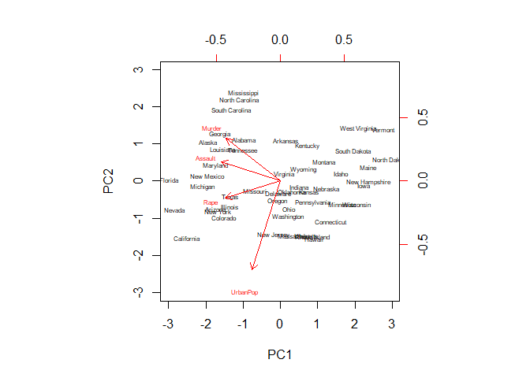
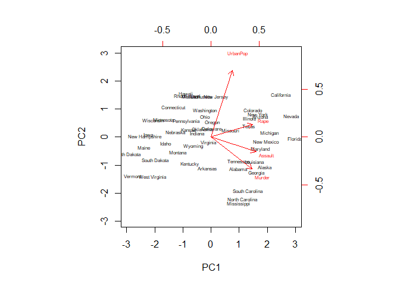
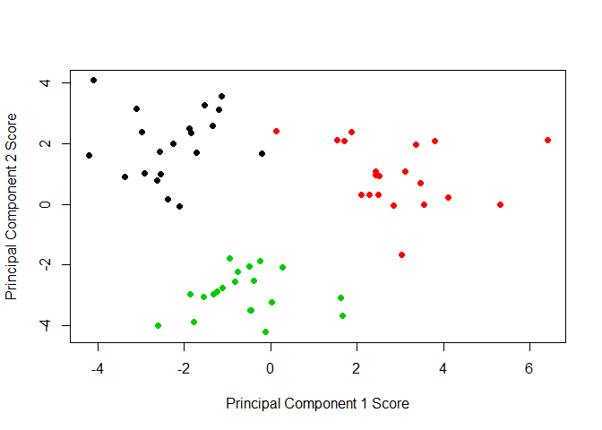

# 10 Unsupervised Learning

## 10.4 Lab 1: Principal Components Analysis


```r
states <- row.names(USArrests)
states
```

```
##  [1] "Alabama"        "Alaska"         "Arizona"        "Arkansas"      
##  [5] "California"     "Colorado"       "Connecticut"    "Delaware"      
##  [9] "Florida"        "Georgia"        "Hawaii"         "Idaho"         
## [13] "Illinois"       "Indiana"        "Iowa"           "Kansas"        
## [17] "Kentucky"       "Louisiana"      "Maine"          "Maryland"      
## [21] "Massachusetts"  "Michigan"       "Minnesota"      "Mississippi"   
## [25] "Missouri"       "Montana"        "Nebraska"       "Nevada"        
## [29] "New Hampshire"  "New Jersey"     "New Mexico"     "New York"      
## [33] "North Carolina" "North Dakota"   "Ohio"           "Oklahoma"      
## [37] "Oregon"         "Pennsylvania"   "Rhode Island"   "South Carolina"
## [41] "South Dakota"   "Tennessee"      "Texas"          "Utah"          
## [45] "Vermont"        "Virginia"       "Washington"     "West Virginia" 
## [49] "Wisconsin"      "Wyoming"
```

```r
names(USArrests)
```

```
## [1] "Murder"   "Assault"  "UrbanPop" "Rape"
```

```r
apply(USArrests, 2, mean)
```

```
##   Murder  Assault UrbanPop     Rape 
##    7.788  170.760   65.540   21.232
```

```r
apply(USArrests, 2, var)
```

```
##     Murder    Assault   UrbanPop       Rape 
##   18.97047 6945.16571  209.51878   87.72916
```

```r
pr.out <- prcomp(USArrests, scale = T)
names(pr.out)
```

```
## [1] "sdev"     "rotation" "center"   "scale"    "x"
```

```r
pr.out$center
```

```
##   Murder  Assault UrbanPop     Rape 
##    7.788  170.760   65.540   21.232
```

```r
pr.out$scale
```

```
##    Murder   Assault  UrbanPop      Rape 
##  4.355510 83.337661 14.474763  9.366385
```

```r
pr.out$rotation
```

```
##                 PC1        PC2        PC3         PC4
## Murder   -0.5358995  0.4181809 -0.3412327  0.64922780
## Assault  -0.5831836  0.1879856 -0.2681484 -0.74340748
## UrbanPop -0.2781909 -0.8728062 -0.3780158  0.13387773
## Rape     -0.5434321 -0.1673186  0.8177779  0.08902432
```

```r
dim(pr.out$x)
```

```
## [1] 50  4
```

```r
head(pr.out$x)
```

```
##                   PC1        PC2         PC3          PC4
## Alabama    -0.9756604  1.1220012 -0.43980366  0.154696581
## Alaska     -1.9305379  1.0624269  2.01950027 -0.434175454
## Arizona    -1.7454429 -0.7384595  0.05423025 -0.826264240
## Arkansas    0.1399989  1.1085423  0.11342217 -0.180973554
## California -2.4986128 -1.5274267  0.59254100 -0.338559240
## Colorado   -1.4993407 -0.9776297  1.08400162  0.001450164
```

```r
biplot(pr.out, scale = 0, cex = .5)
```

<!-- -->

```r
pr.out$rotation <- -pr.out$rotation
pr.out$x <- -pr.out$x
biplot(pr.out, scale = 0, cex = .5)
```

<!-- -->

```r
pr.out$sdev
```

```
## [1] 1.5748783 0.9948694 0.5971291 0.4164494
```

```r
pr.var <- pr.out$sdev^2
pr.var
```

```
## [1] 2.4802416 0.9897652 0.3565632 0.1734301
```

```r
pve <- pr.var/sum(pr.var)
pve
```

```
## [1] 0.62006039 0.24744129 0.08914080 0.04335752
```

```r
plot(pve, xlab = "Principal Component", ylab = "Proportion of Variance Explained", ylim = c(0,1), type = "b")
```

<!-- -->

```r
plot(cumsum(pve), xlab = "Principal Component", ylab = "Cumulative Proportion of Variance Explained", ylim = c(0,1), type = "b")
```

<!-- -->

```r
a <- c(1,2,8,-3)
cumsum(a)
```

```
## [1]  1  3 11  8
```

## 10.7 Exercises

### Conceptual

#### 6. A researcher collects expression measurements for 1,000 genes in 100 tissue samples. The data can be written as a 1, 000 × 100 matrix, which we call X, in which each row represents a gene and each column a tissue sample. Each tissue sample was processed on a different day, and the columns of X are ordered so that the samples that were processed earliest are on the left, and the samples that were processed later are on the right. The tissue samples belong to two groups: control (C) and treatment (T). The C and T samples were processed in a random order across the days. The researcher wishes to determine whether each gene’s expression measurements differ between the treatment and control groups.
#### As a pre-analysis (before comparing T versus C), the researcher performs a principal component analysis of the data, and finds that the first principal component (a vector of length 100) has a strong linear trend from left to right, and explains 10 % of the variation. The researcher now remembers that each patient sample was run on one of two machines, A and B, and machine A was used more often in the earlier times while B was used more often later. The researcher has a record of which sample was run on which machine

  (a) Explain what it means that the first principal component “explains
10% of the variation”  
  The first principal component contains 10% of the overall variance. 90% of the variance is not contained by the first principal component.
  
  (b) The researcher decides to replace the (j, i)th element of X with xji − φj1zi1 where zi1 is the ith score, and φj1 is the jth loading, for the first principal component. He will then perform a two-sample t-test on each gene in this new data set in order to determine whether its expression differs between the two conditions. Critique this idea, and suggest a better approach. (The principal component analysis is performed on XT ). 
  Should probably factor in which machine was used, A or B.
  
  (c) Design and run a small simulation experiment to demonstrate the superiority of your idea.  
  

```r
set.seed(123)
dat <- matrix(rnorm(100 * 1000), ncol = 100)
dat[1, ] <- seq(from = -20, to =20, length.out = 100) # adding replacement
pr.out <- prcomp(scale(dat))

summary(pr.out)
```

```
## Importance of components:
##                           PC1     PC2     PC3    PC4     PC5     PC6
## Standard deviation     3.4463 1.24634 1.21946 1.2125 1.20099 1.19125
## Proportion of Variance 0.1188 0.01553 0.01487 0.0147 0.01442 0.01419
## Cumulative Proportion  0.1188 0.13431 0.14918 0.1639 0.17830 0.19249
##                            PC7     PC8     PC9    PC10    PC11    PC12
## Standard deviation     1.18497 1.16923 1.16503 1.16224 1.14844 1.13506
## Proportion of Variance 0.01404 0.01367 0.01357 0.01351 0.01319 0.01288
## Cumulative Proportion  0.20654 0.22021 0.23378 0.24729 0.26048 0.27336
##                           PC13    PC14    PC15    PC16   PC17    PC18
## Standard deviation     1.13222 1.12983 1.11445 1.11322 1.1090 1.10607
## Proportion of Variance 0.01282 0.01277 0.01242 0.01239 0.0123 0.01223
## Cumulative Proportion  0.28618 0.29895 0.31137 0.32376 0.3361 0.34829
##                          PC19    PC20    PC21    PC22    PC23    PC24
## Standard deviation     1.0954 1.09288 1.08929 1.08524 1.07869 1.06038
## Proportion of Variance 0.0120 0.01194 0.01187 0.01178 0.01164 0.01124
## Cumulative Proportion  0.3603 0.37223 0.38410 0.39588 0.40751 0.41876
##                           PC25    PC26    PC27    PC28    PC29   PC30
## Standard deviation     1.05785 1.05593 1.05030 1.04686 1.04491 1.0344
## Proportion of Variance 0.01119 0.01115 0.01103 0.01096 0.01092 0.0107
## Cumulative Proportion  0.42995 0.44110 0.45213 0.46309 0.47401 0.4847
##                           PC31    PC32    PC33    PC34    PC35    PC36
## Standard deviation     1.03148 1.01826 1.01562 1.01442 1.01097 1.00602
## Proportion of Variance 0.01064 0.01037 0.01031 0.01029 0.01022 0.01012
## Cumulative Proportion  0.49534 0.50571 0.51603 0.52632 0.53654 0.54666
##                           PC37    PC38   PC39    PC40    PC41    PC42
## Standard deviation     0.99422 0.98709 0.9848 0.98220 0.97675 0.97388
## Proportion of Variance 0.00988 0.00974 0.0097 0.00965 0.00954 0.00948
## Cumulative Proportion  0.55654 0.56629 0.5760 0.58563 0.59517 0.60466
##                           PC43    PC44    PC45   PC46    PC47    PC48
## Standard deviation     0.96780 0.96590 0.96033 0.9537 0.94916 0.94763
## Proportion of Variance 0.00937 0.00933 0.00922 0.0091 0.00901 0.00898
## Cumulative Proportion  0.61402 0.62335 0.63258 0.6417 0.65068 0.65966
##                           PC49    PC50    PC51    PC52    PC53    PC54
## Standard deviation     0.94251 0.93524 0.93359 0.93093 0.92060 0.91837
## Proportion of Variance 0.00888 0.00875 0.00872 0.00867 0.00848 0.00843
## Cumulative Proportion  0.66854 0.67729 0.68601 0.69467 0.70315 0.71158
##                           PC55    PC56    PC57    PC58    PC59    PC60
## Standard deviation     0.91246 0.90901 0.90093 0.89515 0.88798 0.88527
## Proportion of Variance 0.00833 0.00826 0.00812 0.00801 0.00789 0.00784
## Cumulative Proportion  0.71991 0.72817 0.73629 0.74430 0.75218 0.76002
##                           PC61    PC62    PC63   PC64    PC65   PC66
## Standard deviation     0.87979 0.87088 0.86787 0.8602 0.85717 0.8543
## Proportion of Variance 0.00774 0.00758 0.00753 0.0074 0.00735 0.0073
## Cumulative Proportion  0.76776 0.77535 0.78288 0.7903 0.79762 0.8049
##                           PC67    PC68    PC69    PC70    PC71    PC72
## Standard deviation     0.85279 0.84644 0.83737 0.83309 0.82935 0.82430
## Proportion of Variance 0.00727 0.00716 0.00701 0.00694 0.00688 0.00679
## Cumulative Proportion  0.81220 0.81936 0.82637 0.83331 0.84019 0.84699
##                          PC73   PC74    PC75    PC76    PC77    PC78
## Standard deviation     0.8183 0.8125 0.79836 0.79632 0.79332 0.78929
## Proportion of Variance 0.0067 0.0066 0.00637 0.00634 0.00629 0.00623
## Cumulative Proportion  0.8537 0.8603 0.86666 0.87300 0.87929 0.88552
##                           PC79    PC80    PC81    PC82    PC83    PC84
## Standard deviation     0.78459 0.78048 0.77144 0.76543 0.76417 0.75694
## Proportion of Variance 0.00616 0.00609 0.00595 0.00586 0.00584 0.00573
## Cumulative Proportion  0.89168 0.89777 0.90372 0.90958 0.91542 0.92115
##                           PC85    PC86   PC87    PC88    PC89    PC90
## Standard deviation     0.75117 0.74427 0.7414 0.72682 0.72268 0.71925
## Proportion of Variance 0.00564 0.00554 0.0055 0.00528 0.00522 0.00517
## Cumulative Proportion  0.92679 0.93233 0.9378 0.94311 0.94833 0.95350
##                           PC91    PC92    PC93    PC94    PC95    PC96
## Standard deviation     0.71372 0.70929 0.70469 0.69876 0.68405 0.68299
## Proportion of Variance 0.00509 0.00503 0.00497 0.00488 0.00468 0.00466
## Cumulative Proportion  0.95860 0.96363 0.96860 0.97348 0.97816 0.98282
##                           PC97   PC98    PC99   PC100
## Standard deviation     0.67285 0.6631 0.64755 0.63725
## Proportion of Variance 0.00453 0.0044 0.00419 0.00406
## Cumulative Proportion  0.98735 0.9918 0.99594 1.00000
```

```r
summary(pr.out)$importance[,1]
```

```
##     Standard deviation Proportion of Variance  Cumulative Proportion 
##                3.44635                0.11877                0.11877
```

```r
dat <- rbind(dat, c(rep(-10, 50), rep(10, 50)))
pr.out <- prcomp(scale(dat))
summary(pr.out)$importance[, 1]
```

```
##     Standard deviation Proportion of Variance  Cumulative Proportion 
##               4.225648               0.178560               0.178560
```
  Went up a bit.
  
### Applied

#### 8. In Section 10.2.3, a formula for calculating PVE was given in Equation 10.8. We also saw that the PVE can be obtained using the sdev output of the prcomp() function. On the USArrests data, calculate PVE in two ways:

  (a) Using the sdev output of the prcomp() function, as was done in
Section 10.2.3  

```r
pr.out <- prcomp(USArrests, scale = T)
pr.out$sdev
```

```
## [1] 1.5748783 0.9948694 0.5971291 0.4164494
```

```r
pr.var <- pr.out$sdev^2
pve <- pr.var/sum(pr.var)
pve
```

```
## [1] 0.62006039 0.24744129 0.08914080 0.04335752
```
  (b) By applying Equation 10.8 directly. That is, use the prcomp() function to compute the principal component loadings. Then, use those loadings in Equation 10.8 to obtain the PVE.  

```r
pr.out <- prcomp(USArrests, scale = T)
scaled.USArrests <- scale(USArrests)
top.sums <- apply((scaled.USArrests %*% pr.out$rotation)^2, 2, sum) # Top half of equation, each pc variance
bottom.sum <- sum(apply(scaled.USArrests^2, 2, sum)) # Bottom half of equation, total variance
top.sums/bottom.sum
```

```
##        PC1        PC2        PC3        PC4 
## 0.62006039 0.24744129 0.08914080 0.04335752
```

#### 10. In this problem, you will generate simulated data, and then perform PCA and K-means clustering on the data.

  (a) Generate a simulated data set with 20 observations in each of three classes (i.e. 60 observations total), and 50 variables.  

```r
set.seed(321)
dat <- matrix(rnorm(20 * 3 * 50, mean = 0), ncol = 50)
dat[1:20,1] <- dat[1:20,1] + 3
dat[21:40,2] <- dat[21:40,2] - 3
dat[41:60,3] <- dat[41:60,3] + 4
groupings <- c(rep(1, 20), rep(2, 20), rep(3, 20))
```

  (b) Perform PCA on the 60 observations and plot the first two principal component score vectors. Use a different color to indicate the observations in each of the three classes. If the three classes appear separated in this plot, then continue on to part (c). If not, then return to part (a) and modify the simulation so that there is greater separation between the three classes. Do not continue to part (c) until the three classes show at least some separation in the first two principal component score vectors.
  

```r
pr.out <- prcomp(dat)
plot(pr.out$x[, 1:2], col = groupings, xlab = "Principal Component 1 Score", ylab = "Principal Component 2 Score", pch = 19)
```

<!-- -->

