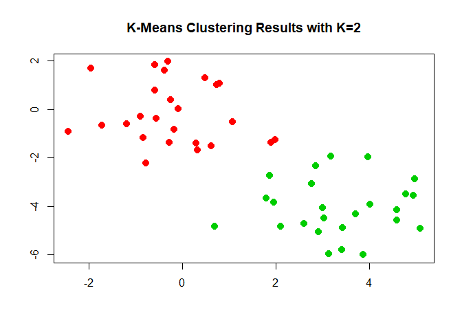
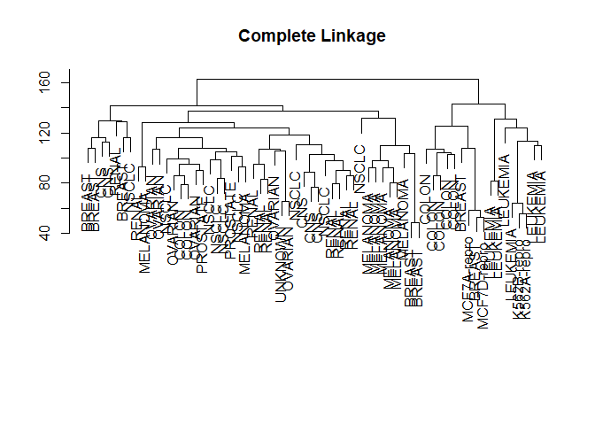

# 10 Unsupervised Learning

## 10.4 Lab 1: Principal Components Analysis


```r
states <- row.names(USArrests)
states
```

```
##  [1] "Alabama"        "Alaska"         "Arizona"        "Arkansas"      
##  [5] "California"     "Colorado"       "Connecticut"    "Delaware"      
##  [9] "Florida"        "Georgia"        "Hawaii"         "Idaho"         
## [13] "Illinois"       "Indiana"        "Iowa"           "Kansas"        
## [17] "Kentucky"       "Louisiana"      "Maine"          "Maryland"      
## [21] "Massachusetts"  "Michigan"       "Minnesota"      "Mississippi"   
## [25] "Missouri"       "Montana"        "Nebraska"       "Nevada"        
## [29] "New Hampshire"  "New Jersey"     "New Mexico"     "New York"      
## [33] "North Carolina" "North Dakota"   "Ohio"           "Oklahoma"      
## [37] "Oregon"         "Pennsylvania"   "Rhode Island"   "South Carolina"
## [41] "South Dakota"   "Tennessee"      "Texas"          "Utah"          
## [45] "Vermont"        "Virginia"       "Washington"     "West Virginia" 
## [49] "Wisconsin"      "Wyoming"
```

```r
names(USArrests)
```

```
## [1] "Murder"   "Assault"  "UrbanPop" "Rape"
```

```r
apply(USArrests, 2, mean)
```

```
##   Murder  Assault UrbanPop     Rape 
##    7.788  170.760   65.540   21.232
```

```r
apply(USArrests, 2, var)
```

```
##     Murder    Assault   UrbanPop       Rape 
##   18.97047 6945.16571  209.51878   87.72916
```

```r
pr.out <- prcomp(USArrests, scale = T)
names(pr.out)
```

```
## [1] "sdev"     "rotation" "center"   "scale"    "x"
```

```r
pr.out$center
```

```
##   Murder  Assault UrbanPop     Rape 
##    7.788  170.760   65.540   21.232
```

```r
pr.out$scale
```

```
##    Murder   Assault  UrbanPop      Rape 
##  4.355510 83.337661 14.474763  9.366385
```

```r
pr.out$rotation
```

```
##                 PC1        PC2        PC3         PC4
## Murder   -0.5358995  0.4181809 -0.3412327  0.64922780
## Assault  -0.5831836  0.1879856 -0.2681484 -0.74340748
## UrbanPop -0.2781909 -0.8728062 -0.3780158  0.13387773
## Rape     -0.5434321 -0.1673186  0.8177779  0.08902432
```

```r
dim(pr.out$x)
```

```
## [1] 50  4
```

```r
head(pr.out$x)
```

```
##                   PC1        PC2         PC3          PC4
## Alabama    -0.9756604  1.1220012 -0.43980366  0.154696581
## Alaska     -1.9305379  1.0624269  2.01950027 -0.434175454
## Arizona    -1.7454429 -0.7384595  0.05423025 -0.826264240
## Arkansas    0.1399989  1.1085423  0.11342217 -0.180973554
## California -2.4986128 -1.5274267  0.59254100 -0.338559240
## Colorado   -1.4993407 -0.9776297  1.08400162  0.001450164
```

```r
biplot(pr.out, scale = 0, cex = .5)
```

<!-- -->

```r
pr.out$rotation <- -pr.out$rotation
pr.out$x <- -pr.out$x
biplot(pr.out, scale = 0, cex = .5)
```

<!-- -->

```r
pr.out$sdev
```

```
## [1] 1.5748783 0.9948694 0.5971291 0.4164494
```

```r
pr.var <- pr.out$sdev^2
pr.var
```

```
## [1] 2.4802416 0.9897652 0.3565632 0.1734301
```

```r
pve <- pr.var/sum(pr.var)
pve
```

```
## [1] 0.62006039 0.24744129 0.08914080 0.04335752
```

```r
plot(pve, xlab = "Principal Component", ylab = "Proportion of Variance Explained", ylim = c(0,1), type = "b")
```

<!-- -->

```r
plot(cumsum(pve), xlab = "Principal Component", ylab = "Cumulative Proportion of Variance Explained", ylim = c(0,1), type = "b")
```

<!-- -->

```r
a <- c(1,2,8,-3)
cumsum(a)
```

```
## [1]  1  3 11  8
```

## 10.5 Lab 2: Clustering
### 10.5.1 K-Means Clustering


```r
set.seed(2)
x <- matrix(rnorm(50*2), ncol = 2)
x[1:25,1] <- x[1:25,1] + 3
x[1:25,2] <- x[1:25,2] - 4

km.out <- kmeans(x, 2, nstart = 20)
km.out$cluster
```

```
##  [1] 2 2 2 2 2 2 2 2 2 2 2 2 2 2 2 2 2 2 2 2 2 2 2 2 2 1 1 1 1 1 1 1 1 1 1
## [36] 1 1 1 1 1 1 1 1 1 1 1 1 1 1 1
```

```r
plot(x, col = (km.out$cluster + 1), main = "K-Means Clustering Results with K=2", xlab = "", ylab = "", pch = 20, cex = 2)
```

<!-- -->

```r
set.seed(4)
km.out <- kmeans(x, 3, nstart = 20)
km.out
```

```
## K-means clustering with 3 clusters of sizes 10, 23, 17
## 
## Cluster means:
##         [,1]        [,2]
## 1  2.3001545 -2.69622023
## 2 -0.3820397 -0.08740753
## 3  3.7789567 -4.56200798
## 
## Clustering vector:
##  [1] 3 1 3 1 3 3 3 1 3 1 3 1 3 1 3 1 3 3 3 3 3 1 3 3 3 2 2 2 2 2 2 2 2 2 2
## [36] 2 2 2 2 2 2 2 2 1 2 1 2 2 2 2
## 
## Within cluster sum of squares by cluster:
## [1] 19.56137 52.67700 25.74089
##  (between_SS / total_SS =  79.3 %)
## 
## Available components:
## 
## [1] "cluster"      "centers"      "totss"        "withinss"    
## [5] "tot.withinss" "betweenss"    "size"         "iter"        
## [9] "ifault"
```

```r
set.seed(3)
km.out <- kmeans(x, 3, nstart = 1)
km.out$tot.withinss
```

```
## [1] 104.3319
```

```r
km.out <- kmeans(x, 3, nstart = 20)
km.out$tot.withinss
```

```
## [1] 97.97927
```

### 10.5.2 Hierarchical Clustering


```r
hc.complete <- hclust(dist(x), method = "complete")
hc.average <- hclust(dist(x), method = "average")
hc.single <- hclust(dist(x), method = "single")

par(mfrow = c(1,1))
plot(hc.complete, main = "Complete Linkage ", xlab = "", sub = "", cex = .9)
```

<!-- -->

```r
plot(hc.average, main = "Average Linkage ", xlab = "", sub = "", cex = .9)
```

<!-- -->

```r
plot(hc.single, main = "Single Linkage ", xlab = "", sub = "", cex = .9)
```

<!-- -->

```r
cutree(hc.complete, 2)
```

```
##  [1] 1 1 1 1 1 1 1 1 1 1 1 1 1 1 1 1 1 1 1 1 1 1 1 1 1 2 2 2 2 2 2 2 2 2 2
## [36] 2 2 2 2 2 2 2 2 2 2 2 2 2 2 2
```

```r
cutree(hc.average, 2)
```

```
##  [1] 1 1 1 1 1 1 1 1 1 1 1 1 1 1 1 1 1 1 1 1 1 1 1 1 1 2 2 2 2 2 2 2 1 2 2
## [36] 2 2 2 2 2 2 2 2 1 2 1 2 2 2 2
```

```r
cutree(hc.single, 2)
```

```
##  [1] 1 1 1 1 1 1 1 1 1 1 1 1 1 1 1 2 1 1 1 1 1 1 1 1 1 1 1 1 1 1 1 1 1 1 1
## [36] 1 1 1 1 1 1 1 1 1 1 1 1 1 1 1
```

```r
cutree(hc.single, 4)
```

```
##  [1] 1 1 1 1 1 1 1 1 1 1 1 1 1 1 1 2 1 1 1 1 1 1 1 1 1 3 3 3 3 3 3 3 3 3 3
## [36] 3 3 3 3 3 3 4 3 3 3 3 3 3 3 3
```

```r
xsc <- scale(x)
par(mfrow = c(1,1))
plot(hclust(dist(xsc), method = "complete"), main = "Hierarchical Clustering with Scaled Features")
```

<!-- -->

```r
x <- matrix(rnorm(30*3), ncol = 3)
dd <- as.dist(1 - cor(t(x)))
plot(hclust(dd, method ="complete"), main = "Complete Linkage with Correlation-Based Distance", xlab = "", sub = "")
```

<!-- -->

## 10.6 Lab 3: NCI60 Data Example


```r
library(ISLR)
nci.labs <- NCI60$labs
nci.data <- NCI60$data
dim(nci.data)
```

```
## [1]   64 6830
```

```r
nci.labs[1:4]
```

```
## [1] "CNS"   "CNS"   "CNS"   "RENAL"
```

```r
table(nci.labs)
```

```
## nci.labs
##      BREAST         CNS       COLON K562A-repro K562B-repro    LEUKEMIA 
##           7           5           7           1           1           6 
## MCF7A-repro MCF7D-repro    MELANOMA       NSCLC     OVARIAN    PROSTATE 
##           1           1           8           9           6           2 
##       RENAL     UNKNOWN 
##           9           1
```

### 10.6.1 PCA on the NCI60 Data


```r
pr.out <- prcomp(nci.data, scale = TRUE)

Cols <- function(vec){
  cols <- rainbow(length(unique(vec)))
  return(cols[as.numeric(as.factor(vec))])
}

par(mfrow = c(1,2))
plot(pr.out$x[,1:2], col = Cols(nci.labs), pch = 19, xlab = "Z1", ylab = "Z2")
plot(pr.out$x[,c(1,3)], col = Cols(nci.labs), pch = 19, xlab = "Z1", ylab = "Z3")
```

<!-- -->

```r
summary(pr.out)
```

```
## Importance of components:
##                            PC1      PC2      PC3      PC4      PC5
## Standard deviation     27.8535 21.48136 19.82046 17.03256 15.97181
## Proportion of Variance  0.1136  0.06756  0.05752  0.04248  0.03735
## Cumulative Proportion   0.1136  0.18115  0.23867  0.28115  0.31850
##                             PC6      PC7      PC8      PC9     PC10
## Standard deviation     15.72108 14.47145 13.54427 13.14400 12.73860
## Proportion of Variance  0.03619  0.03066  0.02686  0.02529  0.02376
## Cumulative Proportion   0.35468  0.38534  0.41220  0.43750  0.46126
##                            PC11     PC12     PC13     PC14     PC15
## Standard deviation     12.68672 12.15769 11.83019 11.62554 11.43779
## Proportion of Variance  0.02357  0.02164  0.02049  0.01979  0.01915
## Cumulative Proportion   0.48482  0.50646  0.52695  0.54674  0.56590
##                            PC16     PC17     PC18     PC19    PC20
## Standard deviation     11.00051 10.65666 10.48880 10.43518 10.3219
## Proportion of Variance  0.01772  0.01663  0.01611  0.01594  0.0156
## Cumulative Proportion   0.58361  0.60024  0.61635  0.63229  0.6479
##                            PC21    PC22    PC23    PC24    PC25    PC26
## Standard deviation     10.14608 10.0544 9.90265 9.64766 9.50764 9.33253
## Proportion of Variance  0.01507  0.0148 0.01436 0.01363 0.01324 0.01275
## Cumulative Proportion   0.66296  0.6778 0.69212 0.70575 0.71899 0.73174
##                           PC27   PC28    PC29    PC30    PC31    PC32
## Standard deviation     9.27320 9.0900 8.98117 8.75003 8.59962 8.44738
## Proportion of Variance 0.01259 0.0121 0.01181 0.01121 0.01083 0.01045
## Cumulative Proportion  0.74433 0.7564 0.76824 0.77945 0.79027 0.80072
##                           PC33    PC34    PC35    PC36    PC37    PC38
## Standard deviation     8.37305 8.21579 8.15731 7.97465 7.90446 7.82127
## Proportion of Variance 0.01026 0.00988 0.00974 0.00931 0.00915 0.00896
## Cumulative Proportion  0.81099 0.82087 0.83061 0.83992 0.84907 0.85803
##                           PC39    PC40    PC41   PC42    PC43   PC44
## Standard deviation     7.72156 7.58603 7.45619 7.3444 7.10449 7.0131
## Proportion of Variance 0.00873 0.00843 0.00814 0.0079 0.00739 0.0072
## Cumulative Proportion  0.86676 0.87518 0.88332 0.8912 0.89861 0.9058
##                           PC45   PC46    PC47    PC48    PC49    PC50
## Standard deviation     6.95839 6.8663 6.80744 6.64763 6.61607 6.40793
## Proportion of Variance 0.00709 0.0069 0.00678 0.00647 0.00641 0.00601
## Cumulative Proportion  0.91290 0.9198 0.92659 0.93306 0.93947 0.94548
##                           PC51    PC52    PC53    PC54    PC55    PC56
## Standard deviation     6.21984 6.20326 6.06706 5.91805 5.91233 5.73539
## Proportion of Variance 0.00566 0.00563 0.00539 0.00513 0.00512 0.00482
## Cumulative Proportion  0.95114 0.95678 0.96216 0.96729 0.97241 0.97723
##                           PC57   PC58    PC59    PC60    PC61    PC62
## Standard deviation     5.47261 5.2921 5.02117 4.68398 4.17567 4.08212
## Proportion of Variance 0.00438 0.0041 0.00369 0.00321 0.00255 0.00244
## Cumulative Proportion  0.98161 0.9857 0.98940 0.99262 0.99517 0.99761
##                           PC63      PC64
## Standard deviation     4.04124 2.148e-14
## Proportion of Variance 0.00239 0.000e+00
## Cumulative Proportion  1.00000 1.000e+00
```

```r
par(mfrow = c(1,1))
plot(pr.out)
```

<!-- -->

```r
pve  <- 100 * pr.out$sdev^2 / sum(pr.out$sdev^2)
par(mfrow = c(1,2))
plot(pve, type = "o", ylab = "PVE", xlab = "Principal Component", col = "blue")
plot(cumsum(pve), type = "o", ylab = "Cumulative PVE", xlab = "Principal Component", col = "brown3")
```

<!-- -->

### 10.6.2 Clustering the Observations of the NCI60 Data


```r
sd.data=scale(nci.data)

par(mfrow = c(1,1))
data.dist <- dist(sd.data)
plot(hclust(data.dist), labels = nci.labs, main = "Complete Linkage ", xlab = "", sub = "", ylab = "")
```

<!-- -->

```r
plot(hclust(data.dist, method = "average"), labels = nci.labs, main = "Average Linkage", xlab = "", sub = "", ylab = "")
```

<!-- -->

```r
plot(hclust(data.dist, method = "single"), labels = nci.labs, main = "Single Linkage", xlab = "", sub = "", ylab = "")
```

<!-- -->

```r
hc.out <- hclust(dist(sd.data))
hc.clusters  <- cutree(hc.out, 4)
table(hc.clusters, nci.labs)
```

```
##            nci.labs
## hc.clusters BREAST CNS COLON K562A-repro K562B-repro LEUKEMIA MCF7A-repro
##           1      2   3     2           0           0        0           0
##           2      3   2     0           0           0        0           0
##           3      0   0     0           1           1        6           0
##           4      2   0     5           0           0        0           1
##            nci.labs
## hc.clusters MCF7D-repro MELANOMA NSCLC OVARIAN PROSTATE RENAL UNKNOWN
##           1           0        8     8       6        2     8       1
##           2           0        0     1       0        0     1       0
##           3           0        0     0       0        0     0       0
##           4           1        0     0       0        0     0       0
```

```r
plot(hc.out, labels = nci.labs)
abline(h=139, col="red")
```

<!-- -->

```r
hc.out
```

```
## 
## Call:
## hclust(d = dist(sd.data))
## 
## Cluster method   : complete 
## Distance         : euclidean 
## Number of objects: 64
```

```r
set.seed(2)
km.out <- kmeans(sd.data, 4, nstart = 20)
km.clusters  <- km.out$cluster
table(km.clusters, hc.clusters)
```

```
##            hc.clusters
## km.clusters  1  2  3  4
##           1 11  0  0  9
##           2  0  0  8  0
##           3  9  0  0  0
##           4 20  7  0  0
```

```r
hc.out <- hclust(dist(pr.out$x[,1:5]))
plot(hc.out, labels = nci.labs, main = "Hier. Clust. on First Five Score Vectors")
```

<!-- -->

```r
table(cutree(hc.out ,4), nci.labs)
```

```
##    nci.labs
##     BREAST CNS COLON K562A-repro K562B-repro LEUKEMIA MCF7A-repro
##   1      0   2     7           0           0        2           0
##   2      5   3     0           0           0        0           0
##   3      0   0     0           1           1        4           0
##   4      2   0     0           0           0        0           1
##    nci.labs
##     MCF7D-repro MELANOMA NSCLC OVARIAN PROSTATE RENAL UNKNOWN
##   1           0        1     8       5        2     7       0
##   2           0        7     1       1        0     2       1
##   3           0        0     0       0        0     0       0
##   4           1        0     0       0        0     0       0
```

## 10.7 Exercises
### Conceptual

#### 2. Suppose that we have four observations, for which we compute a dissimilarity matrix, given by

```r
matrix(c(0,0.3,0.4,0.7,0.3,0,0.5,0.8,0.4,0.5,0,0.45,0.7,0.8,0.45,0), ncol = 4, nrow = 4)
```

```
##      [,1] [,2] [,3] [,4]
## [1,]  0.0  0.3 0.40 0.70
## [2,]  0.3  0.0 0.50 0.80
## [3,]  0.4  0.5 0.00 0.45
## [4,]  0.7  0.8 0.45 0.00
```
#### For instance, the dissimilarity between the first and second observationsis 0.3, and the dissimilarity between the second and fourth observations is 0.8.

  (a) On the basis of this dissimilarity matrix, sketch the dendrogram that results from hierarchically clustering these four observations using complete linkage. Be sure to indicate on the plot the height at which each fusion occurs, as well as the observations corresponding to each leaf in the dendrogram.  

  (b) Repeat (a), this time using single linkage clustering  

[dendrograms]()

  (c) Suppose that we cut the dendogram obtained in (a) such that two clusters result. Which observations are in each cluster?  
  1 and 2 will be in one cluster. 3 and 4 will be in the other cluster

  (d) Suppose that we cut the dendogram obtained in (b) such that two clusters result. Which observations are in each cluster?  
  1, 2, and 3 will be in one cluster and 4 will be in the other
  
  (e) It is mentioned in the chapter that at each fusion in the dendrogram, the position of the two clusters being fused can be swapped without changing the meaning of the dendrogram. Draw a dendrogram that is equivalent to the dendrogram in (a), for which two or more of the leaves are repositioned, but for which the meaning of the dendrogram is the same.  
  
#### 3. In this problem, you will perform K-means clustering manually, with K = 2, on a small example with n = 6 observations and p = 2 features. The observations are as follows


```r
dat <- data.frame(X1 = c(1,1,0,5,6,4), X2 = c(4,3,4,1,2,0))
```

  (a) Plot the observations  

```r
plot(dat)
```

<!-- -->

  (b) Randomly assign a cluster label to each observation. You can use the sample() command in R to do this. Report the cluster labels for each observation.  


```r
set.seed(324)
groupings <- sample(c(1,2),6, replace = T)
plot(dat, col = groupings + 2)
```

<!-- -->

  (c) Compute the centroid for each cluster


```r
centroid1 <- c(mean(dat[groupings == 1, 1]), mean(dat[groupings == 1, 2]))
centroid2 <- c(mean(dat[groupings == 2, 1]), mean(dat[groupings == 2, 2]))
plot(dat, col=(groupings + 2))
points(centroid1[1], centroid1[2], col = 3, pch = 4)
points(centroid2[1], centroid2[2], col = 4, pch = 4)
```

<!-- -->

  (d) Assign each observation to the centroid to which it is closest, in terms of Euclidean distance. Report the cluster labels for each observation
  

```r
groupings <- c(2,2,2,1,1,1)
plot(dat, col=(groupings + 2))
points(centroid1[1], centroid1[2], col = 3, pch = 4)
points(centroid2[1], centroid2[2], col = 4, pch = 4)
```

<!-- -->

  (e) Repeat (c) and (d) until the answers obtained stop changing.  
  Done
  
  (f) In your plot from (a), color the observations according to the cluster labels obtained.  


```r
plot(dat, col=(groupings + 2))
```

<!-- -->

#### 4. Suppose that for a particular data set, we perform hierarchical clustering using single linkage and using complete linkage. We obtain two dendrograms.

  (a) At a certain point on the single linkage dendrogram, the clusters {1, 2, 3} and {4, 5} fuse. On the complete linkage dendrogram, the clusters {1, 2, 3} and {4, 5} also fuse at a certain point. Which fusion will occur higher on the tree, or will they fuse at the same height, or is there not enough information to tell?  
  There is not enough information to tell. The largest and smallest distance between observations in a cluster could be the same.
  
  (b) At a certain point on the single linkage dendrogram, the clusters {5} and {6} fuse. On the complete linkage dendrogram, the clusters {5} and {6} also fuse at a certain point. Which fusion will occur higher on the tree, or will they fuse at the same height, or is there not enough information to tell?  
  They will fuse at the same height. Complete fuses clusters when the largest distance between observations between 2 clusters is the overall smallest distance. Single will fuse clusters based on the smallest distance. If there is only one observation in each cluster then the largest and smallest distance is the same and complete and single linkage operate the same

### Applied
#### 9. Consider the USArrests data. We will now perform hierarchical clustering on the states.
  (a) Using hierarchical clustering with complete linkage and Euclidean distance, cluster the states.  

```r
set.seed(123)
hc.complete <- hclust(dist(USArrests), method = "complete")
plot(hc.complete)
```

<!-- -->

  (b) Cut the dendrogram at a height that results in three distinct clusters. Which states belong to which clusters? 

```r
cut.hc.complete <- cutree(hc.complete, 3)
cut.hc.complete
```

```
##        Alabama         Alaska        Arizona       Arkansas     California 
##              1              1              1              2              1 
##       Colorado    Connecticut       Delaware        Florida        Georgia 
##              2              3              1              1              2 
##         Hawaii          Idaho       Illinois        Indiana           Iowa 
##              3              3              1              3              3 
##         Kansas       Kentucky      Louisiana          Maine       Maryland 
##              3              3              1              3              1 
##  Massachusetts       Michigan      Minnesota    Mississippi       Missouri 
##              2              1              3              1              2 
##        Montana       Nebraska         Nevada  New Hampshire     New Jersey 
##              3              3              1              3              2 
##     New Mexico       New York North Carolina   North Dakota           Ohio 
##              1              1              1              3              3 
##       Oklahoma         Oregon   Pennsylvania   Rhode Island South Carolina 
##              2              2              3              2              1 
##   South Dakota      Tennessee          Texas           Utah        Vermont 
##              3              2              2              3              3 
##       Virginia     Washington  West Virginia      Wisconsin        Wyoming 
##              2              2              3              3              2
```

```r
table(cut.hc.complete)
```

```
## cut.hc.complete
##  1  2  3 
## 16 14 20
```

  (c) Hierarchically cluster the states using complete linkage and Euclidean distance, after scaling the variables to have standard deviation one.  

```r
shc.complete <- hclust(dist(scale(USArrests)), method = "complete")
plot(shc.complete)
```

<!-- -->

```r
cut.shc.complete <- cutree(shc.complete, 3)
cut.shc.complete
```

```
##        Alabama         Alaska        Arizona       Arkansas     California 
##              1              1              2              3              2 
##       Colorado    Connecticut       Delaware        Florida        Georgia 
##              2              3              3              2              1 
##         Hawaii          Idaho       Illinois        Indiana           Iowa 
##              3              3              2              3              3 
##         Kansas       Kentucky      Louisiana          Maine       Maryland 
##              3              3              1              3              2 
##  Massachusetts       Michigan      Minnesota    Mississippi       Missouri 
##              3              2              3              1              3 
##        Montana       Nebraska         Nevada  New Hampshire     New Jersey 
##              3              3              2              3              3 
##     New Mexico       New York North Carolina   North Dakota           Ohio 
##              2              2              1              3              3 
##       Oklahoma         Oregon   Pennsylvania   Rhode Island South Carolina 
##              3              3              3              3              1 
##   South Dakota      Tennessee          Texas           Utah        Vermont 
##              3              1              2              3              3 
##       Virginia     Washington  West Virginia      Wisconsin        Wyoming 
##              3              3              3              3              3
```

```r
table(cut.shc.complete)
```

```
## cut.shc.complete
##  1  2  3 
##  8 11 31
```

  (d) What effect does scaling the variables have on the hierarchical clustering obtained? In your opinion, should the variables be scaled before the inter-observation dissimilarities are computed? Provide a justification for your answer.  

```r
summary(USArrests)
```

```
##      Murder          Assault         UrbanPop          Rape      
##  Min.   : 0.800   Min.   : 45.0   Min.   :32.00   Min.   : 7.30  
##  1st Qu.: 4.075   1st Qu.:109.0   1st Qu.:54.50   1st Qu.:15.07  
##  Median : 7.250   Median :159.0   Median :66.00   Median :20.10  
##  Mean   : 7.788   Mean   :170.8   Mean   :65.54   Mean   :21.23  
##  3rd Qu.:11.250   3rd Qu.:249.0   3rd Qu.:77.75   3rd Qu.:26.18  
##  Max.   :17.400   Max.   :337.0   Max.   :91.00   Max.   :46.00
```

```r
table(cut.hc.complete, cut.shc.complete)
```

```
##                cut.shc.complete
## cut.hc.complete  1  2  3
##               1  6  9  1
##               2  2  2 10
##               3  0  0 20
```
Differences appear after you scale the data. Scaling should be done in this case because the data is measured in different units

#### 10. In this problem, you will generate simulated data, and then perform PCA and K-means clustering on the data.

  (a) Generate a simulated data set with 20 observations in each of three classes (i.e. 60 observations total), and 50 variables.  

```r
set.seed(321)
dat <- matrix(rnorm(20 * 3 * 50, mean = 0), ncol = 50)
dat[1:20,1] <- dat[1:20,1] + 3 # shift means
dat[21:40,2] <- dat[21:40,2] - 3 # shift means
dat[41:60,3] <- dat[41:60,3] + 4 # shift means
groupings <- c(rep(1, 20), rep(2, 20), rep(3, 20))
```

  (b) Perform PCA on the 60 observations and plot the first two principal component score vectors. Use a different color to indicate the observations in each of the three classes. If the three classes appear separated in this plot, then continue on to part (c). If not, then return to part (a) and modify the simulation so that there is greater separation between the three classes. Do not continue to part (c) until the three classes show at least some separation in the first two principal component score vectors.
  

```r
pr.out <- prcomp(dat)
plot(pr.out$x[, 1:2], col = groupings, xlab = "Principal Component 1 Score", ylab = "Principal Component 2 Score", pch = 19)
```

<!-- -->

  (c) Perform K-means clustering of the observations with K = 3. How well do the clusters that you obtained in K-means clustering compare to the true class labels? *Hint: You can use the table() function in R to compare the true class labels to the class labels obtained by clustering. Be careful how you interpret the results: K-means clustering will arbitrarily number the clusters, so you cannot simply check whether the true class labels and clustering labels are the same.*  

```r
km.out <- kmeans(dat, 3, nstart = 50)
km.out$cluster
```

```
##  [1] 1 1 1 1 1 1 1 1 1 1 1 1 1 1 1 1 1 1 1 1 2 2 2 2 2 2 2 2 2 2 2 2 2 2 2
## [36] 1 2 2 2 2 3 3 3 3 3 3 3 3 3 3 3 3 3 3 3 3 3 3 3 3
```

```r
table(groupings,km.out$cluster)
```

```
##          
## groupings  1  2  3
##         1 20  0  0
##         2  1 19  0
##         3  0  0 20
```
One observation was placed in the wrong group

  (d) Perform K-means clustering with K = 2. Describe your results.  

```r
km.out <- kmeans(dat, 2, nstart = 50)
km.out$cluster
```

```
##  [1] 2 2 2 2 2 2 2 2 2 2 2 2 2 2 2 2 2 2 2 2 1 1 1 1 1 1 1 1 1 1 1 1 1 1 1
## [36] 2 1 1 1 1 1 2 2 2 2 2 2 2 2 2 1 2 2 2 2 2 2 2 2 2
```

```r
table(groupings,km.out$cluster)
```

```
##          
## groupings  1  2
##         1  0 20
##         2 19  1
##         3  2 18
```
Looks like it condensed two separate clusters into one cluster while keeping the other relatively intact

  (e) Now perform K-means clustering with K = 4, and describe your results.  

```r
km.out <- kmeans(dat, 4, nstart = 50)
km.out$cluster
```

```
##  [1] 2 2 2 2 2 1 2 2 2 2 2 2 2 2 2 2 2 2 2 2 1 1 1 4 4 4 1 4 4 1 1 1 1 1 1
## [36] 2 1 1 1 1 3 3 3 3 3 3 3 3 3 3 3 3 3 3 3 3 3 3 3 3
```

```r
table(groupings,km.out$cluster)
```

```
##          
## groupings  1  2  3  4
##         1  1 19  0  0
##         2 14  1  0  5
##         3  0  0 20  0
```
Looks like it broke one cluster into two separate clusters while keeping the other 2 relatively intact

  (f) Now perform K-means clustering with K = 3 on the first two principal component score vectors, rather than on the raw data. That is, perform K-means clustering on the 60 × 2 matrix of which the first column is the first principal component score vector, and the second column is the second principal component score vector. Comment on the results.

```r
km.out <- kmeans(pr.out$x[, 1:2], 3, nstart = 50)
km.out$cluster
```

```
##  [1] 1 1 1 1 1 1 1 1 1 1 1 1 1 1 1 1 1 1 1 1 3 3 3 3 3 3 3 3 3 3 3 3 3 3 3
## [36] 1 3 3 3 3 2 2 2 2 2 2 2 2 2 2 2 2 2 2 2 2 2 2 2 2
```

```r
table(groupings,km.out$cluster)
```

```
##          
## groupings  1  2  3
##         1 20  0  0
##         2  1  0 19
##         3  0 20  0
```
Same result as in (c). Still get one observation grouped incorrectly.

  (g) Using the scale() function, perform K-means clustering with K = 3 on the data after scaling each variable to have standard deviation one. How do these results compare to those obtained in (b)? Explain.  

```r
km.out <- kmeans(scale(dat), 3, nstart = 50)
km.out$cluster
```

```
##  [1] 2 2 1 2 3 2 1 1 3 2 2 2 1 2 2 2 2 2 3 2 2 3 3 3 1 1 3 3 3 3 1 1 1 1 2
## [36] 1 3 1 1 1 3 3 2 3 2 1 1 3 3 1 1 1 1 3 2 2 2 2 1 3
```

```r
table(groupings,km.out$cluster)
```

```
##          
## groupings  1  2  3
##         1  4 13  3
##         2 10  2  8
##         3  7  6  7
```
Made things a lot worse. In this case scaling was detrimental to the ability to cluster.

#### 11. On the book website, www.StatLearning.com, there is a gene expression data set (Ch10Ex11.csv) that consists of 40 tissue samples with measurements on 1,000 genes. The first 20 samples are from healthy patients, while the second 20 are from a diseased group.

  (a) Load in the data using read.csv(). You will need to select header = F.  

```r
dat <- read.csv(url("http://www-bcf.usc.edu/~gareth/ISL/Ch10Ex11.csv"), header = F)
```

  (b) Apply hierarchical clustering to the samples using correlation-based distance, and plot the dendrogram. Do the genes separate the samples into the two groups? Do your results depend on the type of linkage used?  

```r
ddat <- as.dist(1 - cor(dat))
plot(hclust(ddat, method ="complete"), main = "Complete Linkage with Correlation-Based Distance", xlab = "", sub = "")
```

<!-- -->

```r
plot(hclust(ddat, method ="average"), main = "Average Linkage with Correlation-Based Distance", xlab = "", sub = "")
```

<!-- -->

```r
plot(hclust(ddat, method ="single"), main = "Single Linkage with Correlation-Based Distance", xlab = "", sub = "")
```

<!-- -->
With complete and single the samples separate into two groups. The same cannot be said for average

  (c) Your collaborator wants to know which genes differ the most across the two groups. Suggest a way to answer this question, and apply it here.  

```r
pr.out <- prcomp(t(dat))
pr.var <- pr.out$sdev^2
pve <- pr.var/sum(pr.var)
pve
```

```
##  [1] 1.266765e-01 3.271438e-02 3.129170e-02 3.020862e-02 2.939498e-02
##  [6] 2.886820e-02 2.820520e-02 2.763526e-02 2.736018e-02 2.693605e-02
## [11] 2.676284e-02 2.648787e-02 2.592858e-02 2.528100e-02 2.474502e-02
## [16] 2.417056e-02 2.402306e-02 2.357612e-02 2.325322e-02 2.271015e-02
## [21] 2.255280e-02 2.237696e-02 2.185370e-02 2.145264e-02 2.101857e-02
## [26] 2.062282e-02 2.053858e-02 1.991745e-02 1.963358e-02 1.925662e-02
## [31] 1.893183e-02 1.853305e-02 1.823389e-02 1.795291e-02 1.692754e-02
## [36] 1.687763e-02 1.617583e-02 1.569253e-02 1.522155e-02 2.449980e-32
```

```r
par(mfrow=c(1,2))
plot(pve, xlab = "Principal Component", ylab = "Proportion of Variance Explained", ylim = c(0,1), type = "b")
plot(cumsum(pve), xlab = "Principal Component", ylab = "Cumulative Proportion of Variance Explained", ylim = c(0,1), type = "b")
```

<!-- -->

```r
top <- order(abs(pr.out$rotation[,1]), decreasing = T)
top[1:10]
```

```
##  [1] 600 584 549 540 502 582 565 568 529 599
```
Originally we were looking at our ability to separate samples based on gene expression. Now were want to see what genes were causing driving the clustering. For this we will transpose the data and perform PCA, then look at the variance explained. From their select the loadings from the selected principal components. We then select the 20 genes which corresponding to the 20 most influential genes in the first principal component. Could probably look at more principal components though.
