## load data


```r
library(ISLR)
library(ggplot2)
library(dplyr)
```

```
## 
## Attaching package: 'dplyr'
```

```
## The following objects are masked from 'package:stats':
## 
##     filter, lag
```

```
## The following objects are masked from 'package:base':
## 
##     intersect, setdiff, setequal, union
```

```r
library(e1071)
```

# 9.6 Lab: Support Vector Machines
## 9.6.1 Support Vector Classifier

```r
set.seed(1)
x <- matrix(rnorm(20*2), ncol=2)
y <- c(rep(-1,10), rep(1,10))
x[y==1,] <- x[y==1,] + 1
plot(x, col=(3-y))
```

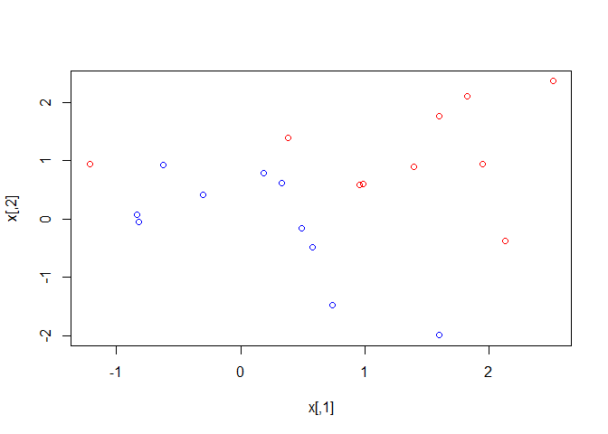<!-- -->

```r
dat <- data.frame(x=x, y=as.factor(y))
svmfit <- svm(y ~., data=dat, kernel = "linear", cost = 10, scale = FALSE)

plot(svmfit, dat)
```

<!-- -->

```r
svmfit$index
```

```
## [1]  1  2  5  7 14 16 17
```

```r
summary(svmfit)
```

```
## 
## Call:
## svm(formula = y ~ ., data = dat, kernel = "linear", cost = 10, 
##     scale = FALSE)
## 
## 
## Parameters:
##    SVM-Type:  C-classification 
##  SVM-Kernel:  linear 
##        cost:  10 
##       gamma:  0.5 
## 
## Number of Support Vectors:  7
## 
##  ( 4 3 )
## 
## 
## Number of Classes:  2 
## 
## Levels: 
##  -1 1
```

```r
svmfit <- svm(y ~ ., data=dat, kernel = "linear", cost = 0.1, scale=FALSE)
plot(svmfit, dat)
```

<!-- -->

```r
svmfit$index
```

```
##  [1]  1  2  3  4  5  7  9 10 12 13 14 15 16 17 18 20
```

```r
set.seed(1)
tune.out <- tune(svm, y ~ ., data=dat, kernel = "linear", ranges=list(cost=c(0.001, 0.01, 0.1, 1, 5, 10, 100)))

summary(tune.out)
```

```
## 
## Parameter tuning of 'svm':
## 
## - sampling method: 10-fold cross validation 
## 
## - best parameters:
##  cost
##   0.1
## 
## - best performance: 0.1 
## 
## - Detailed performance results:
##    cost error dispersion
## 1 1e-03  0.70  0.4216370
## 2 1e-02  0.70  0.4216370
## 3 1e-01  0.10  0.2108185
## 4 1e+00  0.15  0.2415229
## 5 5e+00  0.15  0.2415229
## 6 1e+01  0.15  0.2415229
## 7 1e+02  0.15  0.2415229
```

```r
bestmod <- tune.out$best.model
summary(bestmod)
```

```
## 
## Call:
## best.tune(method = svm, train.x = y ~ ., data = dat, ranges = list(cost = c(0.001, 
##     0.01, 0.1, 1, 5, 10, 100)), kernel = "linear")
## 
## 
## Parameters:
##    SVM-Type:  C-classification 
##  SVM-Kernel:  linear 
##        cost:  0.1 
##       gamma:  0.5 
## 
## Number of Support Vectors:  16
## 
##  ( 8 8 )
## 
## 
## Number of Classes:  2 
## 
## Levels: 
##  -1 1
```

```r
xtest <- matrix(rnorm(20*2), ncol=2)
ytest <- sample (c(-1,1), 20, rep=TRUE)
xtest[ytest==1,] <-  xtest[ytest==1,] + 1
testdat <- data.frame(x = xtest, y = as.factor(ytest))

ypred <- predict(bestmod, testdat)
table(predict = ypred, truth = testdat$y)
```

```
##        truth
## predict -1  1
##      -1 11  1
##      1   0  8
```

```r
svmfit <- svm(y ~ ., data=dat, kernel = "linear", cost = .01, scale=FALSE)
ypred <- predict(svmfit, testdat)
table(predict = ypred, truth = testdat$y)
```

```
##        truth
## predict -1  1
##      -1 11  2
##      1   0  7
```

```r
x[y==1,] <- x[y==1,] + 0.5
plot(x, col = (y+3)/2, pch = 19)
```

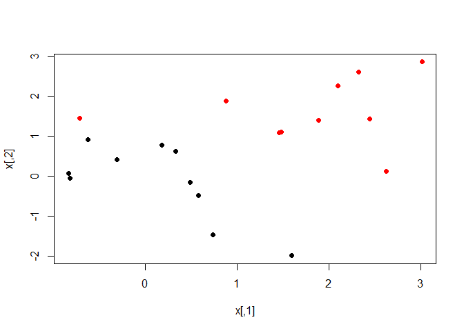<!-- -->

```r
dat <- data.frame(x = x, y = as.factor(y))
svmfit <- svm(y ~ ., data=dat, kernel = "linear", cost = 1e5)
summary(svmfit)
```

```
## 
## Call:
## svm(formula = y ~ ., data = dat, kernel = "linear", cost = 1e+05)
## 
## 
## Parameters:
##    SVM-Type:  C-classification 
##  SVM-Kernel:  linear 
##        cost:  1e+05 
##       gamma:  0.5 
## 
## Number of Support Vectors:  3
## 
##  ( 1 2 )
## 
## 
## Number of Classes:  2 
## 
## Levels: 
##  -1 1
```

```r
plot(svmfit, dat)
```

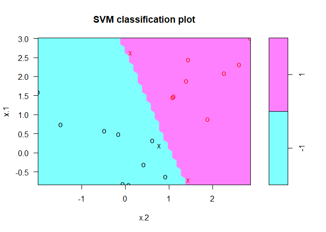<!-- -->

```r
svmfit <- svm(y ~ ., data=dat, kernel = "linear", cost = 1)
summary(svmfit)
```

```
## 
## Call:
## svm(formula = y ~ ., data = dat, kernel = "linear", cost = 1)
## 
## 
## Parameters:
##    SVM-Type:  C-classification 
##  SVM-Kernel:  linear 
##        cost:  1 
##       gamma:  0.5 
## 
## Number of Support Vectors:  7
## 
##  ( 4 3 )
## 
## 
## Number of Classes:  2 
## 
## Levels: 
##  -1 1
```

```r
plot(svmfit, dat)
```

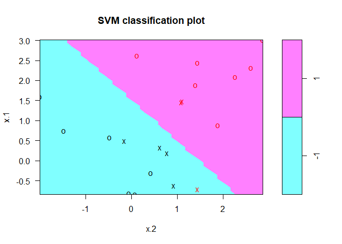<!-- -->

### 1. This problem involves hyperplanes in two dimensions.

(a) Sketch the hyperplane 1 + 3X1 − X2 = 0. Indicate the set of points for which 1 + 3X1 − X2 > 0, as well as the set of points for which 1 + 3X1 − X2 < 0.  


```r
#1 + 3X1 − X2 = 0
# X2 = 3X1 + 1
###
par(mfrow = c(1,1))
grid.x <- expand.grid(seq(-5,5, length.out = 75),seq(-5,5, length.out = 75))
grid.y <- as.factor(ifelse((1 + 3*grid.x$Var1 - grid.x$Var2) < 0, -1, 1))
names(grid.y) <- 1:length(grid.y)
plot(grid.x, col=c("red","blue")[as.numeric(grid.y)], pch=20, cex=.2)
abline(1,3)
```

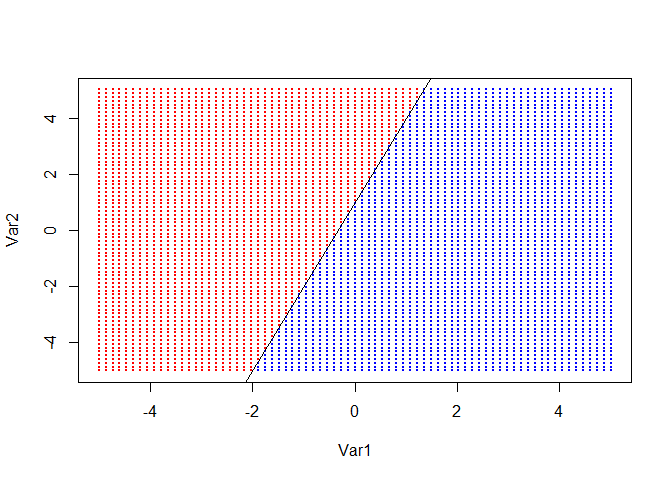<!-- -->

(b) On the same plot, sketch the hyperplane −2 + X1 + 2X2 = 0. Indicate the set of points for which −2 + X1 + 2X2 > 0, as well as the set of points for which −2 + X1 + 2X2 < 0.


```r
#−2 + X1 + 2X2 = 0
# X2 = (-X1)/2 + 1
grid.y2 <- as.factor(ifelse((-2 + grid.x$Var1 + 2*grid.x$Var2) < 0, -1, 1))
names(grid.y2) <- 1:length(grid.y2)
plot(grid.x, col=c("red","blue")[as.numeric(grid.y2)], pch=20, cex=.2)
abline(1,-.5)
```

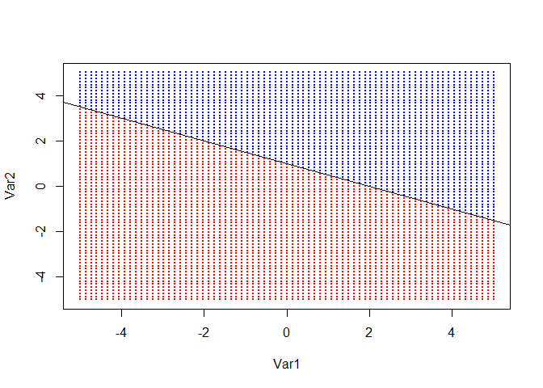<!-- -->

```r
par(mfrow = c(1,2))
plot(grid.x, col=c("red","blue")[as.numeric(grid.y)], pch=20, cex=.2)
abline(1,3)
plot(grid.x, col=c("red","blue")[as.numeric(grid.y2)], pch=20, cex=.2)
abline(1,-.5)
```

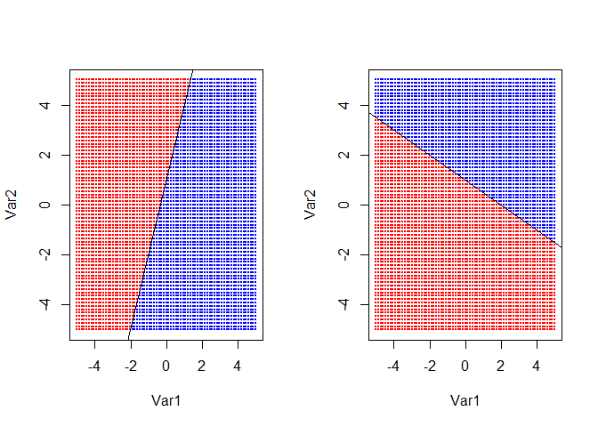<!-- -->

### 3. Here we explore the maximal margin classifier on a toy data set.

(a) We are given n = 7 observations in p = 2 dimensions. For each observation, there is an associated class label.  

|Obs.|X1 |X2 | Y  |
|----|---|---|--- |
|  1 | 3 | 4 |Red |
|  2 | 2 | 2 |Red |
|  3 | 4 | 4 |Red |
|  4 | 1 | 4 |Red |
|  5 | 2 | 1 |Blue|
|  6 | 4 | 3 |Blue|
|  7 | 4 | 1 |Blue|

Sketch the observations.


```r
par(mfrow=c(1,1))
x1 <- c(3,2,4,1,2,4,4)
x2 <- c(4,2,4,4,1,3,1)
y <- c(rep("Red",4),rep("Blue",3))
dat <- data.frame(x1,x2,y)

plot(dat$x1,dat$x2, col = c("Blue","Red")[as.numeric(dat$y)])
```

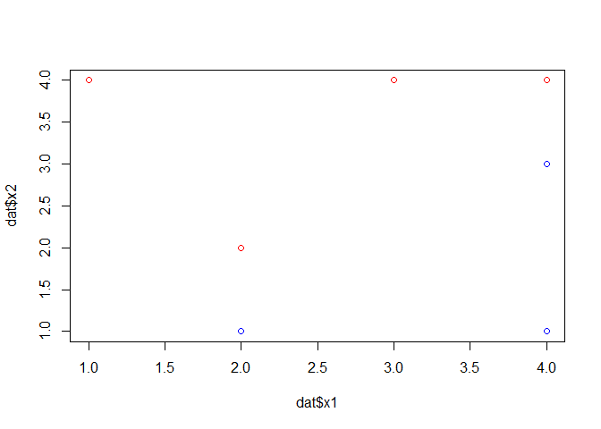<!-- -->

(b) Sketch the optimal separating hyperplane, and provide the equation for this hyperplane (of the form (9.1)).


```r
plot(dat$x1,dat$x2, col = c("Blue","Red")[as.numeric(dat$y)])
abline(-.5,1)
```

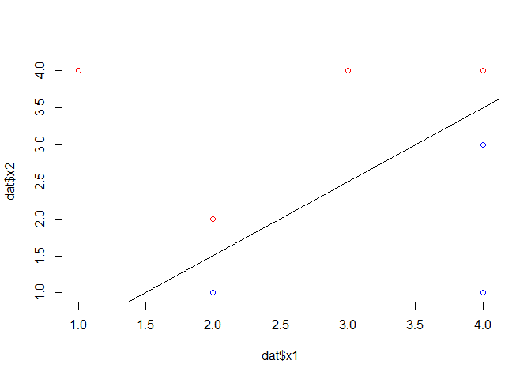<!-- -->

```r
# -.5 + X1 - X2 = 0 
```

(c) Describe the classification rule for the maximal margin classifier. It should be something along the lines of “Classify to Red if β0 + β1X1 + β2X2 > 0, and classify to Blue otherwise.” Provide the values for β0, β1, and β2.

β0 = -.5  
β1 = 1  
β2 = -1  
Classify to Blue if β0 + β1X1 + β2X2 < 0, and classify to Red otherwise.

(d) On your sketch, indicate the margin for the maximal margin hyperplane.


```r
plot(dat$x1,dat$x2, col = c("Blue","Red")[as.numeric(dat$y)])
abline(-.5,1)
abline(0,1, col = "Red")
abline(-1,1, col = "Red")
```

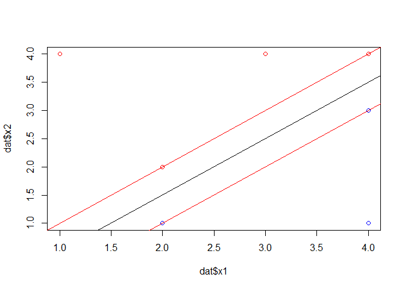<!-- -->

```r
#Close enough
```

(e) Indicate the support vectors for the maximal margin classifier.


```r
plot(dat$x1,dat$x2, col = c("Blue","Red")[as.numeric(dat$y)])
abline(-.5,1)
abline(0,1, col = "Red")
abline(-1,1, col = "Red")
points(dat$x1[c(2,3,5,6)],dat$x2[c(2,3,5,6)], pch=2, cex=2)
```

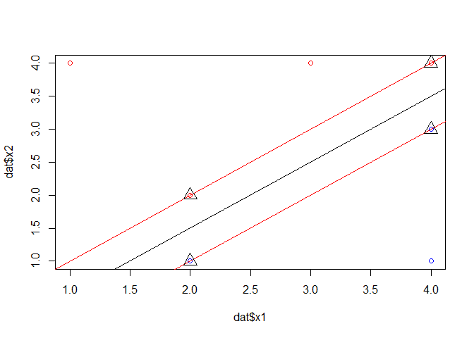<!-- -->

(f) Argue that a slight movement of the seventh observation would not affect the maximal margin hyperplane.


```r
dat[7,1:2] <- dat[7,1:2] + 1

plot(dat$x1,dat$x2, col = c("Blue","Red")[as.numeric(dat$y)])
abline(-.5,1)
abline(0,1, col = "Red")
abline(-1,1, col = "Red")
points(dat$x1[c(2,3,5,6)],dat$x2[c(2,3,5,6)], pch=2, cex=2)
points(dat$x1[7],dat$x2[7], pch=4, cex=2)
```

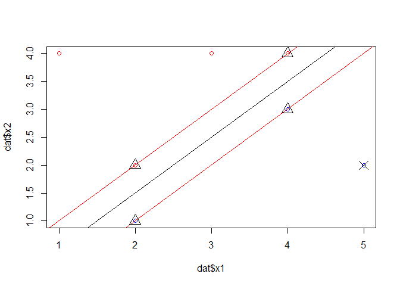<!-- -->

```r
# Didn't change
dat[7,1:2] <- dat[7,1:2] - 1
```

(g) Sketch a hyperplane that is not the optimal separating hyperplane, and provide the equation for this hyperplane.


```r
plot(dat$x1,dat$x2, col = c("Blue","Red")[as.numeric(dat$y)])
abline(.25,.75)
```

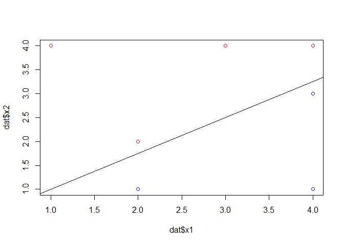<!-- -->

```r
# .25 +.75X1 - X2 = 0 
```

(h) Draw an additional observation on the plot so that the two classes are no longer separable by a hyperplane.


```r
plot(dat$x1,dat$x2, col = c("Blue","Red")[as.numeric(dat$y)])
points(2,3, col = "Blue")
```

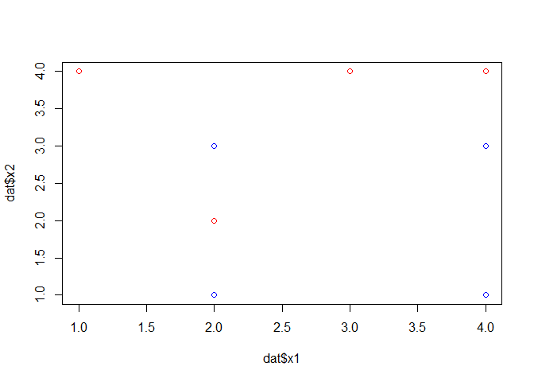<!-- -->

### 6. At the end of Section 9.6.1, it is claimed that in the case of data that is just barely linearly separable, a support vector classifier with a small value of cost that misclassifies a couple of training observations may perform better on test data than one with a huge value of cost that does not misclassify any training observations. You will now investigate this claim.

(a) Generate two-class data with p = 2 in such a way that the classes are just barely linearly separable.


```r
set.seed(123)
x <- matrix(rnorm(1000), ncol=2)
y <- ifelse(x[,2] > .2, -1, 1)
plot(x, col=(3-y))
```

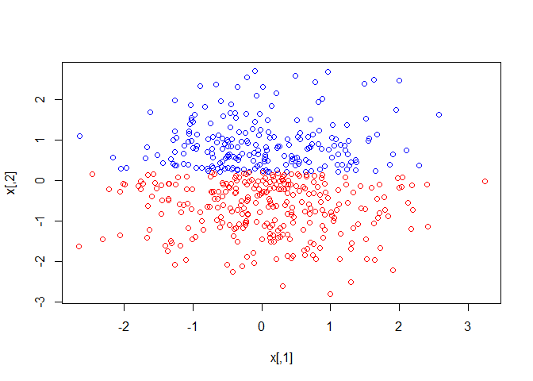<!-- -->

```r
dat <- data.frame(x=x, y=as.factor(y))
```

(b) Compute the cross-validation error rates for support vector classifiers with a range of cost values. How many training errors are misclassified for each value of cost considered, and how does this relate to the cross-validation errors obtained?


```r
set.seed(1)
tune.out <- tune(svm, y ~ ., data=dat, kernel = "linear", ranges=list(cost=c(0.001, 0.01, 0.1, 1, 5, 10, 100)))

summary(tune.out)
```

```
## 
## Parameter tuning of 'svm':
## 
## - sampling method: 10-fold cross validation 
## 
## - best parameters:
##  cost
##     5
## 
## - best performance: 0 
## 
## - Detailed performance results:
##    cost error  dispersion
## 1 1e-03 0.426 0.058916136
## 2 1e-02 0.022 0.019888579
## 3 1e-01 0.012 0.016865481
## 4 1e+00 0.012 0.013984118
## 5 5e+00 0.000 0.000000000
## 6 1e+01 0.002 0.006324555
## 7 1e+02 0.006 0.009660918
```

```r
bestmod <- tune.out$best.model
summary(bestmod)
```

```
## 
## Call:
## best.tune(method = svm, train.x = y ~ ., data = dat, ranges = list(cost = c(0.001, 
##     0.01, 0.1, 1, 5, 10, 100)), kernel = "linear")
## 
## 
## Parameters:
##    SVM-Type:  C-classification 
##  SVM-Kernel:  linear 
##        cost:  5 
##       gamma:  0.5 
## 
## Number of Support Vectors:  45
## 
##  ( 22 23 )
## 
## 
## Number of Classes:  2 
## 
## Levels: 
##  -1 1
```

(c) Generate an appropriate test data set, and compute the test errors corresponding to each of the values of cost considered. Which value of cost leads to the fewest test errors, and how does this compare to the values of cost that yield the fewest training errors and the fewest cross-validation errors?


```r
xtest <- matrix(rnorm(1000), ncol=2)
ytest <- ifelse(xtest[,2] > .2, -1, 1)
costs <- c(0.001, 0.01, 0.1, 1, 5, 10, 100,1000,10000)

for(cost in costs){
  svmfit <- svm(y ~ ., data=dat, kernel = "linear", cost = cost, scale=FALSE)
  ypred <- predict(svmfit, xtest)
  cat("Error for cost value:", cost, "\n")
  print(table(predict = ypred, truth = ytest))
  cat(sum(ypred==ytest)/length(ytest)*100,"% of test cases correctly classified\n", sep = "")
}
```

```
## Error for cost value: 0.001 
##        truth
## predict  -1   1
##      -1   2   0
##      1  203 295
## 59.4% of test cases correctly classified
## Error for cost value: 0.01 
##        truth
## predict  -1   1
##      -1 198   0
##      1    7 295
## 98.6% of test cases correctly classified
## Error for cost value: 0.1 
##        truth
## predict  -1   1
##      -1 201   0
##      1    4 295
## 99.2% of test cases correctly classified
## Error for cost value: 1 
##        truth
## predict  -1   1
##      -1 205   7
##      1    0 288
## 98.6% of test cases correctly classified
## Error for cost value: 5 
##        truth
## predict  -1   1
##      -1 204   1
##      1    1 294
## 99.6% of test cases correctly classified
## Error for cost value: 10 
##        truth
## predict  -1   1
##      -1 204   5
##      1    1 290
## 98.8% of test cases correctly classified
## Error for cost value: 100 
##        truth
## predict  -1   1
##      -1 205   3
##      1    0 292
## 99.4% of test cases correctly classified
## Error for cost value: 1000 
##        truth
## predict  -1   1
##      -1 204   4
##      1    1 291
## 99% of test cases correctly classified
## Error for cost value: 10000 
##        truth
## predict  -1   1
##      -1 205   0
##      1    0 295
## 100% of test cases correctly classified
```

(d) Discuss your results.

It appears that a lower cost was able to perform better or tied with higher costs.

###7. In this problem, you will use support vector approaches in order to predict whether a given car gets high or low gas mileage based on the Auto data set.

(a) Create a binary variable that takes on a 1 for cars with gas mileage above the median, and a 0 for cars with gas mileage below the median.


```r
summary(Auto)
```

```
##       mpg          cylinders      displacement     horsepower   
##  Min.   : 9.00   Min.   :3.000   Min.   : 68.0   Min.   : 46.0  
##  1st Qu.:17.00   1st Qu.:4.000   1st Qu.:105.0   1st Qu.: 75.0  
##  Median :22.75   Median :4.000   Median :151.0   Median : 93.5  
##  Mean   :23.45   Mean   :5.472   Mean   :194.4   Mean   :104.5  
##  3rd Qu.:29.00   3rd Qu.:8.000   3rd Qu.:275.8   3rd Qu.:126.0  
##  Max.   :46.60   Max.   :8.000   Max.   :455.0   Max.   :230.0  
##                                                                 
##      weight      acceleration        year           origin     
##  Min.   :1613   Min.   : 8.00   Min.   :70.00   Min.   :1.000  
##  1st Qu.:2225   1st Qu.:13.78   1st Qu.:73.00   1st Qu.:1.000  
##  Median :2804   Median :15.50   Median :76.00   Median :1.000  
##  Mean   :2978   Mean   :15.54   Mean   :75.98   Mean   :1.577  
##  3rd Qu.:3615   3rd Qu.:17.02   3rd Qu.:79.00   3rd Qu.:2.000  
##  Max.   :5140   Max.   :24.80   Max.   :82.00   Max.   :3.000  
##                                                                
##                  name    
##  amc matador       :  5  
##  ford pinto        :  5  
##  toyota corolla    :  5  
##  amc gremlin       :  4  
##  amc hornet        :  4  
##  chevrolet chevette:  4  
##  (Other)           :365
```

```r
Auto$efficiency <- as.factor(ifelse(Auto$mpg > median(Auto$mpg), 1, 0))
```

(b) Fit a support vector classifier to the data with various values of cost, in order to predict whether a car gets high or low gas mileage. Report the cross-validation errors associated with different values of this parameter. Comment on your results.


```r
set.seed(1)
tune.out <- tune(svm, efficiency ~ ., data=Auto, kernel = "linear", ranges=list(cost=c(0.001, 0.01, 0.1, 1, 5, 10, 100)))

summary(tune.out)
```

```
## 
## Parameter tuning of 'svm':
## 
## - sampling method: 10-fold cross validation 
## 
## - best parameters:
##  cost
##     1
## 
## - best performance: 0.01275641 
## 
## - Detailed performance results:
##    cost      error dispersion
## 1 1e-03 0.09442308 0.03837365
## 2 1e-02 0.07403846 0.05471525
## 3 1e-01 0.03826923 0.05148114
## 4 1e+00 0.01275641 0.01344780
## 5 5e+00 0.01782051 0.01229997
## 6 1e+01 0.02038462 0.01074682
## 7 1e+02 0.03820513 0.01773427
```

```r
bestmod <- tune.out$best.model
summary(bestmod)
```

```
## 
## Call:
## best.tune(method = svm, train.x = efficiency ~ ., data = Auto, 
##     ranges = list(cost = c(0.001, 0.01, 0.1, 1, 5, 10, 100)), 
##     kernel = "linear")
## 
## 
## Parameters:
##    SVM-Type:  C-classification 
##  SVM-Kernel:  linear 
##        cost:  1 
##       gamma:  0.003205128 
## 
## Number of Support Vectors:  56
## 
##  ( 26 30 )
## 
## 
## Number of Classes:  2 
## 
## Levels: 
##  0 1
```

Best cost was somewhere around 1 and 5.

### 8. This problem involves the OJ data set which is part of the ISLR package.

(a) Create a training set containing a random sample of 800 observations, and a test set containing the remaining observations.


```r
summary(OJ)
```

```
##  Purchase WeekofPurchase     StoreID        PriceCH         PriceMM     
##  CH:653   Min.   :227.0   Min.   :1.00   Min.   :1.690   Min.   :1.690  
##  MM:417   1st Qu.:240.0   1st Qu.:2.00   1st Qu.:1.790   1st Qu.:1.990  
##           Median :257.0   Median :3.00   Median :1.860   Median :2.090  
##           Mean   :254.4   Mean   :3.96   Mean   :1.867   Mean   :2.085  
##           3rd Qu.:268.0   3rd Qu.:7.00   3rd Qu.:1.990   3rd Qu.:2.180  
##           Max.   :278.0   Max.   :7.00   Max.   :2.090   Max.   :2.290  
##      DiscCH            DiscMM         SpecialCH        SpecialMM     
##  Min.   :0.00000   Min.   :0.0000   Min.   :0.0000   Min.   :0.0000  
##  1st Qu.:0.00000   1st Qu.:0.0000   1st Qu.:0.0000   1st Qu.:0.0000  
##  Median :0.00000   Median :0.0000   Median :0.0000   Median :0.0000  
##  Mean   :0.05186   Mean   :0.1234   Mean   :0.1477   Mean   :0.1617  
##  3rd Qu.:0.00000   3rd Qu.:0.2300   3rd Qu.:0.0000   3rd Qu.:0.0000  
##  Max.   :0.50000   Max.   :0.8000   Max.   :1.0000   Max.   :1.0000  
##     LoyalCH          SalePriceMM     SalePriceCH      PriceDiff      
##  Min.   :0.000011   Min.   :1.190   Min.   :1.390   Min.   :-0.6700  
##  1st Qu.:0.325257   1st Qu.:1.690   1st Qu.:1.750   1st Qu.: 0.0000  
##  Median :0.600000   Median :2.090   Median :1.860   Median : 0.2300  
##  Mean   :0.565782   Mean   :1.962   Mean   :1.816   Mean   : 0.1465  
##  3rd Qu.:0.850873   3rd Qu.:2.130   3rd Qu.:1.890   3rd Qu.: 0.3200  
##  Max.   :0.999947   Max.   :2.290   Max.   :2.090   Max.   : 0.6400  
##  Store7      PctDiscMM        PctDiscCH       ListPriceDiff  
##  No :714   Min.   :0.0000   Min.   :0.00000   Min.   :0.000  
##  Yes:356   1st Qu.:0.0000   1st Qu.:0.00000   1st Qu.:0.140  
##            Median :0.0000   Median :0.00000   Median :0.240  
##            Mean   :0.0593   Mean   :0.02731   Mean   :0.218  
##            3rd Qu.:0.1127   3rd Qu.:0.00000   3rd Qu.:0.300  
##            Max.   :0.4020   Max.   :0.25269   Max.   :0.440  
##      STORE      
##  Min.   :0.000  
##  1st Qu.:0.000  
##  Median :2.000  
##  Mean   :1.631  
##  3rd Qu.:3.000  
##  Max.   :4.000
```

```r
set.seed(3251)
train <- sample(1:nrow(OJ), 800, replace = F)
dat.train <- OJ[train,]
dat.test <- OJ[-train,]
```

(b) Fit a support vector classifier to the training data using cost=0.01, with Purchase as the response and the other variables as predictors. Use the summary() function to produce summary statistics, and describe the results obtained.


```r
svmfit <- svm(Purchase ~ ., data = dat.train, kernel = "linear", cost = 0.01, scale = TRUE)
summary(svmfit)
```

```
## 
## Call:
## svm(formula = Purchase ~ ., data = dat.train, kernel = "linear", 
##     cost = 0.01, scale = TRUE)
## 
## 
## Parameters:
##    SVM-Type:  C-classification 
##  SVM-Kernel:  linear 
##        cost:  0.01 
##       gamma:  0.05555556 
## 
## Number of Support Vectors:  437
## 
##  ( 219 218 )
## 
## 
## Number of Classes:  2 
## 
## Levels: 
##  CH MM
```
About 218 support vectors from each class

(c) What are the training and test error rates?


```r
pred.train <- predict(svmfit, dat.train)
table(predict = pred.train, truth = dat.train$Purchase)
```

```
##        truth
## predict  CH  MM
##      CH 441  76
##      MM  56 227
```

```r
100 - sum(pred.train == dat.train$Purchase)/length(dat.train$Purchase)*100
```

```
## [1] 16.5
```

```r
# 16.5% training error

pred.test <- predict(svmfit, dat.test)
table(predict = pred.test, truth = dat.test$Purchase)
```

```
##        truth
## predict  CH  MM
##      CH 145  34
##      MM  11  80
```

```r
100 - sum(pred.test == dat.test$Purchase)/length(dat.test$Purchase)*100
```

```
## [1] 16.66667
```

```r
# 16.7% test error
```


(d) Use the tune() function to select an optimal cost. Consider values in the range 0.01 to 10.


```r
set.seed(567)
tune.out <- tune(svm, Purchase ~ ., data=dat.train, kernel = "linear", ranges=list(cost=c(0.01, 0.1, 1, 5, 10)))

summary(tune.out)
```

```
## 
## Parameter tuning of 'svm':
## 
## - sampling method: 10-fold cross validation 
## 
## - best parameters:
##  cost
##  0.01
## 
## - best performance: 0.17 
## 
## - Detailed performance results:
##    cost   error dispersion
## 1  0.01 0.17000 0.05809475
## 2  0.10 0.17000 0.05439056
## 3  1.00 0.17125 0.05684103
## 4  5.00 0.17750 0.05552777
## 5 10.00 0.17875 0.05529278
```

```r
bestmod <- tune.out$best.model
summary(bestmod)
```

```
## 
## Call:
## best.tune(method = svm, train.x = Purchase ~ ., data = dat.train, 
##     ranges = list(cost = c(0.01, 0.1, 1, 5, 10)), kernel = "linear")
## 
## 
## Parameters:
##    SVM-Type:  C-classification 
##  SVM-Kernel:  linear 
##        cost:  0.01 
##       gamma:  0.05555556 
## 
## Number of Support Vectors:  437
## 
##  ( 219 218 )
## 
## 
## Number of Classes:  2 
## 
## Levels: 
##  CH MM
```

(e) Compute the training and test error rates using this new value for cost.


```r
pred.train <- predict(bestmod, dat.train)
table(predict = pred.train, truth = dat.train$Purchase)
```

```
##        truth
## predict  CH  MM
##      CH 441  76
##      MM  56 227
```

```r
100 - sum(pred.train == dat.train$Purchase)/length(dat.train$Purchase)*100
```

```
## [1] 16.5
```

```r
# 16.5% training error

pred.test <- predict(bestmod, dat.test)
table(predict = pred.test, truth = dat.test$Purchase)
```

```
##        truth
## predict  CH  MM
##      CH 145  34
##      MM  11  80
```

```r
100 - sum(pred.test == dat.test$Purchase)/length(dat.test$Purchase)*100
```

```
## [1] 16.66667
```

```r
# 16.7% test error
```

The predicted best cost is the same as the previous steps
